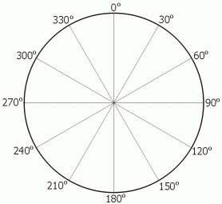

# Sketch #1: Still Life for Turtle

For this sketch, you will give instructions to a "[turtle](https://brianhouse.github.io/turtle5/)" who draws on the screen.

The turtle understands instructions like these:
- `forward(100)`    Move forward 100 steps (abbr: `fd`)
- `right(90)`     	Turn to the right 90º (abbr: `rt`)
- `left(90)`     	Turn to the left 90º (abbr: `lt`)
- `backwards(100)`  Move backwards 100 steps (abbr: `bk`)
- `penup()`        	Pull the pen up off the paper (abbr: `pu`)
- `pendown()`       Put the pen down on the paper (abbr: `pd`)
- `pencolor('red')` Change the color of the pen—note the quotes (abbr: `pc`)
- `penweight(5)`	Change the weight of the pen (abbr: `pw`)

Each of these instructions is known as a _function_—we can usually identify a function because it ends with a set of parentheses `()`. Often (but not always), the function takes an _argument_, such as the number of steps to move, the angle of the turn, or the name of the color.

In addition, the turtle can repeat instructions if they are enclosed by braces `{}`. The following code makes a square:
```
repeat(4) {  
  fd(100)
  rt(90)
}
```

When code is surrounded by braces `{}`, it's called a _block_ of code.


\
To get the hang of things, have the turtle
- draw a square
- draw a triangle
- draw a circle (possible?)

\
Now have the turtle draw a still life from the model in the room.

Email your finished (or unfinished) code to the professor along with a screenshot of your result.  

\

#### Angle reference



