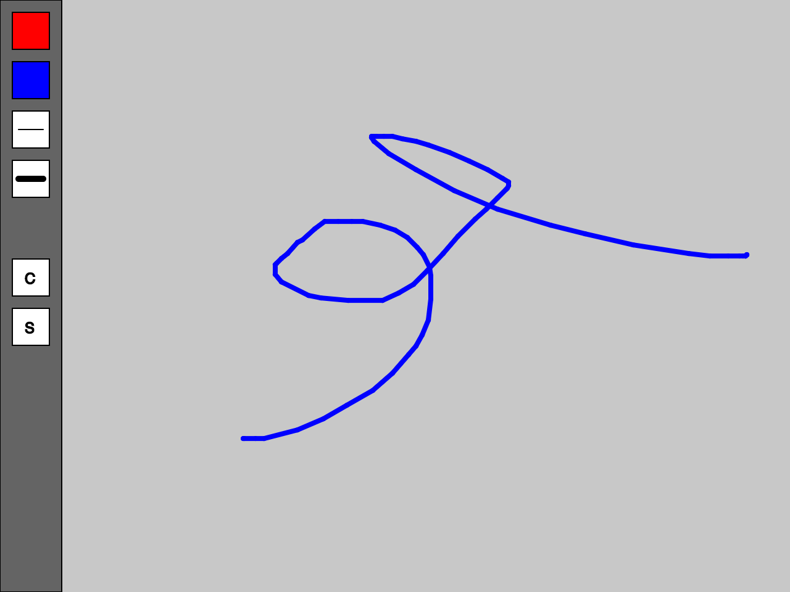
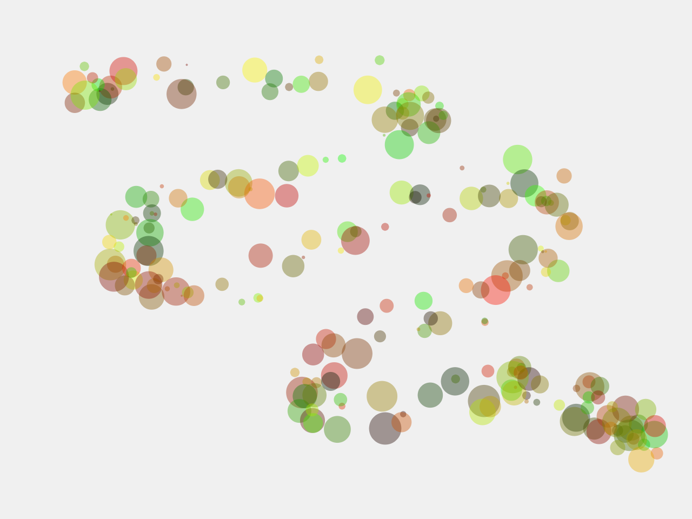
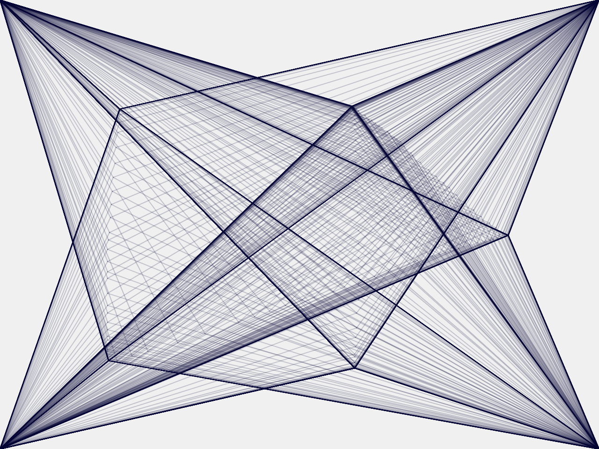

# Sketch #5: Expressive Interface

When we interact with a computer, we do so through a software interface. The files and folders of the operating system, the prompt of a text-based terminal, the links of a webpage, and the tool palette and working space of a graphics program—in all of these examples, input from the keyboard and mouse are translated into meaningful actions. Designing an interface is a creative act unto itself, and as artists, we can use code to make the tools that we need to express our ideas.

For this sketch, you will create a software drawing interface using p5. To get started, think about programs like [MacPaint](https://en.wikipedia.org/wiki/MacPaint), where the "user" can choose from multiple brushes with the mouse and use them to draw on the open canvas. However, your approach should reflect your own artist concept: maybe your interface is designed to paint trees, or looks like the cockpit of a spacecraft, or is made for people who are colorblind, to name some examples. How your brushes work and how someone using your interface selects them will be important artistic choices for you to make.

Requirements:
- Your interface must include at least 5 different "brushes" / ways of interacting
- It should be presented on a webpage that includes your title and [3-sentence description](../../resources/description_guidelines.md)
- Your page should also include an example image of an artwork that you have made with your interface
- This page should be hosted on GitHub and linked to from your portfolio

Note that this assignment will have a preliminary crit—please have your work posted online prior.


## Technical Resources

#### Textbook

Please read Chapter 5: "Response" (page 59) of _Getting Started with p5.js_ for this assignment, which explains how to incorporate user input. Chapter 4: "Variables" (page 41) will also be helpful.


#### p5js.org

For this assignment, see the "Mouse" and "Keyboard" functions at https://p5js.org/reference/  

Additional input examples:
- [Mouse Press](https://p5js.org/examples/input-mouse-press.html)
- [Mouse Functions (draggable object)](https://p5js.org/examples/input-mouse-functions.html)
- [Keyboard Input](https://p5js.org/examples/input-keyboard.html)
- [Changing the Cursor](https://p5js.org/reference/#/p5/cursor)

Important new functions:
- [`random()`](https://p5js.org/reference/#/p5/random)
- [`map()`](https://p5js.org/reference/#/p5/map)


#### Shiffman

Draw function, variables, and the mouse:
https://www.youtube.com/watch?v=RnS0YNuLfQQ

Variables in general:
https://www.youtube.com/watch?v=Bn_B3T_Vbxs

The map function:
https://www.youtube.com/watch?v=nicMAoW6u1g

The random function:
https://www.youtube.com/watch?v=nfmV2kuQKwA

If-statements with number comparisons:
https://www.youtube.com/watch?v=1Osb_iGDdjk


## Preparation

Similar to last assignment, you will create a new folder called `interface` on your computer and a corresponding repository on GitHub. These will contain an `index.html` file that looks like this:

```html
<html>
  <head>
    <title>Expressive Interface</title>
    <script src="https://cdn.jsdelivr.net/npm/p5@0.10.2/lib/p5.js"></script>
    <script src="sketch.js"></script>
  </head>
  <body>
      <h1>A title</h1>
      <p>A description</p>
      <!--  -->      
      <div id="p5"></div>
  </body>
</html>
```

...and a `sketch.js` file that looks like this:

```js
function setup() {

    // create a 640x480 pixel canvas and attach it to your HTML
    createCanvas(640, 480).parent('p5')

}

function draw() {

    background(200)

}

function mouseClicked() {

    print(int(mouseX), int(mouseY))

}

function keyPressed() {

    print(key)

}
```


## Example Code


#### Interface Elements

The following `draw()` and `mouseClicked()` functions work together to make a basic interface:

```js

let current_stroke = 1 // declare a variable to keep track of the strokeWeight

function draw() {

    if (mouseIsPressed) {
        cursor(CROSS)   // change the cursor to a cross while drawing
        // draw a line from the previous mouse position to the current mouse position
        line(pmouseX, pmouseY, mouseX, mouseY)
    } else {
        cursor(ARROW)   // change the cursor back to normal
    }

    // changes to the stroke and fill between "push" and "pop" wont affect other draw commands
    push()

    stroke(0)
    strokeWeight(1)

    // make the toolbar area
    fill(100)
    rect(0, 0, 50, height)  // magic variable "height" is the canvas height

    // make the red button
    fill(255, 0, 0)
    rect(10, 10, 30, 30)

    // make the blue button
    fill(0, 0, 255)
    rect(10, 50, 30, 30)

    // make an decrease strokeWeight button
    fill(255)
    rect(10, 90, 30, 30)
    line(15, 105, 35, 105)

    // make an increase strokeWeight button
    rect(10, 130, 30, 30)
    strokeWeight(5)
    line(15, 145, 35, 145)

    // make a clear button
    strokeWeight(1)
    fill(255)
    rect(10, 210, 30, 30)
    fill(0)
    text("C", 20, 230)

    // make a save button
    fill(255)
    rect(10, 250, 30, 30)
    fill(0)
    text("S", 20, 270)

    pop()

}

function mouseClicked() {

    print(int(mouseX), int(mouseY))

    // check if the mouse click was within the "red" button
    if (mouseX > 10 && mouseX < 40 && mouseY > 10 && mouseY < 40) {
        stroke(255, 0, 0)
    }

    // check if the mouse click was within the "blue" button
    if (mouseX > 10 && mouseX < 40 && mouseY > 50 && mouseY < 90) {
        stroke(0, 0, 255)
    }

    // check if mouse clicked in "strokeWeight increase" box
    if (mouseX > 10 && mouseX < 40 && mouseY > 90 && mouseY < 130) {
        if (current_stroke > 1) {
            current_stroke -= 1
        }
        strokeWeight(current_stroke)
    }

    // check if mouse clicked in "strokeWeight decrease" box
    if (mouseX > 10 && mouseX < 40 && mouseY > 130 && mouseY < 160) {
        current_stroke += 1
        strokeWeight(current_stroke)
    }

    // check if mouse clicked in "clear" box
    if (mouseX > 10 && mouseX < 40 && mouseY > 210 && mouseY < 240) {
        background(200)
    }

    // check if mouse clicked in "save" box
    if (mouseX > 10 && mouseX < 40 && mouseY > 250 && mouseY < 280) {
        save()
    }

}
```



#### Examples of brushes using [`random()`](https://p5js.org/reference/#/p5/random)

```js
if (mouseIsPressed) {
    stroke(0, 0, 0, 80)
    line(mouseX, mouseY, mouseX + random(-50, 50), mouseY + random(-50, 50))
}
```


```js
if (mouseIsPressed) {
    noStroke()
    fill(random(255), random(255), 0, 100)
    circle(mouseX + random(-20, 20), mouseY + random(-20, 20), random(2, 30))
}
```


```js
if (mouseIsPressed) {
    line(mouseX - 20, mouseY - 20, mouseX + 20, mouseY + 20)
}
```


```js
if (mouseIsPressed) {
    rectMode(CORNERS) // https://p5js.org/reference/#/p5/rectMode
    rect(mouseX, mouseY, pmouseX, pmouseY)
}
```


```js
if (mouseIsPressed) {
    stroke(0, 0, 50, 50)
    line(0, 0, mouseX, mouseY)
    line(width, 0, mouseX, mouseY)
    line(0, height, mouseX, mouseY)
    line(width, height, mouseX, mouseY)
}
```

