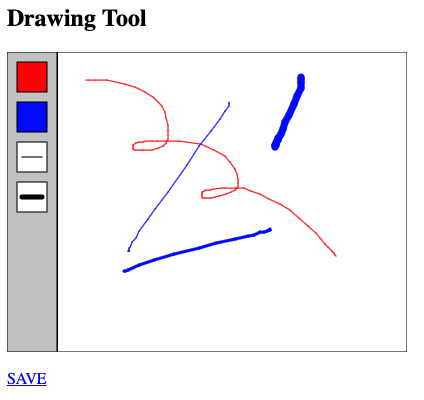

# Sketch #6: Drawing Tool

Create a software drawing tool using p5. Similar to [MacPaint](https://en.wikipedia.org/wiki/MacPaint), the "user" should be able to choose from multiple tools such as a pencil, eraser, and various brushes, and use them to draw on the open canvas. This will require using p5's [mouse functions](https://p5js.org/examples/input-mouse-functions.html) to keep track of the user's actions. Get creative with the brushstrokes—incorporate what you have learned from your screensaver.

Your piece should be hosted on github—email a working URL to the professor before class.

### p5 Reference

A basic drawing tool might look like this:  
<br />
<br />
<br />

<br />
<br />
<br />

The `sketch.js` for this tool is as follows:

```javascript
let paint_mode = false
let current_stroke = 1

function setup() {

    // tell p5 to use the <div> tag you made in your html
    let canvas = createCanvas(400, 300)
    canvas.parent("p5")

    // draw frame, but leave room for the buttons on the left
    rect(50, 0, width-50, height)

}

function draw() {

    // only execute this code if you've turn on paint_mode
    if (paint_mode == true) {
        // draw from the previous mouse position to the current mouse position
        line(pmouseX, pmouseY, mouseX, mouseY)       
    }

    // make a button on the canvas 
    // use push and pop to isolate any changes from the rest of your code
    push()
    stroke(0)
    strokeWeight(1)

    // make the toolbar area
    fill(200, 200, 200)
    rect(0, 0, 50, height)

    // make the red button
    fill(255, 0, 0)
    rect(10, 10, 30, 30)

    // make the blue button
    fill(0, 0, 255)
    rect(10, 50, 30, 30)

    // make an decrease strokeWeight button
    fill(255, 255, 255)
    rect(10, 90, 30, 30)
    line(15, 105, 35, 105)

    // make an increase strokeWeight button
    fill(255, 255, 255)
    rect(10, 130, 30, 30)
    strokeWeight(5)        
    line(15, 145, 35, 145)    

    pop()

}

function mousePressed() {
    paint_mode = true
}

function mouseReleased() {
    paint_mode = false
}

function mouseClicked() {

    // check to see if the mouse click was within the red button coords
    if (mouseX > 10 && mouseX < 40 && mouseY > 10 && mouseY < 40) {
        stroke(255, 0, 0, 50)
    }

    // check to see if the mouse click was within the blue button coords
    if (mouseX > 10 && mouseX < 40 && mouseY > 50 && mouseY < 90) {
        stroke(0, 0, 255, 50)
    }

    // test if mouse clicked in strokeWeight increase box
    if (mouseX > 10 && mouseX < 40 && mouseY > 90 && mouseY < 130) {
        if (current_stroke > 1) {
            current_stroke -= 1
        }        
        strokeWeight(current_stroke)        
    }

    // test if mouse clicked in strokeWeight decrease box
    if (mouseX > 10 && mouseX < 40 && mouseY > 130 && mouseY < 170) {
        current_stroke += 1        
        strokeWeight(current_stroke)
    }


}    
```

And the `index.html`:

```HTML
<html>

<head>
    <title>Drawing Tool</title>
    <script src="p5.js"></script>
    <script src="sketch.js"></script>
</head>

<body>
    <h2>Drawing Tool</h2>

    <div id="p5"></div>
    <br />

    <a href="javascript:save()">SAVE</a>

</body>

</html>
```