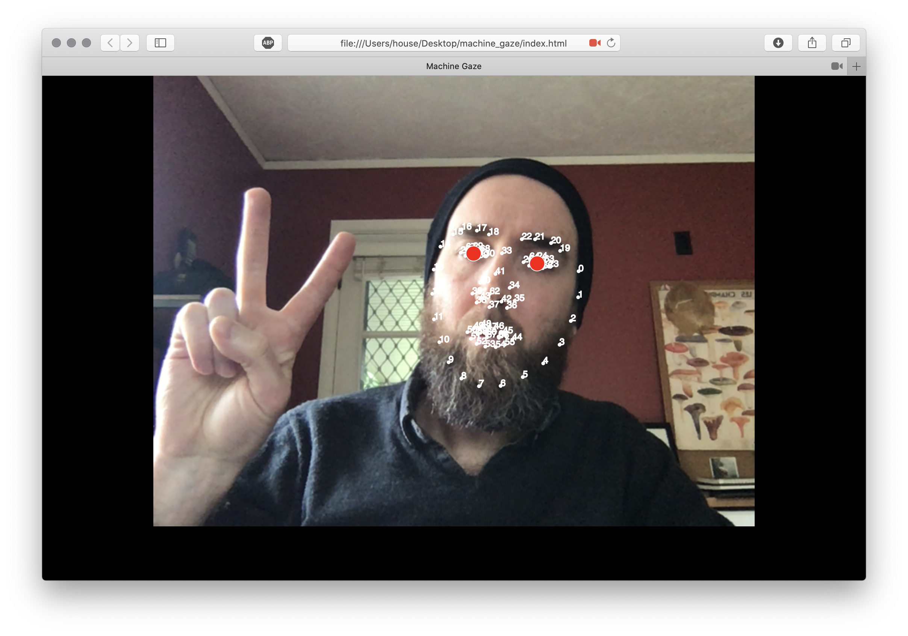

# Sketch #7: Machine Gaze

Thanks to the ubiquity of cameras, not only do you look at a digital artwork—often the artwork is looking back at you. Webcams can be a source of input to a sketch, similar to the keyboard and mouse. But video is also a rich source of information, and it captures aspects of the world that are more than just commands to the computer. Webcams are often used to bring the human body into code, for example, which raises all sorts of questions about how a machine is made to see.

For this sketch, you will make a "magic mirror" that augments or replaces a digital “reflection” of the viewer's face with additional information or graphics. Do do this, you will use a library called clmtracker which gathers data about the face and provides it to your p5 code as an array of feature objects. Incorporate the coordinates in these objects into your own animations and graphics. Conceptually, your mirror should in some way address the relationship between our physical selves and how we are represented online.

Requirements:
- Your piece should be presented on a webpage
- This page should be hosted on GitHub—post a working URL to the crit Google Doc before class
- You must include your title and a [3-sentence description](../../resources/description_guidelines.md) that explains your inspiration


## Technical Resources

This assignment builds on tools we've developed so far. Please refer to the textbook and to https://p5js.org/reference/ to refresh your memory.


## Preparation

Make a folder called `mirror` and add an `index.html` file that contains the following HTML:
```html
<html>
  <head>
    <title>Machine Gaze</title>
    <script src="https://cdnjs.cloudflare.com/ajax/libs/p5.js/1.0.0/p5.js"></script>
    <script src="clmtrackr.js"></script>
    <script src="sketch.js"></script>
    <style type="text/css">
        html, body { margin: 0; padding; 0; background-color: 0}
        #p5 { position: relative; width: 800px; height: 600px; margin: auto; }
    </style>
  </head>
  <body>
      <div id="p5"></div>
  </body>
</html>

```

Download [`clmtrackr.js`](clmtrackr.js) and add it to your folder.

Finally, here is the template for `sketch.js`:

```js
let capture
let tracker

function setup() {

    createCanvas(800, 600).parent('p5')

    // start capturing video
    capture = createCapture(VIDEO)
    capture.size(800, 600)
    capture.hide()

    // create the tracker
    tracker = new clm.tracker()
    tracker.init()
    tracker.start(capture.elt)

}

function draw() {

    // draw background stuff
    background(0)

    // show the mirrored video feed
    showFlippedCapture()

    // get new data from tracker
    let features = tracker.getCurrentPosition()

    // sometimes the tracker doesn't capture anything
    // in that case, we want to stop the function right here using 'return'
    if (features.length == 0) {
        return
    }

    // 'features' is an array of objects with x, y properties
    for (let feature of features) {
        stroke(255)
        fill(255)
        circle(feature.x, feature.y, 4)
        text(feature.label, feature.x, feature.y)
    }

    // the nose is feature 62
    let nose = features[62]
    fill(255, 0, 0)
    circle(nose.x, nose.y, 30)

    // the eyes are elements 32 and 27
    fill(0, 0, 255)
    circle(features[32].x, features[32].y, 20)  // access the array directly
    circle(features[27].x, features[27].y, 20)

}

// this function flips the webcam and displays it
function showFlippedCapture() {
    push()
    translate(capture.width, 0)
    scale(-1, 1)
    image(capture, 0, 0, capture.width, capture.height)
    pop()
}
```




<!--
conceptual references
zach blas
trevor paglen
kyle mcdonald
-->
