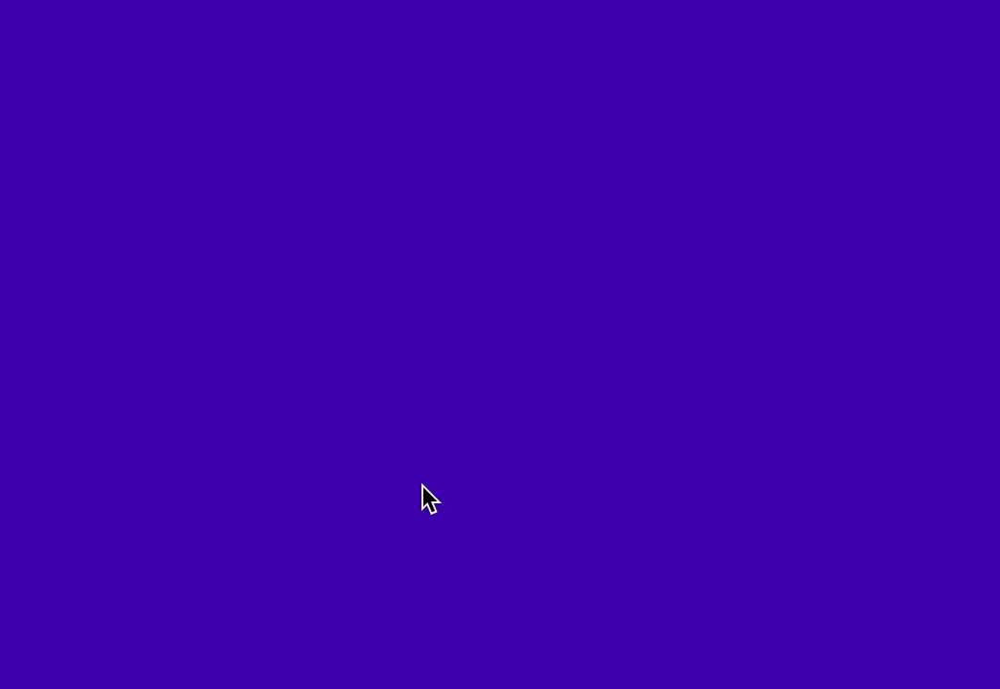

# Final Project

In this course, we have explored scores for humans and for the computer, we've made nonlinear narratives with branching conditions, worked with coordinate systems for space and color, incorporated interface elements for interaction, created objects with their own ways of moving, and brought ourselves into code through the camera. All of these are formal components to code-based digital media; along the way we've also heard about many artists who use various aspects of these forms in their own practices.

For your final project, you may draw from any of these techniques (and/or experiment with other ones) to develop a sketch of your own design. This is your chance to move beyond the prescriptions of the assignments thus far, and to focus on what most interests you.

As always, you are required to have a title and artist description. However, for this assignment, a draft of your artist description will be due up front (4/20). We will have a preliminary crit the following week (4/27) where you will receive feedback on what you've produced so far, and then the final work will be due for the end of the semester.

For your final, in addition to this project, you will update your website to include links to all of your assignments (except Nonlinear Narrative) as a portfolio of your work in this class. This will also be a reference for you in the future to go back and remember what you've done and how you did it.


## Example Code

Additional references and techniques will be posted here as they come up in our discussion, in addition to the class Slack.

### Using external images and sounds in sketches

Because p5 runs in the browser, and because browsers have security restrictions that prevent it from accessing your files directly, there are a few extra steps if you want to load images directly in a p5 sketch. Specifically, you must run your sketch from a local web server. A "server" is simply a computer that provides access to a folder of files via HTTP—ie, the web. GitHub is already a server, so the following only applies to running your sketch locally. Once you've uploaded it, it should work as expected.

The p5 website outlines [a few ways to run a local server](https://github.com/processing/p5.js/wiki/Local-server).

The easiest is to install [Web Server for Chrome](https://chrome.google.com/webstore/detail/web-server-for-chrome/ofhbbkphhbklhfoeikjpcbhemlocgigb/).

When the extension is up and running, you'll point your browser at the URL showing on Chrome Web Server, which will look something like http://127.0.0.1:8887

Once that is all up and running, you'll be able to load images, sounds, and even videos into your sketches. For sound, you'll also need to have the p5.sound addon loaded. That happens in the HTML with another link to a script:

```html
<html>
  <head>
    <title>Loading Example</title>
    <script src="https://cdnjs.cloudflare.com/ajax/libs/p5.js/1.0.0/p5.js"></script>
    <script src="https://cdnjs.cloudflare.com/ajax/libs/p5.js/1.0.0/addons/p5.sound.js"></script>
    <script src="sketch.js"></script>
    <style type="text/css">
        html, body { margin: 0; padding; 0; }
    </style>
  </head>
  <body>
      <div id="p5"></div>
  </body>
</html>
```

And here's a `sketch.js` example of how to load an image, draw it at the mouse position, and play a sound effect when the mouse is clicked:

```js
let pio
let bark

function preload() {

    pio = loadImage("pio.jpg")
    bark = loadSound("bark.mp3")

}

function setup() {

    createCanvas(windowWidth, windowHeight).parent('p5')

}

function draw() {

    background(0)

    image(pio, mouseX, mouseY, pio.width, pio.height)

}

function mouseClicked() {

    bark.play()

}
```

Note that sounds cannot play automatically as soon as the sketch loads—this is another security feature of browsers that prevents advertisements from taking over your web experience. As long as the mouse has been clicked at least once (or the keyboard pressed), the sound can play.


### Interpolating colors

These examples make use of the p5 function [`lerpColor`](https://p5js.org/reference/#/p5/lerpColor).


```js
function draw() {

    let color_1 = color(255, 0, 0)      // red is our first color
    let color_2 = color(0, 0, 255)      // blue is our second color

    // use a for-loop and line to draw each row of pixels across the screen individually
    // each time, change the lerp value
    for (let y=0; y<height; y++) {
        let lerped_color = lerpColor(color_1, color_2, y / height)
        stroke(lerped_color)
        line(0, y, width, y)
    }

}
```


```js
function draw() {

    let color_1 = color(255, 0, 0)      // red is our first color
    let color_2 = color(0, 0, 255)      // blue is our second color

    // fade_amount has to be between 0 and 1
    // by taking the mouseY value and dividing it by the height of the screen
    // we get a value between 0 and 1 which represents how far up the screen the
    // mouse is currenty positioned
    let fade_amount = mouseY / height
    let lerped_color = lerpColor(color_1, color_2, fade_amount)

    //// or try using frameCount()
    // let fade_amount = frameCount / 500
    // let lerped_color = lerpColor(color_1, color_2, fade_amount)

    //// or an object variable (see object declaration above)
    // let fade_amount = changing_color.c / 500
    // let lerped_color = lerpColor(color_1, color_2, fade_amount)
    // changing_color.c += changing_color.vc
    // if (changing_color.c == 0 || changing_color.c == 500) {
    //     changing_color.vc = -changing_color.vc
    // }

    background(lerped_color)

}
```

