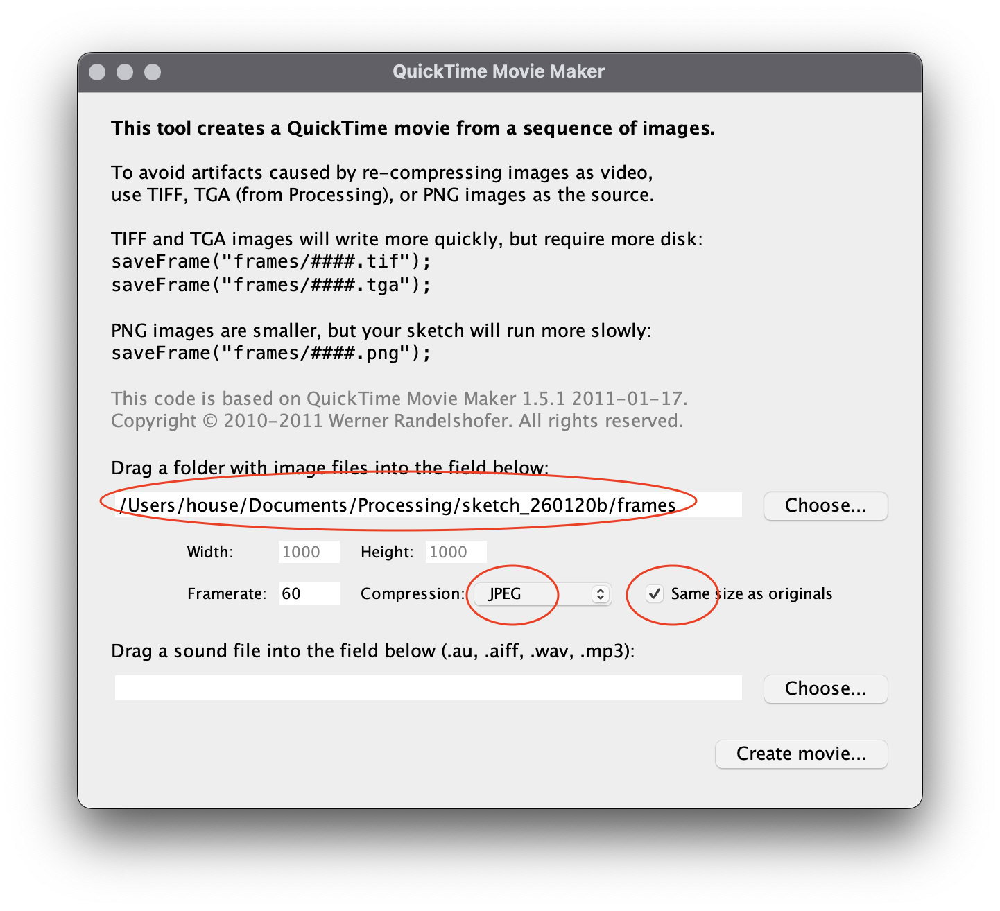

# Movie Maker in Processing

Using Processing, you can generate a video file from an animated sketch.

The following code shows a basic sketch in Python for Processing that uses motion. It also includes `saveFrame("frames/#####.png")` as the last command of the `draw()` function. This will generate an image for each frame of your animation saved in a folder called "frames" inside of your sketch folder.

```py
def setup(): 
    size(400, 400)
    
def draw():
    background(255)        
    fill(0, 255, 0)
    noStroke()
    circle(width/2 + swing(-42, 42, 50), change(0, height, 500) + swing(-12, 12, 28), 22)

    saveFrame("frames/#####.png") # saves each frame as an image
    
def change(start, stop, duration, offset=0):
    return map((frameCount - offset) % max(duration, 1), 0, duration, start, stop)

def swing(start, stop, duration, offset=0): 
    position = -cos(2 * PI * change(0, 1, duration * 2, offset)) * .5 + .5
    return (position * (stop - start)) + start   
```

Next, look under the "Tools" menu and select "Movie Maker":
- drag your "frames" folder onto the path shown in the dialog box
- make sure "Same size as originals" is selected
- choose "JPEG" for compression

<p align="center">
  <br />
</p>

When you're ready, click "Create Movie..." and select your sketch folder as a path with a title of your choice. Processing will then generate a .mov file.


### Tips

- Don't let the sketch run for too long—images take up space, and if you generate too many, it can slow down your computer.

- Keep in mind that a generated movie file may be smoother than the actual animation, but it will also likely be worse quality in terms of colors and sharp lines. Once you are able to make a basic movie, you can experiment with different resolutions and compressions that may or may not help things look better.

