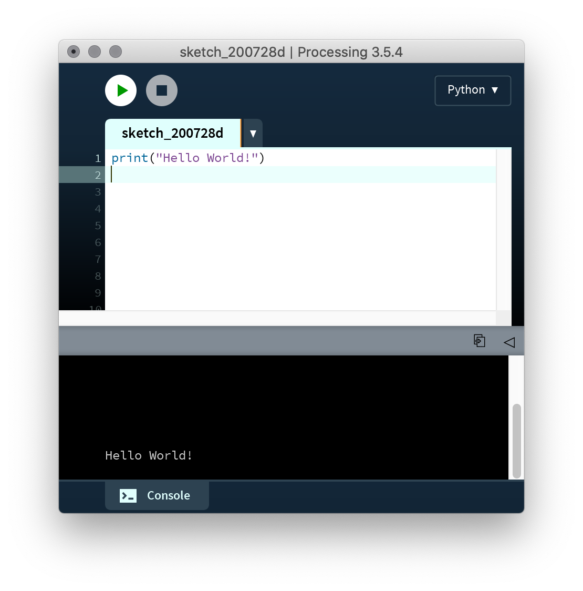
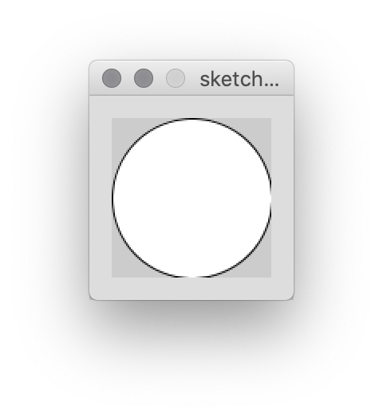
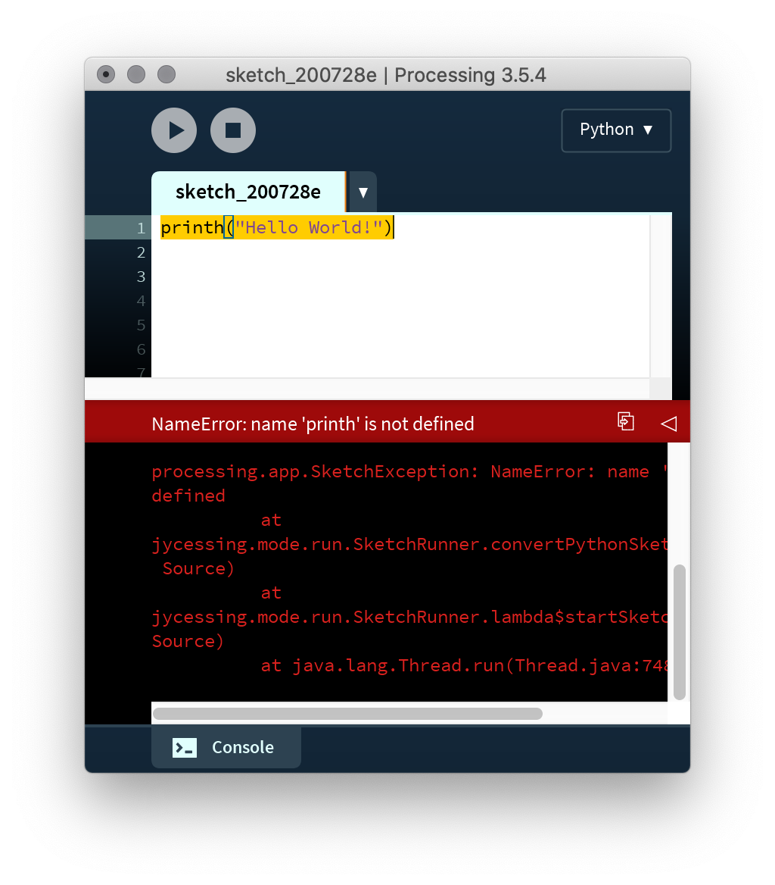

# Getting started with Python Mode for Processing

We're used to downloading software such as Photoshop or Ableton to our computers and using it creatively. These applications are programs that have been written in programming languages. Writing code yourself to make your own programs is arguably a more interesting way to interact with a computer, but to do so we have to choose some tools:

**[Python](https://en.wikipedia.org/wiki/Python_(programming_language))** is a programming language. Other languages include C, Java, Go, Swift, PHP, Javascript ... the list goes on and on. Python is notable for its relatively simple syntax and its wide applicability. Though it was invented in 1991, today it's used for cutting edge artificial intelligence research, computational biology, data visualization, and backend server systems at companies like Google, not to mention many digital media artists. You can compare a programming language to the syntax and basic vocabulary of a "natural language" like English, except that you're addressing the computer instead of a person.

**[Processing](https://processing.org/overview/)** is a software application that we'll use to write programs in Python (yes, it turns out you need software to write software) which was created to make programming more accessible for artists. In addition, it provides Python with a _library_ of additional functions for graphics. You can think of this like a set of new words that the computer understands that don't automatically come with Python. Processing was originally created to work with the Java programming language, not Python, so we'll be using a special mode. Confusingly, Processing itself is often called a programming language, but when people say this they are referring to the original Java version. In general, programs written with Processing are called "sketches."

## Setup

[Download Processing](https://processing.org/download/) for whichever operating system you are using

- On Windows, you'll have a .zip file. Double-click it, and drag the folder inside to a location on your hard disk. It could be Program Files or simply the desktop, but the important thing is for the processing folder to be pulled out of that .zip file. Then double-click processing.exe to start.

- The Mac OS X version is also a .zip file. Double-click it and drag the Processing icon to the Applications folder. Then double-click the Processing icon to start.

You should see something like this:

<p align="center">
  <br />
</p>


Processing doesn't include support for the Python programming language by default. In order to enable Python support, you'll need to install an add-on called Python Mode. You can do this by clicking on the drop-down menu on the right side of the tool bar and selecting "Add Mode..."

<p align="center">
  <br />
</p>

A window with the title "Mode Manager" will appear. Scroll down until you see "Python" and press "Install."

<p align="center">
  <br />
</p>

After you do this, quit Processing and re-open it. You should then be able to select Python under the mode menu.

<p align="center">
  <br />
  <br />
</p>

## Hello World

It is tradition to write a "Hello World" program to make sure everything is up and running correctly. To do that, type the following into your sketch (pay attention to quotation marks and the lack of spacing):

```py
print("Hello World!")
```

To run your program, click the button that looks like a "play" icon (or type Command-R). You should see something like this:

<p align="center">
  <br />
</p>

...and a small window like this:

<p align="center">
  <br />
</p>

That's it! You've created your first program.


## Error messages

As you will learn, you will have to write Python code _exactly_ right for it to work. The computer has no ability to guess at what you mean. When something doesn't make sense to the computer, you'll see an error. Don't be afraid of this! In fact, it's a good thing, because it helps us figure out what's going on in the program and to correct it.

<p align="center">
  <br />
</p>
