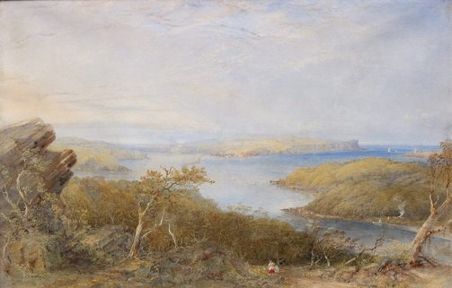
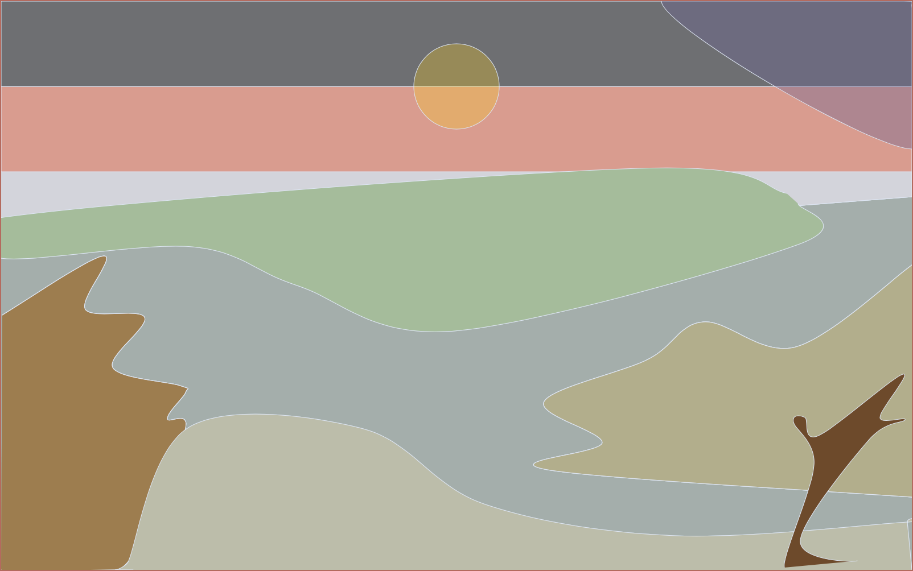
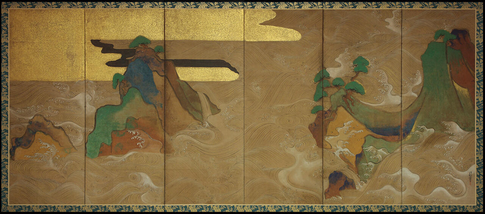
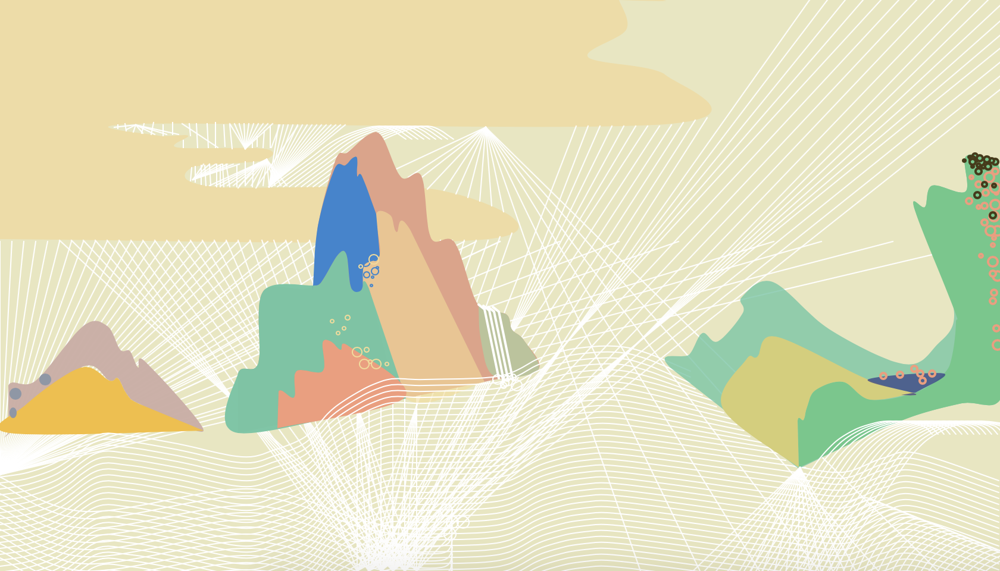
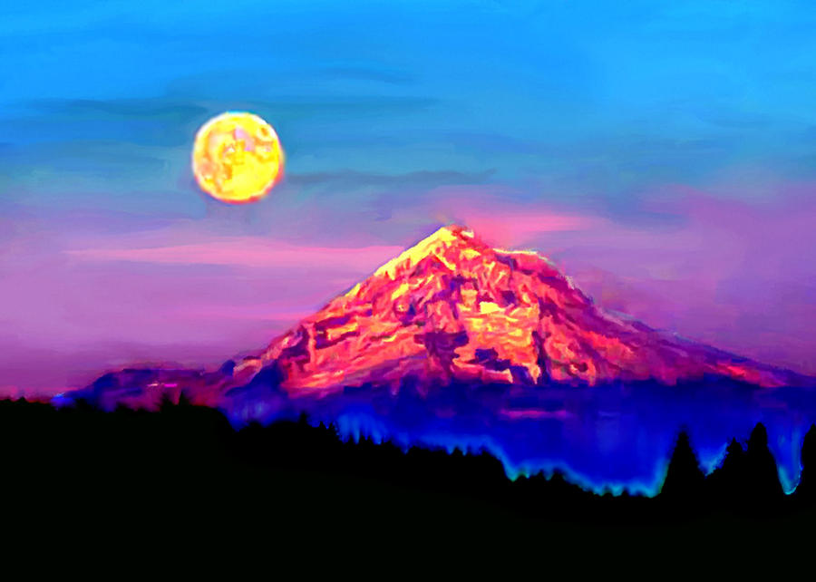
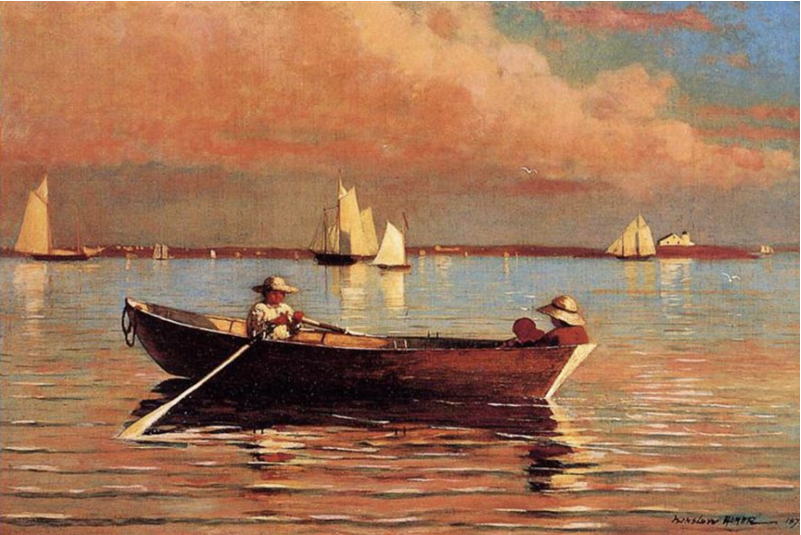
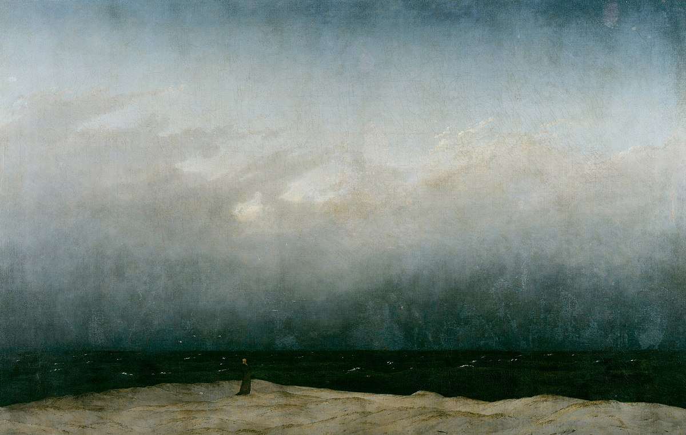
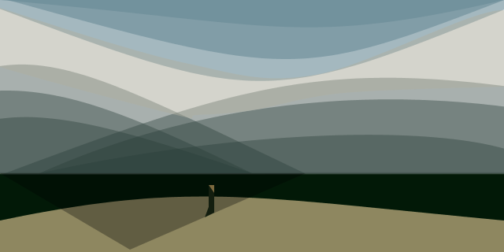

## Sketch #1: Coordinates

In this sketch, you will practice with drawing using coordinates. To explore the relationship of digitally encoded "space" to traditional depictions of the world, you will choose a [famous landscape painting from art history](https://www.google.com/search?q=famous+landscape+painting) and reinterpret it in code. _Reinterpret_ means that you do not necessarily have to try and reproduce the painting exactly—rather, you must choose how to work with code in a way that retains a sense of the original composition but which expresses something of its _digital_-ness. Pay particular attention to your use of color.

Turn in your sketch folder to Moodle (first remember to save it, include `save("output.png")` as the last line of your sketch, and run the sketch to make sure an image file is generated). In addition, upload an image file of the original painting. Your description on Moodle should include your title, the artist and year of the original painting, and a [3-sentence statement](../../resources/statement_guidelines.md) that explains the choices you made in your reinterpretation.

### Examples

Here's some inspiration from past semesters, with the original and reinterpreted landscapes side by side:

 

  
   
  Aijaeh Hennessey, <i>No Country</i> (2020) 

  

  
   
  Ellie Villano, <i>Waves at Matsushima</i> (2020) 

  

  
   
  Ericka Eyton, <i>Technicolor Mount Hood</i> (2020) 

  

  
   
  Elsa Hanson, <i>Blurred Gloucester Harbor</i> (2020) 

  

  
   
  Owen Wolff, <i>Monk by the Sea</i> (2021) 

