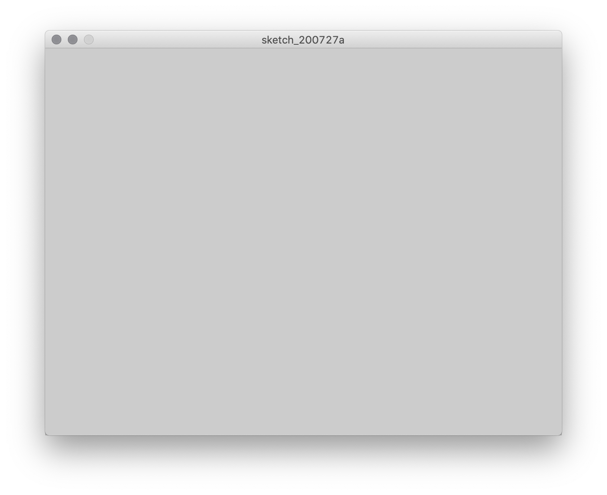

# Coordinates

### The canvas

Spatial coordinates work a little differently with computers than you might be used to from math class. Rather than `0, 0` (aka the "origin") being in the center of the screen, it represents the top-left corner, and as the `y` value gets larger, we move further down:

<p align="center">
  <br />  
</p>


Let's see how this works with Python Mode for Processing. Open processing and start a new Python sketch.

First, we'll create the canvas. Type the following on line 1:

```py
size(640, 480)              # width, height
```

This is what it should look like in the Processing window:

<p align="center">
  <br />
</p>

In this code, `size` is a **function** provided by Processing that creates the "canvas," which takes two **arguments**, one each for how many pixels wide and how many high we want our canvas to be. Subsequently, when we run the program, a grey window should appear that is exactly 640 by 480 pixels (I chose these dimensions for fun because they are what personal computers used in the 80s and 90s).

<p align="center">
  <br />
</p>

Though the canvas is currently blank, what is key to realize is that it is essentially a fancy piece of graph paper, with each pixel corresponding to a pair of x/y coordinates.

As an aside, I also wrote a "comment" in this code:
```py
      # width, height
```
In Python, anything on a line after a `#` character is ignored by the program. You can use comments to keep notes on what's going on in the code itself, which can be very helpful in larger programs.


### Lines and shapes

Processing provides us with many more functions, including `line`. Let's draw one from the upper-left corner of the screen to the lower-right. `line` takes four arguments, one each for the x/y coordinates of the starting point, and one each for the x/y coordinates of the stopping point. So to make the line stretch diagonally across the entire canvas, we'll want to draw it from `0, 0` to  `640, 480`:

```py
size(640, 480)              # width, height
line(0, 0, 640, 480)        # begin x, begin y, end x, end y
```

<p align="center">
  <br />
</p>

How about a circle in the center?

`circle` takes three arguments: the x and y coordinates of its center, and the diameter of the circle. The center point of the canvas is half its width (640 / 2 = 320) and half its height (480 / 2 = 240):

```py
size(640, 480)              # width, height
line(0, 0, 640, 480)        # begin x, begin y, end x, end y

circle(320, 240, 50)        # center x, center y, diameter
```

<p align="center">
  <br />
</p>

Processing provides several shapes that all work similarly, though they are all different: each one is a function that takes a series of arguments that provide the necessary information for the computer to draw that particular shape.

```py
size(640, 480)              # width, height
line(0, 0, 640, 480)        # begin x, begin y, end x, end y

circle(320, 240, 50)        # center x, center y, diameter
square(320, 10, 50)         # top-left x, top-right y, side length
rect(20, 50, 100, 400)      # top-left x, top-right y, width, height
ellipse(500, 200, 200, 10)  # center x, center y, width, height
triangle(30, 75, 58, 20, 86, 75)    # x and y for each of the three points
quad(338, 331, 386, 320, 369, 363, 330, 376) # x and y for each of the four points
```

<p align="center">
  <br />
</p>

Notice how the shapes overlap each other depending on the order in which we write them in the code.

Try experimenting with different shapes and arguments. You can type in as many as you want, in any order and on any line. You can only have one function per line, but blank lines in between functions are fine.

<!-- draw a face -->

### Line size

So far, everything has a black outline that is one pixel thick. We can change that using the `strokeWeight` function, which takes as an argument the number of pixels wide that we want our lines to be. It's like picking up a new pen—once we change the `strokeWeight`, it will stay that way until we change it again. (We can also use `noStroke` if we don't want any stroke at all.)

Here's a new program to demonstrate:
```py
size(640, 480)

strokeWeight(5)
line(0, 50, 640, 50)
line(0, 100, 640, 100)

strokeWeight(10)
line(0, 150, 640, 200)

strokeWeight(0.5)
line(0, 250, 640, 250)

noStroke()
square(50, 300, 50)
```

<p align="center">
  <br />
</p>

<!-- add to face -->

### Color

You will have noticed that the lines are black and the fill of the shapes is white. Those are the default values—and not very interesting ones.

Color, just like spatial coordinates, are represented in computers using numbers. Though a painter comes up with shades of color by physically mixing paints, the computer usually encodes color as a three numbers for the amount of red, green, and blue components.

<p align="center">
  <br />
</p>

It may seem awkward, but the amount for each of these values is specified in the range 0-255 (the reason is that 256 values are the most that can be specified with [one byte](https://256stuff.com/256.html) of information—we will return to this later in the semester). Suffice to say that the easy way to deal with this is to use [Google's Color Picker](https://www.google.com/search?q=color+picker).

<p align="center">
  <br />
</p>

To change the line color, we use the `stroke` function, and to change the fill color, we use the `fill`. Each of these take three arguments for the red, green, and blue amounts. For example:

```py
stroke(0, 0, 0)             # the lines remain black
fill(252, 107, 3)           # the fill is a nice burnt orange
```

This works like changing a paintbrush—anything put on the canvas after changing the color will be that color. To eliminate the line entirely, we can use `noStroke`, and to eliminate fill entirely, we use `noFill`. In addition, we can use `background` to the change the default color of the canvas.

Here's an example of a white background with three circles with no outlines and primary colors:

```py
size(640, 480)

background(255, 255, 255)    # white

noStroke()

fill(255, 0, 0)
circle(320, 150, 200)

fill(0, 255, 0)
circle(250, 250, 200)

fill(0, 0, 255)
circle(380, 250, 200)
```

<p align="center">
  <br />
</p>

It turns out that `stroke` and `fill` can take one more argument—this one is for opacity, with 0 corresponding to completely transparent and 255 indicating completely opaque (which the is default). Here's the same code, but notice this fourth argument added in for `fill`:

```py
size(640, 480)

background(255, 255, 255)   # white

noStroke()

fill(255, 0, 0, 100)    # 100 out of 255 opacity
circle(320, 150, 200)

fill(0, 255, 0, 100)
circle(250, 250, 200)

fill(0, 0, 255, 100)
circle(380, 250, 200)
```

<p align="center">
  <br />
</p>

In this example, the computer automatically computes the blended colors according to the overlap and the opacity.

What if we don't want to work in color, just greyscale? It turns out we don't need all three arguments—using just one will get us varying degrees of grey:

```py
size(640, 480)

background(255) # shorter way to make white

noStroke()

fill(50)
circle(320, 150, 200)

fill(150)
circle(250, 250, 200)

fill(200)
circle(380, 250, 200)
```

<p align="center">
  <br />
</p>

Finally, we can also do greyscale + opacity if we use two arguments:

```py
size(640, 480)

background(255) # shorter way to make white

noStroke()

fill(50, 200)           # 200 out of 255 opacity
circle(320, 150, 200)

fill(150, 200)
circle(250, 250, 200)

fill(200, 200)
circle(380, 250, 200)
```

<p align="center">
  <br />
</p>


To summarize:  

1 argument, greyscale:  
`fill(100)`  

2 arguments, greyscale + opacity:  
`fill(100, 50)`           

3 arguments, color:  
`fill(100, 200, 0)`       

4 arguments, color + opacity:  
`fill(100, 200, 0, 50)`   


<!-- add to face -->

### Complex shapes and curves

While circles, squares, and the like are great, we can also draw arbitrary shapes. This is slightly more complicated because it involves multiple lines of code.

To start a shape, we use the function `beginShape()`; to end it, we use `endShape()`:

```py
size(600, 400)
beginShape()

endShape()
```

By itself, these lines don't do anything. But in between them, we'll add series of anchor points, and  Processing will connect them together into a shape.

```py
size(600, 400)
beginShape()
vertex(174, 114)
vertex(246, 140)
vertex(305, 58)
vertex(345, 167)
vertex(467, 109)
vertex(355, 220)
vertex(439, 350)
vertex(279, 226)
vertex(105, 240)
vertex(223, 157)
vertex(174, 114)  
endShape()
```
<p align="center">
  <br />
</p>


Although there are many ways to draw curves in Processing, the most flexible way works very similarly.

To make curved lines instead of straight ones, we use `curveVertex()`, which also just takes x and y coordinates as arguments.

```py
size(600, 400)
beginShape()
curveVertex(10, 390) # start point
curveVertex(10, 390) # repeat

# intermediate anchor points
curveVertex(200, 200)
curveVertex(280, 280)
curveVertex(400, 100)
curveVertex(450, 300)
curveVertex(500, 10)

curveVertex(590, 390) # end point
curveVertex(590, 390) # repeat
endShape()
```
<p align="center">
  <br />
</p>

It can be a little hard to understand the relationship between the curve and the `curveVertex`s. To visualize it, let's add some code to draw points (using a function we haven't used yet, `point()`) at each of the anchors so we can see what's going on:

```py
size(600, 400)

beginShape() # enclose the shape
curveVertex(10, 390) # start point
curveVertex(10, 390) # repeat

# anchor points
curveVertex(200, 200)
curveVertex(280, 280)
curveVertex(400, 100)
curveVertex(450, 300)
curveVertex(500, 10)

curveVertex(590, 390) # end point
curveVertex(590, 390) # repeat
endShape() # enclose the shape

strokeWeight(10)

# draw dots on start and end
stroke(0, 0, 255)
point(10, 390)
point(590, 390)

# draw dots on intermediate anchor points
stroke(255, 0, 0)
point(200, 200)
point(280, 280)
point(400, 100)
point(450, 300)
point(500, 10)
```

<p align="center">
  <br />
</p>

As you can see, the anchors effectively constrain the curve—the more points, the tighter and more complex the curve can be.

But why are the start and end points doubled, with two `curveVertex()`s with the same coordinates? This makes it easier to think about when we're just getting started. But the very first and very last `curveVertex()` define the initial slope of the curve—it's like a virtual anchor point to get things going. For now, however, doubling works fine.

Processing will fill the shape by default, but you can always use `noFill()` or `noStroke()` to adjust the appearance as necessary.


## Saving an image

Remember to periodically save your work. Don't use "Save As...", as that will only make things more confusing.

<p align="center">
  <br />
</p>

In addition, if the last line of your sketch is the `save` function, you'll have an image file in your sketch folder.

```py
# draw some things
size(640, 480)
background(69, 209, 99)
strokeWeight(5)
noFill()
bezier(100, 100, 400, 100, 200, 400, 540, 380)

# make an image file
save("output.png")    
```

<p align="center">
  <br />
</p>


Phew, that's a lot to absorb at once. Don't worry, if all of this seems complicated, it will get more intuitive with practice, and we will learn some shortcuts next unit.
