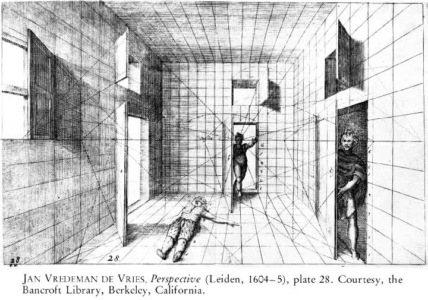
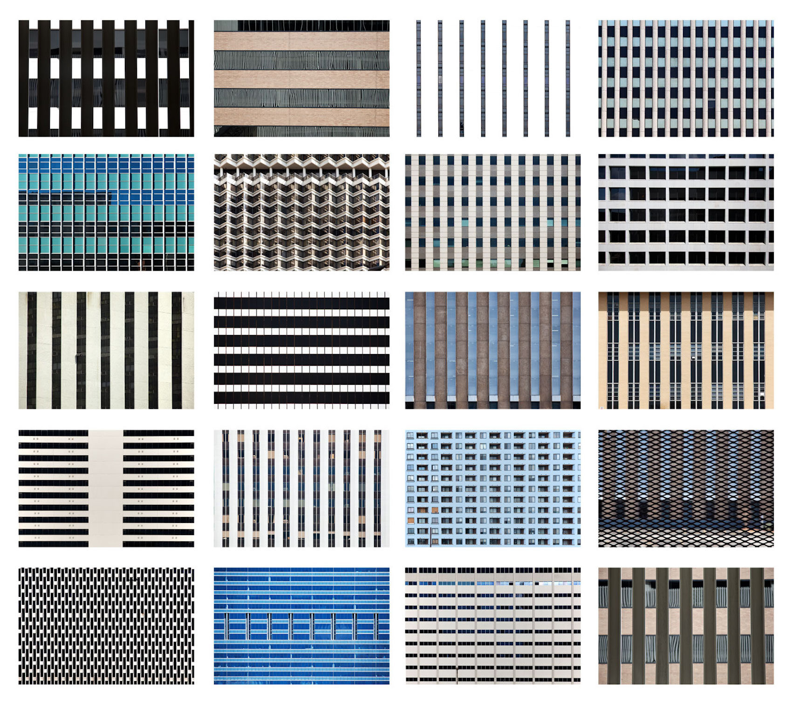

# Coordinates

## Concept

Fundamentally, computers represent the world in numeric form. Whether text, an image, music, seismological observations, or the fingerprint you use to unlock your phone, it's all numbers to the machine. As a result, dealing with numbers on some level is a quality that is characteristic of all digital media.

In our exercise from last class, a common problem was how to tell the other person _where_ and _in what direction_ on the paper to draw. Some of you may have used words like "the center" as a means of orientation, or even referenced a unit of measurement, like "about two inches from the previous line." Computers, however, typically represent the concept of "space" through a numeric **coordinate** system; a 2-dimensional canvas has a row (x) value and a column (y) value that correspond to _pixels_ (**pi** cture-**el** ements) on the screen. This encoding scheme quantifies something intuitive like physical space into a numeric system that the computer can process.

## Context

### Non-digital

<!-- where do we see coordinate systems? -->

Of course, using coordinates to represent space is not unique to digital media. In the Western world, coordinate systems are associated with René Descartes and the Enlightenment (aka the "[Cartesian Grid](https://en.wikipedia.org/wiki/Cartesian_coordinate_system)"), when they were first used to visualize algebraic equations. Artists had been using grids before that, however; notably, Leon Battista Alberti wrote a treatise in 1435 that included the use of grid systems to establish [linear perspective](https://en.wikipedia.org/wiki/Perspective_(graphical)) in painting.

   
  From Alberti's "De Pictura (On Painting)" (1435) 

   

European use of coordinates was particularly important in cartography. Latitude and longitude encode the surface of the Earth into calculable numbers, which accompanied colonization of Africa and the Americas from the 15th century onward. In addition, colonial cities often used the [urban grid](https://en.wikipedia.org/wiki/Grid_plan), although the technique was not novel to cultures such as those in [Sengal](https://www.tandfonline.com/doi/abs/10.1080/02665433.2018.1453860?scroll=top&needAccess=true&journalCode=rppe20) and [Mexico](http://www.public.asu.edu/~mesmith9/1-CompleteSet/MES-08-AzCityPlan-Encyclopedia.pdf). These systematic approaches were utilized as [a means of subjugating](http://projectivecities.aaschool.ac.uk/portfolio/the-citys-essentiality-to-the-spanish-colonial-project/) alternative [indigenous modes](https://press.uchicago.edu/books/HOC/HOC_V2_B3/HOC_VOLUME2_Book3_chapter6.pdf) of [organizing space](https://openresearch-repository.anu.edu.au/handle/1885/114874) and of consolidating power.

   
  Map of North America with coordinate lines (1600s) 

These colonial endeavors are inseparable from what it is that we mean when we say, "modern"—it's a sense of rationalized space. Modernism in art, however, is associated with the 20th century.

Gridded space became an important tool in modernist print [design](https://www.readingdesign.org/modernist-grid) and [architecture](https://nplusonemag.com/issue-34/reviews/vernacular-modernism/) (often associated with the [Bauhaus](https://en.wikipedia.org/wiki/Bauhaus)). And grids became an aesthetic unto themselves in modernist art and architecture, which have had a defining influence on the aesthetics associated with computers.

   
  Grid-based architecture from Mies van der Rohe (1970s) 

   
  Ben Marcin, <i>Untitled (Twenty Office Buildings)</i> (2010–14)  

   
  Piet Mondrian, <i>Broadway Boogie Woogie</i> (1942) 

### Digital

<!-- in what context were the earliest computers? -->

Grids on contemporary computers, and numeric encoding in computing general, inherit the rationalizing impulse of Enlightenment thought and modernist aesthetics (and even militaristic histories given the post-WWII [origin of the electronic computer in weapons research](https://en.wikipedia.org/wiki/ENIAC)).

However, from early on, artists have co-opted those systems for their own expressive purposes. An early example is [Lillian Schwartz](https://en.wikipedia.org/wiki/Lillian_Schwartz), one of the first artists to adopt screen-based graphics as her primary medium. As an artist-in-residence at [Bell Labs](https://en.wikipedia.org/wiki/Bell_Labs), Schwartz created paintings and films that made use of pixels defined by screen coordinates, and she expanded and subverted the possibilities of these early graphics systems.

   
  Lillian Schwartz, <i>Olympiad</i> (1971) 

To make her images, Lillian would sketch the images on graph paper and then [encode each color and position into coordinates](http://lillian.com/discoveries_post/). These would then be transferred to [punch cards](https://en.wikipedia.org/wiki/Punched_card) and fed into the machine, as these early computers did not support direct entry via keyboard.

   
  Example of a punch card 

   
  Lillian Schwartz, still from <i>Enigma</i> (1972) 
  <a href="http://lillian.com/1972-enigma-4-min-20-sec/">Watch the video</a> (trigger warning for people sensitive to flashing lights) 

Schwartz's work plays with the abstraction of representational imagery into digital form—or even just digital form for its own sake. Color plays a critical role, and in fact color is another example of how intuitive phenomena are encoded numerically, as we'll explore.

### Response

Describe another example of the use of a coordinate system. Provide a link if possible.

##### Ready to code? Preview the introduction we'll do in class [here](code.md).
