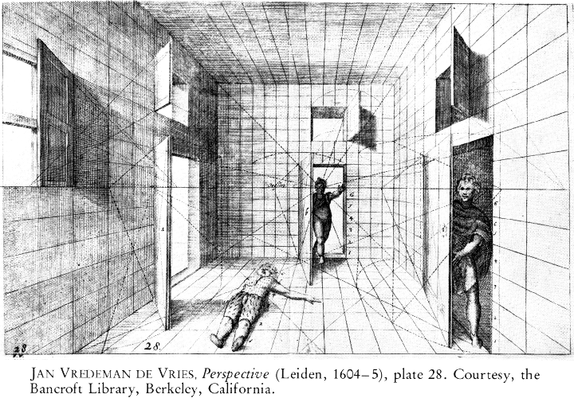
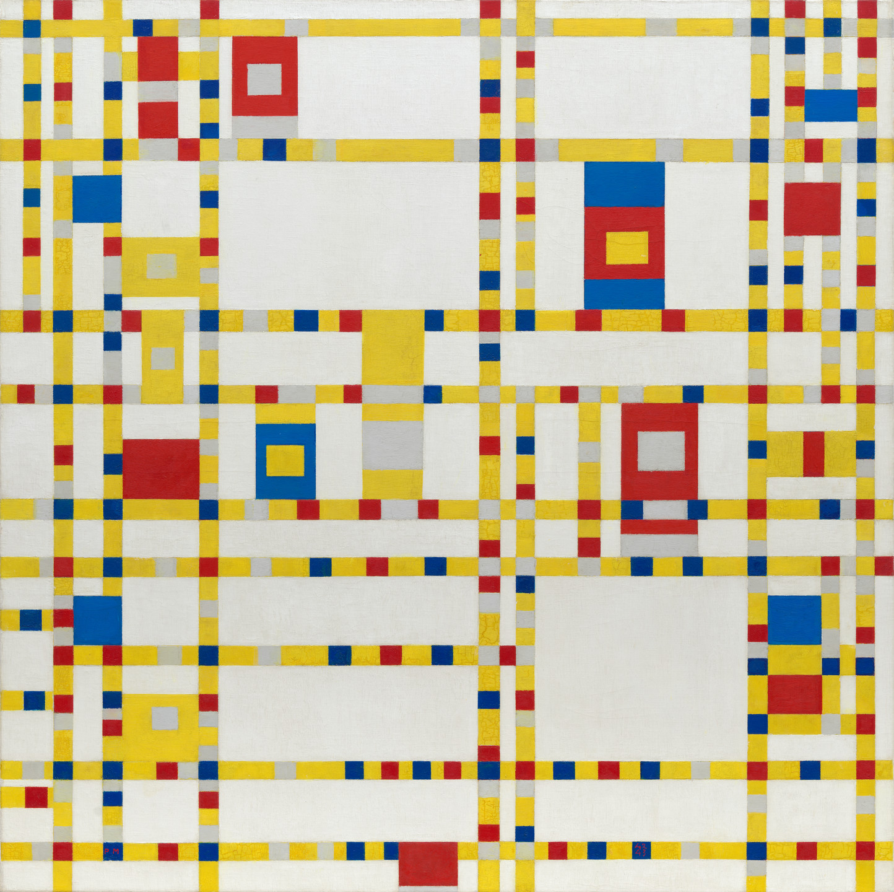
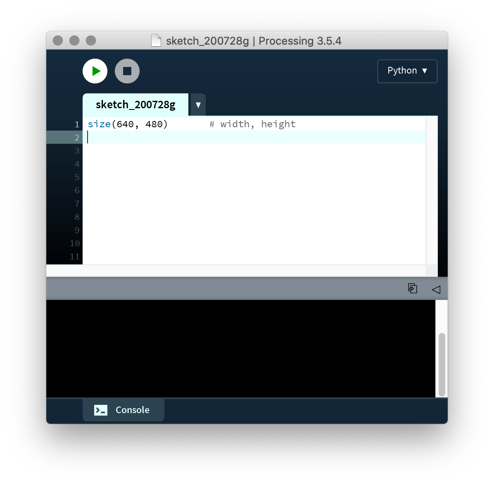
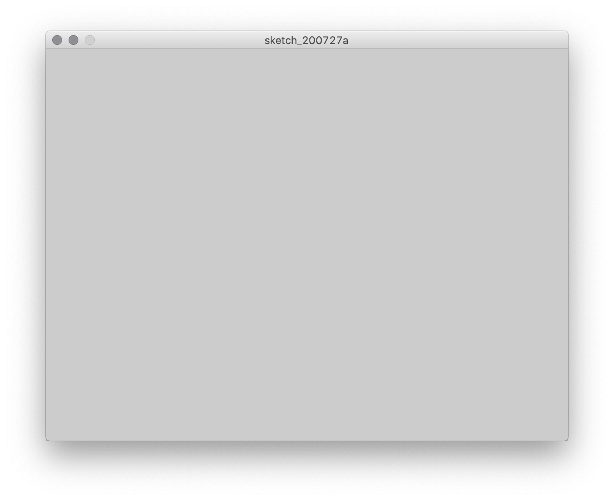
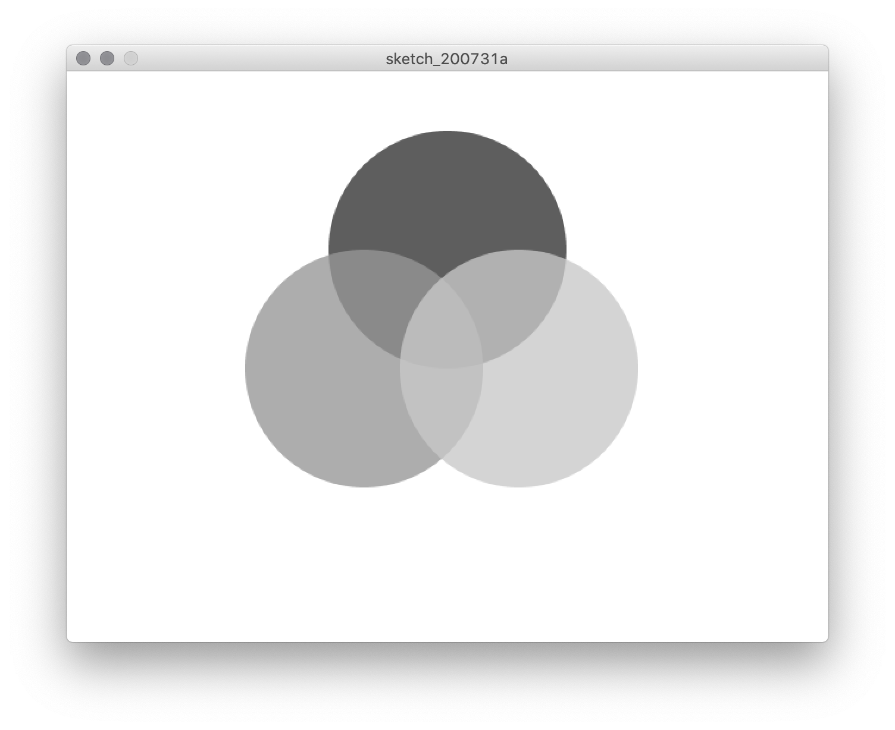
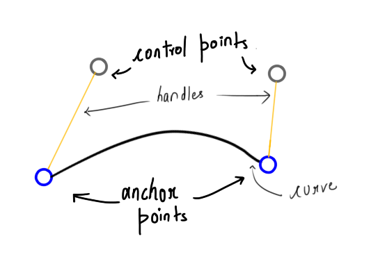
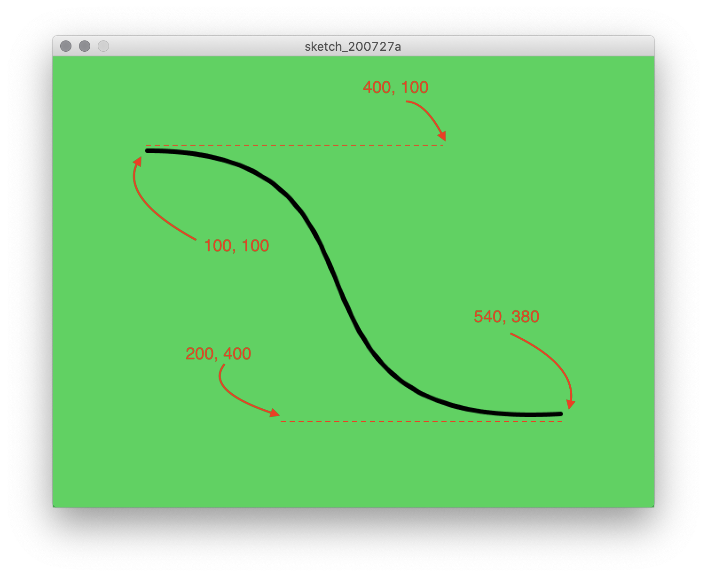
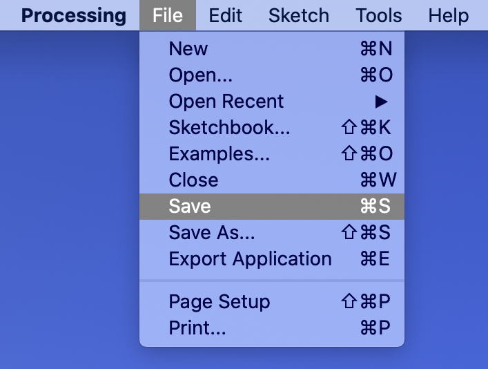

# Coordinates

## Concept

Fundamentally, computers represent the world in numeric form. Whether text, an image, music, seismological observations, or the fingerprint you use to unlock your phone, it's all numbers to the machine. As a result, dealing with numbers on some level is a quality that is characteristic of all digital media.

In our exercise from last class, a common problem was how to tell the other person _where_ and _in what direction_ on the paper to draw. Some of you may have used words like "the center" as a means of orientation, or even referenced a unit of measurement, like "about two inches from the previous line." Computers, however, typically represent the concept of "space" through a numeric **coordinate** system; a 2-dimensional canvas has a row (x) value and a column (y) value that correspond to _pixels_ (**pi** cture-**el** ements) on the screen. This encoding scheme quantifies something intuitive like physical space into a numeric system that the computer can process.

## Context

### Non-digital

<!-- where do we see coordinate systems? -->

Of course, using coordinates to represent space is not unique to digital media. In the Western world, coordinate systems are associated with René Descartes and the Enlightenment (aka the "[Cartesian Grid](https://en.wikipedia.org/wiki/Cartesian_coordinate_system)"), when they were first used to visualize algebraic equations. Artists had been using grids before that, however; notably, Leon Battista Alberti wrote a treatise in 1435 that included the use of grid systems to establish [linear perspective](https://en.wikipedia.org/wiki/Perspective_(graphical)) in painting.

<p align="center">
  <br />
  From Alberti's "De Pictura (On Painting)" (1435)<br />
</p>

<p align="center">
  <br />
</p>

European use of coordinates was particularly important in cartography. Latitude and longitude encode the surface of the Earth into calculable numbers, which accompanied colonization of Africa and the Americas from the 15th century onward. In addition, colonial cities often used the [urban grid](https://en.wikipedia.org/wiki/Grid_plan), although the technique was not novel to cultures such as those in [Sengal](https://www.tandfonline.com/doi/abs/10.1080/02665433.2018.1453860?scroll=top&needAccess=true&journalCode=rppe20) and [Mexico](http://www.public.asu.edu/~mesmith9/1-CompleteSet/MES-08-AzCityPlan-Encyclopedia.pdf). These systematic approaches were utilized as [a means of subjugating](http://projectivecities.aaschool.ac.uk/portfolio/the-citys-essentiality-to-the-spanish-colonial-project/) alternative [indigenous modes](https://press.uchicago.edu/books/HOC/HOC_V2_B3/HOC_VOLUME2_Book3_chapter6.pdf) of [organizing space](https://openresearch-repository.anu.edu.au/handle/1885/114874) and of consolidating power.

<p align="center">
  <br />
  Map of North America with coordinate lines (1600s)<br />
</p>

In the twentieth century, gridded space became an important tool in modernist print [design](https://www.readingdesign.org/modernist-grid) and [architecture](https://nplusonemag.com/issue-34/reviews/vernacular-modernism/) (often associated with the [Bauhaus](https://en.wikipedia.org/wiki/Bauhaus)). And grids became an aesthetic unto themselves in modernist art and architecture, which have had a defining influence on the aesthetics associated with computers.

<p align="center">
  <br />
  Piet Mondrian, <i>Broadway Boogie Woogie</i> (1942)<br />
</p>

<p align="center">
  <br />
  Grid-based architecture from Mies van der Rohe (1970s)<br />
</p>


### Digital

<!-- in what context were the earliest computers? -->

Grids on contemporary computers, and numeric encoding in computing general, inherit the rationalizing impulse of Enlightenment thought and modernist aesthetics (and even militaristic histories given the post-WWII [origin of the electronic computer in weapons research](https://en.wikipedia.org/wiki/ENIAC)).

However, from early on, artists have co-opted those systems for their own expressive purposes. An early example is [Lillian Schwartz](https://en.wikipedia.org/wiki/Lillian_Schwartz), one of the first artists to adopt screen-based graphics as her primary medium. As an artist-in-residence at [Bell Labs](https://en.wikipedia.org/wiki/Bell_Labs), Schwartz created paintings and films that made use of pixels defined by screen coordinates, and she expanded and subverted the possibilities of these early graphics systems.

<p align="center">
  <br />
  Lillian Schwartz, <i>Olympiad</i> (1971)<br />
</p>

To make her images, Lillian would sketch the images on graph paper and then [encode each color and position into coordinates](http://lillian.com/discoveries_post/). These would then be transferred to [punch cards](https://en.wikipedia.org/wiki/Punched_card) and fed into the machine, as these early computers did not support direct entry via keyboard.

<p align="center">
  <br />
  Example of a punch card<br />
</p>

<p align="center">
  <br />
  Lillian Schwartz, still from <i>Enigma</i> (1972)<br />
  <a href="http://lillian.com/1972-enigma-4-min-20-sec/">Watch the video</a><br />
</p>

Schwartz's work plays with the abstraction of representational imagery into digital form—or even just digital form for its own sake. Color plays a critical role, and in fact color is another example of how intuitive phenomena are encoded numerically, as we'll explore below.

## Code

### The canvas

Spatial coordinates work a little differently with computers than you might be used to from math class. Rather than `0, 0` (aka the "origin") being in the center of the screen, it represents the top-left corner, and as the `y` value gets larger, we move further down:

<p align="center">
  <br />  
</p>


Let's see how this works with Python Mode for Processing. Open processing and start a new Python sketch.

First, we'll create the canvas. Type the following on line 1:

```py
size(640, 480)              # width, height
```

This is what it should look like in the Processing window:

<p align="center">
  <br />
</p>

In this code, `size` is a **function** provided by Processing that creates the "canvas," which takes two **parameters**, one each for how many pixels wide and how many high we want our canvas to be. Subsequently, when we run the program, a grey window should appear that is exactly 640 by 480 pixels (I chose these dimensions for fun because they are what personal computers used in the 80s and 90s).

<p align="center">
  <br />
</p>

Though the canvas is currently blank, what is key to realize is that it is essentially a fancy piece of graph paper, with each pixel corresponding to a pair of x/y coordinates.

As an aside, I also wrote a "comment" in this code:
```py
      # width, height
```
In Python, anything on a line after a `#` character is ignored by the program. You can use comments to keep notes on what's going on in the code itself, which can be very helpful in larger programs.


### Lines and shapes

Processing provides us with many more functions, including `line`. Let's draw one from the upper-left corner of the screen to the lower-right. `line` takes four parameters, one each for the x/y coordinates of the starting point, and one each for the x/y coordinates of the stopping point. So to make the line stretch diagonally across the entire canvas, we'll want to draw it from `0, 0` to  `640, 480`:

```py
size(640, 480)              # width, height
line(0, 0, 640, 480)        # begin x, begin y, end x, end y
```

<p align="center">
  <br />
</p>

How about a circle in the center?

`circle` takes three parameters: the x and y coordinates of its center, and the diameter of the circle. The center point of the canvas is half its width (640 / 2 = 320) and half its height (480 / 2 = 240):

```py
size(640, 480)              # width, height
line(0, 0, 640, 480)        # begin x, begin y, end x, end y

circle(320, 240, 50)        # center x, center y, diameter
```

<p align="center">
  <br />
</p>

Processing provides several shapes that all work similarly, though they are all different: each one is a function that takes a series of parameters that provide the necessary information for the computer to draw that particular shape.

```py
size(640, 480)              # width, height
line(0, 0, 640, 480)        # begin x, begin y, end x, end y

circle(320, 240, 50)        # center x, center y, diameter
square(320, 10, 50)         # top-left x, top-right y, side length
rect(20, 50, 100, 400)      # top-left x, top-right y, width, height
ellipse(500, 200, 200, 10)  # center x, center y, width, height
triangle(30, 75, 58, 20, 86, 75)    # x and y for each of the three points
quad(338, 331, 386, 320, 369, 363, 330, 376) # x and y for each of the four points
```

<p align="center">
  <br />
</p>

Notice how the shapes overlap each other depending on the order in which we write them in the code.

Try experimenting with different shapes and parameters. You can type in as many as you want, in any order and on any line. You can only have one function per line, but blank lines in between functions are fine.

<!-- draw a face -->

### Line size

So far, everything has a black outline that is one pixel thick. We can change that using the `strokeWeight` function, which takes as a parameter the number of pixels wide that we want our lines to be. It's like picking up a new pen—once we change the `strokeWeight`, it will stay that way until we change it again. (We can also use `noStroke` if we don't want any stroke at all.)

Here's a new program to demonstrate:
```py
size(640, 480)

strokeWeight(5)
line(0, 50, 640, 50)
line(0, 100, 640, 100)

strokeWeight(10)
line(0, 150, 640, 200)

strokeWeight(0.5)
line(0, 250, 640, 250)

noStroke()
square(50, 300, 50)
```

<p align="center">
  <br />
</p>

<!-- add to face -->

### Color

You will have noticed that the lines are black and the fill of the shapes is white. Those are the default values—and not very interesting ones.

Color, just like spatial coordinates, are represented in computers using numbers. Though a painter comes up with shades of color by physically mixing paints, the computer usually encodes color as a three numbers for the amount of red, green, and blue components.

<p align="center">
  <br />
</p>

It may seem awkward, but the amount for each of these values is specified in the range 0-255 (the reason is that 256 values are the most that can be specified with [one byte](https://256stuff.com/256.html) of information—we will return to this later in the semester). Suffice to say that the easy way to deal with this is to use [Google's Color Picker](https://www.google.com/search?q=color+picker).

<p align="center">
  <br />
</p>

To change the line color, we use the `stroke` function, and to change the fill color, we use the `fill`. Each of these take three parameters for the red, green, and blue amounts. For example:

```py
stroke(0, 0, 0)             # the lines remain black
fill(252, 107, 3)           # the fill is a nice burnt orange
```

This works like changing a paintbrush—anything put on the canvas after changing the color will be that color. To eliminate the line entirely, we can use `noStroke`, and to eliminate fill entirely, we use `noFill`. In addition, we can use `background` to the change the default color of the canvas.

Here's an example of a white background with three circles with no outlines and primary colors:

```py
size(640, 480)

background(255, 255, 255)    # white

noStroke()

fill(255, 0, 0)
circle(320, 150, 200)

fill(0, 255, 0)
circle(250, 250, 200)

fill(0, 0, 255)
circle(380, 250, 200)
```

<p align="center">
  <br />
</p>

It turns out that `stroke` and `fill` can take one more parameter—this one is for opacity, with 0 corresponding to completely transparent and 255 indicating completely opaque (which the is default). Here's the same code, but notice this fourth parameter added in for `fill`:

```py
size(640, 480)

background(255, 255, 255)   # white

noStroke()

fill(255, 0, 0, 100)    # 100 out of 255 opacity
circle(320, 150, 200)

fill(0, 255, 0, 100)
circle(250, 250, 200)

fill(0, 0, 255, 100)
circle(380, 250, 200)
```

<p align="center">
  <br />
</p>

In this example, the computer automatically computes the blended colors according to the overlap and the opacity.

What if we don't want to work in color, just greyscale? It turns out we don't need all three parameters—using just one will get us varying degrees of grey:

```py
size(640, 480)

background(255) # shorter way to make white

noStroke()

fill(50)
circle(320, 150, 200)

fill(150)
circle(250, 250, 200)

fill(200)
circle(380, 250, 200)
```

<p align="center">
  <br />
</p>

Finally, we can also do greyscale + opacity if we use two parameters:

```py
size(640, 480)

background(255) # shorter way to make white

noStroke()

fill(50, 200)           # 200 out of 255 opacity
circle(320, 150, 200)

fill(150, 200)
circle(250, 250, 200)

fill(200, 200)
circle(380, 250, 200)
```

<p align="center">
  <br />
</p>


To summarize:  

1 parameter, greyscale:  
`fill(100)`  

2 parameters, greyscale + opacity:  
`fill(100, 50)`           

3 parameters, color:  
`fill(100, 200, 0)`       

4 parameters, color + opacity:  
`fill(100, 200, 0, 50)`   


<!-- add to face -->

### Curves

<!--
size(600, 600)

# draw the curve
noFill()
bezier(0, 300,
       200, 300,
       400, 300,
       600, 300)

# draw the control points
stroke(255, 0, 0)
strokeWeight(10)
point(200, 300)
point(400, 300)
-->

We'll learn how to draw one more thing, although this one is a little weird. To make a curve with the `bezier` function, we need to specify the start and end "anchor" points, plus two "control" points. The line doesn't actually pass through these control points, but they influence how the line curves.

<p align="center">
  <br />
</p>

Here's an example in code:
```py
size(640, 480)
background(69, 209, 99)

strokeWeight(5)
noFill()
bezier(100, 100, 400, 100, 500, 200, 540, 380)
```

And the result:
<p align="center">
  <br />
</p>

Notice how the curve follows the trajectory of the dashed red lines as best it can while still smoothly connecting the lines.

If we keep everything the same except for one of the control points, we get a very different result. Here we've swapped out `500, 200` with `200, 400`:

```py
size(640, 480)
background(69, 209, 99)

strokeWeight(5)
noFill()
bezier(100, 100, 400, 100, 200, 400, 540, 380)
```

<p align="center">
  <br />
</p>

`bezier` is a very interesting function, but it does take some getting used to.

## Saving an image

Remember to periodically save your work. Don't use "Save As...", as that will only make things more confusing.

<p align="center">
  <br />
</p>

In addition, if the last line of your sketch is the `save` function, you'll have an image file in your sketch folder.

```py
# draw some things
size(640, 480)
background(69, 209, 99)
strokeWeight(5)
noFill()
bezier(100, 100, 400, 100, 200, 400, 540, 380)

# make an image file
save("output.png")    
```

<p align="center">
  <br />
</p>


Phew, that's a lot to absorb at once. Don't worry, if all of this seems complicated, it will get more intuitive with practice, and we will learn some shortcuts next unit.
