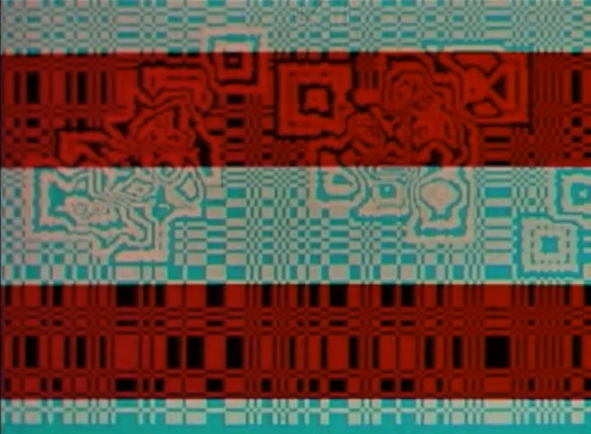
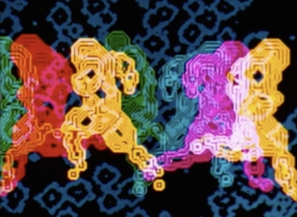
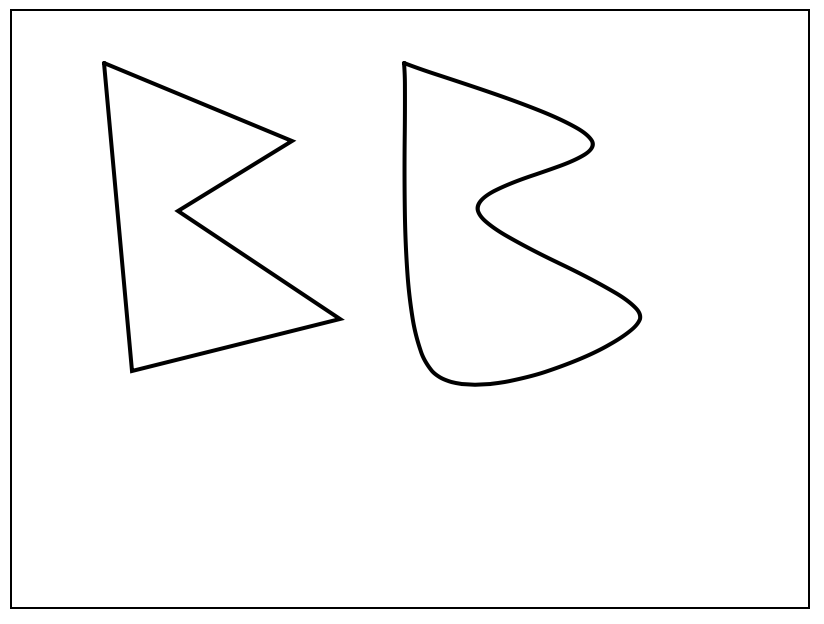

# Sketch #2: Encoding

## Concept

Fundamentally, computers represent the world in numeric form. Whether text, an image, music, seismological observations, or the fingerprint you use to unlock your phone, it's all numbers to the machine. How this is done is called **encoding**, and it's another quality that is characteristic of digital media.

In our exercise from last class, a common problem was how to tell the other person _where_ and _in what direct_ on the paper to draw. Some of you may have used words like "the center" as a means of orientation, or even referenced a unit of measurement, like "about two inches from the previous line". Computers, however, typically represent the concept of "space" through a numeric coordinate system; a 2-dimensional canvas has a row (x) value and a column (y) value that correspond to _pixels_ (**pi** cture-**el** ements) on the screen. This is a good example of encoding, because it quantifies something intuitive like physical space into a numeric system that the computer can process.

## Context

Of course, using coordinates to represent space is not unique to digital media. In the Western world, coordinate systems are associated with René Descartes and the Enlightenment (aka the "[Cartesian Grid](https://en.wikipedia.org/wiki/Cartesian_coordinate_system)"), when they were first used to visualize algebraic equations. Artists had been using grids before that, however; notably, Leon Battista Alberti wrote a treatise in 1435 that included the use of grid systems to establish [linear perspective](https://en.wikipedia.org/wiki/Perspective_(graphical) in painting—Leonardo da Vinci also used this method. In the twentieth century, grids became very prominent through modernist [architecture]() and [design](https://www.readingdesign.org/modernist-grid).

*From Alberti's "De Pictura (On Painting)" (1435)*

*Grid-based architecture from Mies van der Rohe (1970s)*

*Piet Mondrian,* Broadway Boogie Woogie *(1942)*

European use of coordinates was particularly important in cartography. Latitude and longitude encode the surface of the Earth into calculable numbers, which accompanied colonization of Africa and the Americas from the 15th century onward and the development of address schemes on the [urban grid](https://en.wikipedia.org/wiki/Grid_plan). While other cultures including in [Sengal](https://www.tandfonline.com/doi/abs/10.1080/02665433.2018.1453860?scroll=top&needAccess=true&journalCode=rppe20) and [Mexico](http://www.public.asu.edu/~mesmith9/1-CompleteSet/MES-08-AzCityPlan-Encyclopedia.pdf) also used urban grids, colonial systems were imposed as [a means of establishing supremacy](http://projectivecities.aaschool.ac.uk/portfolio/the-citys-essentiality-to-the-spanish-colonial-project/) and suppressing alternative [indigenous modes](https://press.uchicago.edu/books/HOC/HOC_V2_B3/HOC_VOLUME2_Book3_chapter6.pdf) of [organizing space](https://openresearch-repository.anu.edu.au/handle/1885/114874) up to the present day.


Grids on contemporary computers, and numeric encoding in computing general, inherit the rationalizing impulse of Enlightenment thought, modernist aesthetics, and even militaristic histories given the post-WWII [origin of the electronic computer in weapons research](https://en.wikipedia.org/wiki/ENIAC).

However, from early on, artists have co-opted those systems towards aesthetic ends. An early example is [Lillian Schwartz](https://en.wikipedia.org/wiki/Lillian_Schwartz), one of the first artists to adopt computers as her primary medium. As an artist-in-residence at Bell Labs, Schwartz created paintings and films that made use of, subverted, or expanded the possibilities of graphics systems.

*Lillian Schwartz, still from* Enigma *(1972) [Watch the video](http://lillian.com/1972-enigma-4-min-20-sec/)*

*Lillian Schwartz,* Olympiad *(1971)*

Schwartz's work plays with the abstraction of representational imagery into digital form—or even just digital form for its own sake. Color plays a critical role, and in fact color is another example of how intuitive phenomena are encoded numerically, as we'll explore below.

## Code

Spatial coordinates work a little differently with computers than you might be used to from previous math classes. Rather than `0, 0` (aka the "origin") being in the center of the screen, it represents the top-left corner, and as the `y` value gets larger, we move further down:


Let's see how this works with Processing.

First, we'll write a line of code to create the canvas. Type the following on line 1 of your program.

```py
size(640, 480)
```

`size` is a function provided by Processing that creates the canvas, which takes two **parameters**, one each for the desired width and height. Subsequently, when we run the program, a grey window should appear that is exactly 640 pixels wide and 480 pixels high (I chose these dimensions because they associated with the VGA standard that personal computers used in the 80s and 90s).


Similarly, though a painter comes up with shades of color by physically mixing paints, the computer usually encodes color as a three numbers for the amount of red, green, and blue components.


###

In this sketch, you will become familiar with drawing using coordinates. To explore the relationship of digital "space" to traditional depictions of the world, you will choose a [famous landscape painting from art history](https://www.google.com/search?q=famous+landscape+painting) and reinterpret it in code. _Reinterpret_ means that you do not necessarily have to try and reproduce the painting exactly—rather, you must choose how to work with code in a way that retains a sense of the original composition but which expresses something new. Pay particular attention to your use of color.

Requirements:
- Your piece should be presented on a webpage next to an image of the original artwork
- On your webpage, you must include your title, the artist and year of the original painting, and a [3-sentence description](../../resources/description_guidelines.md) that explains the choices you made in your reinterpretation
- This page should be hosted on GitHub—email a working URL to the professor before class


## Technical Resources

#### Textbook

Please read Chapter 3: "Draw" (page 17) of _Getting Started with p5.js_ for this assignment, which explains in detail the p5 drawing functions.

#### p5js.org

All p5 functions are documented at https://p5js.org/reference/  

Pay particular attention to the "2D Primitives" section for this assignment


#### Shiffman

Daniel Shiffman is an educator who has produced an awesome and extensive series of videos about programming with p5. Watch these for help with this assignment:

Shapes and Drawing:  
https://www.youtube.com/watch?v=c3TeLi6Ns1E

Color:  
https://www.youtube.com/watch?v=riiJTF5-N7c


#### Colors

[Google Color Picker](https://www.google.com/search?q=color+picker)


## Technical Preparation

From now on, we will be using [p5](https://p5js.org) for our sketches. p5 sketches are also webpages—you will create a folder on your computer that contains an `index.html` file, just like you did for your homepage.

Make a folder called `landscape` and add an `index.html` file that contains the following HTML:
```html
<html>
  <head>
    <title>Coordinate Landscape</title>
    <!-- load p5 drawing functions -->
    <script src="https://cdn.jsdelivr.net/npm/p5@0.10.2/lib/p5.js"></script>
    <!-- load a local js program -->
    <script src="sketch.js"></script>
  </head>
  <body>
      <h1>Coordinate Landscape</h1>

      <!-- an empty container called p5 -->
      <div id="p5"></div>

      <!-- add other HTML in the body if you'd like -->

  </body>
</html>
```

Notice the two `<script>` tags in the head section. These tags load in javascript files like we used for Nonlinear Narrative. `p5.js` is a set of functions created for us to help us draw, and `sketch.js` is a file that you will write. Create `sketch.js` now, and save it to the same folder. This file should contain the following javascript code:

```js
// put in setup whatever needs to be done to get things started
function setup() {

    // create a 640x480 pixel canvas and attach it to your HTML
    createCanvas(640, 480).parent('p5')
    noLoop()

}

// put in draw everything you want to draw to the canvas
function draw() {

    // start off with a background
    background(200)

    // draw here!

}

// this function will print coordinates to the console whenever you click
function mouseClicked() {                
    print(int(mouseX), int(mouseY))
}
```

When you open `index.html` in your web browser, you should see a grey rectangle showing the area of the canvas.

To put your sketch online using GitHub, you will follow the [same instructions](../03_personal_homepage/description.md) as you did for your homepage. However, this time your new repository should be called "coordinate_landscape"—your URL will subsequently be http://username.github.io/coordinate_landscape


## Example Code

Coordinates in p5 are organized in a way that may be different than you are used to:


### A basic drawing example
```js

function draw() {

    background(255)

    noStroke()              
    fill(0, 0, 255)         // R G B values from 0-255 (google search: color picker)

    rect(0, 0, 500, 100)    // x, y, width, height
    rect(0, 200, 500, 300)

    fill(255, 0, 0)
    arc(200, 150, 200, 200, 25 * PI/180, 335 * PI/180) // center x, center y, radius width, radius height, start angle, stop angle


    fill(255, 200, 0)
    ellipse(200, 150, 100, 100)   // center x, center y, radius width, radius height


    line(10, 150, 390, 150)  // x1, y1, x2, y2 (draws a line through center)


    noFill()
    stroke(0, 0, 0)          
    strokeWeight(5)         // thickness in pixels    
    rect(0, 0, 500, 300)

}
```


### Shapes, curves, and translation
```js
function draw() {

    background(255)

    strokeWeight(2)

    beginShape()
    vertex(47, 27)
    vertex(61, 181)
    vertex(165, 155)
    vertex(84, 101)
    vertex(141, 66)
    endShape(CLOSE)

    push()
    translate(150, 0)
    beginShape()
    curveVertex(47, 27)
    curveVertex(61, 181)
    curveVertex(165, 155)
    curveVertex(84, 101)
    curveVertex(141, 66)
    curveVertex(47, 27)
    endShape(CLOSE)
    pop()

    noFill()
    rect(0, 0, width, height)

}
```




### HTML and p5 together

For this assignment, you will want to modify your HTML to include an artist description and the original image. You may use this template:

```html
<html>
  <head>
    <title>Coordinate Landscape</title>
    <script src="https://cdn.jsdelivr.net/npm/p5@0.10.2/lib/p5.js"></script>
    <script src="sketch.js"></script>
  </head>
  <body>
      <h1>Not so starry night</h1>

      <p>In this interpretation of Van Gogh's classic, I completely ignore everything, except the brilliance.</p>

      

      <div id="p5"></div>

  </body>
</html>
```
