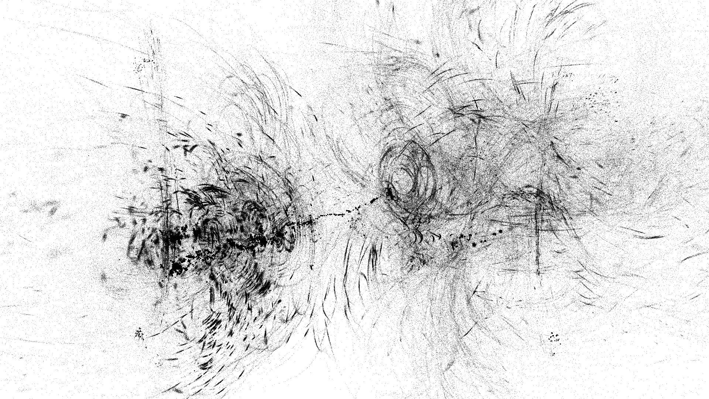
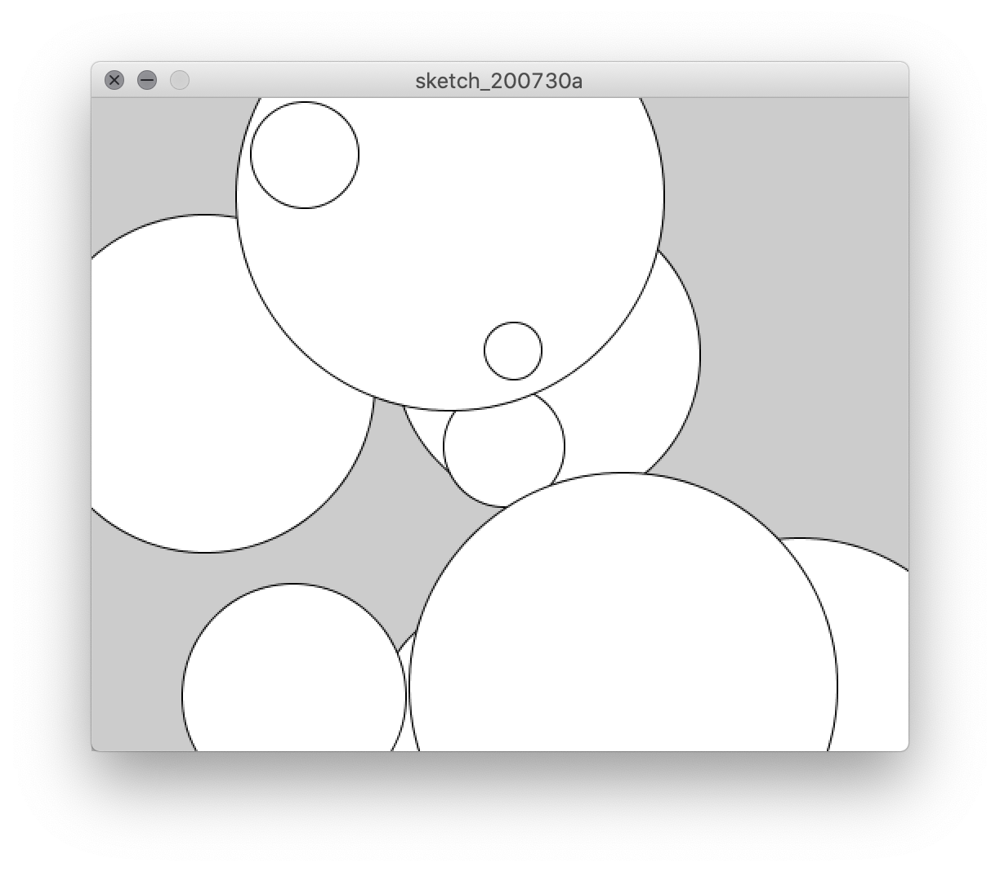
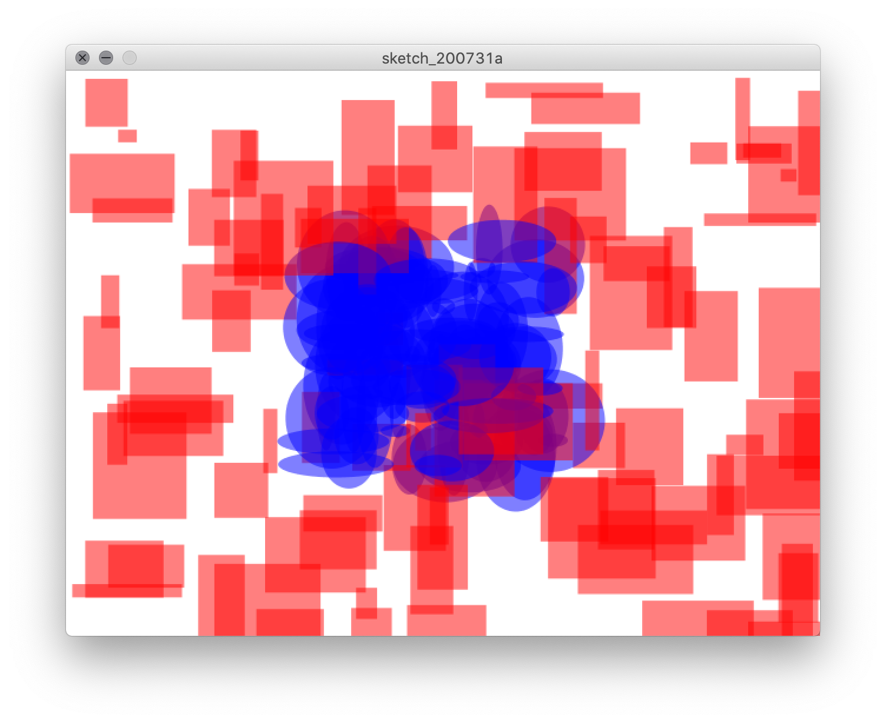
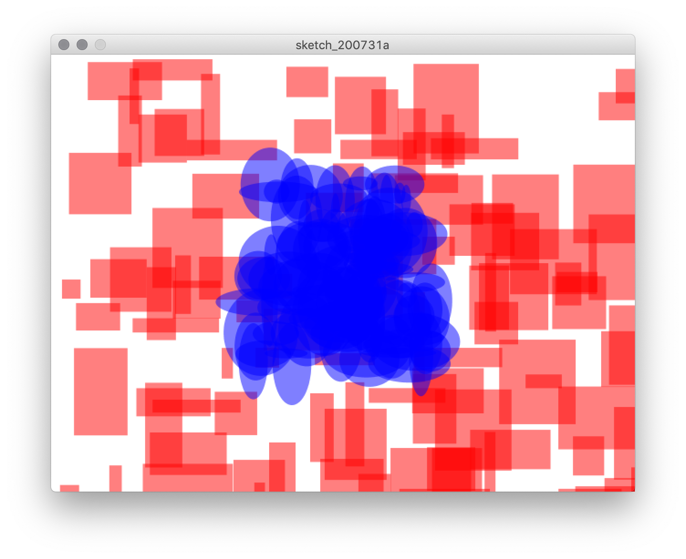

# Indeterminacy

## Concept

The physical world is very complex—so much so that it is never fully predictable. From the shape of a leaf to the gait of an animal to the words you use to express a thought, variation is intrinsic to reality. This is intuitive to artmaking in physical mediums. When a paintbrush flows against a canvas, the individual hairs move in a way that creates texture; when musicians play a score, the air responds dynamically to create rich timbres.

Digital media, however, encode everything in numbers. As we saw in the last unit, this can entail defining everything very precisely, rather than intuitively relying on the indeterminate properties of the medium. But to manually reproduce the degree of variation we see in nature would be tedious, if not impossible.

However, algorithms have been developed to simulate "random"—e.g. unpredictable—numbers. Such indeterminacy can be used to create variation on forms that simulates the dynamics of the physical world, or at least expands the possibilities of what can be automatically generated in digital imagery.


## Context

### Non-digital

Algorithms for working with indeterminacy have been an important part of artmaking even without electronic computers. The [Dada](https://en.wikipedia.org/wiki/Dada) movement, for example, developed the "chance collage" technique, in which artists dropped scraps of paper onto a larger sheet and pasted them wherever they landed. This method of embracing chance was a reaction against the ideologies of power and control that had led to the outbreak of WWI in Europe in the late 1910s.

<p align="center">
  <br />
  Jean Arp, <i>According to the Laws of Chance</i> (1933)<br />
</p>

In the United States, the term "indeterminacy" is often associated with the composer and conceptual artist [John Cage](https://en.wikipedia.org/wiki/John_Cage) (1912–1992). His piece _Music of Changes_ (1951) arranged notes and rests on a score according to an elaborate system of chance that involved throwing sticks on the ground and interpreting how they landed. He appropriated this technique from the _I Ching_, an ancient Chinese text (1000–750 BCE) which intended it as a means of [divination](https://en.wikipedia.org/wiki/Divination). This is similar to using tarot cards, rolling dice, or flipping a coin, all of which are manifestations of chance in culture that have been used by artists to generate indeterminacy.

<p align="center">
  <br />
  John Cage, from <i>Music of Changes</i> (1951) [<a href="https://www.youtube.com/watch?v=B_8-B2rNw7s">listen here</a>]<br />
</p>

Of course, incorporating nonhuman agency is another way of relinquishing a degree of control over a finished result. Daniel Ranalli did this in a simple way with snails:

<p align="center">
  <br />
  Daniel Ranalli, <i>Double Line</i> (2007)<br />
</p>


### Digital

When it comes to computers, one way of generating random numbers is to measure some chaotic physical phenomena, like cosmic background radiation, and incorporating those numbers into a program. This can be done directly with sensors or via copying them from a published reference like [_A Million Random Digits_](https://www.youtube.com/watch?v=bvLD54GnOTk) which was created by the RAND corporation for this purpose in 1955.

A more clever way that we use today is a "pseudo-random number generator," an algorithm that takes a "seed" (like the current time) and [elaborates upon it](https://en.wikipedia.org/wiki/Mersenne_Twister). The resulting numbers are not strictly indeterminate as it is _possible_ to predict them, but for most purposes they are plenty random. Many programming languages (including Python) include a function, usually called `random`, that lets us use these numbers.

Digital media artists have seized upon the opportunity to experiment. One example is [Harold Cohen](https://en.wikipedia.org/wiki/Harold_Cohen_(artist)) (1928–2016), who starting in the 1960s began developing an algorithm to make unique representational drawings using rules together with random parameters. He and others have made the specious claim that his program, which he called AARON, is an example of artificial intelligence—it is not, but it nonetheless demonstrates how powerful the random function can be.

<p align="center">
  <br />
  Harold Cohen, painting by <i>AARON</i> (1995)<br />
</p>

A contemporary of Cohen's, Roman Verostko (1929–), approached indeterminacy with a very different aesthetic, even though his work similarly uses random parameters within repeating patterns in order to craft abstract forms. The results reflect Verostko's mystic interest (and his time as a Benedictine monk). (Verostko also initiated the "[algorist](https://en.wikipedia.org/wiki/Algorithmic_art#Algorists)" movement of artists who work with computers.)

<p align="center">
  <br />
  Roman Verostko, <i>FlyingCloud II</i> (1999)
</p>

[Casey Reas](https://en.wikipedia.org/wiki/Casey_Reas) (1972–), together with Ben Fry, is the creator of Processing. The application and library generalize many of the techniques used by earlier algorithmic artists, including `random`—repetition with random variation features prominently in Reas' own work.

<p align="center">
  <br />
  Casey Reas, <i>Process 18 (Software 2)</i> (2010)
</p>

Another notable artist who has used Processing goes by the name [LIA](https://en.wikipedia.org/wiki/Lia_(artist)). Her work often takes the form of animation, with infinitely evolving visuals that she performs live or which are displayed on a monitor within a frame.

<p align="center">
  <br />
  LIA, <i>Untitled 20160817</i> (2016)
</p>


## Code: Random parameters and loops

How do these artists create such complex effects? While there is a lot of craft involved in their code, we can start to create visual artwork that operates similarly with what we already know plus just a few more techniques.

...but before we do anything else, let's take a second to talk about `print`.

```py
print(100)
```

Like the shape functions from Processing, `print` is a function that takes a parameter and does something with it. In this case, however, it doesn't draw anything to the canvas. Instead, it prints it out in Processing's console window:

<p align="center">
  <br />
</p>

`print` ends up being a very useful function for [debugging](https://en.wikipedia.org/wiki/Debugging) our code, or at least getting a better sense of what's going on, as we will see.

### Random parameters

Now we're ready for `random`, which is also a function that takes a couple of parameters and produces a result. However, `random` doesn't draw anything to the canvas, either. Instead, it produces a random number within a given range.

```py
random(0, 100)  # a random number between 0 and 100
```

If you put this into a sketch, every time you run it, you'll get a different random number. But we can't see that number unless we print it out:

```py
print(random(0, 100))
```

Notice how we've put `random` _inside_ `print`. It can be tricky to keep track of all the parentheses, but this is a very useful thing to be able to do. `random` will first do its job and come up with a random number between 0 and 100, and then this number will be what `print` prints out. And every time the sketch is run, this number will be different:

<p align="center">
  <br />
</p>

 Try seeing what happens if you change `0` and `100` to other values, for example `-20` and `20`:

 <p align="center">
   <br />
 </p>

As an aside, one shortcut that will make our lives a bit easier is that if the first parameter for `random` is `0`, we can omit it. In other words `random(0, 42)` can be shortened to `random(42)`, which is more convenient to write.

Ok, so what can we do with this visually?

Let's start with a simple shape in the center of the canvas:

```py
size(500, 400)

circle(250, 200, 100) # x position, y position, diameter
```

<p align="center">
  <br />
</p>

So far, we've only used static numbers for parameters in functions like `circle`. But what if we put random numbers there in there instead?

If we want coordinates that fit within the canvas, we want them to be between 0 and its width or height. Since we're using 0, we can omit that parameter. Therefore, `random(500)` and `random(400)` produce numbers between 0 and the width and height of the canvas, respectively.

```py
size(500, 400)

circle(random(500), random(400), 100) # x position, y position, diameter
```

This looks a little weird with all the parentheses and commas (be careful to keep track of them all!), but all we've done is _substitute_ the static numbers that we were using with the `random` function and its parameters:
- `250` is replaced with `random(500)` which chooses a number between 0 and 500
- `200` is replaced with `random(400)` which chooses a number between 0 and 400

The result is that every time you run this sketch, the circle will be drawn in a different location:


<p align="center">
  <br />
</p>

How is that at all useful? Well, what if we repeated that random circle a bunch of times (and also substituted the diameter with a random parameter between 10 and 300)?

```py
size(500, 400)

circle(random(500), random(400), random(10, 300))
circle(random(500), random(400), random(10, 300))
circle(random(500), random(400), random(10, 300))
circle(random(500), random(400), random(10, 300))
circle(random(500), random(400), random(10, 300))
circle(random(500), random(400), random(10, 300))
circle(random(500), random(400), random(10, 300))
circle(random(500), random(400), random(10, 300))
circle(random(500), random(400), random(10, 300))
circle(random(500), random(400), random(10, 300))
```

<p align="center">
  <br />
</p>

This starts to get interesting. Each time you run the sketch, you'll have a different random composition.

However, it's also a bit tedious to write. What if we wanted 1000 circles? Too much typing, or at least copy-pasting. And this is where key programming structure can help us out: the _loop_.


### Loops

The following code is equivalent to the previous example:

```py
size(500, 400)

for i in range(10): # a loop that repeats 10 times!
    circle(random(500), random(400), random(10, 300))
```

In another class, we'll discuss the exact meaning of the `for` syntax here. For now, the key thing is that this loop repeats **whatever is indented** on the next line (or many lines) after the colon.

On each iteration of the loop, the program chooses new random numbers for the parameters of `circle`. This loop repeats 10 times, but we can change that number to whatever we want.

Here's another output from that sketch, just to prove it works:

<p align="center">
  <br />
</p>

It turns out that `random` can be applied to color, not just shapes. Remember than every component of a color goes from 0-255, which means we can make random numbers like this:
```py
# a random color with a random amount of opacity (R, G, B, opacity)
fill(random(255), random(255), random(255), random(255))

# a random greyscale color with a random amount of opacity (grey, opacity)
fill(random(255), random(255))
```

Let's use this together with a loop to make a somewhat more elaborate example:

```py
size(500, 400)

# no outline on the shapes
noStroke()

# repeat 100 times
for i in range(100):

    # choose random color and opacity
    fill(random(255), random(255), random(255), random(255))  

    # make a random triangle with the bounds of the canvas
    triangle(random(500), random(400), random(500), random(400), random(500), random(400))

```

<p align="center">
  <br />
</p>

Now we're getting somewhere. If you play with the parameters, and add in more of the drawing tools we've learned previously, you can get an increasingly more interesting result:

```py
size(500, 400)

# set the background to white
background(255)

# repeat everything 20 times
for i in range(20):

    # make a random triangle with no outline and a random red-ish fill
    noStroke()
    fill(random(255), 0, 0, random(255)) # choose random red value and opacity (green and blue are 0)
    triangle(random(500), random(400), random(500), random(400), random(500), random(400))

    # make a circle with no fill and random greyscale outline of random weight
    noFill()
    stroke(random(255), random(255))
    strokeWeight(random(1, 10))
    circle(random(500), random(400), random(10, 50))
```

<p align="center">
  <br />
</p>

As you can see, even this relatively straightforward example shares a certain aesthetic with that of artists we've seen who work with indeterminacy.

Remember that you don't always have to use the entire width and height of the canvas with random. In fact, experimenting with these ranges is how you can add structure to your sketch.

In this example, which has a canvas size of 640 x 480, notice that the blue rectangles get a random horizontal position between 0 and 320, and the red ellipses get a random horizontal position between 320 and 640:

```py
size(640, 480)
background(255)
noStroke()

for i in range(100):

    # blue rectangles
    fill(255, 0, 0, 128)
    rect(random(320), random(480), random(10, 100), random(10, 100))

    # red ellipses
    fill(0, 0, 255, 128)
    ellipse(random(320, 640), random(480), random(10, 100), random(10, 100))

```

<p align="center">
  <br />
</p>

We could also cluster the circles within a smaller overall area in the center. Here, the rectangles once again take up the whole canvas, but the ellipses have more constrained parameters:

```py
size(640, 480)
background(255)
noStroke()

for i in range(100):

    # blue rectangles
    fill(255, 0, 0, 128)
    rect(random(640), random(480), random(10, 100), random(10, 100))

    # red ellipses
    fill(0, 0, 255, 128)
    ellipse(random(220, 420), random(140, 340), random(10, 100), random(10, 100))
```

<p align="center">
  <br />
</p>

One final thing. Notice how the rectangles and ellipses are interleaved. This is because for every iteration of our loop, the computer draws one rectangle and then one ellipse. What if we wanted all the rectangles drawn first?

To do that, we use two separate loops (and we're very careful with indentation):

```py
size(640, 480)
background(255)
noStroke()

# blue rectangles    
for i in range(100):
    fill(255, 0, 0, 128)
    rect(random(640), random(480), random(10, 100), random(10, 100))

# red ellipses
for i in range(100):
    fill(0, 0, 255, 128)
    ellipse(random(220, 420), random(140, 340), random(10, 100), random(10, 100))
```

<p align="center">
  <br />
</p>

Now all the ellipses are all up front. This technique is a simple way to create a sense of composition.

Random parameters and loops together radically transform how we can think about making images—rather than just encoding space, the computer can do some work for us by incorporating indeterminacy. Let's see what you can create.


## Sketch #2

In this sketch, you will explore indeterminacy as a means of making visual art with code. Your result can be abstract or representational (or a combination of the two). Use shapes together with loops (use more than one) and the `random` function. Pay special attention to layering. Not all parameters should be random, and by being intentional about the ranges of numbers you choose, create a sense of structure or composition in your image.

Turn in the contents of your sketch folder to Google Classroom (first remember to save it, include `save("output.png")` as the last line of your sketch to make sure an image file is present, and run it a few times until you get a version you like). In addition, upload a document that includes your title and a [3-sentence description](../../resources/description_guidelines.md) that explains how you'd like us to approach the result.
