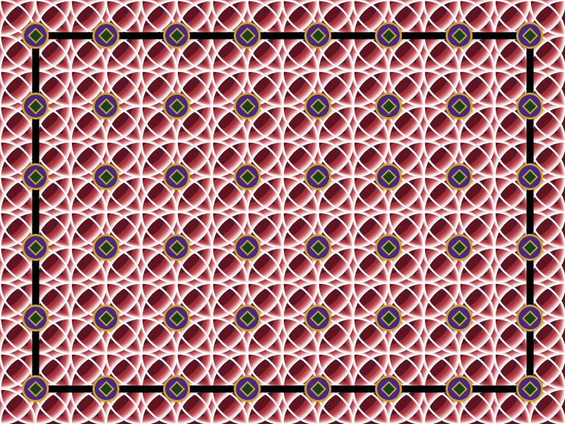
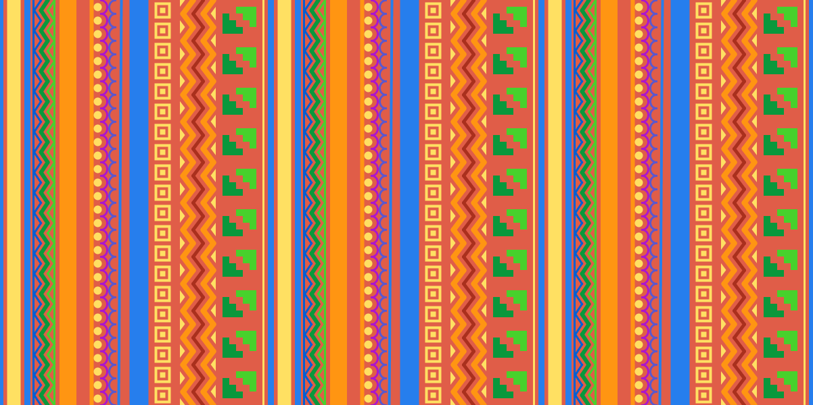
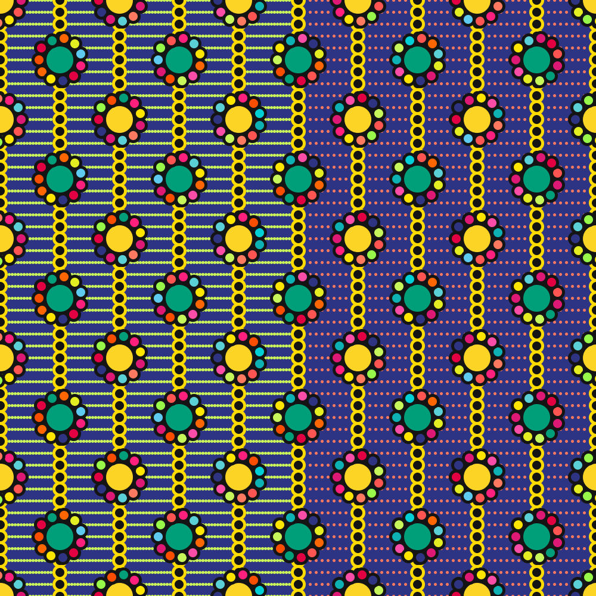
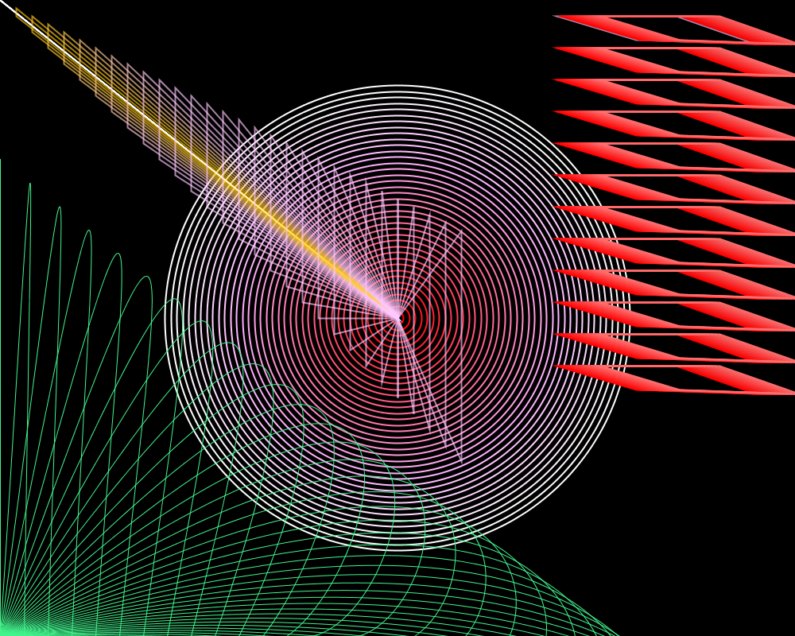

## Sketch #2: Repetition

Create a virtual "textile." The patterns you create should incorporate multiple loops and layers, with attention paid to the overall composition as well as the texture. You might experiment with looping multiple small shapes at the same time, and consider taking advantage of transparency.

Turn in the contents of your sketch folder to Google Classroom (first remember to save it, include `save("output.png")` as the last line of your sketch to make sure an image file is generated. In addition, include a document that includes your title and a [3-sentence description](../../resources/description_guidelines.md) that explains how you'd like us to approach the result.

### Examples

   
  Renz Johnson, <i>Tile</i> (2021) 

   
  Molly Troxell, <i>Pallay in Python</i> (2021) 

   
  Lily Logan Goff, <i>Daisy Chain</i> (2021) 

   
  Eleanor Trombla, <i>Wound</i> (2021) 

