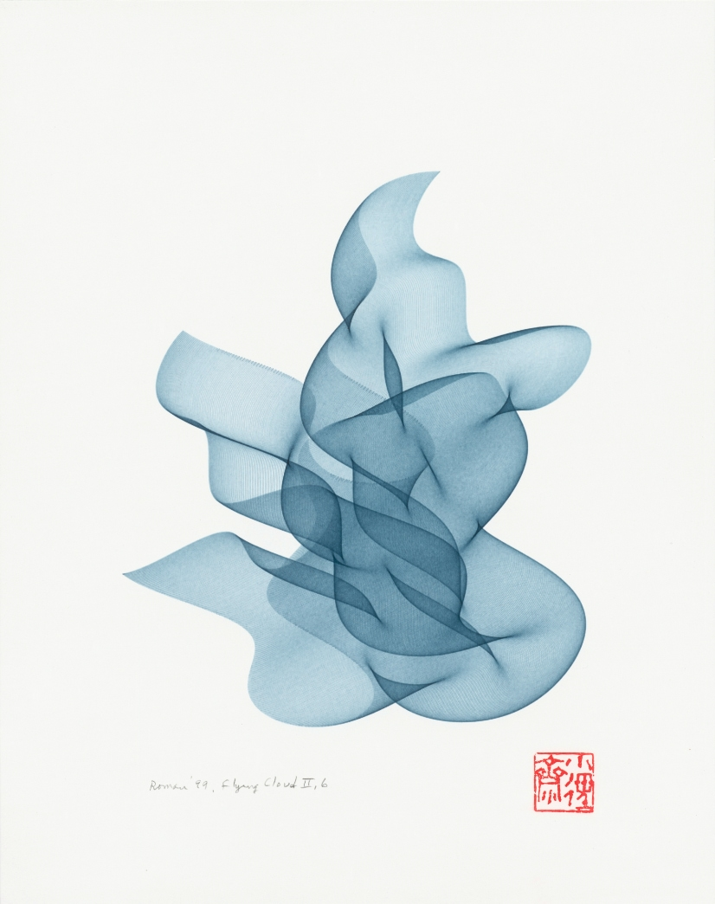
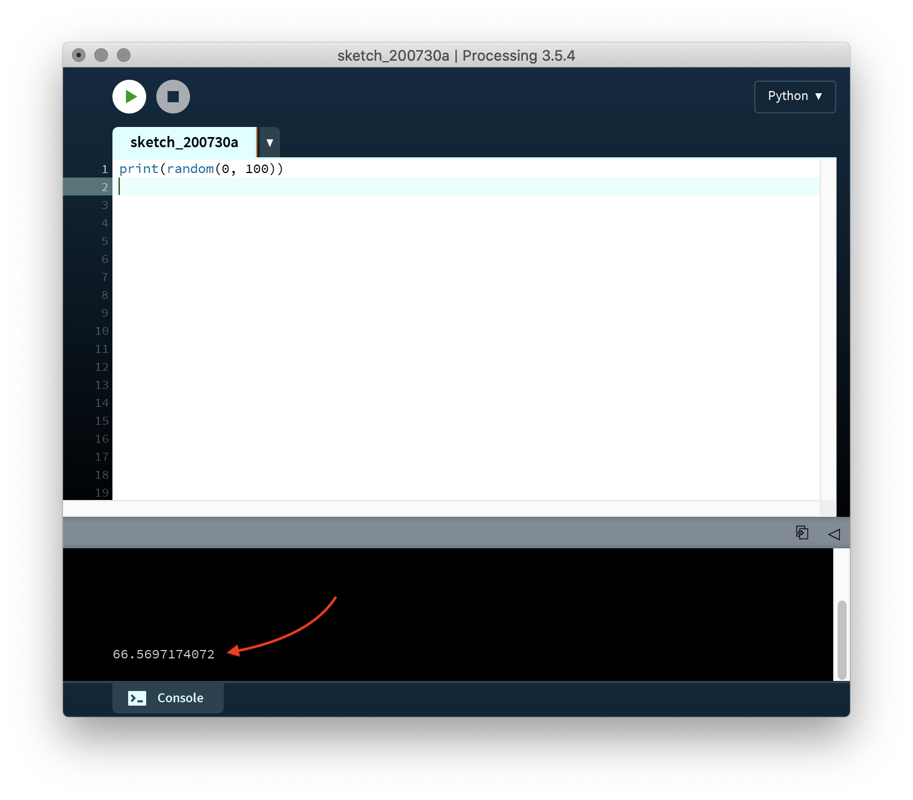
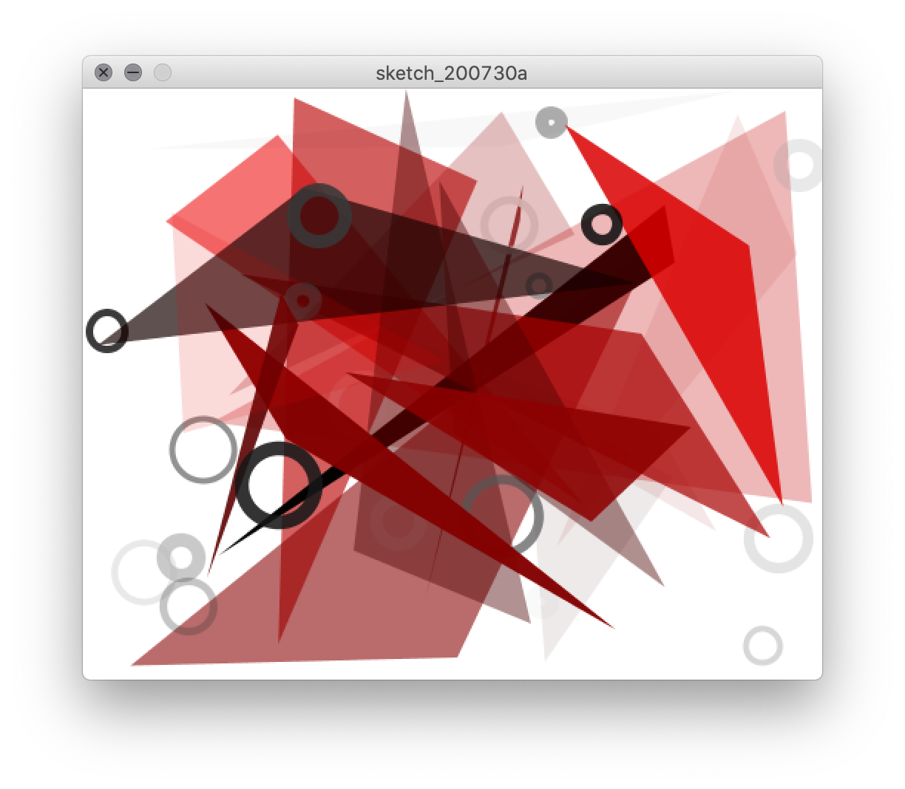

# Repetition

## Concept

Patterns are fundamental to both nature and human culture, and central to the idea of a pattern is the act of repetition. Computers are repetition specialists. Like many mechanical devices, they were invented in order to do something over and over again, quickly, in order exceed what what is possible by the human hand. When it comes to computation, the ability to take some logical possibility and enumerate it indefinitely undergirds much of the innovation digital media make possible.

Consequently, repeating patterns are central to digital aesthetics. Electronic music generates like techno are one obvious example; scrolling through endless posts on Instagram, playing a video game, or watching an animated movie all incorporate intense amounts of repetition. Digital media artists often use repetition explicitly in their work in order to highlight this aspect of computation.


## Context

### Non-digital

Predating digital technology, repeating patterns have been a part of the art and craft of every human culture. One particularly notable medium, of course, is textiles. Weaving on a loom involves an intricate manual or mechanical process in which horizontal threads are repeatedly interlaced at right angles to create fabric; geometric patterns are formed through variation in the method of weaving and the color of the threads used within a single cloth, designs for which are an important part of cultures' heritage.

<p align="center">
  <br />
  Traditional Peruvian cloth from Cusco region, via <a href="https://en.wikipedia.org/wiki/Nilda_Callañaupa_Alvarez">Nilda Callañaupa Alvarez</a><br />
</p>

<p align="center">
  <br />
  Diagram showing weaving notation, <a href="https://en.wikipedia.org/wiki/Anni_Albers">Anni Albers</a>, <i>On Weaving</i> (1965)<br />
</p>

Weaving and looms are particularly important to the history of digital media. In fact, many people consider the Jacquard Loom to be the first computing device. Invented in France in 1804 by Joseph Marie Jacquard, this loom used punched cards to determine what pattern was mechanically woven. This idea of representing data in a separate medium—the cards—which could then be reproduced repeatedly by a machine was a direct precursor to Charles Babbage's [Analytical Engine](https://en.wikipedia.org/wiki/Analytical_Engine), which operated similarly (though it enumerated logic, rather than fabric).

<p align="center">
  <br />
  Jacquard Loom<br />
</p>

The Jacquard Loom was emblematic of the [Industrial Revolution](https://en.wikipedia.org/wiki/Industrial_Revolution), a period spanning the turn of the 19th century that saw the mechanization of manufacturing processes and the reorganization of social relations to support capitalist enterprises. Industrialization began a process through which mass-production would transform all aspect of everyday life around the globe. By the 20th century, fine artists were incorporating and commenting upon such mechanisms in their work, such as the previously mentioned Bauhaus movement (see Annie Albers, above).

One particularly prominent figure in contemporary art in this regard is Andy Warhol (1928–1987). Identifying repetition as a central trope of modern society that had been largely ignored by the fine art world, Warhol and embraced mass-production techniques and together with other [pop artists](https://en.wikipedia.org/wiki/Pop_art) brought popular media, celebrity, and advertising into the art world vernacular.

<p align="center">
  <br />
  Andy Warhol, <i>Campbell's Soup Cans</i> (1962)<br />
</p>

In reference to _Campbell's Soup Cans_, one of his most famous works, Warhol commented, "I used to have the same lunch every day, for twenty years, I guess, the same thing over and over again." And yet, Warhol is also known for the coining the phrase "15-minutes of fame" and for creating "screen tests" of his friends, anticipating social media and the influencer culture today.

Warhol's taste for rapid and vapid repetition contrasts another New York City-based artist of a subsequent generation who took industrial repetition in a completely different direction—Taiwanese artist Tehching Hsieh (1950–). One example is _One Year Performance 1980–1981 (Time Clock Piece)_, in which Hsieh punched a time clock and took a photograph of himself every hour on the hour for an entire year.

<p align="center">
  <br />
  Tehching Hsieh, <i>One Year Performance 1980–1981 (Time Clock Piece)</i> <br />
  <a href="https://www.youtube.com/watch?v=k4_xw2zyQN4">Full video here</a>
</p>

Hsieh's "durational performance" is at once at critique of the artificiality of mechanized time, an exploration of film as a medium that changes our experience of temporality, and a meditation on change with his own body as medium.

However, although Western industrialized society provides many precedents like these for understanding repetition in computation, a potent precursor in algorithmic visual design is Islamic art (in fact, [the word "algorithm" comes from the name of a Persian Mathematician](https://en.wikipedia.org/wiki/Algorithm#Etymology) from the ninth century, Muhammad ibn Musa al-Khwarizmi, who first developed algebra). In particular, incredibly ornate brick and tile geometry characterize the architectural facades of mosques in the years 800–1600, reflecting a religious commitment to avoid figurative artwork.

<p align="center">
  <br />
  Tomb of Hafez, Shiraz, Iran
</p>

Many of these patterns are algorithmic in nature, where a simple set of shapes are repeated to generate rich complexity.

<p align="center">
  <br />
  Constructing patterns at Alhambra castle, Spain
</p>


### Digital

When it comes to computers, one way of generating random numbers is to measure some chaotic physical phenomena, like cosmic background radiation, and incorporating those numbers into a program. This can be done directly with sensors or via copying them from a published reference like [_A Million Random Digits_](https://www.youtube.com/watch?v=bvLD54GnOTk) which was created by the RAND corporation for this purpose in 1955.

A more clever way that we use today is a "pseudo-random number generator," an algorithm that takes a "seed" (like the current time) and [elaborates upon it](https://en.wikipedia.org/wiki/Mersenne_Twister). The resulting numbers are not strictly indeterminate as it is _possible_ to predict them, but for most purposes they are plenty random. Many programming languages (including Python) include a function, usually called `random`, that lets us use these numbers.

Digital media artists have seized upon the opportunity to experiment. One example is [Harold Cohen](https://en.wikipedia.org/wiki/Harold_Cohen_(artist)) (1928–2016), who starting in the 1960s began developing an algorithm to make unique representational drawings using rules together with random parameters. His code chooses the overall composition of the images as well as approximates the indeterminate aspects of lines made with a pen. He and others have made the specious claim that his program, which he called AARON, is an example of artificial intelligence—it is not, but it nonetheless demonstrates how powerful the random function can be.

<p align="center">
  <br />
  Harold Cohen, painting by <i>AARON</i> (1995)<br />
</p>

A contemporary of Cohen's, Roman Verostko (1929–), approached indeterminacy with a very different aesthetic, even though his work similarly uses random parameters within repeating patterns. Rather than approximate images made by hand, Verostko uses code to craft beautiful abstract forms that show an Eastern aesthetics and reflect his his mystic interests (he also spent time as a Benedictine monk). Verostko is also known for initiating the "[algorist](https://en.wikipedia.org/wiki/Algorithmic_art#Algorists)" movement of artists who work with computers.

<p align="center">
  <br />
  Roman Verostko, <i>FlyingCloud II</i> (1999)
</p>

[Casey Reas](https://en.wikipedia.org/wiki/Casey_Reas) (1972–), together with Ben Fry, is the creator of Processing. They realized that using a common platform to generalize many of the techniques used by earlier algorithmic artists would be better than artists always having to start from scratch, and that sharing code would create a community of artists working with code. The use of `random` to produce repetition with variation features prominently in Reas' own work.

<p align="center">
  <br />
  Casey Reas, <i>Process 18 (Software 2)</i> (2010)
</p>

Another notable artist who uses Processing goes by the name [LIA](https://en.wikipedia.org/wiki/Lia_(artist)). Her work often takes the form of animation, with infinitely evolving visuals that she performs live or which are displayed on a monitor within a frame.

<p align="center">
  <br />
  LIA, <i>Untitled 20160817</i> (2016)
</p>


## Code: repetition and variation

How do these artists create such complex effects? While there is a lot of craft involved in their code, we can start to create visual artwork that operates similarly with what we already know plus just a few more techniques.

...but before we do anything else, let's take a second to talk about `print`.

```py
print(100)
```

Like the shape functions from Processing, `print` is a function that takes a parameter and does something with it. In this case, however, it doesn't draw anything to the canvas. Instead, it prints it out in Processing's console window:

<p align="center">
  <br />
</p>

`print` ends up being a very useful function for [debugging](https://en.wikipedia.org/wiki/Debugging) our code, or at least getting a better sense of what's going on, as we will see.

### Random parameters

Now we're ready for `random`, which is also a function that takes a couple of parameters and produces a result. However, `random` doesn't draw anything to the canvas, either. Instead, it produces a random number within a given range.

```py
random(0, 100)  # a random number between 0 and 100
```

If you put this into a sketch, every time you run it, you'll get a different random number. But we can't see that number unless we print it out:

```py
print(random(0, 100))
```

Notice how we've put `random` _inside_ `print`. It can be tricky to keep track of all the parentheses, but this is a very useful thing to be able to do. `random` will first do its job and come up with a random number between 0 and 100, and then this number will be what `print` prints out. And every time the sketch is run, this number will be different:

<p align="center">
  <br />
</p>

 Try seeing what happens if you change `0` and `100` to other values, for example `-20` and `20`:

 <p align="center">
   <br />
 </p>

As an aside, one shortcut that will make our lives a bit easier is that if the first parameter for `random` is `0`, we can omit it. In other words `random(0, 42)` can be shortened to `random(42)`, which is more convenient to write.

<!-- pause and have them experiment, questions -->


Ok, so what can we do with this visually?

Let's start with a simple shape in the center of the canvas:

```py
size(500, 400)

circle(250, 200, 100) # x position, y position, diameter
```

<p align="center">
  <br />
</p>

So far, we've only used static numbers for parameters in functions like `circle`. But what if we put random numbers there in there instead?

If we want coordinates that fit within the canvas, we want them to be between 0 and its width or height. Since we're using 0, we can omit that parameter. Therefore, `random(500)` and `random(400)` produce numbers between 0 and the width and height of the canvas, respectively.

```py
size(500, 400)

circle(random(500), random(400), 100) # x position, y position, diameter
```

This looks a little weird with all the parentheses and commas (be careful to keep track of them all!), but all we've done is _substitute_ the static numbers that we were using with the `random` function and its parameters:
- `250` is replaced with `random(500)` which chooses a number between 0 and 500
- `200` is replaced with `random(400)` which chooses a number between 0 and 400

The result is that every time you run this sketch, the circle will be drawn in a different location:


<p align="center">
  <br />
</p>

<!-- questions -->

How is that at all useful? Well, what if we repeated that random circle a bunch of times (and also substituted the diameter with a random parameter between 10 and 300)?

```py
size(500, 400)

circle(random(500), random(400), random(10, 300))
circle(random(500), random(400), random(10, 300))
circle(random(500), random(400), random(10, 300))
circle(random(500), random(400), random(10, 300))
circle(random(500), random(400), random(10, 300))
circle(random(500), random(400), random(10, 300))
circle(random(500), random(400), random(10, 300))
circle(random(500), random(400), random(10, 300))
circle(random(500), random(400), random(10, 300))
circle(random(500), random(400), random(10, 300))
```

<p align="center">
  <br />
</p>

This starts to get interesting. Each time you run the sketch, you'll have a different random composition.

However, it's also a bit tedious to write. What if we wanted 1000 circles? Too much typing, or at least copy-pasting. And this is where key programming structure can help us out: the _loop_.


### Loops

The following code is equivalent to the previous example:

```py
size(500, 400)

for i in range(10): # a loop that repeats 10 times!
    circle(random(500), random(400), random(10, 300))
```

In another class, we'll discuss the exact meaning of the `for` syntax here. For now, the key thing is that this loop repeats **whatever is indented** on the next line (or many lines) after the colon.

On each iteration of the loop, the program chooses new random numbers for the parameters of `circle`. This loop repeats 10 times, but we can change that number to whatever we want.

Here's another output from that sketch, just to prove it works:

<p align="center">
  <br />
</p>

It turns out that `random` can be applied to color, not just shapes. Remember than every component of a color goes from 0-255, which means we can make random numbers like this:
```py
# a random color with a random amount of opacity (R, G, B, opacity)
fill(random(255), random(255), random(255), random(255))

# a random greyscale color with a random amount of opacity (grey, opacity)
fill(random(255), random(255))
```

Let's use this together with a loop to make a somewhat more elaborate example:

```py
size(500, 400)

# no outline on the shapes
noStroke()

# repeat 100 times
for i in range(100):

    # choose random color and opacity
    fill(random(255), random(255), random(255), random(255))  

    # make a random triangle with the bounds of the canvas
    triangle(random(500), random(400), random(500), random(400), random(500), random(400))

```

<p align="center">
  <br />
</p>

Now we're getting somewhere. If you play with the parameters, and add in more of the drawing tools we've learned previously, you can get an increasingly more interesting result:

```py
size(500, 400)

# set the background to white
background(255)

# repeat everything 20 times
for i in range(20):

    # make a random triangle with no outline and a random red-ish fill
    noStroke()
    fill(random(255), 0, 0, random(255)) # choose random red value and opacity (green and blue are 0)
    triangle(random(500), random(400), random(500), random(400), random(500), random(400))

    # make a circle with no fill and random greyscale outline of random weight
    noFill()
    stroke(random(255), random(255))
    strokeWeight(random(1, 10))
    circle(random(500), random(400), random(10, 50))
```

<p align="center">
  <br />
</p>

As you can see, even this relatively straightforward example shares a certain aesthetic with that of artists we've seen who work with indeterminacy.

Remember that you don't always have to use the entire width and height of the canvas with random. In fact, experimenting with these ranges is how you can add structure to your sketch.

In this example, which has a canvas size of 640 x 480, notice that the blue rectangles get a random horizontal position between 0 and 320, and the red ellipses get a random horizontal position between 320 and 640:

```py
size(640, 480)
background(255)
noStroke()

for i in range(100):

    # blue rectangles
    fill(255, 0, 0, 128)
    rect(random(320), random(480), random(10, 100), random(10, 100))

    # red ellipses
    fill(0, 0, 255, 128)
    ellipse(random(320, 640), random(480), random(10, 100), random(10, 100))

```

<p align="center">
  <br />
</p>

We could also cluster the circles within a smaller overall area in the center. Here, the rectangles once again take up the whole canvas, but the ellipses have more constrained parameters:

```py
size(640, 480)
background(255)
noStroke()

for i in range(100):

    # blue rectangles
    fill(255, 0, 0, 128)
    rect(random(640), random(480), random(10, 100), random(10, 100))

    # red ellipses
    fill(0, 0, 255, 128)
    ellipse(random(220, 420), random(140, 340), random(10, 100), random(10, 100))
```

<p align="center">
  <br />
</p>

One final thing. Notice how the rectangles and ellipses are interleaved. This is because for every iteration of our loop, the computer draws one rectangle and then one ellipse. What if we wanted all the rectangles drawn first?

To do that, we use two separate loops (and we're very careful with indentation):

```py
size(640, 480)
background(255)
noStroke()

# blue rectangles    
for i in range(100):
    fill(255, 0, 0, 128)
    rect(random(640), random(480), random(10, 100), random(10, 100))

# red ellipses
for i in range(100):
    fill(0, 0, 255, 128)
    ellipse(random(220, 420), random(140, 340), random(10, 100), random(10, 100))
```

<p align="center">
  <br />
</p>

Now all the ellipses are all up front. This technique is a simple way to create a sense of composition.

Random parameters and loops together radically transform how we can think about making images—rather than just encoding space, the computer can do some work for us by incorporating indeterminacy. Let's see what you can create.
