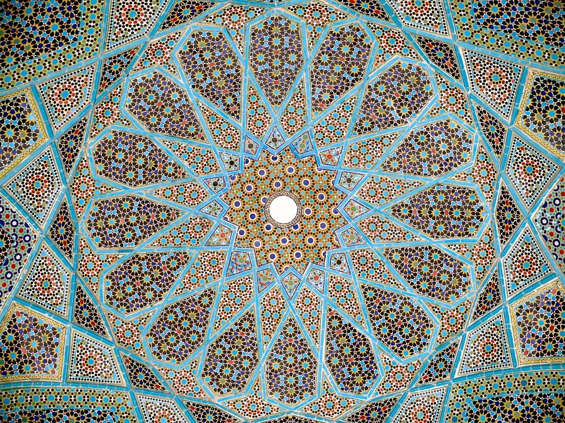
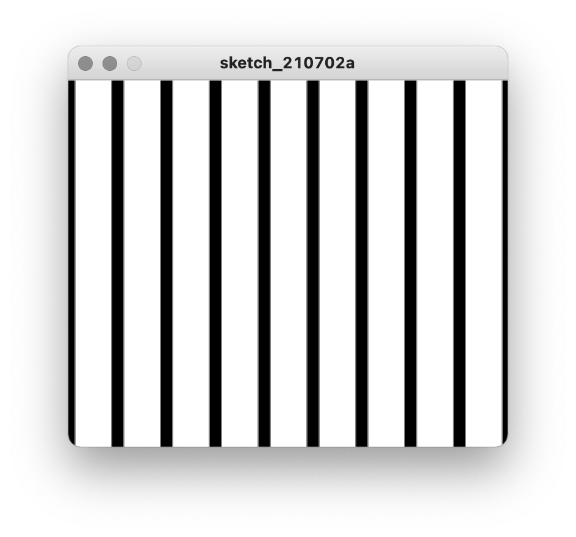
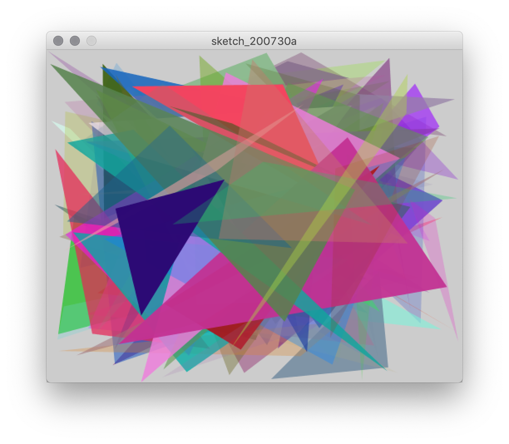
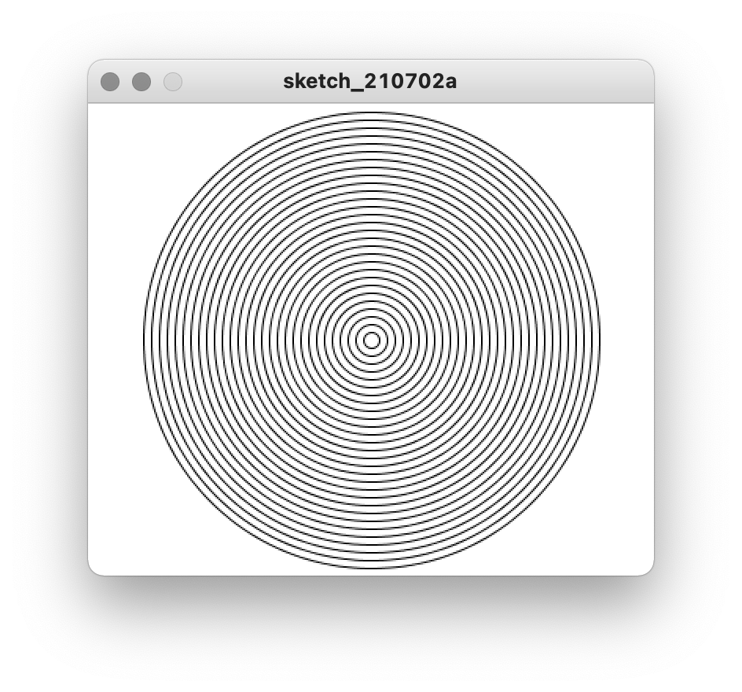
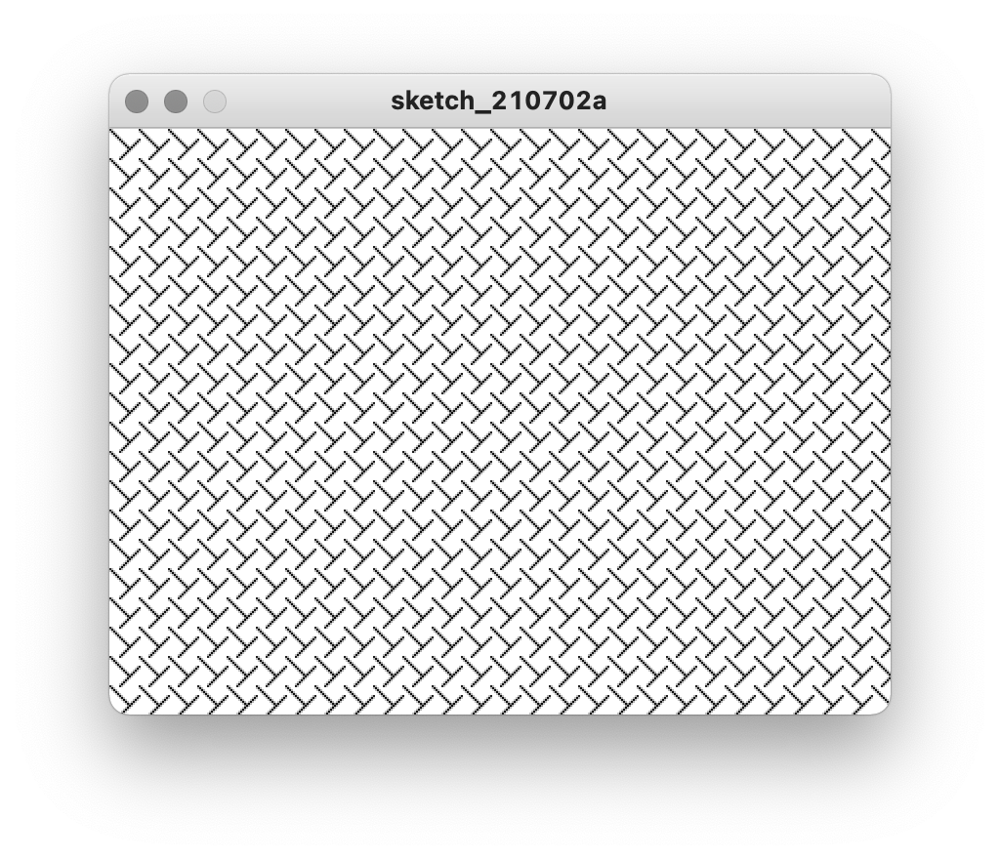

# Repetition

## Concept

Patterns are fundamental to both nature and human culture, and central to the idea of a pattern is the act of repetition. Computers are repetition specialists. Like many mechanical devices, they were invented in order to do something over and over again, quickly, in order exceed what what is possible by the human hand. When it comes to computation, the ability to take some logical possibility and enumerate it indefinitely undergirds much of the innovation digital media make possible.

Consequently, repeating patterns are central to digital aesthetics. Electronic music genres like techno are one obvious example; scrolling through endless posts on Instagram, playing a video game, or watching an animated movie all incorporate intense amounts of repetition. Digital media artists often use repetition explicitly in their work in order to highlight this aspect of computation.


## Context

### Non-digital

Predating digital technology, repeating patterns have been a part of the art and craft of every human culture. One particularly notable medium, of course, is textiles. Weaving on a loom involves an intricate manual or mechanical process in which horizontal threads are repeatedly interlaced at right angles to create fabric; geometric patterns are formed through variation in the method of weaving and the color of the threads used within a single cloth, designs for which are an important part of cultures' heritage.

<p align="center">
  <br />
  Traditional Peruvian cloth from Cusco region, via <a href="https://en.wikipedia.org/wiki/Nilda_Callañaupa_Alvarez">Nilda Callañaupa Alvarez</a><br />
</p>

<p align="center">
  <br />
  Diagram showing weaving notation, <a href="https://en.wikipedia.org/wiki/Anni_Albers">Anni Albers</a>, <i>On Weaving</i> (1965)<br />
</p>

Weaving and looms are particularly important to the history of digital media. In fact, many people consider the Jacquard Loom to be the first computing device. Invented in France in 1804 by Joseph Marie Jacquard, this loom used punch cards to determine the pattern that was mechanically woven. This idea of representing data in a separate medium—the cards—which could then be reproduced repeatedly by a machine was a direct precursor to Charles Babbage's [Analytical Engine](https://en.wikipedia.org/wiki/Analytical_Engine), which operated similarly (though it enumerated logic, rather than fabric), and we've seen how early digital media artists like Lillian Schwartz encoded their visual designs into punch cards.

<p align="center">
  <br />
  Jacquard Loom<br />
</p>

The Jacquard Loom was emblematic of the [Industrial Revolution](https://en.wikipedia.org/wiki/Industrial_Revolution), a period spanning the turn of the 19th century that saw the mechanization of manufacturing processes and the reorganization of social relations to support capitalist enterprises. Industrialization began a process through which mass-production would transform all aspect of everyday life around the globe. By the 20th century, fine artists were incorporating and commenting upon such mechanisms in their work, such as the previously mentioned Bauhaus movement (see Annie Albers, above). 

One particularly prominent figure in contemporary art in this regard is Andy Warhol (1928–1987). Identifying repetition as a central trope of modern society that had been largely ignored by the fine art world, Warhol and embraced mass-production techniques. Together with other artists associated with "[pop art](https://en.wikipedia.org/wiki/Pop_art)," he brought popular media, celebrity, and advertising into the art world vernacular.

<p align="center">
  <br />
  Andy Warhol, <i>Campbell's Soup Cans</i> (1962)<br />
</p>

In reference to _Campbell's Soup Cans_, one of his most famous works, Warhol commented, "I used to have the same lunch every day, for twenty years, I guess, the same thing over and over again." And yet, Warhol is also known for the coining the phrase "15-minutes of fame" and for creating "screen tests" of his friends, anticipating social media and the influencer culture today.

Warhol's taste for rapid and vapid repetition contrasts another New York City-based artist of a subsequent generation who took industrial repetition in a completely different direction—Taiwanese artist Tehching Hsieh (1950–). One example is _One Year Performance 1980–1981 (Time Clock Piece)_, in which Hsieh punched a time clock and took a photograph of himself every hour on the hour for an entire year.

<p align="center">
  <br />
  Tehching Hsieh, <i>One Year Performance 1980–1981 (Time Clock Piece)</i> <br />
  <a href="https://www.youtube.com/watch?v=k4_xw2zyQN4">Full video here</a>
</p>

Hsieh's "durational performance" is at once at critique of the artificiality of mechanized time, an exploration of film as a medium that changes our experience of temporality, and a meditation on change with his own body as medium.

However, although Western industrialized society provides many precedents like these for understanding repetition in computation, a potent precursor in algorithmic visual design is Islamic art (in fact, [the word "algorithm" comes from the name of a Persian Mathematician](https://en.wikipedia.org/wiki/Algorithm#Etymology) from the ninth century, Muhammad ibn Musa al-Khwarizmi, who first developed algebra). In particular, incredibly ornate brick and tile geometry characterize the architectural facades of mosques in the years 800–1600, reflecting a religious commitment to avoid figurative artwork.

<p align="center">
  <br />
  Tomb of Hafez, Shiraz, Iran
</p>

Many of these patterns are algorithmic in nature, where a simple set of shapes are repeated to generate rich complexity.

<p align="center">
  <br />
  Constructing patterns at Alhambra castle, Spain
</p>


### Digital

In the digital domain, many of the visual artists who first experimented with computers intuitively worked with the machine's inclination toward repetition while at the same time introducing variation. Hungarian artist Vera Molnár (born 1924 and still living) is a pioneer in this regard. Starting as early as the 1960s, Molnár used the programming languages Fortran and BASIC to control a pen-plotter machine, which is a robotic arm that holds a pen. These abstract images convey a tension between order and disorder (as her titles often suggest).

<p align="center">
  <br />
  Vera Molnár, <i>(Des)Ordres</i> (1974)
</p>

Today, repetition is so ingrained with digital artists' work as to be somewhat difficult to pinpoint. It might be used to create an abstract pattern or a figurative texture, like hair, and consist of simple regular shapes or small components with unique characteristics. This example comes from Jared Tarbell, an early artist to find success using Processing. While organic-looking, it repeats a short algorithm over and over to create a twisted form.

<p align="center">
  <br />
  Jared Tarbell, <i>Guts</i> (2004)
</p>


## Code

### Print

Before we get to repeating things, let's take a second to talk about `print`, because it will help us understand what we're doing.

```py
print(100)
```

Like the shape functions from Processing, `print` is a function that takes an argument and does something with it. In this case, however, it doesn't draw anything to the canvas. Instead, it prints it out in Processing's console window:

<p align="center">
  <br />
</p>

`print` ends up being a very useful function for [debugging](https://en.wikipedia.org/wiki/Debugging) our code, or at least getting a better sense of what's going on, as we will see.


### `for` Loops

In programming, repetition is made much easier using loops. Check out the following code:

```py
for i in range(10):
    print(i)
```

There are several interesting things going on here. But because Python is English-like, we can almost read it as a sentence: _for every integer in a range up to 10, print out the number_.

Let's break it down:
- The key word here is `for`, which lets the computer know we're going to be repeating something.
- How many times are we going to repeat it? This is where `range()` comes in. Whatever number we give to range determines the number of repetitions.
- What are we going to be repeating? Whatever is _indented_ below the `for` command. In many programming languages, indentation doesn't matter, but in Python, it's very important.

Got it? Great. But what the hell is `i`?

`i` is a **variable**. That means `i` means something different each time the loop repeats. It's just like in math, where we'd typically use "x" to represent a number that might have an unknown value (actually, we could use "x" here too, but "i" is more common in programming so we don't get it mixed up with x/y spatial coordinates). So in this case, when we're repeating our loop 10 times, i is going to be a different integer up to 10.

Running the program, you should see this in the console:
```
0
1
2
3
4
5
6
7
8
9
```
<p align="center">
  <br />
</p>

This proves that our loop repeated, and that it did it ten times. Each time, `i` became a different number, which `print()` printed out. Notice, however, that we start with 0, not 1, and we end with 9, not 10. This seems counterintuitive at first, but it will end up making our lives simpler in many cases. From now on, just remember that computers start counting at 0, so you'll get all the numbers up to _but not including_ whatever number you give to `range()`.

## Drawing with Loops

Ok, so how is this helpful?

Consider the following code, which draws a series of vertical lines:

```py
size(360, 300)
background(255)
strokeWeight(10)

line(0, 0, 0, 300)
line(40, 0, 40, 300)
line(80, 0, 80, 300)
line(120, 0, 120, 300)
line(160, 0, 160, 300)
line(200, 0, 200, 300)
line(240, 0, 240, 300)
line(280, 0, 280, 300)
line(320, 0, 320, 300)
line(360, 0, 360, 300)
```
<p align="center">
  <br />
</p>

There is a lot of unnecessary labor in manually writing out all of these lines; furthermore, if we wanted to make a change, like making the lines slightly closer together, for example, we would have to edit every line.

Instead, let's use a `for` loop:
```py
size(360, 300)
background(255)
strokeWeight(10)    

for i in range(10):
    line(i * 40, 0, i * 40, 300)    
```

You'll notice that this requires a bit of math. Until now, we've only supplied our drawing functions like `line()` with static numbers. But it turns out that Python can do math on the fly, so we can use short equations as arguments instead.

In this case, we give line a value of `i * 40` as the x-coordinate for both the start and the end of the line. We know that we are going to run this loop 10 times, and that `i` is going to begin as 0 and increase incrementally up until 9. `*` is the symbol for multiplication, so when we multiply those numbers by 40, we're going to get 0, 40, 80, 120, 160, 200, 240, 280, 320, 360 ... that means the lines will be in different places.

Try mixing it up a bit. Depending on how we replace the static numbers we're giving `line()` with multiples of i, we can get all sorts of results:

<!-- exercise: make them horizontal -->


```py
size(360, 300)
background(255)
strokeWeight(10)    

for i in range(10):
    line(180, 300, i * 40, 0)    
```

<p align="center">
  <br />
</p>

```py
size(360, 300)
background(255)
strokeWeight(10)    

for i in range(10):
    line(i * 40, i * 10, i * 20, i * 30)    
```
<p align="center">
  <br />
</p>

```py
size(360, 300)
background(255)
strokeWeight(10)    

for i in range(10):
    line(0, i * 15, 360, i * 15)   
```
<p align="center">
  <br />
</p>


```py
size(360, 300)
background(255)
strokeWeight(10)    

for i in range(10):
    line(i * 20, 0, (i * 20) + 180, 300)    
```

<p align="center">
  <br />
</p>

Notice how on this last example, the equation got a little more complicated: `(i * 20) + 180` uses parentheses to add 180 to the result after multiplying `i * 20`. There's a lot of expressive power in nesting operations like this.

Note that `i` can be used for other arguments besides coordinates:
```py
size(360, 300)
background(255)

for i in range(32):
    strokeWeight(i/3)
    line(0, i * 10, 360, i * 10)     
```
<p align="center">
  <br />
</p>

```py
size(360, 300)
background(255)

noFill()
for i in range(30):
    circle(180, 150, i * 10)  
```
<p align="center">
  <br />
</p>


```py
size(360, 300)
background(255)
strokeWeight(5)

for i in range(255):
    stroke(200, i, 255)
    line(0, i + 45, 360, i)
```
<p align="center">
  <br />
</p>

### Nesting Loops

Let's make a row of circles:

```py
size(400, 300)
background(255)

for i in range(8):
    circle((i * 50) + 25, 25, 50)
```
<p align="center">
  <br />
</p>

Here we have circles with a radius of 25 (and therefore a diameter of 50). By multiplying `i` by 50, we spread them out across the canvas. Since circles are drawn from the center, adding 25 shifts them over so we're not stuck with half a circle on the edge. So the x-coordinate becomes `(i * 50) + 25`.

So what do we do if we want to fill the canvas with circles? We need eight more rows. We could, of course, make eight separate `for` loops, with a different y-coordinate in each one. A better solution is to use _nested loops_:

```py
size(400, 300)
background(255)

for j in range(6):    
    for i in range(8):
        circle((i * 50) + 25, (j * 50) + 25, 50)
```
<p align="center">
  <br />
</p>

The first thing to be careful of here is the indentation: we now have two levels.

Secondly, we have a new variable: `j`. We can actually name these variables whatever we want, `i` and `j` are just conventions, but they are helpful ones.

Since our canvas is 400 by 300 and our circles are 50 pixels in diameter, one of our loops repeats 6 times (300 / 50) and the other 8 times (400 / 50). We use equations with both `i` and `j` for the x- and y-coordinates that we give to circle. The computer does the rest.

Nesting loops like this can be used to create some interesting textures. Consider this basic unit:

```py
size(400, 300)
background(255)

line(0, 0, 10, 10)    
line(5, 15, 15, 5)    
```
<p align="center">
  <br />
</p>

We're going to put these two lines inside of a nested `for` loop, and add either `(i * 15)` or `(j * 15)` to all the arguments. This will make the shape repeat and fill the canvas.

```py
size(400, 300)
background(255)

for j in range(40):    
    for i in range(40):
        line((i * 15) + 0, (j * 15) + 0, (i * 15) + 10, (j * 15) + 10)    
        line((i * 15) + 5, (j * 15) + 15, (i * 15) + 15, (j * 15) + 5)    
```
<p align="center">
  <br />
</p>

From here, you might experiment with uneven increments:

```py
size(400, 300)
background(255)

for j in range(40):    
    for i in range(40):
        line(i * 14, j * 15, (i * 15) + 10, (j * 11) + 10)    
        line((i * 16) + 5, (j * 15) + 15, (i * 14) + 15, (j * 15) + 5)    
```
<p align="center">
  <br />
</p>


Keep in mind that in all these examples, we've just used one loop (or a nested loop), but you might layer multiple loops together. And not everything has to be in a loop! Everything you've learned previously still applies.

```py
size(400, 300)
background(91, 206, 217)

stroke(183, 255, 0, 120)    
for j in range(31):    
    for i in range(41):
        line(200, 150, i * 10, j * 10)

stroke(255, 174, 0, 200)    
for j in range(12):    
    for i in range(16):
        line(200, 150, (i * 20) + 40, (j * 20) + 40)

noStroke()
fill(255, 0, 255)
for j in range(10):
    for i in range(10):
        circle((i * 6) + (j * 1.5) + 168, (j * 8) + (i * 2) + 110, 5)        
```

<p align="center">
  <br />
</p>
