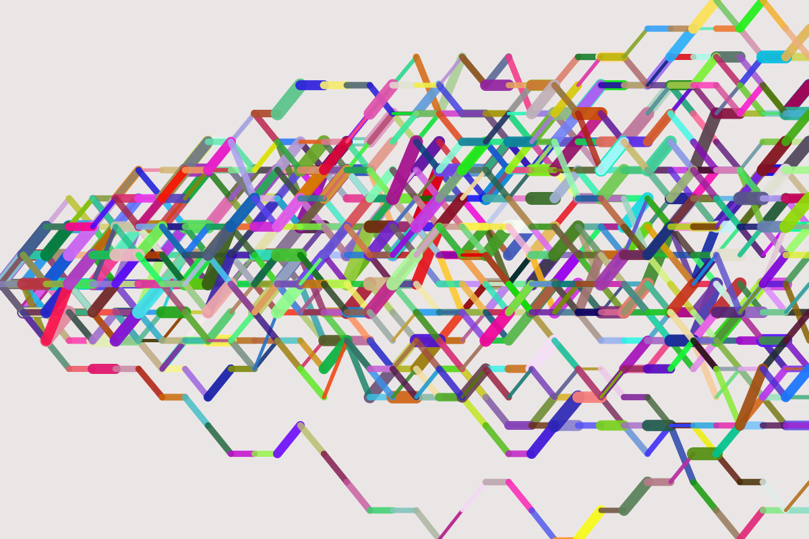
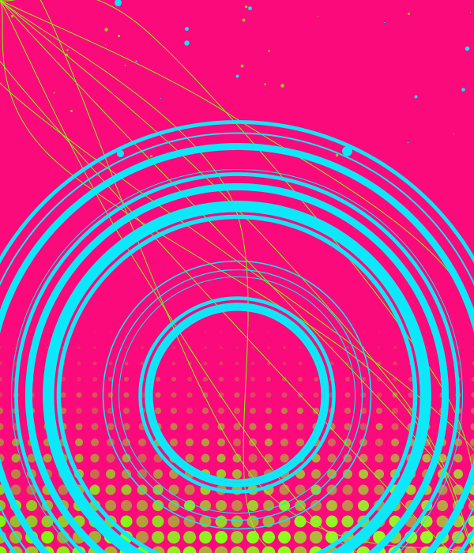
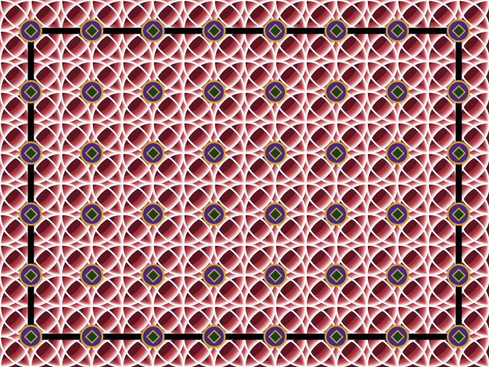
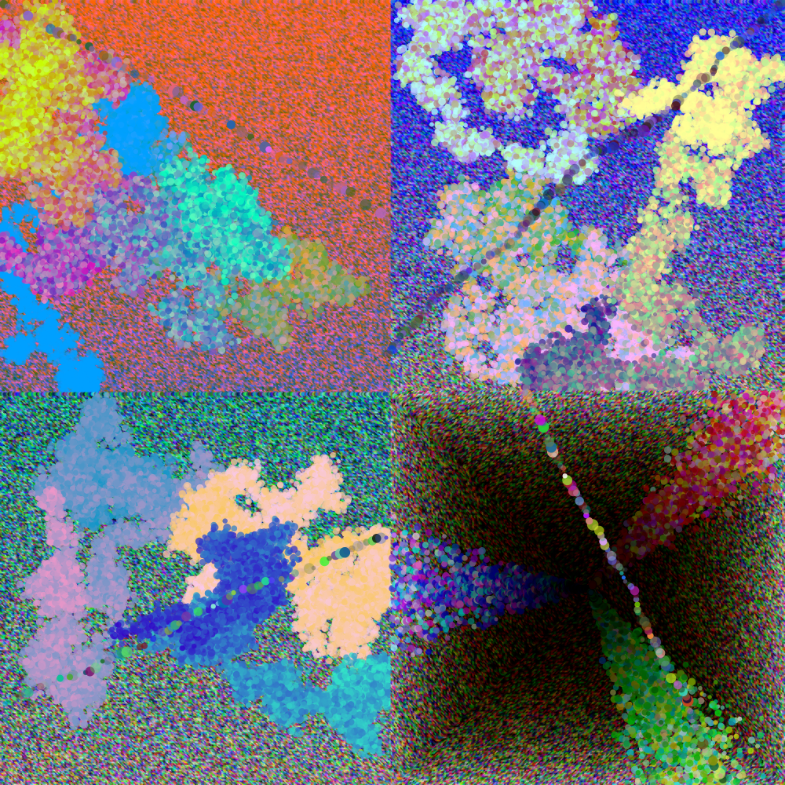

## Sketch #2: Difference and Repetition

In this sketch, you will explore the tension between repetition and indeterminacy as a means of making visual art with code. Your result can be abstract or representational (or a combination of the two), but these formal structures should play a central role in your concept. Use shapes together with `for` loops and the `random` function. Pay special attention to layering. Not all parameters should be random, and the resulting images should have a sense of structure and composition.

Copy your sketch folder to Google Drive; your code should include a comment with your title and a [3-sentence statement](../../resources/statement_guidelines.md) that conveys your concept.

### Examples

   
  Dan Dachille, <i>Bullish or Bearish</i> (2023) 

   
  Isha Elboctorcy, <i>Miya</i> (2021) 

   
  Renz Johnson, <i>Tile</i> (2021) 

   
  Em Nguyen, <i>Road to Convergence</i> (2023) 

