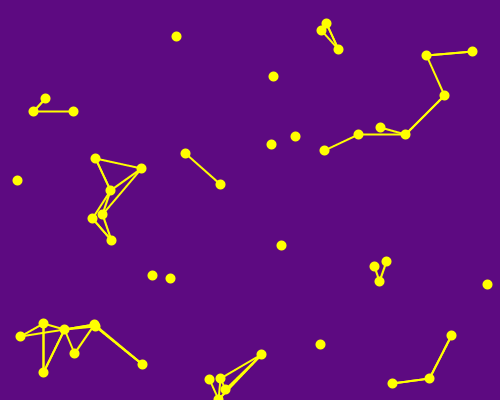
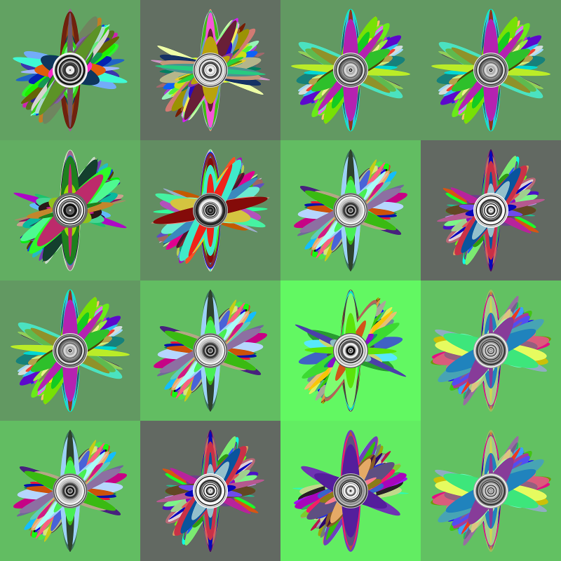
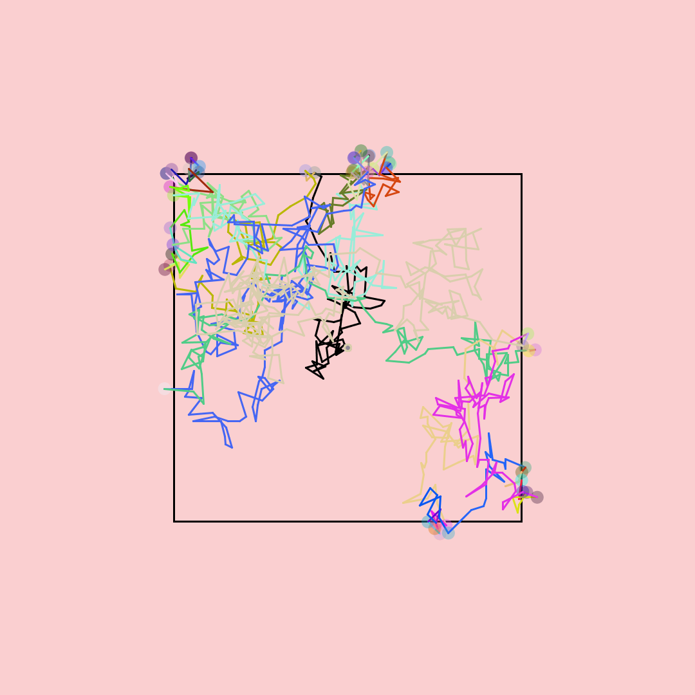
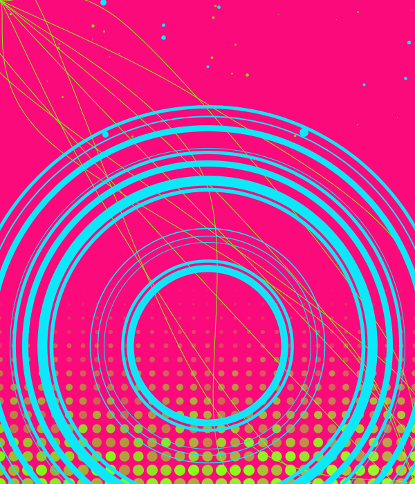

## Sketch #3: Indeterminacy

In this sketch, you will explore indeterminacy as a means of making visual art with code. Your result can be abstract or representational (or a combination of the two), but randomness should play a central role in your concept. Use shapes together with loops and the `random` function. Pay special attention to layering. Not all parameters should be random, and by being intentional about the ranges of numbers you choose, the random elements in the resulting images should have a sense of structure and composition.

Turn in your .pyde file as well as your image. In addition, include a document that includes your title and a [3-sentence description](../../resources/description_guidelines.md) that conveys your concept.

### Examples

   
  Alex Skiles, <i>Stars</i> (2021) 

   
  Carly Leandro, <i>Flowers</i> (2021) 

   
  Carson Reader, <i>Line Art</i> (2021) 

   
  Isha Elboctorcy, <i>Miya</i> (2021) 

