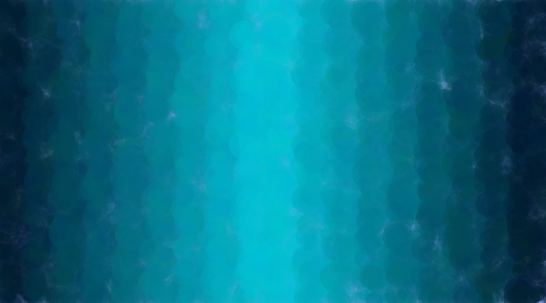
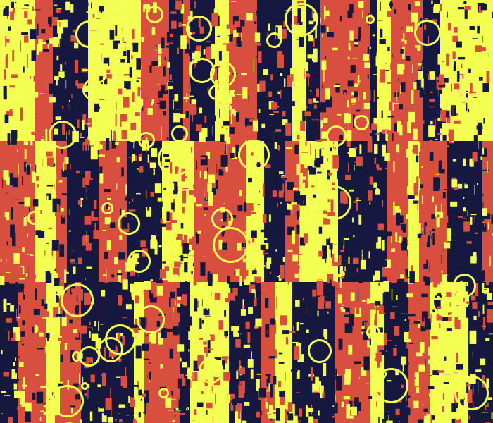

## Sketch #3: Indeterminacy

In this sketch, you will explore indeterminacy as a means of making visual art with code. Your result can be abstract or representational (or a combination of the two). Use shapes together with loops (use more than one) and the `random` function. Pay special attention to layering. Not all parameters should be random, and by being intentional about the ranges of numbers you choose, create a sense of structure or composition in your image.

One approach that you might take is to look for inspiration in complex textures from nature—can you use loops+random to make an abstract interpretation of, for example, a pond with ripples and vegetation? Clouds and a rainstorm? A forest? Fire? A swarm of insects?

Turn in the contents of your sketch folder to Google Classroom (first remember to save it, include `save("output.png")` as the last line of your sketch to make sure an image file is present, and run it a few times until you get a version you like). In addition, include a document that includes your title and a [3-sentence description](../../resources/description_guidelines.md) that explains how you'd like us to approach the result.

### Examples

  
   Stephan Baird, <i>Ocean</i> (2020)

  
   Kendal Jones, <i>Primary Cola</i> (2020)

  
   Ericka Eyton, <i>Supernova</i> (2020)

