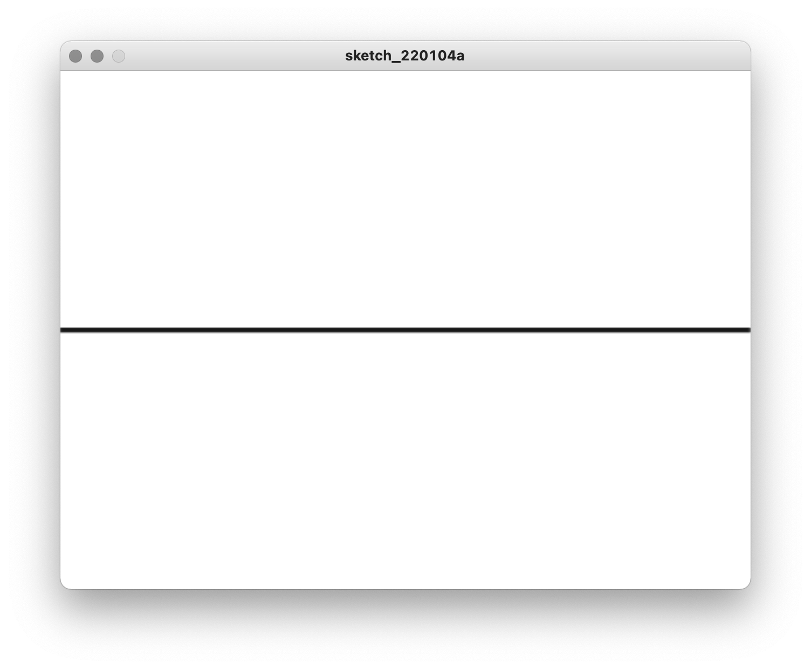
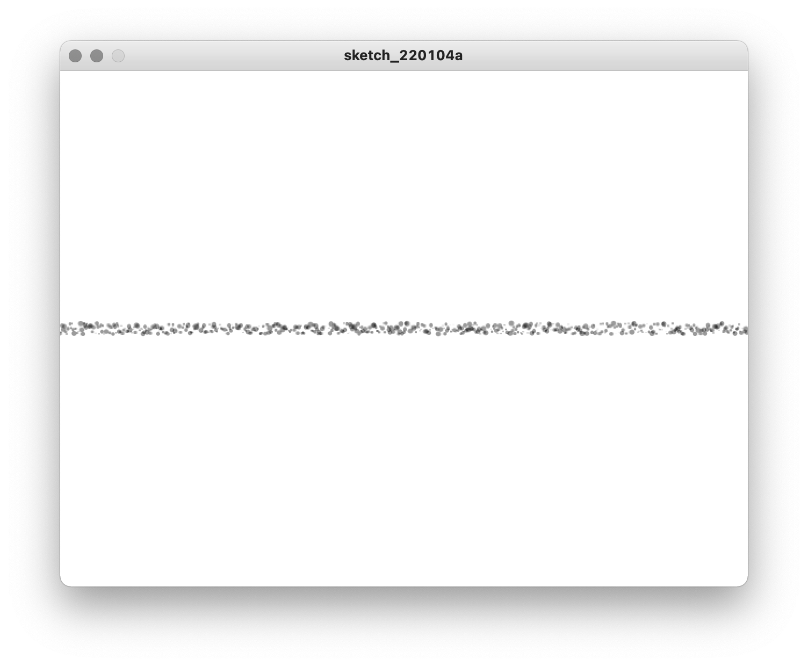
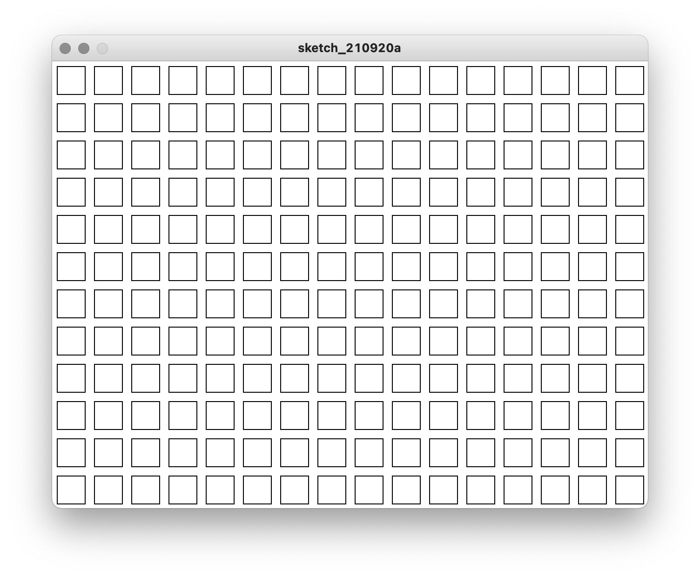
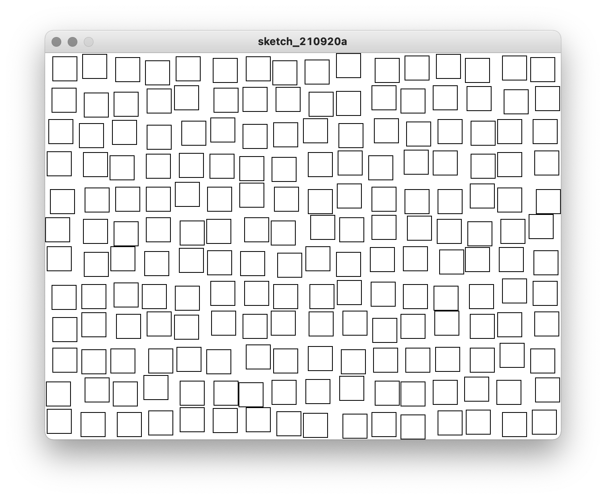
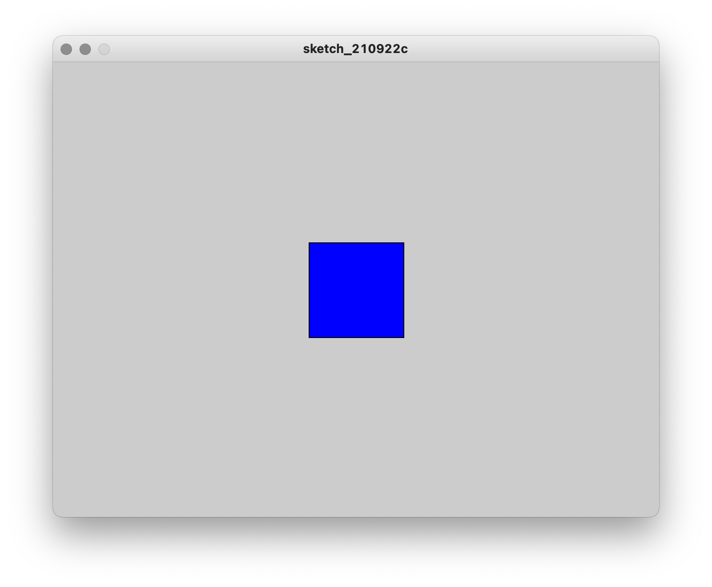
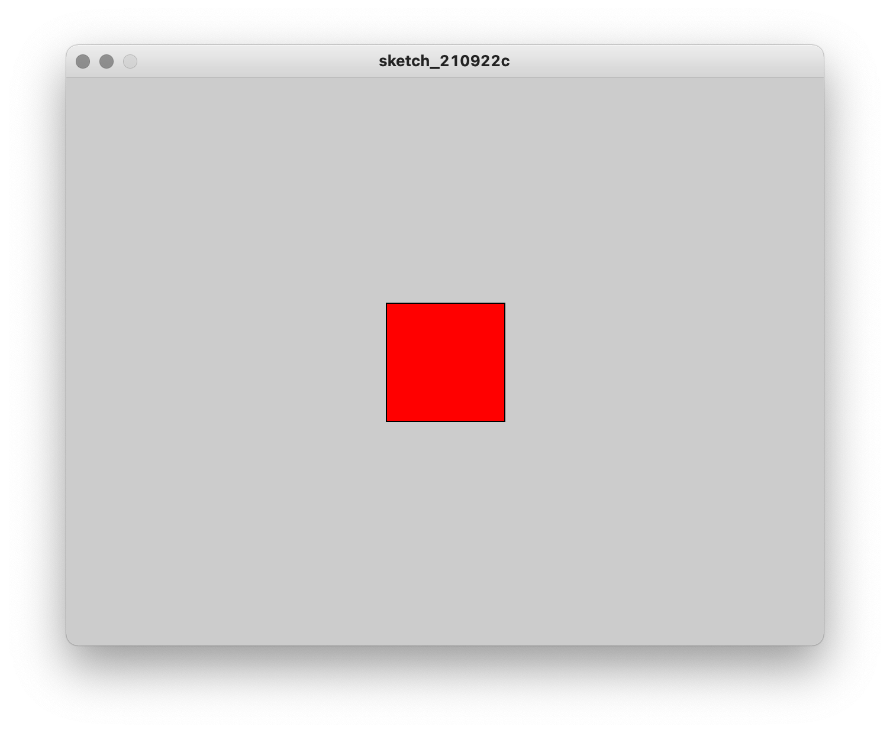
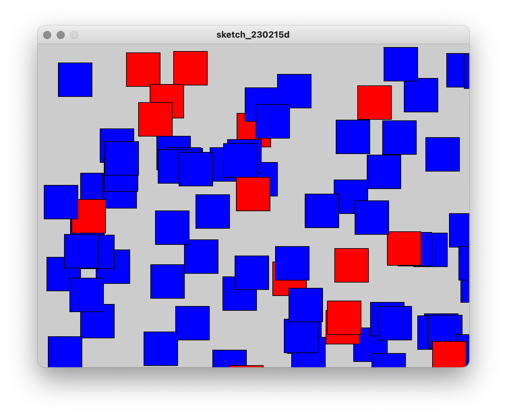
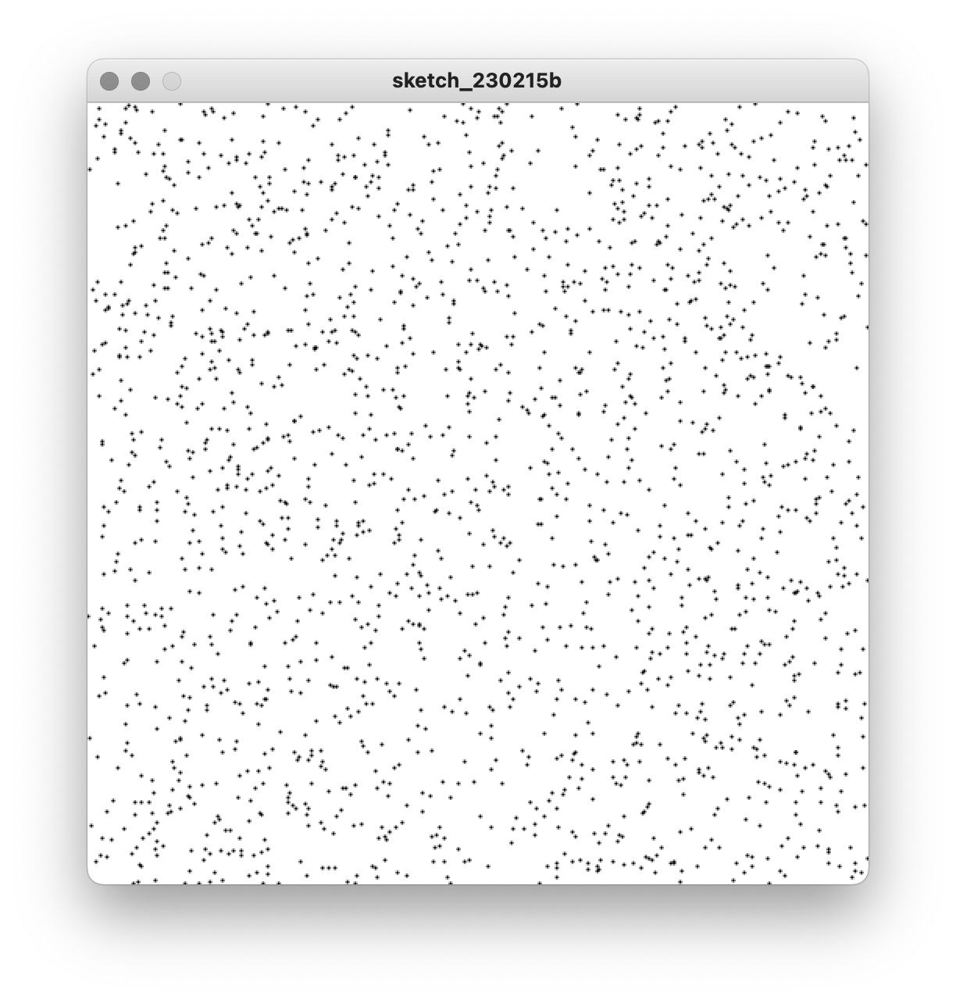
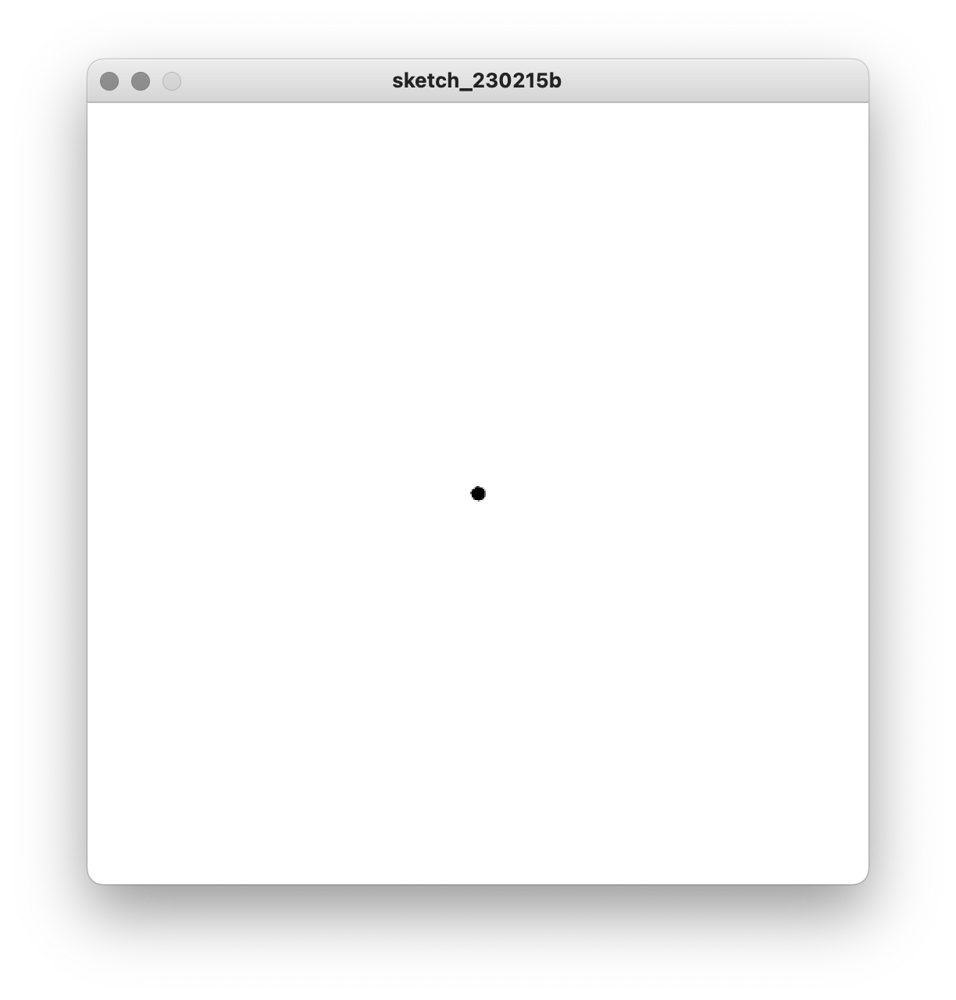
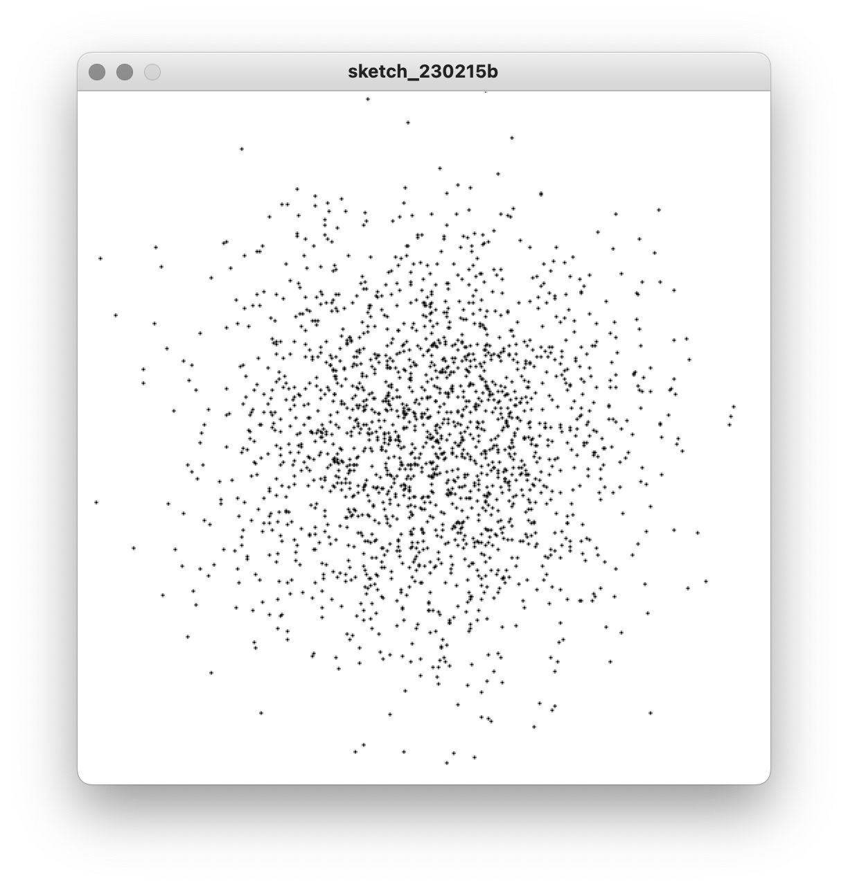

# Indeterminacy

A critical function for making images like these is `random()`. `random()` doesn't draw anything to the canvas itself. Instead, it _returns_ a random number within a given range.

```py
random(0, 100)  # a random number between 0 and 100
```

If you put this into a sketch, every time you run it, you'll get a different random number. But we can't see that number unless we print it out:

```py
print(random(0, 100))
```

Notice how we've put `random()` _inside_ `print()`. It can be tricky to keep track of all the parentheses, but this is a very useful thing to be able to do. `random()` will first do its job and come up with a random number between 0 and 100 and return it. And then this number will be what `print()` prints out. Every time the sketch is run, this number will be different:

<p align="center">
  <br />
</p>

 Try seeing what happens if you change `0` and `100` to other values, for example `-20` and `20`:

 <p align="center">
   <br />
 </p>

As an aside, one shortcut that will make our lives a bit easier is that if the first argument for `random` is `0`, we can omit it. In other words `random(0, 42)` can be shortened to `random(42)`, which is more convenient to write.

<!-- pause and have them experiment, questions -->

### Random arguments

Ok, so what can we do with this visually?

Let's start with a simple shape in the center of the canvas:

```py
size(500, 400)

circle(250, 200, 100) # x position, y position, diameter
```

<p align="center">
  <br />
</p>

What if we used random numbers for the arguments in `circle()` instead?

If we want coordinates that fit within the canvas, we want them to be between 0 and its width or height. Since we're using 0, we can omit that argument. Therefore, `random(500)` and `random(400)` produce numbers between 0 and the width and height of the canvas, respectively.

```py
size(500, 400)

circle(random(500), random(400), 100) # x position, y position, diameter
```

This looks a little weird with all the parentheses and commas (be careful to keep track of them all!), but all we've done is _substitute_ the static numbers that we were using with the `random` function and its arguments:
- `250` is replaced with `random(500)` which chooses a number between 0 and 500
- `200` is replaced with `random(400)` which chooses a number between 0 and 400

The result is that every time you run this sketch, the circle will be drawn in a different location:


<p align="center">
  <br />
</p>

<!-- questions -->

How is that at all useful? Well, what if we repeated that random circle a bunch of times using a `for` loop (and also substituted the diameter with a random argument between 10 and 300)?

```py
size(500, 400)

for i in range(10):
    circle(random(500), random(400), random(10, 300))
```

<p align="center">
  <br />
</p>

Suddenly, this has become very expressive with just a little code.

It turns out that `random` can be applied to color, not just shapes. Remember than every component of a color goes from 0-255, which means we can make random numbers like this:
```py
# a random color with a random amount of opacity (R, G, B, opacity)
fill(random(255), random(255), random(255), random(255))

# a random greyscale color with a random amount of opacity (grey, opacity)
fill(random(255), random(255))
```

Let's use this together with a loop to make a somewhat more elaborate example:

```py
size(500, 400)

# no outline on the shapes
noStroke()

# repeat 100 times
for i in range(100):

    # choose random color and opacity
    fill(random(255), random(255), random(255), random(255))  

    # make a random triangle with the bounds of the canvas
    triangle(random(500), random(400), random(500), random(400), random(500), random(400))

```

<p align="center">
  <br />
</p>

Now we're getting somewhere. If you play with the arguments, and add in more of the drawing tools we've learned previously, you can get an increasingly more interesting result:

```py
size(500, 400)

# set the background to white
background(255)

# repeat everything 20 times
for i in range(20):

    # make a random triangle with no outline and a random red-ish fill
    noStroke()
    fill(random(255), 0, 0, random(255)) # choose random red value and opacity (green and blue are 0)
    triangle(random(500), random(400), random(500), random(400), random(500), random(400))

    # make a circle with no fill and random greyscale outline of random weight
    noFill()
    stroke(random(255), random(255))
    strokeWeight(random(1, 10))
    circle(random(500), random(400), random(10, 50))
```

<p align="center">
  <br />
</p>

As you can see, even this relatively straightforward example shares a certain aesthetic with that of artists we've seen who work with indeterminacy.

Remember that you don't always have to use the entire width and height of the canvas with random. In fact, experimenting with these ranges is how you can add structure to your sketch.

In this example, which has a canvas size of 640 x 480, notice that the blue rectangles get a random horizontal position between 0 and 320, and the red ellipses get a random horizontal position between 320 and 640:

```py
size(640, 480)
background(255)
noStroke()

for i in range(100):

    # blue rectangles
    fill(255, 0, 0, 128)
    rect(random(320), random(480), random(10, 100), random(10, 100))

    # red ellipses
    fill(0, 0, 255, 128)
    ellipse(random(320, 640), random(480), random(10, 100), random(10, 100))

```

<p align="center">
  <br />
</p>

We could also cluster the circles within a smaller overall area in the center. Here, the rectangles once again take up the whole canvas, but the ellipses have more constrained arguments:

```py
size(640, 480)
background(255)
noStroke()

for i in range(100):

    # blue rectangles
    fill(255, 0, 0, 128)
    rect(random(640), random(480), random(10, 100), random(10, 100))

    # red ellipses
    fill(0, 0, 255, 128)
    ellipse(random(220, 420), random(140, 340), random(10, 100), random(10, 100))
```

<p align="center">
  <br />
</p>

Notice how the rectangles and ellipses are interleaved. This is because for every iteration of our loop, the computer draws one rectangle and then one ellipse. What if we wanted all the rectangles drawn first?

To do that, we use two separate loops (and we're very careful with indentation):

```py
size(640, 480)
background(255)
noStroke()

# red rectangles    
for i in range(100):
    fill(255, 0, 0, 128)
    rect(random(640), random(480), random(10, 100), random(10, 100))

# blue ellipses
for i in range(100):
    fill(0, 0, 255, 128)
    ellipse(random(220, 420), random(140, 340), random(10, 100), random(10, 100))
```

<p align="center">
  <br />
</p>

Now all the ellipses are all up front. This technique is a simple way to create a sense of composition with otherwise randomly distributed shapes.


### Random with `i` and nested loops

In all of these examples, we've been ignoring `i`. But we can certainly combine `random()` with the techniques we used to organize shapes via loops. This is one way to create tension between regularity and variability, such as in the work of Vera Molnár.

For example, consider this code, which uses `i` to create a row of circles across the canvas. They're only one pixel apart, but they have a diameter of 5, so the result appears as just a line:
```py
size(640, 480)
background(255)
noStroke()
fill(0, 100)

for i in range(640):
    circle(i, 240, 5)
```
<p align="center">
  <br />
</p>

Now let's randomly vary the parameters a bit:
```py
size(640, 480)
background(255)
noStroke()
fill(0, 100)

for i in range(640):
    circle(i, 240 + random(-5, 5), random(5))
```
<p align="center">
  <br />
</p>

We still have a "line", but now it's a more expressive one, with a sense of texture.

This also, of course, works in two dimensions. First consider a regular grid:
```py
size(640, 480)
background(255)

for i in range(16):
    for j in range(12):
        square((i * 40) + 5, (j * 40 ) + 5, 30)
```        
<p align="center">
  <br />
</p>

To give this a sense of variation, let's change the offset by a small random amount:
```py
size(640, 480)
background(255)

for i in range(16):
    for j in range(12):
        square((i * 40) + random(2, 8), (j * 40 ) + random(2, 8), 30)
```   
<p align="center">
  <br />
</p>

Here we still understand the canvas as a grid, but the tension in the variation creates a more satisfying aesthetic result.

Instead of positioning, we might randomly vary the construction of a series of small multiples, using a third nested loop. Individually, these figures might not be all that interesting, but together they create a world of curiosities:

```py
size(640, 480)
background(255)

for i in range(16):
    for j in range(12):
        for k in range(5):
            ellipse((i * 40) + 20, (j * 40) + 20, random(5, 35), random(5, 35))
```


<p align="center">
  <br />
</p>

Random arguments and loops together radically transform how we can think about making images—rather than just encoding space, the computer can do some work for us by incorporating indeterminacy, work that can surprise us and add visual depth to our compositions.


### Flipping a coin

By specifying the ranges of random parameters, we can do a lot to control the texture and composition of the work. But what if we want to simply do one thing OR another? To make something blue OR red, for example, or a circle OR a square, or some other more radical branch in the code?

Consider the following construction:

```py
size(640, 480)

if random(100) < 50:      # flip the coin
    fill(255, 0, 0)     # this happens 50% of the time
else:
    fill(0, 0, 255)     # this happens 50% of the time

square(320, 240, 100)
```

This is called a random conditional, and it takes the form of an `if` statement. We'll cover conditionals in detail in our next unit, but previewing it here will give us some flexibility to produce more radically different versions of the output each time we run the code.

Notice how there are two blocks of code—one with a red fill and one with a blue fill—and only _one_ of them will actually run. Which one runs depends on whether `random()` returns a value that is above or below 50. We can read this like an English sentence: "if a random number between 0 and 100 is below 50, make it red, else make it blue." We've used 100 here to make it even easier to think about: "50% of the time, make it red, the rest of the time make it blue." We can then change 50 to whatever percentage we want.

Why would we want to do this? It's a strategy often used in generative art: if the same code is being used to produce multiple versions of an artwork in a series, random conditionals can contribute to those versions being more radically unique.

<p align="center">
  <br />
</p>

<p align="center">
  <br />
</p>


...but we can also adjust the distribution of choices within our sketches. To demonstrate, let's put this example in a `for` loop:


```py
size(640, 480)

for i in range(80):
    if random(100) < 20:    
        fill(255, 0, 0)     # this happens 20% of the time
    else:
        fill(0, 0, 255)     # this happens 80% of the time

    square(random(width), random(height), 50)
```

This gives us a collection of squares, 20% of which are red, and the rest blue.


<p align="center">
  <br />
</p>


### Gaussian Distributions

`random()` gives us an even distribution of numbers. But as we've learned, that's not always what we want. If we consider things in the real world, they often follow "normal" distributions. Take the height of adults, for example: there are very short people and very tall people, but most people are clustered around the middle. (This in itself is a topic with deep philosophical overtones as to how and why we create normalizations and categories, but we'll save that for discussion.)

To do this in code, we use `randomGaussian()`. This works a little differently than `random()` in that it doesn't take an arguments—it always returns values centered on 0 and deviating by a random amount.

Consider the following code using `random()`, which gives an even distribution:

```py
size(500, 500)
background(255)

strokeWeight(2)

for i in range(2000):
    point(random(width), random(height))
```

<p align="center">
  <br />
</p>


To get a Gaussian distribution, we'll use `randomGaussian()` instead. Because this function takes no arguments, we'll add half the canvas in each dimension to get things centered:

```py
size(500, 500)
background(255)

strokeWeight(2)

for i in range(2000):
   point(randomGaussian() + width/2, randomGaussian() + height/2)
```

<p align="center">
  <br />
</p>

Notice the little cluster in the middle! To spread that out, let's add a multiplier (getting the number that works best will take some trial and error):

```py
size(500, 500)
background(255)

strokeWeight(2)

for i in range(2000):
   point(randomGaussian() * 75 + width/2, randomGaussian() * 75 + height/2)
```

<p align="center">
  <br />
</p>

Notice how this is still "random", but it tapers off on the edges. It doesn't have to be used in two dimensions or centered in this way—using a gaussian distribution might be useful in all kinds of contexts, any time you want values centered somewhere with a bit of natural-feeling variation.


