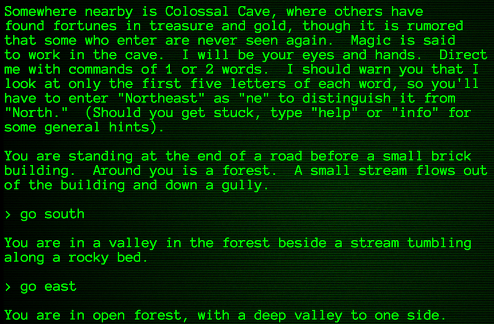
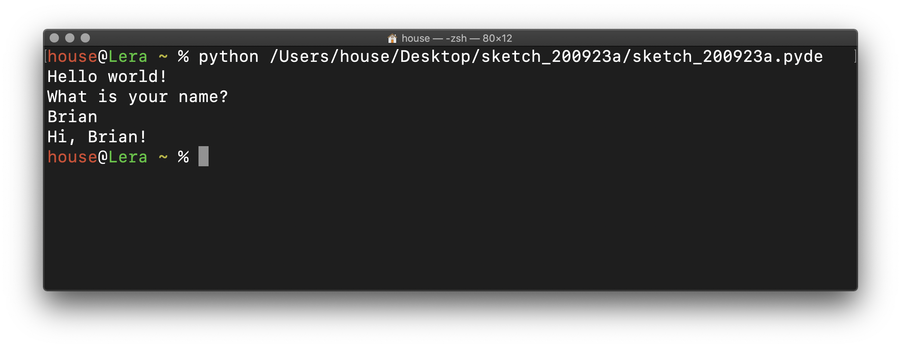
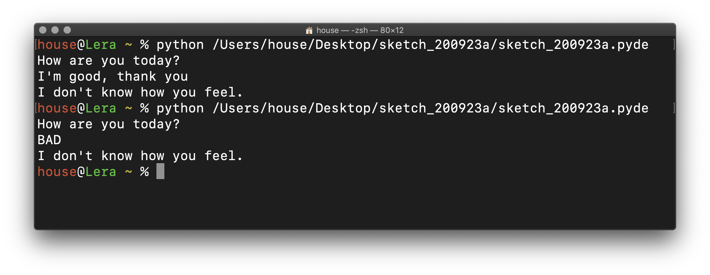
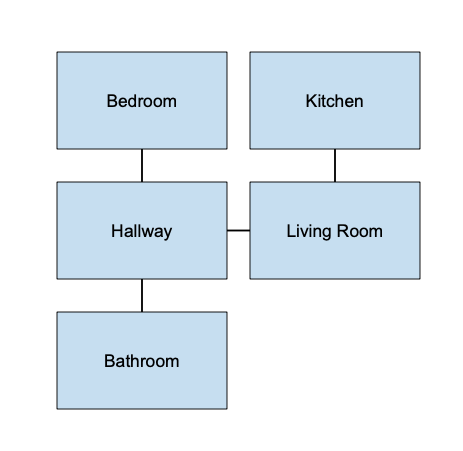
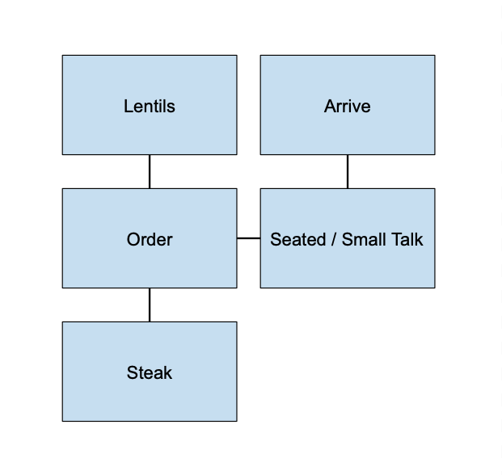
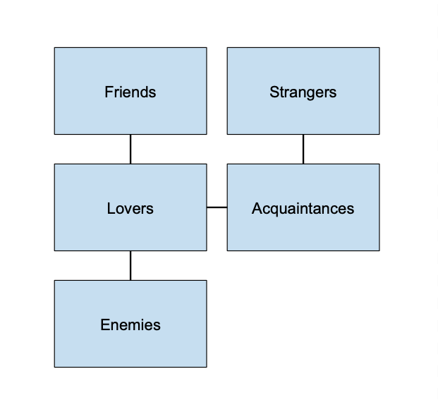

# Nonlinearity

<!--
- apologies for cancelling class on Tuesday (my wife had a baby on Monday, so it's been an awesome but logistically challenging week)
- you'll have an extra weekend to work on this assignment
- going to move artist presentations (Julian + Noa, Alex + Sadie)

1:
- when I say linear, what does that mean? -> cassette
- examples of nonlinearity?
    - choose your own adventure stories (page numbers)
    - nonlinear storytelling in films (pulp fiction) -> kinoautomat
- digital media are inherently structured nonlinearly (audio editing, jump back and forth)
- zork is one example (responses to playing it)
- everyone review the notes in the assignment
/
- Terminal?
- show strings
- have them work on response to a question

/
note that this is harder than the last assignment, so you'll need to start working on it earlier

next time we'll review maps

review the notes in the assignment!
-->

## Concept

Traditional media such as film, audio recordings, or books typically proceed in a fixed sequence. Though we can do things like rewind a tape, or use page numbers to jump to a particular section of a novel, ultimately the possibilities are limited because the content is static. When creating artwork in these media, we typically compose a linear narrative (or narratives) that will be followed again and again in the same order.

Digital media, however, do not need to be linear. Because computers can respond in the moment to how a person is experiencing an artwork, the content can be dynamic. Rather than define the exact sequence of a story, for example, we can create a map of possibilities and leave the specific path up to the reader. This quality of nonlinearity is characteristic of narrative- and time-based artwork that does not just reproduce analog forms in digital media, but takes advantage of the possibilities intrinsic to computers.


## Context

### Non-digital

There are some ways analog media can have nonlinear structures without using computers. A classic example of this is the [_Choose Your Own Adventure_](https://en.wikipedia.org/wiki/Choose_Your_Own_Adventure) series of young adult novels. Popular throughout the 1980s and 1990s, the books are written in the [second person](https://en.wikipedia.org/wiki/Narration#Second-person) so that the reader identifies with the protagonist of the story. Every few pages, these books offer a choice between a few different actions, each of which requires skipping to a different page to continue reading. _Choose Your Own Adventure_ books had up to 44 different endings and prefigured some of the adventure games released on personal computers that were beginning to proliferate around the same time.

<p align="center">
  <br />
  <i>Choose Your Own Adventure</i> book series<br />
</p>

Julio Cortázar's [_Rayuela_](https://en.wikipedia.org/wiki/Hopscotch_(Cortázar_novel)) (1963, English: "Hopscotch") is another example from literature in which the reader may choose the order in which to experience the narrative by skipping chapters. Other works such as Jorge Borges' [_The Garden of Forking Paths_](https://en.wikipedia.org/wiki/The_Garden_of_Forking_Paths) (1941, [full text](https://archive.org/stream/TheGardenOfForkingPathsJorgeLuisBorges1941/The-Garden-of-Forking-Paths-Jorge-Luis-Borges-1941_djvu.txt)),  Kurt Vonnegut's [_Slaughterhouse Five_](https://en.wikipedia.org/wiki/Slaughterhouse-Five) (1969) and Octavia Butler's [_Kindred_](https://en.wikipedia.org/wiki/Kindred_(novel)) (1979) have narratives that proceed non-chronologically and so hint at nonlinearity, although they do not incorporate decisions by the reader into the text itself.

In 1967, Czech director Radúz Činčera tried something similar to _Choose Your Own Adventure_ with film. His [_Kinoautomat_](https://en.wikipedia.org/wiki/Kinoautomat), made for the Czechoslovak Pavilion of the World Exposition, included several points in which the action stopped and the audience was polled to determine what should happen next. The projection was switched between two reels of film accordingly. Although it caused a sensation, the film was banned by the Communist Party, which prevented its further development.

<p align="center">
  <br />
  Radúz Činčera's <i>Kinoautomat</i> (1967)<br />
</p>

Although traditional film projection is inflexible in its sequence, just like in literature there are many movies that suggest nonlinearity in their content by telling a story in a different order than that experienced by the characters. These include several by celebrated avant-garde directors such as Akira Kurosawa's [_Rashomon_](https://en.wikipedia.org/wiki/Rashomon) (Japanese, 1950 [trailer](https://www.youtube.com/watch?v=xCZ9TguVOIA)), Jean-Luc Godard's [_Weekend_](https://en.wikipedia.org/wiki/Weekend_(1967_film)) (French, 1967 [trailer](https://www.youtube.com/watch?v=dFJLuhVvBPM)), Andrei Tartovsky's [_The Mirror_](https://en.wikipedia.org/wiki/Mirror_(1975_film)) (Russian, 1975 [trailer](https://www.youtube.com/watch?v=uXYfRkuA3cM)), and Quentin Tarantino's [_Pulp Fiction_](https://en.wikipedia.org/wiki/Pulp_Fiction_(film)) (American, 1994 [trailer](https://www.youtube.com/watch?v=s7EdQ4FqbhY)).

<p align="center">
  <br />
  A poster for Quentin Tarantino's <i>Pulp Fiction</i> (1994) with Uma Thurman<br />
</p>


### Digital

In 1975, Will Crowther was working as a programmer on the [ARPANET](https://en.wikipedia.org/wiki/ARPANET), a precursor to the internet funded by the US Department of Defense. Alongside his wife, Patricia, he had also been an avid caver. In an effort to bond with his young daughters after their divorce, Crowther combined his interests by programming a digital version of Kentucky's Mammoth Cave for the mainframe computers at his workplace (read more about this history in an [article](https://onezero.medium.com/the-woman-who-inspired-one-of-the-first-hit-video-games-by-mapping-the-worlds-longest-cave-ef572ccde6d2) by Claire Evans).

The result was [_Colossal Cave Adventure_](https://en.wikipedia.org/wiki/Colossal_Cave_Adventure), one of the earliest "games" made for computers and the first example of what became known "interactive fiction." Computer graphics were not yet widespread, and so _Adventure_ consists only of text. To explore the cave, the player types in one- or two-word commands to move and interact with objects. The program acts as a narrator, describing what is visible to the player and the results of their actions.

<p align="center">
  <br />
  Will Crowther, <i>Colossal Cave Adventure</i> (1975)<br />
</p>

_Adventure_ subsequently became a touchstone of nerd and hacker culture, and together with its immediate successors such as [_Zork_](https://en.wikipedia.org/wiki/Zork) (play [here](https://playclassic.games/games/adventure-dos-games-online/play-zork-great-underground-empire-online/play), original 1977 sourcecode [here](https://github.com/MITDDC/zork), cheats [here](http://www.eristic.net/games/infocom/zork1.html)), were highly influential on the development of later computer games, online role-playing, and today's virtual spaces.

Contemporary artists also began taking advantage of the possibilities for nonlinearity offered by digital media. Lynn Hershman Leeson's [_LORNA_](https://zkm.de/en/media/video/lynn-hershman-leeson-lorna-1979) (1979) is a preeminent example. Visitors to the gallery encounter a woman on a TV screen, and using the remote control, they navigate through her psychology to one of several possible results.

<p align="center">
  <br />
  Lynn Hershman Leeson, <i>LORNA</i> (1979)<br />
</p>

Online, websites and links provide another form of nonlinearity. Shortly after the World Wide Web and HTML browsers became widespread in the mid 1990s, artist Olia Lialina used basic HTML elements to create the poetic experience that is [_My Boyfriend Came Back from the War_](https://anthology.rhizome.org/my-boyfriend-came-back-from-the-war) (1996, still online [here](http://www.teleportacia.org/war/)).

<p align="center">
  <br />
  Olia Lialina, <i>My Boyfriend Came Back from the War</i> (1996)<br />
</p>

More recently, Netflix created a special episode of the dystopian series Black Mirror, called [_Bandersnatch_](https://en.wikipedia.org/wiki/Black_Mirror:_Bandersnatch) (2018), which incorporates audience choice into the narrative. The storyline features early game developers, and it self-reflexively refers both to the branching narratives of video games and the hacker culture of the 1970s inspired by _Adventure_.

<p align="center">
  <br />
  A decision point in <i>Bandersnatch</i> (2018)<br />
</p>


## Code: branching logic

Though we've repeated small blocks of code with loops, so far the code we've written has more or less proceeded linearly down the page. While this is sufficient for producing static images, programs that incorporate time and interactivity need to be structured in a way that can respond dynamically. We're going to take a break from graphics to explore nonlinearity first using text.

If you haven't already, [get started with the terminal](getting_started.md) before continuing here.

### Text input and variables

To begin, let's consider text. From debugging our graphics programs, we're already familiar with `print()`, which we can use with the terminal as well:

```py
print("Hello world!")
print("What is your name?")
```
<p align="center">
  
</p>

...but to be able to answer the question, we need to use the `raw_input()` function:
```py
print("Hello world!")
print("What is your name?")
name = raw_input()
```

`raw_input` captures whatever the person at the keyboard types, which is a **string** of text just like `"Hello world!"`. However, we don't know exactly what text it is, because the person could have typed anything.

That's where **variables** come in. In the code above, the variable `name` is a placeholder for whatever string comes out of `raw_input()` (the name "name" is arbitrary—we can call it whatever we want, as long as it's not a word that is already in use as the name of a function or by another variable).

In this code, `=` sets `name` to the result of `raw_input()`. We can subsequently use `name` elsewhere in our code. For example, using `+` and a few more strings, we can assemble a response:

```py
print("Hello world!")
print("What is your name?")
name = raw_input()
print("Hi, " + name + "!")
```

Here, the strings `"Hi, "` and `"!"` are concatenated on either side of whatever string is represented by `name`.

<p align="center">
  
</p>

The program doesn't end right away anymore—there is a prompt waiting for an answer:

<p align="center">
  
</p>

There's a lot going on in that simple example: we've asked for user input, used a variable to store the response, and concatenated several strings together to produce a dynamic output. But that's not all we can do.

### Conditionals

What's most exciting about variables is that they open up the possibility of our programs doing different things depending on the input. For example:

```py
print("Is the air quality good today?")
answer = raw_input()

if answer == "yes":
    print("That's a relief!")
else:
    print("Oh no!")
```

Here, the `if` keyword sets up a test. If `answer == "yes"` is in fact true, then the program prints out `"That's a relief!"`, which is indented on the next line. But if that's not what was typed, the program skips to what is indented after `else` instead and prints out `"Oh no!"`.

One thing that's important to note: to _assign_ a variable, we used the `=` symbol, but to _test_ if a variable matched another string, we used the `==` symbol. There's a subtle difference between those two, but it's very easy to mix up.

<p align="center">
  
</p>

This is a very simple example. What if there are more than two answers to a question?

```py
print("How are you today?")
feeling = raw_input()

if feeling == "good":
    print("Great to hear it.")
elif feeling == "bad":
    print("I'm sorry to hear that.")
elif feeling == "ok":
    print("We do what we can.")
else:
    print("I don't know how you feel.")
```

We have to be careful about our indentation here. But you can see that now there `elif` keywords, which is a short way of writing "else if". It means that after the first `if` test, the program goes down the line through all the `elif`s and sees if any of them are true. If they are, the program executes the appropriate indented code. If not, it will end up at `else` and execute that code instead (you can think of `else` as a default answer). `if`, `elif`, and `else` all work together to structure the flow of the program.

<p align="center">
  
</p>

## Tests on strings

This is starting to feel more dynamic. But the tests remain somewhat rigid, and we can end up with issues like this:

<p align="center">
  
</p>

Both of these tests should have produced different answers. But in the first example, a word we were looking for, "good", was couched in a longer phrase, and so it didn't match exactly. We can fix that by using the `in` keyword instead of the `==` operator:

```py
print("How are you today?")
feeling = raw_input().lower()   # convert input text to lowercase

if "good" in feeling:
    print("Great to hear it.")
elif "bad" in feeling:
    print("I'm sorry to hear that.")
elif "ok" in feeling:
    print("We do what we can.")
else:
    print("I don't know how you feel.")
```

This reworked example tests if the word "good" is contained somewhere in the variable `feeling` (and likewise for the other options), so it is a little more flexible when it comes to extraneous words. We've also added `.lower()` to the end of `raw_input()`, which is a trick that converts the input to lowercase and prevent the second mixup with cases.

<p align="center">
  
</p>

Of course, there might be multiple inputs that should elicit the same response, ie, "good", "great", "excellent" shouldn't all require a unique `elif`. The `or` keyword helps us with this:

```py
print("How are you today?")
feeling = raw_input().lower()

if "good" in feeling or "great" in feeling or "excellent" in feeling:
    print("Great to hear it.")
elif "bad" in feeling or "rough" in feeling:
    print("I'm sorry to hear that.")
elif "ok" in feeling or "fine" in feeling:
    print("We do what we can.")
else:
    print("I don't know how you feel.")
```
Similarly, maybe we want to be sure that two different words are present in the response. We can accomplish that with the `and` keyword:
```py
print("Do you want soup or salad?")
choice = raw_input().lower()

if "soup" in choice and "salad" in choice:
    print("That's right--why pick?!")
elif "soup" in choice:
    print("The bisque is delicious.")
elif "salad" in choice:
    print("Ranch or vinaigrette with that?")
else:
    print("That's not what we're serving.")
```

This code can get a little wordy, but it allows for more flexibility within the program's flow (you can even use parentheses to create complex conditions). Using `if` conditionals like this, we can craft fairly elaborate responses to open ended input. But we still lack one crucial tool for nonlinearity.

<!--
exercise with question and answer
-->

### Functions

In programming, the most fundamental way of organizing code is by grouping it into reusable blocks called **functions**. We've already been using functions, of course, such as `rect()`, `random()`, and `print()`, but these have been written for us.

Making our own functions in Python is similar to how we indent code under a `for` loop or an `if` conditional, except in this case we use the keyword `def`, followed by a unique name. Anything that is subsequently indented is included in the function. For example:

```py
def air_test():
    print("How is the air quality today?")
    quality = raw_input()    
    print("You said the air quality is " + quality)
```

The name of this new function is "air_test," but that is an arbitrary choice—just like with variables, you can call a function whatever you want, as long as that name is not already being used by something else in the program.

If you write this code in a sketch and run it, nothing will happen. In order to run the code in `air_test()`, we have to "call," or execute, the function. We do that just by writing the name followed by parentheses on a line by itself:

```py
# declare the function
def air_test():
    print("How is the air quality today?")
    quality = raw_input()    
    print("You said the air quality is " + quality)

# call the function
air_test()
```

Now we get a result when we run the sketch:

<p align="center">
  
</p>


Once you define a function, you can reuse it over and over, like with `circle` in your drawings. You can also think of a function as a section of the program that you can return to as needed. Once the function is complete, the program continues with the line after the function call.


### Putting it all together

Variables, conditionals, and functions. Together, we can use them to create nonlinearity in our programs.

But before we continue to write code, consider this abstract diagram of a house, where connections (ie, doors) between rooms are represented by lines:

<p align="center">
  
</p>

A person moving through this house will have different options depending on what room they're in. If they are in the bedroom, the only option is to enter the hallway. But from there, they can go to the living room, the bathroom, or back to the bedroom. To get to the kitchen, they would have to pass through the living room first.

This is a metaphor for how programs are structured with functions and conditionals (in computer science, this is what is known as a [finite state machine](https://en.wikipedia.org/wiki/Finite-state_machine)). Taken more literally, it's also more or less how Will Crowther built _Adventure_.

Each of these rooms can be represented with a function. For example:

```py
def living_room():
    print("You're in the living room. Doors lead to the hallway and to the kitchen.")
    print("Where do you want to go next?")
    response = raw_input("> ").lower()  # adding a parameter creates a prompt
```

Since the living room is connected to kitchen and the hallway, we'll want to provide those options. And if we get a response that doesn't include anything about a kitchen or hallway, we'll want to provide a default response using `else`:

```py
def living_room():
    print("You're in the living room. Doors lead to the hallway and to the kitchen.")
    print("Where do you want to go next?")
    response = raw_input("> ").lower()
    if "kitchen" in response:
        kitchen()   # call the kitchen function
    elif "hallway" in response:
        hallway()   # call the hallway function
    else:
        print("You can't go there.")
        living_room() # repeat the living room function
```

`kitchen()` and `hallway()` are functions that we haven't written yet. But they will be new parts of the program that represent those rooms. `living_room()` is the function we're already in—when we call it again, we repeat the function over from the beginning.

Here's the hallway:


```py
def hallway():
    print("You're in the hallway. Doors lead to the living room, bathroom, and bedroom.")
    print("Where do you want to go next?")
    response = raw_input("> ").lower()
    if "living room" in response:
        living_room()
    elif "bathroom" in response:
        bathroom()
    elif "bedroom" in response:
        bedroom()
    else:
        print("You can't go there.")
        hallway()
```

With a function for each room of the house and appropriate conditionals, we can navigate through the house by typing:

<p align="center">
  
</p>

This could go on forever, and the exact order isn't determined until the reader inputs text. That makes it a basic example of a nonlinear narrative. Though the content of the text could use some elaboration, notice how the flexibility of the input creates a sense of narrative, and even unintended humor in the responses.

Remember, to start the narrative, you'll need to call a function on a line by itself to kick things off:
```py
living_room()
```
...and if you want the narrative to end somewhere, whether magnificent victory, horrible defeat, or something more subtle, you can just include a function that doesn't call any other functions:
```py
def the_end():
    print("That's all, folks")
```

It may be too late already, but an important thing everyone needs to learn: **type Control-C to exit your program if you get stuck**. You'll need it.

Using functions to represent physical spaces lets us picture how the parts of the program are interrelated. But although _Adventure_ and _Zork_ did it this way, it is not the only option. The "rooms" (or "states") could correspond to topics of conversation, or a character's moods, or a medical diagnosis, or a events in a soccer match.

<p style="float:left;">
  
</p>

<p style="float:left;">
  
</p>

<p style="">
  
</p>


<!--

create a map

-->

### Advanced: keeping track of things with variables

In the code above, variables are only used to temporarily hold a value returned by `raw_input`. However, we can also use **global variables** that span multiple functions in order to keep track of user actions. This is particularly useful when combined with `True` and `False`, a special kind of value in Python that isn't a number or a string.

To demonstrate, consider a nonlinear narrative in which the reader needs a key to unlock a special door. When the program begins, the reader doesn't yet have the key. So at the top of the program, before any functions, we'll create a variable `has_key` and set it to `False`:

```py
has_key = False
```

Subsequently, if any of our functions are going to use this global variable, we need to explicitly say so with the `global` keyword:

```py
has_key = False

def basement():
    global has_key  # this function can now use the global variable 'key'
```

We can now add a condition to the possibilities for this room, depending on whether or not the reader already has the key:

```py
has_key = False

def basement():
    global has_key  # this function can now use the global variable 'has_key'
    print("You're in the basement. There is a mysterious door here.")
    print("What do you want to do?")
    response = raw_input("> ").lower()
    if "door" in response and has_key == True:
        mystery_door()
    else:
        print("You can't do that.")
        basement()
```

For the mystery door to open, `"door"` has to be in the response, _and_ `has_key` has to be set to `True`. Otherwise, the option isn't available.

Using `True` / `False` and global variables in this way creates hidden possibilities within the logical structure of the functions / rooms, which is particularly useful for adding puzzles or other game-like aspects to the narrative.

But how does the reader get the key?

Let's add something to the text of a different room (assuming a longer program where these rooms are connected by others), that depends on whether or not the reader already has the key in possession:

```py
has_key = False

def office():
    global has_key  # this function can now use the global variable 'has_key'
    print("You're in an office. A door leads to the hall.")    
    if has_key == False:
        print("There is a key here.")
```

Notice this `if` statement doesn't need an `elif` or even an `else`—it just checks it see if the reader has picked up the key yet. If they haven't, it must be still sitting on the table, so we print out `"There is a key here."`.

Now, we can add the interaction:

```py
has_key = False

def office():
    global has_key  # this function can now use the global variable 'has_key'
    print("You're in an office. A door leads to the hall.")    
    if has_key == False:
        print("There is a key here.")        
    print("What do you want to do?")
    response = raw_input("> ").lower()
    if "hall" in response:
        hall()
    elif "key" in response and has_key == False:
        print("You take the key.")
        has_key = True                  # set has_key to True
        office()
    else:
        print("You can't do that.")
        office()
```

If in response to the question `"What do you want to do?"` the reader types something like `"take key"` and `has_key` is not already set to `True`, then the program will set `has_key` to `True`. It will subsequently repeat the function, this time leaving out the extra text. The outcome might look something like this:

<p>
  
</p>

When (and if) the reader proceeds to the basement, they will then be able to open the door.

Note that the construction of this narrative is as much about the craft of _writing_ as it is about programming. A concept like a key exists somewhere between the variable that keeps track of whether the user has picked it up (`has_key`), the conditional logic of what it makes possible, and the narration of a world that is consistent and intuitive, one in which keys can be taken to unlock doors and in which they don't spontaneously appear or persist (unless, of course, we want them to magically do so).


## Sketch #3

With this sketch, you will create a nonlinear narrative in the second person using code where the reader chooses their path by inputting text. While your work may be structurally similar to _Zork_, the theme and written content should reflect your own artistic concept. Your program must demonstrate at least 8 different branching points that create meaningful alternative paths.

Draw a "map" of the the choices that will be available to your reader (by hand, using Google Draw, or any other medium) and turn this in along with your final Python code to Google Classroom. In addition, upload a document that includes your title and a [3-sentence description](../../resources/description_guidelines.md) that explains how you'd like us to approach the result.
