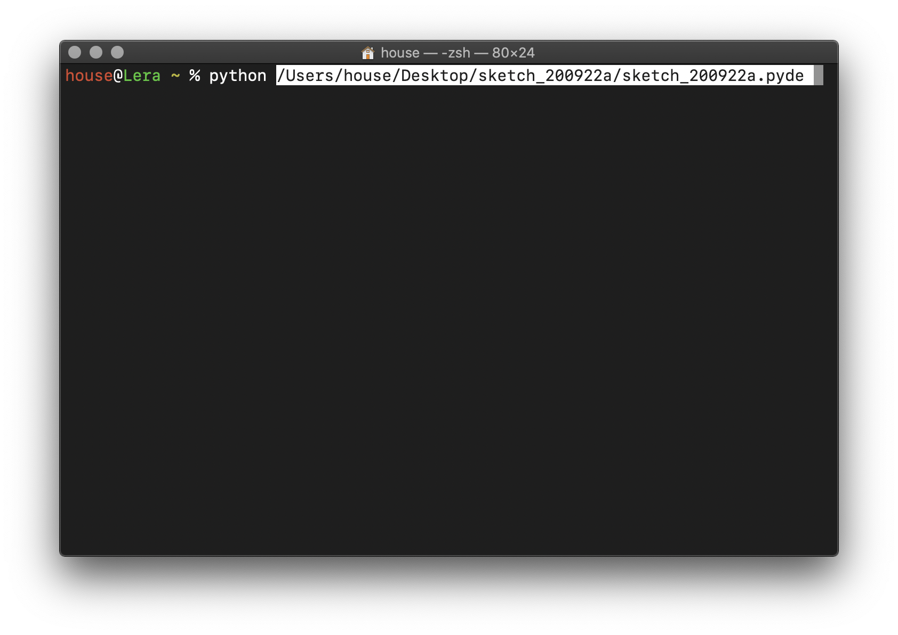
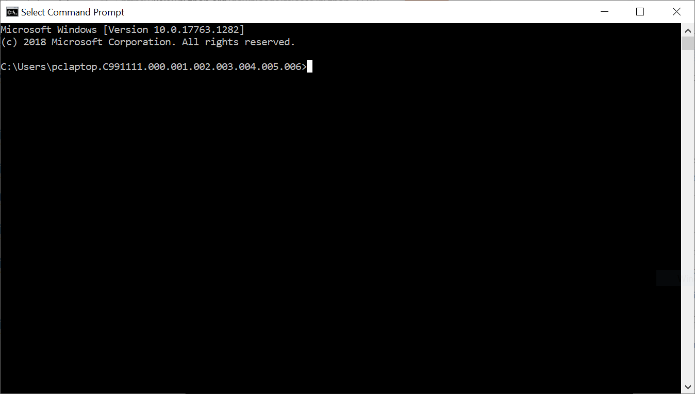

# Getting started with the Terminal

In the spirit of early artworks that came before graphical displays, we're going to use the computer's terminal to run our Python code. This is a more fundamental way of interacting with the machine than the folders, files, and browsers to which we're normally accustomed. Even though we don't typically use it directly, we can still look "under the hood" of most machines and see this original interface. For our purposes, it's a way that we can use Python to process text input, not just draw graphics.

## MacOS

In the Finder, navigate to `Applications > Utilities > Terminal.app` and open it. You should see a window that looks something like this (your colors may be different, but you can customize them in the Terminal preferences):

  

The `%` or `$` symbol is the "command prompt" where you can type instructions to the machine (different versions of MacOS use different symbols). We won't get into all the things you can do here, but as it turns out, one of the things that's possible is to run Python programs directly.

<!-- but try typing `python` and hitting return—you should get information on your particular version:

  

If you get an error that says "command not found," you'll need to come to office hours to get things set up. If you get a warning about version 2.7 like the above, don't worry, it won't matter for our purposes. For now, type `exit()` after the `>>>` symbol to get back to your command prompt. -->

<!-- So far, we've been writing Python code in the Processing application, and clicking the "Run" button to run it. However, there is an alternative.  -->

To try this out, first write some code in Processing and save it.

  

Now, use the "Show Sketch Folder" option under the Sketch menu to reveal the sketch code in its folder (the .pyde file):

  

In the terminal, type `python` and a space, but don't hit return yet. Now drag the .pyde file from the folder into the terminal. It should look something like this:

  

NOW hit return:

  

To run the program again, you don't have to drag the file again. Just hit the up arrow key and the terminal will show the last command you typed, and you can hit return to run it again, which will be much faster.

Unlike in the Processing application, this technique requires that you **save your work** before running it on the terminal—otherwise, your changes won't have an effect. So get in the habit of saving after ever change you make—using Command-S on the keyboard can become an almost unconscious reflex.

## Windows 10

Windows doesn't understand Python out of the box, so the first thing to do is to download a Python interpreter. Go to the [Python website for version 2.7.18](https://www.python.org/downloads/release/python-2718/) and download the "Windows x86-64 MSI installer". Run the installer and choose the default options.

Once Python is installed, go to the Start Menu and type `cmd` to bring up the Command Prompt (aka the terminal):

  

The > symbol is the prompt where you can type instructions to the machine. We won't get into all the things you can do here, but having installed Python, we can run it here directly.

To try this out, first write some code in Processing and save it.

  

Now, use the "Show Sketch Folder" option under the Sketch menu to reveal the sketch code in its folder (the .pyde file):

  

In the terminal, type `C:\python27\python.exe` and a space, but don't hit return yet. Now drag the .pyde file from the folder into the terminal. It should look something like this:

  

NOW hit return:

  

To run the program again, you don't have to drag the file again. Just hit the up arrow key and the terminal will show the last command you typed, and you can hit return to run it again, which will be much faster.

Unlike in the Processing application, this technique requires that you **save your work** before running it on the terminal—otherwise, your changes won't have an effect. So get in the habit of saving after ever change you make—using Control-S on the keyboard can become an almost unconscious reflex.
