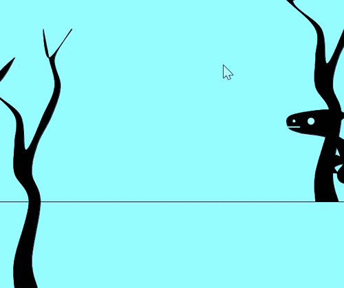

## Sketch #3: Time

Create a sketch with some aspect of time as its central theme. Draw upon techniques from past units and combine them with Processing's events to express your idea.

Your code should include your title and a [3-sentence statement](../../resources/statement_guidelines.md) that conveys your concept. In addition, turn in a video of your animation (see how to make a video [here](https://github.com/brianhouse/art_and_code/blob/master/resources/movie_maker.md])).


### Time Functions

```py
def change(start, stop, duration, offset=0):
    return map((frameCount - offset) % max(duration, 1), 0, duration, start, stop)

def swing(start, stop, duration, offset=0): 
    position = -cos(2 * PI * change(0, 1, duration * 2, offset)) * .5 + .5
    return (position * (stop - start)) + start  
```

### `random()` alternative that works with `draw()`

```py
def draw():
  resetRandom()
```

```py
def resetRandom():
    global gen
    def pseudo(seed, a=1664525, c=1013904223, m=2**32):
        while True:
            seed = (a * seed + c) % float(m)
            yield seed / float(m)    
    gen = pseudo(42)
            
def rando(low_limit, high_limit=None):
    if high_limit is None:
        high_limit = low_limit
        low_limit = 0
    return next(gen) * (high_limit - low_limit) + low_limit
```


### Examples

<p>
  <br />
  Caroline Wu, <i>Curtained Sunrise</i> (2023)<br />
</p>

<p>
  <br />
  Daniel Dachille, <i>Hypnotic Weave</i> (2023)<br />
</p>

<p>
  <br />
  Piper Moring, <i>Beach</i> (2023)<br />
</p>

<p>
  <br />
  Laurel Davidson, <i>Evolution</i> (2023)<br />
</p>