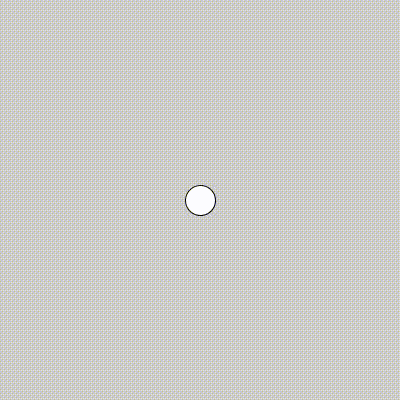
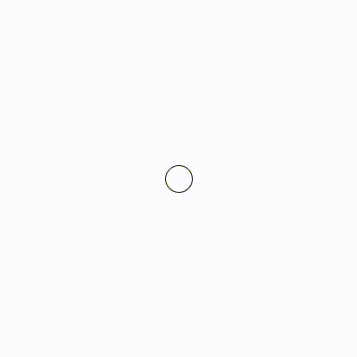

# Time

### Events

So far, we've used Python functions written by others, whether to make graphics in Processing or via `import` commands to manipulate text or use variations on the random module. We've also written our own functions to make rooms in nonlinear narratives and recursive drawings. Now, we're going to use functions in yet another, slightly different way.

When we write functions that have certain specific names, Processing will know to call those functions for us under certain circumstances. These are called **event handlers**.

`setup()` is the most boring of these. This function is called once when the sketch is first run:

<p align="center">
  <br />
</p>

Notice how this function runs even though we didn't call it explicitly (which we had to do for our functions in the nonlinearity sketch, for instance).

Once we start using handlers, _all_ of our code has to be contained in functions. So `setup()` doesn't do much for us other than give us a place to put the kind of code we've been working with so far—that is, code that is intended to be run just once. For example, from now on, we'll put `size()` inside of setup.

The interesting stuff starts with `draw()`. Processing calls `draw()` over and over again, once every 1/30th of a second. The implications of this are profound, because it allows us to do animation (the reason that it is 1/30th of a second is that this is the standard frame rate for digital video).

To start with, let's draw a circle:

```py
def setup(): # runs just once
    size(400, 400)

def draw(): # runs over and over again
    circle(200, 200, 30)    
```

<p align="center">
  <br />
</p>

So far, `setup()` is called right when the sketch is run, and it initializes the canvas. Then, `draw()` is called and it in turn calls `circle()`. In fact, the code inside `draw()` is running 30 times every second, drawing circle upon circle upon circle. However, we can't see this, because it's always drawing the circle at the same position.

To change the position of the circle, we're going to need some variables.

```py
def setup(): # runs just once
    size(400, 400)

def draw(): # runs over and over again
    x = 200
    y = 200  
    circle(x, y, 30)
```
<p align="center">
  <br />
</p>

No change yet. But what we're going to do now is use `setup()` to set the initial values of `x` and `y`, and then update them in `draw()`. One catch when we do this: we need to let Processing know that the `x` in `setup()` is the same `x` as the `x` in `draw()`. Likewise with `y`. To do this, we use the `global` keyword:

```py
def setup(): # runs just once
    global x, y # these variables are shared between functions     
    size(400, 400)
    x = 200 # initial value for x
    y = 200 # initial value for y

def draw(): # runs over and over again
    global x, y # these variables are shared between functions
    circle(x, y, 30)
```
<p align="center">
  <br />
</p>

Still no change, but now we're setting `x` and `y` in `setup()` and making use of them in `draw()`. So now we're ready to make something happen:
```py
def setup(): # runs just once
    global x, y # these variables are shared between functions     
    size(400, 400)
    x = 200 # initial value for x
    y = 200 # initial value for y

def draw(): # runs over and over again
    global x, y # these variables are shared between functions
    circle(x, y, 30)
    x = x + 1   # update the value of x each frame
    y = y - 1.2 # update the value of y each frame
```
<p align="center">
  <br />
</p>

The circle moves! Or rather, the circle is being redrawn at a new location every frame. The trail of circles looks pretty cool, but to make this really feel like animation, we have to clear our canvas every frame, using `background()`:

```py
def setup(): # runs just once
    global x, y   
    size(400, 400)
    x = 200
    y = 200

def draw(): # runs over and over again
    global x, y
    background(255) # clear the background every frame
    circle(x, y, 30)
    x = x + 1
    y = y - 1.2
```

<p align="center">
  <br />
</p>

This way, 30 frames a second, the canvas gets wiped clean, and then we draw the circle again.

The magic is in how we update `x` and `y`—in this case, just taking their previous values and adding `1` and subtracting `1.2`, respectively. There is a slightly more compact syntax for this:

```py
x += 1
y -= 1.2
```
These operators—increment and decrement—accomplish the exact same thing as before, but without repeating the variable name.


### `frameRate()` and frameCount()

print(frameRate)
print(frameCount)
print(frameCount % 10)


### conditionals

wrap the ball

if x > width:
x = 0

bounce the ball
need vx and vy

Note that depending on what you want, clearing the background each time may or may not be necessary. Some very complex and beautiful patterns can be produced by letting things build up. Especially with transparency.

```py
def setup(): # runs just once
    global x, y, vx, vy
    size(400, 400)
    background(255)
    x = 200
    y = 200
    vx = random(5)
    vy = random(5)

def draw(): # runs over and over again
    global x, y, vx, vy
    noStroke()
    fill(100, 0, 200, 10)
    # background(255) # clear the background every frame
    circle(x, y, 30)
    x = x + vx
    y = y + vy
    print(frameCount)
    
    if x < 0 or x > width:
        vx *= -1
    if y < 0 or y > height:
        vy *= -1
        
```

### using map

keeping track of variables in this way is useful, but it gets complicated really fast

before we go further down that road, I want to show something that may be simpler for many of our purposes. and that is map.


```py
def setup():
    size(600, 600)
    
def draw():
    background(255)
    
    circle(swing(0, width, 200), height/2, 50)
    
    
    
def change(start, stop, duration, offset=0):
    if duration == 0:
        duration = 1    
    return map((frameCount + offset) % duration, 0, duration, start, stop)


def swing(start, stop, duration, offset=0): 
    # duration is one half of the swing
    position = -cos(2 * PI * change(0, 1, duration * 2, offset)) * .5 + .5
    return (position * (stop - start)) + start    
```

make several with offsets
take away background

### hsb color
colorMode(HSB)


### discrete changes

hints toward emergence

frameCount and mod

```py
def setup():
    global x, y, direction
    size(600, 600)
    background(255)

    x, y = width/2, height/2
    direction = int(random(4))
    
def draw():
    global x, y, direction
        
    if frameCount % 2 == 0:
        direction = int(random(4))
        # print(direction)
    if direction == 0: # right
        x += 10
    elif direction == 1: # left
        x -= 10
    elif direction == 2: # up
        y += 10
    else:            # down
        y -= 10 

    if x < 0:
        x = 0
    elif x > width:
        x = width
    if y < 0:
        y = 0
    elif y > height:
        y = height          
                
    fill(0, 255, 0)
    noStroke() 
    square(x, y, 10)
```

```py
    if frameCount % 200 == 0:
        fill(random(255), random(255), random(255))       
```


###


do animation with multiple parts of a figure moving by adding changes()


### using get()

```py
    pixel = get(x, y)
    if red(pixel) == 255 and green(pixel) == 255 and blue(pixel) == 255:
        fill(0, 255, 0)
    else:
        fill(255, 255, 255)
```

lose the x increment method


sections on:
- simple motion

- solar system example

- conditionals

    if 0 < frameCount < 1000:
        
    elif 1000 < frameCount < 2000:
      
    elif 2000 < frameCount < 3000:  

    else:    

note that you can (have to) use a negative offset if you're using change for a simple transition that is delayed


- color:
    
    colorMode(HSB, 360, 100, 100)


- compound motion
this should cover "draw_leaf" or whatever -- just take parameters and do it below