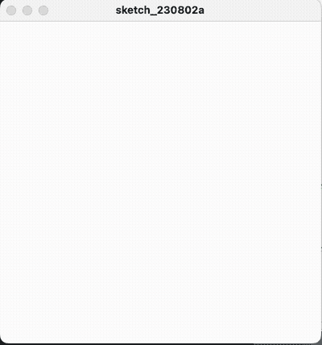

# Time

So far, all of the code we've written runs all at once and produces a static output. However, computers are quite good at incorporating another dimension: time.


### Event Handlers

To work with time, we have to set up our sketches a bit differently, using what's called **event handlers**. These are a special type of function. We've already used plenty of built-in functions to make the various shapes on the canvas. However, event handlers are functions we'll write ourselves.

Because event handlers have specific names, Processing will know to call those functions for us under certain circumstances.

The first is `setup()`, which is also the most boring. This function is called once when the sketch is first run:

<p align="center">
  <br />
</p>

Notice how this function runs even though we didn't call it explicitly.

Once we start using handlers, _all_ of our code has to be contained in functions. So `setup()` doesn't do much for us other than give us a place to put the kind of code we've been working with so far—that is, code that is intended to be run just once. For example, from now on, we'll put `size()` inside of setup.

The interesting stuff starts with `draw()`. Processing calls `draw()` over and over again, once every 1/60th of a second. The implications of this are profound, because it allows us to do animation (the reason that it is 1/60th of a second is that this is the standard frame rate for digital video).

To start with, let's draw a circle:

```py
def setup(): # runs just once
    size(400, 400)

def draw(): # runs over and over again
    circle(width/2, height/2, 30)    
```

<p align="center">
  <br />
</p>

So far, `setup()` is called right when the sketch is run, and it initializes the canvas. Then, `draw()` is called and it in turn calls `circle()`. In fact, the code inside `draw()` is running 30 times every second, drawing circle upon circle upon circle. However, we can't see this, because it's always drawing the circle at the same position.

Note the indentation—the `def` of the draw function is all the way over to the left, it's not underneath `setup()`.

To change the position of the circle, we're going to need some more functions. 


### Simple Motion


Before we go further, let's add some functions to our sketch:

```py
def change(start, stop, duration, offset=0):
    return map((frameCount - offset) % max(duration, 1), 0, duration, start, stop)

def swing(start, stop, duration, offset=0): 
    position = -cos(2 * PI * change(0, 1, duration * 2, offset)) * .5 + .5
    return (position * (stop - start)) + start  
```


These functions aren't built-in, like `circle`, and we're not going to write them from scratch. Rather, we're just going to paste in some pre-written code to add some functionality. We won't go over exactly how they work now, but most of what's in them will be covered as we go on.

Put them at the bottom, like this:

```py
def setup(): # runs just once
    size(400, 400)

def draw(): # runs over and over again
    circle(width/2, height/2, 30)    
    
        
                
def change(start, stop, duration, offset=0):
    return map((frameCount + offset) % max(duration, 1), 0, duration, start, stop)

def swing(start, stop, duration, offset=0): 
    position = -cos(2 * PI * change(0, 1, duration * 2, offset)) * .5 + .5
    return (position * (stop - start)) + start  
```

Going forward in this document, I won't show these two functions to avoid the clutter with every example. Just remember that they're down there!

Now, let's make the circle move. Replace the `width/2` that we're using as an argument for the circle's x position with `change(0, width, 120)`. Just like with `random()`, we're putting a function where a single argument was before.


```py
def setup(): # runs just once
    size(400, 400)

def draw(): # runs over and over again
    circle(change(0, width, 120), height/2, 30)    
```

`change()` takes three arguments: start value, stop value, and duration in terms of the number of frames. Remember, Processing is calling `draw()` 60 times a second, so putting 120 for the duration means that `change()` will start at its start value and transition to its stop value over the course of two seconds. Here's the result:

<p align="center">
  <br />
</p>

The circle moves! Or rather, the circle is being redrawn at a new location every frame. The trail of circles looks pretty cool, but to make this really feel like animation, we have to clear our canvas every frame, using `background()`:

```py
def setup(): # runs just once 
    size(400, 400)

def draw(): # runs over and over again
    background(255) # clear the background every frame    
    circle(change(0, width, 120), height/2, 30)    
```

<p align="center">
  <br />
</p>


`swing()` works the same as `change()` — it just switches direction and goes back again.

```py
def setup():
    size(400, 400)

def draw():
    background(255)
    circle(swing(0, width, 120), height/2, 30)   # swing
```        

<p align="center">
  <br />
</p>

What happens if you do both at the same time?

<p align="center">
  <br />
</p>

```py
def setup(): # runs just once 
    size(400, 400)

def draw():
    background(255)
    circle(swing(100, width-100, 120, 60), swing(100, height-100, 120, 0), 30)
    circle(swing(120, width-120, 100, 50), swing(120, height-120, 100, 0), 30)
```           

In the example above, there are two moving circles. In each one, both the x and the y position are controlled by `swing()` functions. One of which is making a circle 100 pixels from the edge, the other one is 120 pixels from the edge. 

To get this to work, we use the fourth parameter of `swing()` (and `change()`), which is "offset". Notice how in the first circle, the duration is 120 frames, and the x position function is offset by 60 frames. That puts the x and y in a complementary relation to each other, generating a circle. In the second circle, the duration is 100 frames, so the offset is 50.

Play with those offset values, and see what you get!


### Compound Motion

By adding multiple motion functions together, more complex motion results. For example, you may want to have something moving across the screen while simultaneously moving more subtly within itself. For example, a falling leaf (ok, it's not a very good leaf, but roll with it):

<p align="center">
  <br />
</p>

```py
def setup(): 
    size(400, 400)
    
def draw():
    background(255)        
    fill(0, 255, 0)
    noStroke()
    circle(width/2 + swing(-42, 42, 50), change(0, height, 500) + swing(-12, 12, 28), 22)
```

Notice how in the x parameter, `swing()` is added to `width/2`. This is another way of writing `swing(width/2 - 42, width/2 + 42, 50)`. The effect is the "leaf" oscillating left and right.

With the y parameter, `change()` and `swing()` are added together. While `change()` is making the leaf fall from the top to the bottom of the screen, `swing()` complicates this motion a bit, by making it go up and down against that general motion.

All together, it's a relatively complex motion that gives a nuanced character to the motion.


### Time Conditionals

There's another entirely different way to deal with time, and that is through conditionals. 

Conditionals are a fundamental structure in coding whereby depending on some condition, one thing happens—or another. In this case, we'll be using the Processing variable `frameCount`. This magic variable, much like `width` and `height` is automatically set by Processing. It holds the number of frames since the sketch was started. 

For example, if we want something to begin after 100 frames, we write:

```py

if frameCount >= 100:  # if 100 or more frames have elapsed
    # do the thing

```

Likewise, if we want something to stop after 100 frames, we can write:

```py

if frameCount < 100:  # if less than 100 frames have elapsed
    # do the thing

```

Or we can have two conditions together:

```py

if 100 <= frameCount < 200:  # if 100 or greater, but less than 200 frames have elapsed
    # do the thing

```

Notice how `<=` and `>=` versus `<` and `>` are used above. You want to make sure you keep track of whether you're including the boundary in your condition or not.


Imagine a sketch that shows the changing seasons. We may want four different colored backgrounds for Spring (green), Summer (yellow), Autumn (orange), and Winter (white). We can do that with four conditionals:

```py
def setup(): 
    size(400, 400)
    
def draw():
    if frameCount < 200:
        background(0, 255, 0)
    if 200 <= frameCount < 400:
        background(255, 255, 0)
    if 400 <= frameCount < 600:
        background(255, 165, 0)
    if 600 <= frameCount < 800:
        background(255)   
```

<p align="center">
  <br />
</p>


This example begs the question, however: If `frameCount` keeps going up, is it possible to make it repeat?

The answer is to use an operator called mod, `%`. You may be familiar with this from math, but what it does is calculate the remainder of a value when divided by a given number. What? In other words, it makes a value loop once it reaches a certain number. 

So in this case, let's replace `frameCount` with `frameCount % 800`. In effect, this makes `frameCount` count from 0 to 799 and then start over again—and our seasons repeat.


### Advanced Color

Motion doesn't always have to be spatial—applying it to color is another effective approach. However, at this point the limitations of R,G,B can come into play. For example, maybe you want to change the brightness of a color, but not its hue. How can we do that?

Processing actually supports another color mode, HSB, which stands for Hue, Saturation, and Brightness. To use HSB, put this in your setup function:

    colorMode(HSB, 360, 100, 100)

Now, if you use `fill()` or `stroke()` the three parameters will be HSB instead of RGB (opacity is still the fourth)

<p align="center">
  <br />
</p>

To navigate these values, go to the menubar and choose "Tools" -> "Color Selector...". You can see that Hue is a degree value from 0–360, and Saturation and Brightness are percentages from 0–100. Play around to get a sense of how they relate.

In practice, we can use this to create smooth transitions either between colors or within a color. For example, a pulsing red background:

```py
def setup(): 
    size(400, 400)
    colorMode(HSB, 360, 100, 100)
    
def draw():
    background(0, 100, swing(0, 100, 100))
```

<p align="center">
  <br />
</p>


### `random()` alternative

You might notice that `random()` doesn't play nice with `draw()`—generating a new random number 60 times a second doesn't often result in the intended effect. What's needed is a function that generates "random" numbers but does so _in an order that repeats every frame_. So much for unpredictable.

This is possible, just not with the `random()` function as Processing gives it to us. Add the following functions to your sketch at the bottom, just like the animation functions: 

```py
def resetRandom():
    global gen
    def pseudo(seed, a=1664525, c=1013904223, m=2**32):
        while True:
            seed = (a * seed + c) % float(m)
            yield seed / float(m)    
    gen = pseudo(42)
            
def rando(low_limit, high_limit=None):
    if high_limit is None:
        high_limit = low_limit
        low_limit = 0
    return next(gen) * (high_limit - low_limit) + low_limit
```

Now, in your sketch you can use `rando()` instead of `random()` and it should work as expected, with the caveat that you also have to call `resetRandom()` at the beginning of every `draw()` function. This jumps the random sequence back to the beginning.

So, for example, say you want to have a field of randomly placed stars—your sketch could look like this:


```py

def setup():
    size(500, 400)
    

def draw():
    background(0)
    resetRandom() # reset the random number generator 
    
    for i in range(200):
        circle(rando(width), rando(height), 5) # uses rando() instead of random()
    
    
def resetRandom():
    global gen
    def pseudo(seed, a=1664525, c=1013904223, m=2**32):
        while True:
            seed = (a * seed + c) % float(m)
            yield seed / float(m)    
    gen = pseudo(42)
            
def rando(low_limit, high_limit=None):
    if high_limit is None:
        high_limit = low_limit
        low_limit = 0
    return next(gen) * (high_limit - low_limit) + low_limit
```

That might not look like much, but you'll find that animation works just fine on top of it.


### Rotation

Rotation in Processing can get pretty weird. But here's a few more helper functions to add that can make it easier:

```py
def startRotation(anchor_x, anchor_y, deg):
    push()
    translate(anchor_x, anchor_y)
    rotate(radians(deg))
    translate(-anchor_x, -anchor_y)
    
def stopRotation():
    pop()
```

In your code, you can add `startRotation()` when you want everything that follows to be rotated by a certain number of degrees around a particular anchor point. When you're done, call `stopRotation()`. In between those functions, draw whatever you want with the coordinates _prior to the rotation_. So, for a example, a swinging pendulum can be made like this:

```py
def setup():
    size(500, 400)
    
    
def draw():
    background(0)
    
    stroke(255)
    
    x = width/2
    y = height/2    
    startRotation(width/2, 0, swing(-45, 45, 200))
    square(width/2 - 25, height/2 - 25, 50)
    line(width/2, 0, width/2, height/2)
    stopRotation()
    
    
    
def startRotation(anchor_x, anchor_y, deg):
    push()
    translate(anchor_x, anchor_y)
    rotate(radians(deg))
    translate(-anchor_x, -anchor_y)
    
def stopRotation():
    pop()

def change(start, stop, duration, offset=0):
    return map((frameCount - offset) % max(duration, 1), 0, duration, start, stop)

def swing(start, stop, duration, offset=0): 
    position = -cos(2 * PI * change(0, 1, duration * 2, offset)) * .5 + .5
    return (position * (stop - start)) + start      

```

We draw the box in the center of the canvas, and then swing it back and forth using rotation.


### More examples

Swinging pendulum:
```py
def setup():
    size(500, 400)
    
    
def draw():
    background(0)
    
    stroke(255)
    
    x = width/2
    y = height/2    
    startRotation(width/2, 0, swing(-45, 45, 200))    
    square(width/2 - 25, height/2 - 25, 50)
    line(width/2, 0, width/2, height/2)
    stopRotation()
    
    
    
def startRotation(anchor_x, anchor_y, deg):
    push()
    translate(anchor_x, anchor_y)
    rotate(radians(deg))
    translate(-anchor_x, -anchor_y)
    
def stopRotation():
    pop()

def change(start, stop, duration, offset=0):
    return map((frameCount - offset) % max(duration, 1), 0, duration, start, stop)

def swing(start, stop, duration, offset=0): 
    position = -cos(2 * PI * change(0, 1, duration * 2, offset)) * .5 + .5
    return (position * (stop - start)) + start      
```


Growing palm tree:

```py
def setup():
    size(500, 400)
    

def draw():
    background(0)
    resetRandom() # reset the random number generator 
    
    stroke(255)
    strokeWeight(5)
    
    tip_x = width/2
    tip_y = change(height, height/2, 200)
    
    line(width/2, height, tip_x, tip_y)
    
    for i in range(6):
        startRotation(tip_x, tip_y, rando(360))
        beginShape()
        vertex(tip_x, tip_y)
        vertex(tip_x + change(0, 50, 200), tip_y - change(0, 15, 200))
        vertex(tip_x + change(0, 100, 200), tip_y)
        vertex(tip_x + change(0, 50, 200), tip_y + change(0, 15, 200))
        vertex(tip_x, tip_y)
        endShape()
        stopRotation()

    
def resetRandom():
    global gen
    def pseudo(seed, a=1664525, c=1013904223, m=2**32):
        while True:
            seed = (a * seed + c) % float(m)
            yield seed / float(m)    
    gen = pseudo(42)
            
def rando(low_limit, high_limit=None):
    if high_limit is None:
        high_limit = low_limit
        low_limit = 0
    return next(gen) * (high_limit - low_limit) + low_limit

def change(start, stop, duration, offset=0):
    return map((frameCount - offset) % max(duration, 1), 0, duration, start, stop)

def swing(start, stop, duration, offset=0): 
    position = -cos(2 * PI * change(0, 1, duration * 2, offset)) * .5 + .5
    return (position * (stop - start)) + start  


def startRotation(anchor_x, anchor_y, deg):
    push()
    translate(anchor_x, anchor_y)
    rotate(radians(deg))
    translate(-anchor_x, -anchor_y)
    
def stopRotation():
    pop()
```

