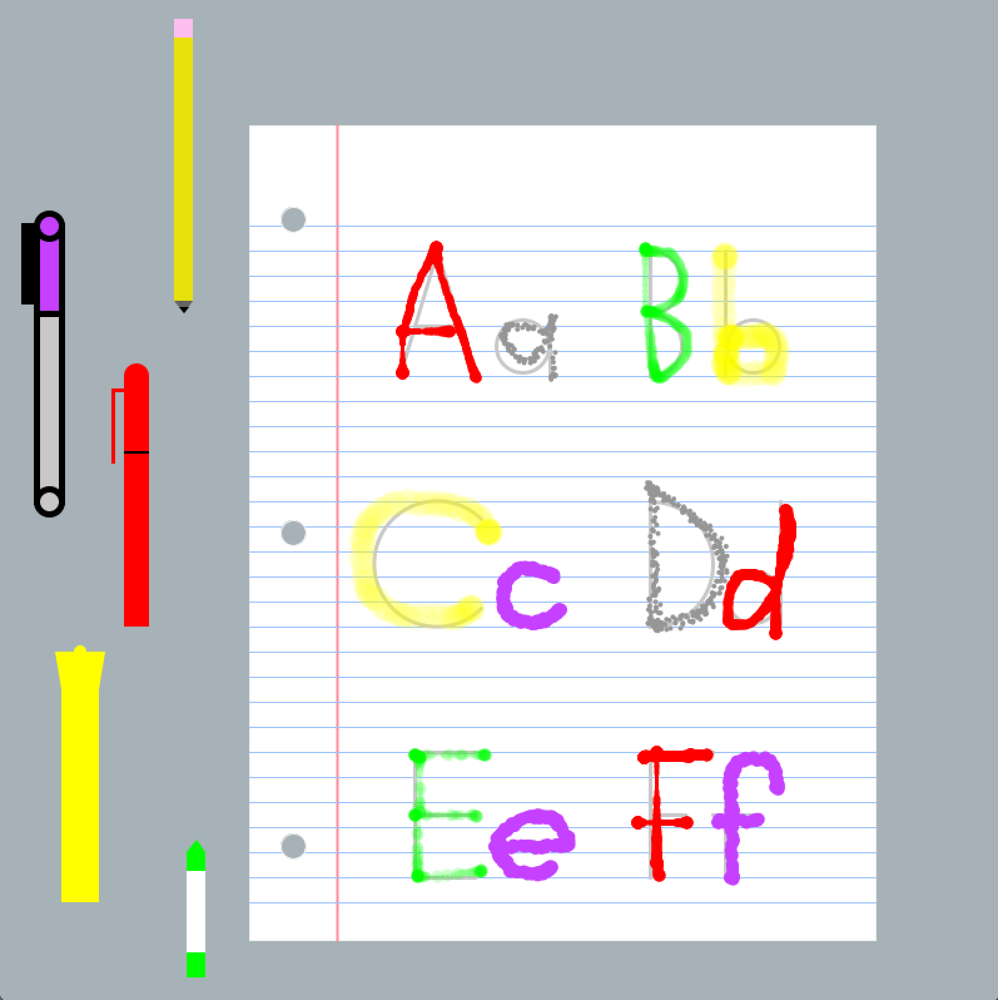
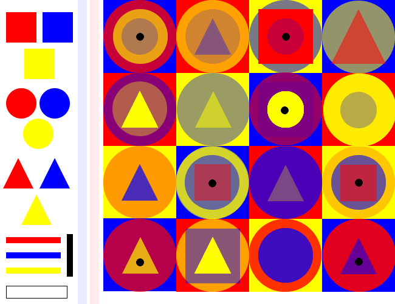
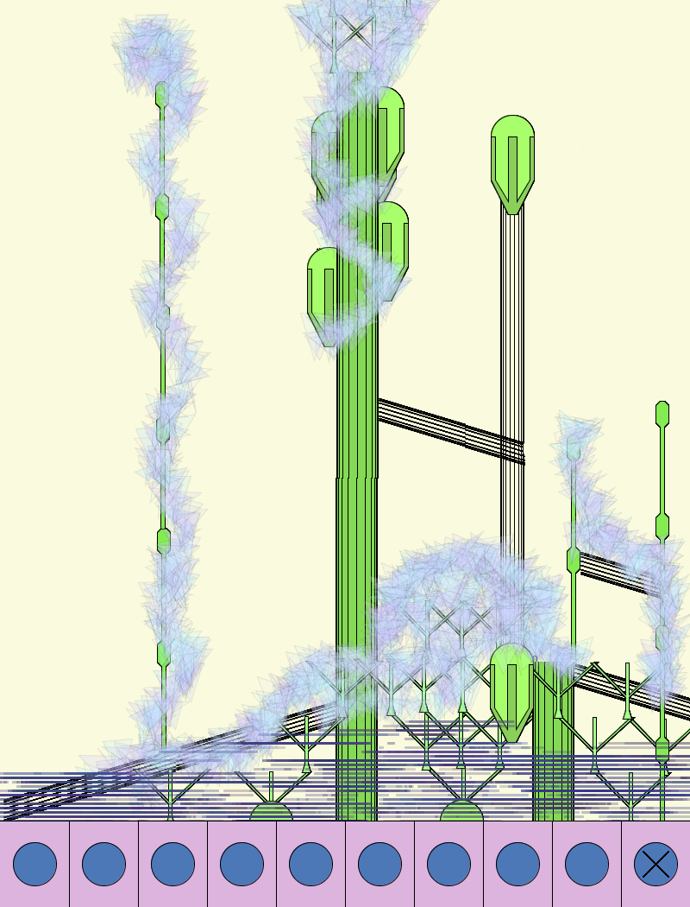

## Sketch #4: Interface

For this sketch, you will create a software painting interface using code. To get started, think about programs like [MacPaint](https://en.wikipedia.org/wiki/MacPaint), where the "user" can choose from multiple brushes with the mouse and use them to draw on the open canvas. However, your approach should reflect an artistic purpose for your own use or for someone else. For example, imagine the difference between interfaces for artists with a [street-art aesthetic](https://www.google.com/search?q=graffiti&tbm=isch) using spray-paint brushes, or a [futurist](https://www.google.com/search?q=future+interface&tbm=isch) interface, or maybe one for someone who is [color blind](https://en.wikipedia.org/wiki/Color_blindness), or a [bird](https://en.wikipedia.org/wiki/Bird_vision#Light_perception), or [underwater](http://thedivingblog.com/colors-underwater/).

Along with your code and [3-sentence statement](../../resources/statement_guidelines.md), you should supply an image that you have created to demonstrate the capabilities of your interface. Your interface must include at least four different "brushes" or ways of interacting. For crit, you will swap interfaces with each other.

### Examples

   
Campbell Moriarty, <i>Kindergarten</i> (2024) 

   
Olivia Mezzetti, <i>Polygon Palette</i> (2024) 

   
William Ranyard, <i>Archigram</i> (2024) 

