# Interface

### Mouse variables and additional events

We're already familiar with the event handlers `setup()` and `draw()`. Now we'll add `mouseClicked()`, and `keyTyped()`. In addition, Processing supplies a few **magic variables** that keep track of changing conditions. These include `mouseX`, `mouseY`, `mousePressed`, `key`, and `keyPressed`. We don't need to assign any values to these variables, as Processing will constantly update them in the background.

Combining event handlers and magic variables allows us to build interfaces in our sketches that can respond to the mouse and keyboard.

### draw(), mouseX, and mouseY

Let's draw a circle inside `draw()`:

<p align="center">
  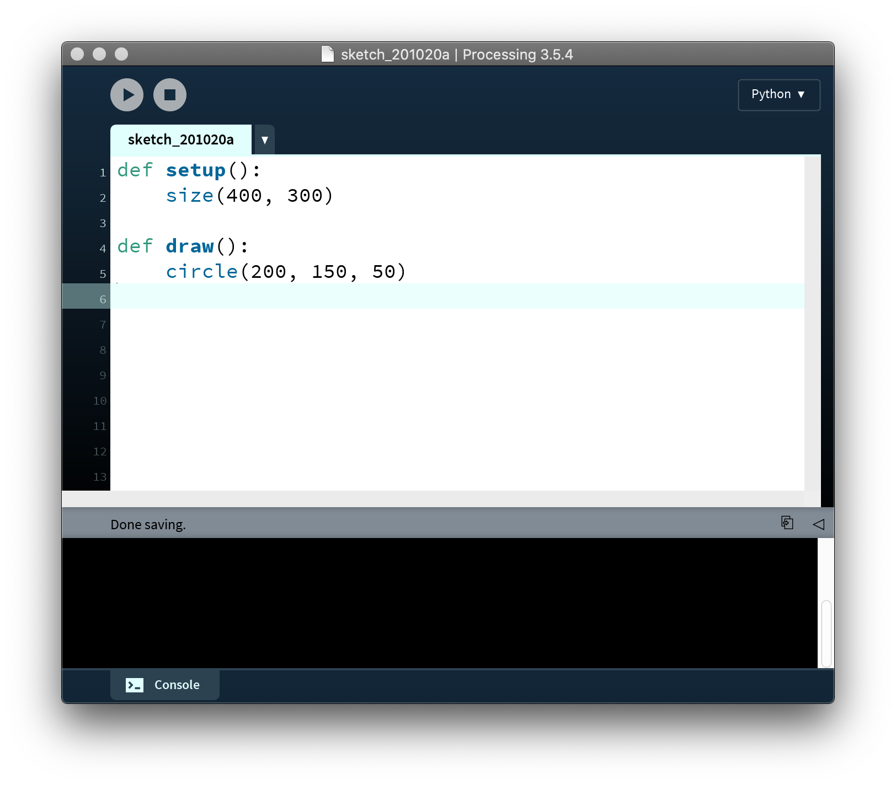<br />
</p>

<p align="center">
  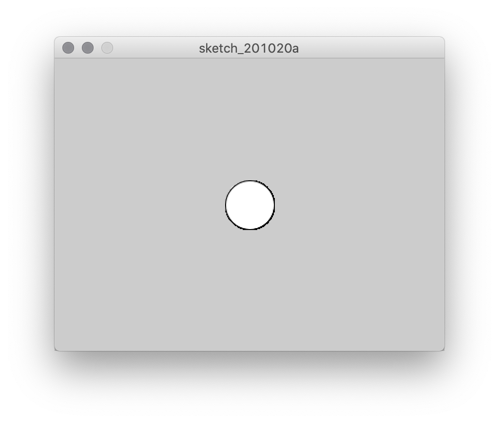<br />
</p>

We know that even though we can't see it, `draw()` is running 30 times every second, drawing circle upon circle upon circle at 200, 150.

However, what if we drew the circle at `mouseX`, `mouseY` instead? These two variables track the mouse, so they are always set to the coordinates of whatever pixel the cursor is currently hovering above. If the mouse is moving, every time `draw()` is called, those coordinates will be different, and the circle will be drawn at a different location.

```py
def setup():
    size(400, 300)

def draw():
    circle(mouseX, mouseY, 50)
```

<p align="center">
  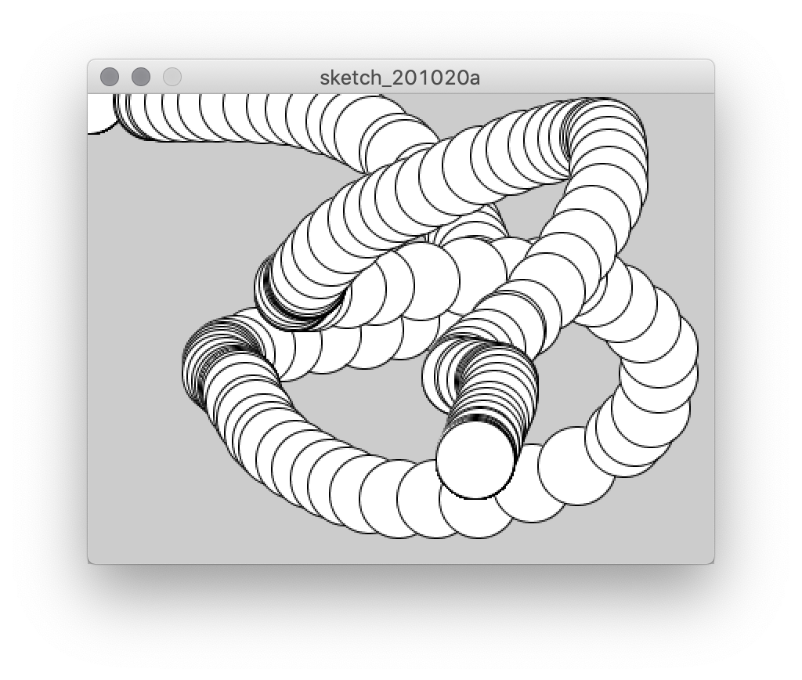<br />
</p>

Suddenly, this feels much more like a canvas, in the sense that it is interactive. Notice that unlike with our emergence sketch, we're not clearing the background every frame—that's what makes it possible for us to work with the trace.

This code draws a circle whenever the mouse is over the canvas, but if we want to add greater control, we could make it draw only when the mouse button is pressed. This is where the variable `mousePressed` comes in—it is either `True` or `False`, and so we can combine it with a conditional to get the desired effect:

```py
def setup():
    size(400, 300)

def draw():
    if mousePressed == True:
        circle(mouseX, mouseY, 50)
```

<p align="center">
  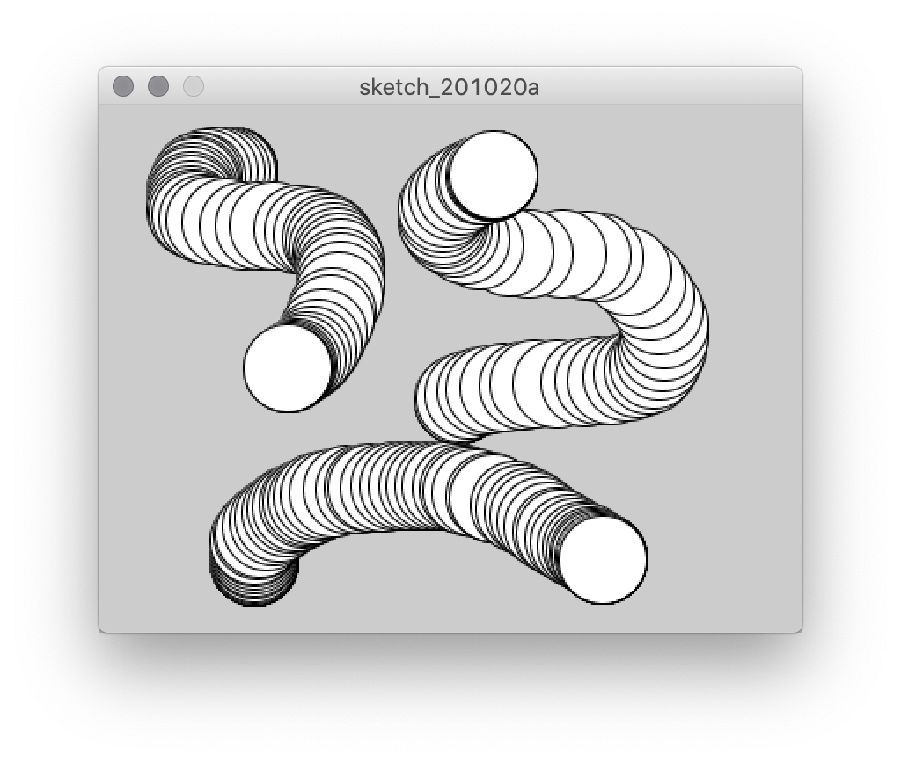<br />
</p>


### mouseClicked() and comparison operators

Of course, _clicking_ the mouse is a fundamental part of contemporary interfaces. Unlike detecting if the mouse button is pressed as the pointer moves across the canvas, a click is a discrete event triggered when the button is pressed and released in the same location. This gets it's own event handler function, `mouseClicked()` (note that `draw()` must also be present for this to work properly):


```py
def setup():
    size(400, 300)

def draw():
    square(10, 10, 30)

def mouseClicked():
    print(mouseX, mouseY)
```

To demonstrate, when you click on the canvas with this sketch, you'll see the coordinates of the click printed out in the console:

<p align="center">
  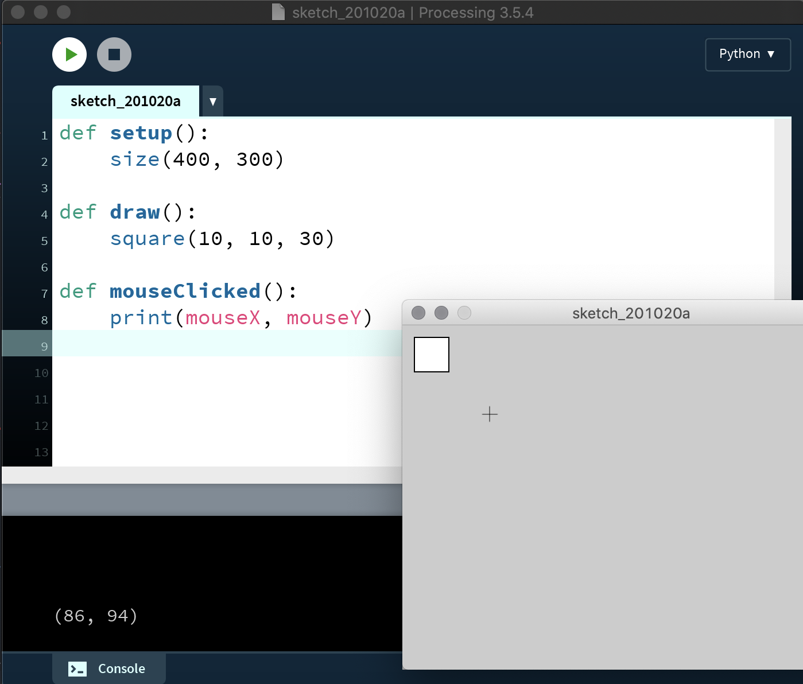<br />
</p>

We also have a square drawn to the canvas, and one thing that `mouseClicked()` is good for is determining whether we have clicked inside it.

To do so, we'll use a conditional and check whether the coordinates of the click are within the coordinates of the square. We've already used the `and` keyword within `if` statements to combine multiple conditions. Now, we'll also need some additional **comparison operators**:

- `>` greater than
- `<` lesser than

The upper-left corner of our square is located at the coordinates 10, 10, and it is 30 pixels wide and tall. Therefore, if we have clicked inside the square, both `mouseX` and `mouseY` need to be greater than 10 and less than 40 (10 + 30). We write it like this:

```py
def setup():
    size(400, 300)

def draw():
    square(10, 10, 30)

def mouseClicked():
    if mouseX > 10 and mouseX < 40 and mouseY > 10 and mouseY < 40:
        print("The square was clicked!")
```

When this program is running, it's constantly checking to see if the mouse has been clicked. If it has, it compares the coordinates in `mouseX` and `mouseY` against coordinates that match those of the square drawn above. If they fall within the given range, the `print()` statement is called.

How about more than one square?

```py
def setup():
    size(400, 300)


def draw():

    # red square
    fill(255, 0, 0)
    square(10, 10, 30)

    # green square
    fill(0,255, 0)
    square(10, 50, 30)

    # blue square
    fill(0, 0, 255)
    square(10, 90, 30)


def mouseClicked():
    if mouseX > 10 and mouseX < 40 and mouseY > 10 and mouseY < 40:
        print("The red square was clicked!")
    elif mouseX > 10 and mouseX < 40 and mouseY > 50 and mouseY < 80:
        print("The green square was clicked!")
    elif mouseX > 10 and mouseX < 40 and mouseY > 90 and mouseY < 120:
        print("The blue square was clicked!")
```

<p align="center">
  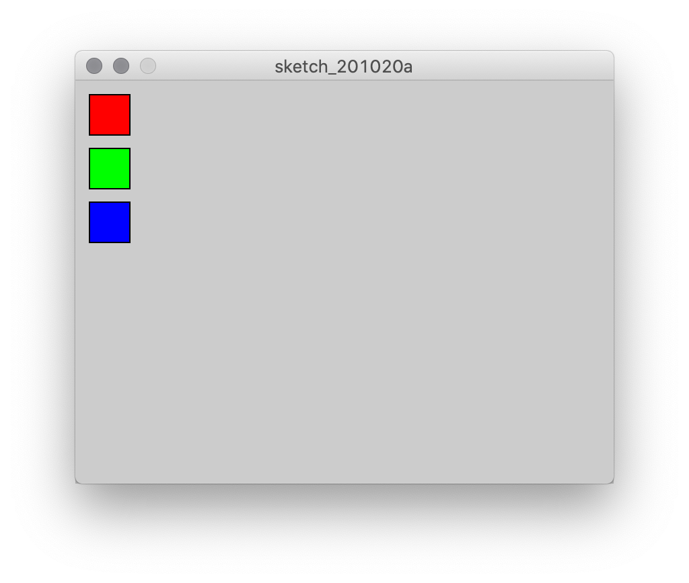<br />
</p>

Look carefully at the numbers in the conditions for `mouseClicked()`, particularly for the y axis. Whereas the squares are all in the same horizontal location, we've had to work out where to begin and end our conditions for each button vertically—we start with the square's y coordinate, and then add 40 for the size of the square.

### Keeping track of things with variables

What emerges is the capacity to build a basic interface of clickable buttons. If we were to combine our previous example using `mouseClicked()` with the first one that draws things at the location of the mouse, we could change between different "brushes" using buttons. The only ingredient that is missing is a global variable to tie the two together.

We'll declare such a global variable, `brush`, at the top of the sketch from the previous example. Then, instead of just print statements inside the `mouseClicked()` conditionals, we'll set this variable to a descriptive string:

```py
brush = "red_circle" # intialize to default value

def setup():
    size(400, 300)


def draw():

    # red square
    fill(255, 0, 0)
    square(10, 10, 30)

    # green square
    fill(0,255, 0)
    square(10, 50, 30)

    # blue square
    fill(0, 0, 255)
    square(10, 90, 30)


def mouseClicked():

    global brush    # indicate that we're using the global variable

    if mouseX > 10 and mouseX < 40 and mouseY > 10 and mouseY < 40:
        print("The red square was clicked!")
        brush = "red_circle"
    elif mouseX > 10 and mouseX < 40 and mouseY > 50 and mouseY < 80:
        print("The green square was clicked!")
        brush = "green_circle"
    elif mouseX > 10 and mouseX < 40 and mouseY > 90 and mouseY < 120:
        print("The blue square was clicked!")
        brush = "blue_circle"
```

Now, whenever a button is clicked, the variable `brush` changes value.

This doesn't do anything on its own, and note that strings like "green_circle" are essentially arbitrary labels so that we can keep track of things within the code. To _actually draw_ a green circle, we'll need to add that code to the `draw()` function.

Previously, we drew to the canvas using the following:
```py
    if mousePressed == True:
        circle(mouseX, mouseY, 50)
```

We want to keep the `mousePressed` condition, so we are going to do a **nested `if` statement**:
```py
    if mousePressed == True:

        if brush == "red_brush":
            fill(255, 0, 0)
            circle(mouseX, mouseY, 50)

        elif brush == "green_brush":
            fill(0, 255, 0)
            circle(mouseX, mouseY, 50)

        elif brush == "blue_brush":
            circle(mouseX, mouseY, 50)
```
We now have three different options for what to draw in response to mouse movement, although the only different here is the different color value within fill. But it could be anything.

With this `if`-inside-of-an-`if`, we have to really be careful about indentation. Note how everything is indented under the first `if`, and those statements that apply to each brush are indented under the second set of conditionals. And all of this is be indented under the `draw()` function definition.

The complete example:
```py
# global variable to keep track of the brush
# initialize with a default setting or None to require a click
brush = None

def setup():
    size(400, 300)


def draw():

    global brush
    ## first draw shapes in response to mouse movement:
    if mousePressed == True:

        if brush == "red_circle":
            fill(255, 0, 0)
            circle(mouseX, mouseY, 50)
        elif brush == "green_circle":
            fill(0, 255, 0)
            circle(mouseX, mouseY, 50)
        elif brush == "blue_circle":
            fill(0, 0, 255)
            circle(mouseX, mouseY, 50)

    ## draw the buttons afterwards so they'll stay on top:

    # red square
    fill(255, 0, 0)
    square(10, 10, 30)

    # green square
    fill(0,255, 0)
    square(10, 50, 30)

    # blue square
    fill(0, 0, 255)
    square(10, 90, 30)


def mouseClicked():
    global brush    # indicate that we're using the global variable

    if mouseX > 10 and mouseX < 40 and mouseY > 10 and mouseY < 40:
        print("The red square was clicked!")
        brush = "red_circle"
    elif mouseX > 10 and mouseX < 40 and mouseY > 50 and mouseY < 80:
        print("The green square was clicked!")
        brush = "green_circle"
    elif mouseX > 10 and mouseX < 40 and mouseY > 90 and mouseY < 120:
        print("The blue square was clicked!")
        brush = "blue_circle"
```

<p align="center">
  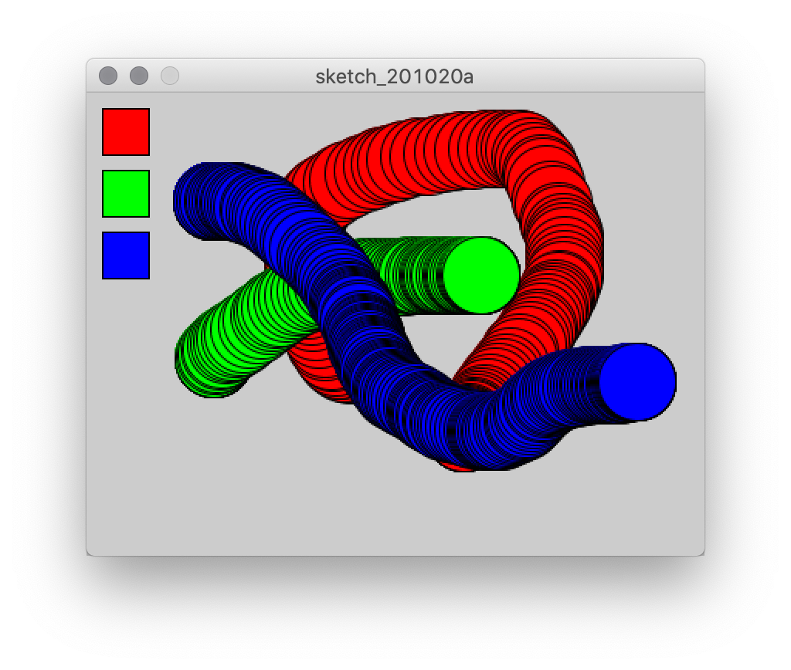<br />
</p>

The layering here is also important. Every time `draw()` is called, it first draws the brush at the mouse location, and then it redraws the buttons. This ensures that the buttons will always be on top.


### The keyboard

The keyboard works similarly to the mouse. `keyPressed` is `True` or `False` depending on whether a key is down. And every time a key is typed, `keyTyped` is called. The magic variable `key` keeps track of what key is active.

Given that, we could rewrite the previous example without the buttons, and use keys instead:

```py
brush = None # if the brush starts as None, we need to type a key first

def setup():
    size(400, 300)


def draw():
    global brush
    ## first draw a circle in response to mouse movement
    if mousePressed == True:

        if brush == "yellow_square":
            fill(255, 255, 0)
            square(mouseX, mouseY, 50)
        elif brush == "cyan_square":
            fill(0, 255, 255)
            square(mouseX, mouseY, 50)
        elif brush == "magenta_square":
            fill(255, 0, 255)
            square(mouseX, mouseY, 50)


def keyTyped():

    global brush    # indicate that we're using the global variable

    print(key)
    if key == "y":
        brush = "yellow_square"
    elif key == "c":
        brush = "cyan_square"
    elif key == "m":
        brush = "magenta_square"

```

<p align="center">
  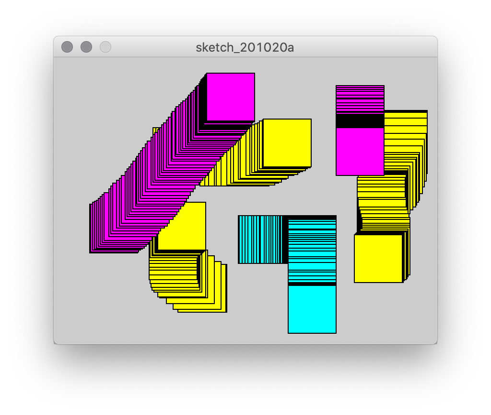<br />
</p>

### Making brushes

Structurally, this setup offers a lot of possibilities—by tracking the mouse, detecting button presses, adding keyboard commands, and using the mouse, all sorts of expressive interfaces might be constructed. But it is the visual aesthetics of the buttons and brushes that will make it interesting.

Within `draw()` and an `if` statement, our brushes thus far have consisted of a color and a shape:
```py
fill(255, 255, 0)
square(mouseX, mouseY, 50)
```

...but they could also use lines to make a calligraphy effect:
```py
stroke(0, 0, 0, 50)
line(mouseX - 20, mouseY - 20, mouseX + 20, mouseY + 20)            
```
<p align="center">
  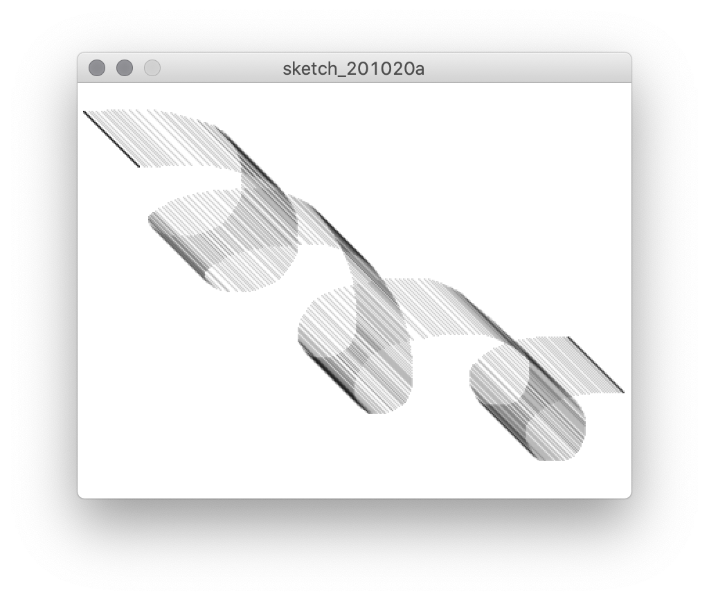<br />
</p>

This is a good moment to remember what `random()` can do for us—by adding some element of indeterminacy, it can create texture:
```py
line(mouseX, mouseY, mouseX + random(-30, 30), mouseY + random(-30, 30))
```
<p align="center">
  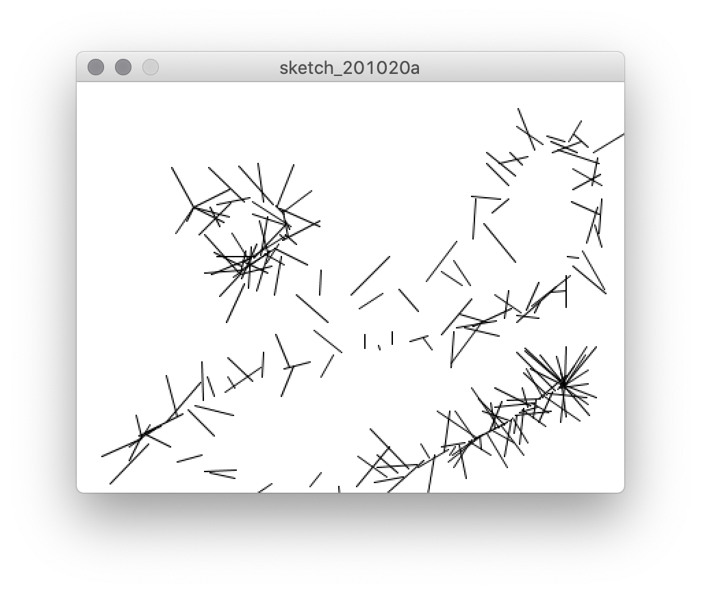<br />
</p>

We have a line that is drawn from the position of the mouse to a random point within 30 pixels in either direction. While we still have general control over the gesture of the brush, the computer gives us a more textured result.

A similar example might use color and transparency:

```py
noStroke()
fill(random(255), random(255), random(255), 150)
circle(mouseX + random(-20, 20), mouseY + random(-20, 20), random(2, 30))            
```

<p align="center">
  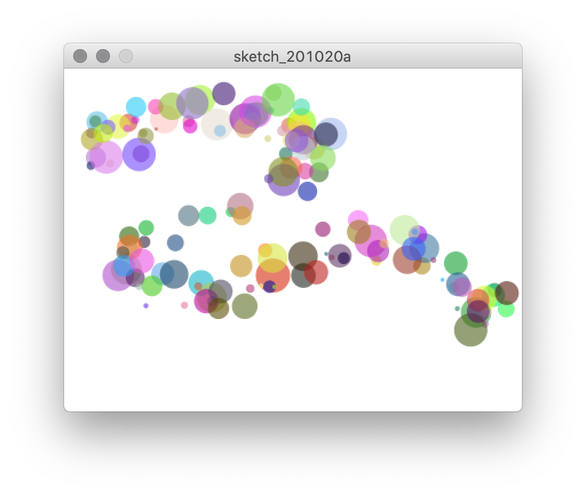<br />
</p>

A more advanced possibility is to use a global variable. In the complete example below, there is a clever use of `if` statements such that `anchor_x` and `anchor_y` are set to the coordinates where the mouse is first pressed—subsequently moving the mouse draws lines back to that point.

```py
anchor_x = -1    # initialize global variables to -1
anchor_y = -1

def setup():
    size(400, 300)
    background(255)

def draw():
    global anchor_x
    global anchor_y
    if mousePressed == True:    
        if anchor_x < 0 and anchor_y < 0:  # initial press
            anchor_x = mouseX
            anchor_y = mouseY          
        else:   # the mouse is being dragged
            stroke(0, 0, 0, 50)
            line(mouseX, mouseY, anchor_x, anchor_y)
    else:
        # if the mouse isn't pressed, re-initialize variables
        anchor_x = -1
        anchor_y = -1
```

<p align="center">
  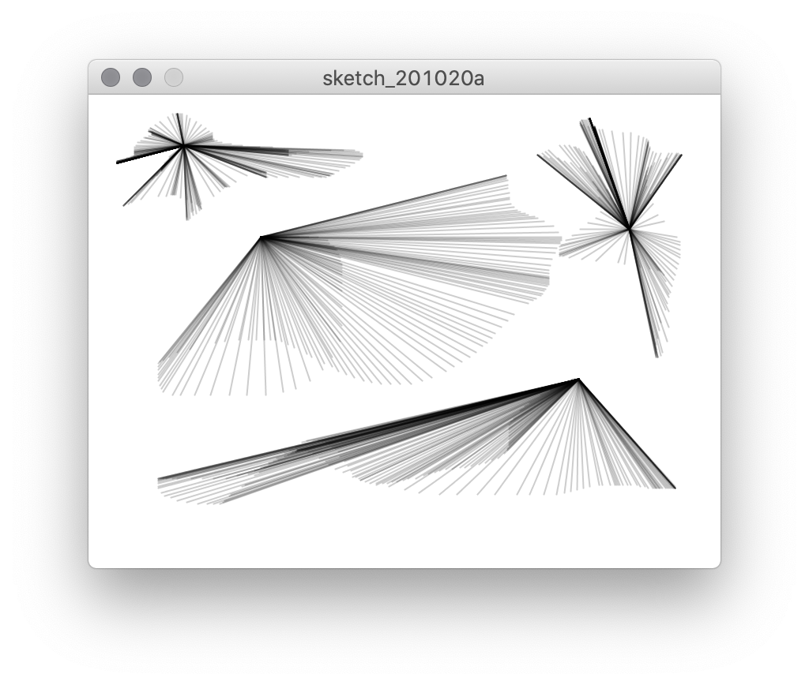<br />
</p>

To create a pixelated effect, we might take `mouseX` and `mouseY` and round them to the nearest number evenly divisible by 10. An easy way to do this is to just divide the number by 10, which in Python will produce an integer, and multiply it by 10 again:

```py
def setup():
    size(400, 300)
    background(0)   # black background

def draw():
    if mousePressed == True:    
        stroke(0)   # black square border
        fill(random(200), random(200), 255) # random bluish color
        x = (mouseX / 10) * 10  # round to nearest 10
        y = (mouseY / 10) * 10 # round to nearest 10
        square(x, y, 10)
```


<p align="center">
  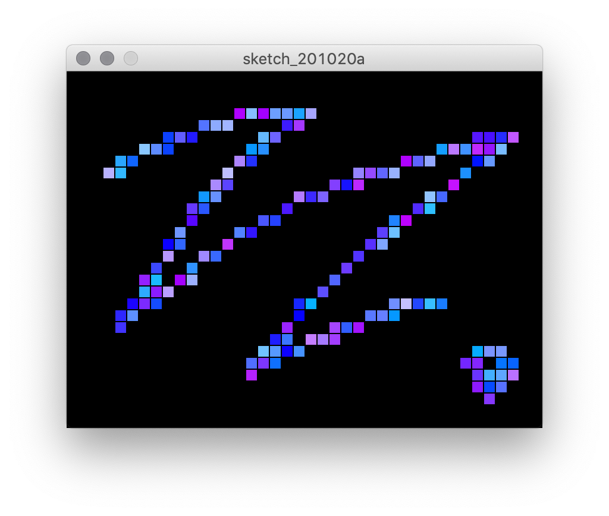<br />
</p>

There are endless possibilities for brushes you might make when you combine interface logic with drawing techniques.

Note that in these examples, a white or black background is set within `setup()`, but of course it could be any color. Pro tip: to make an eraser, make a brush with a fill set  to the same color.

### Saving the canvas

One last detail that you'll need: the ability to save. Fortunately, Processing makes this easy with the `save()` function. Just put this inside an event, whether it is a save button that is clicked or a particular letter that is typed:

```py
def setup():
    size(400, 300)

def draw():
    if mousePressed == True:
        fill(255, 255, 0)
        triangle(mouseX, mouseY, mouseX - 10, mouseY + 15, mouseX + 10, mouseY + 15)

def keyTyped():
    if key == "s":
        save("output.png")
        print("Saved output.png")
```

As before, the resulting image file will be within the sketch folder.
