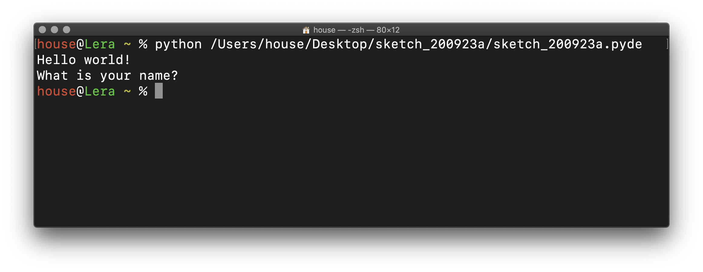
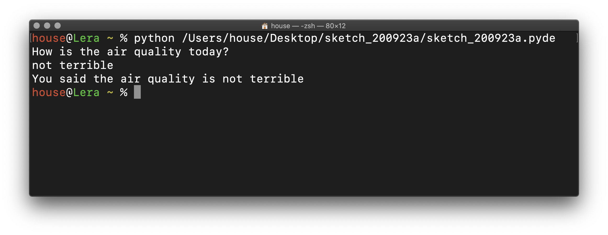
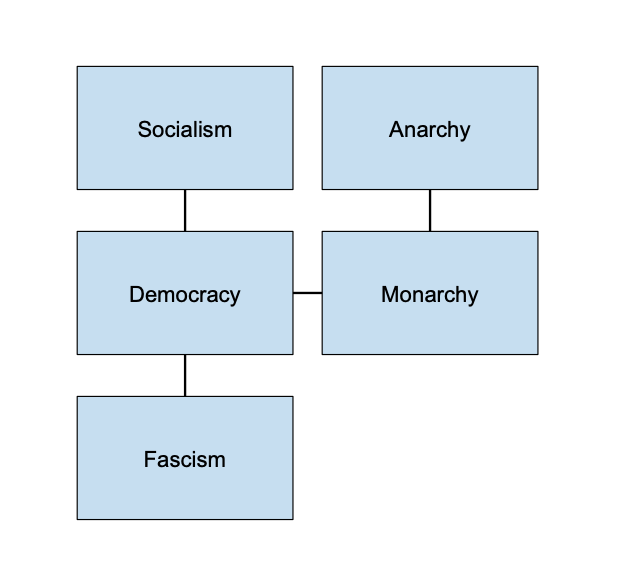

# Nonlinearity

Though we've repeated small blocks of code with loops, so far the code we've written has more or less proceeded linearly down the page. While this is sufficient for producing static images, programs that incorporate time and interactivity need to be structured in a way that can respond dynamically. We're going to take a break from graphics to explore nonlinearity first using text.

If you haven't already, [get started with the terminal](getting_started.md) before continuing here.

### Text input and variables

To begin, let's consider text. From debugging our graphics programs, we're already familiar with `print()`, which we can use with the terminal as well:

```py
print("Hello world!")
print("What is your name?")
```
<p align="center">
  
</p>

...but to be able to answer the question, we need to use the `raw_input()` function:
```py
print("Hello world!")
print("What is your name?")
name = raw_input()
```

`raw_input` captures whatever the person at the keyboard types, which is a **string** of text just like `"Hello world!"`. However, we don't know exactly what text it is, because the person could have typed anything.

That's where **variables** come in. In the code above, the variable `name` is a placeholder for whatever string comes out of `raw_input()` (the name "name" is arbitrary—we can call it whatever we want, as long as it's not a word that is already in use as the name of a function or by another variable).

In this code, `=` sets `name` to the result of `raw_input()`. We can subsequently use `name` elsewhere in our code. For example, using `+` and a few more strings, we can assemble a response:

```py
print("Hello world!")
print("What is your name?")
name = raw_input()
print("Hi, " + name + "!")
```

Here, the strings `"Hi, "` and `"!"` are concatenated on either side of whatever string is represented by `name`.

<p align="center">
  
</p>

The program doesn't end right away anymore—there is a prompt waiting for an answer:

<p align="center">
  
</p>

There's a lot going on in that simple example: we've asked for user input, used a variable to store the response, and concatenated several strings together to produce a dynamic output. But that's not all we can do.

### Conditionals

What's most exciting about variables is that they open up the possibility of our programs doing different things depending on the input. For example:

```py
print("Is the air quality good today?")
answer = raw_input()

if answer == "yes":
    print("That's a relief!")
else:
    print("Oh no!")
```

Here, the `if` keyword sets up a test. If `answer == "yes"` is in fact true, then the program prints out `"That's a relief!"`, which is indented on the next line. But if that's not what was typed, the program skips to what is indented after `else` instead and prints out `"Oh no!"`.

One thing that's important to note: to _assign_ a variable, we used the `=` symbol, but to _test_ if a variable matched another string, we used the `==` symbol. There's a subtle difference between those two, but it's very easy to mix up.

<p align="center">
  
</p>

This is a very simple example. What if there are more than two answers to a question?

```py
print("How are you today?")
feeling = raw_input()

if feeling == "good":
    print("Great to hear it.")
elif feeling == "bad":
    print("I'm sorry to hear that.")
elif feeling == "ok":
    print("We do what we can.")
else:
    print("I don't know how you feel.")
```

We have to be careful about our indentation here. But you can see that now there `elif` keywords, which is a short way of writing "else if". It means that after the first `if` test, the program goes down the line through all the `elif`s and sees if any of them are true. If they are, the program executes the appropriate indented code. If not, it will end up at `else` and execute that code instead (you can think of `else` as a default answer). `if`, `elif`, and `else` all work together to structure the flow of the program.

<p align="center">
  
</p>

## Tests on strings

This is starting to feel more dynamic. But the tests remain somewhat rigid, and we can end up with issues like this:

<p align="center">
  
</p>

Both of these tests should have produced different answers. But in the first example, a word we were looking for, "good", was couched in a longer phrase, and so it didn't match exactly. We can fix that by using the `in` keyword instead of the `==` operator:

```py
print("How are you today?")
feeling = raw_input().lower()   # convert input text to lowercase

if "good" in feeling:
    print("Great to hear it.")
elif "bad" in feeling:
    print("I'm sorry to hear that.")
elif "ok" in feeling:
    print("We do what we can.")
else:
    print("I don't know how you feel.")
```

This reworked example tests if the word "good" is contained somewhere in the variable `feeling` (and likewise for the other options), so it is a little more flexible when it comes to extraneous words. We've also added `.lower()` to the end of `raw_input()`, which converts the input to lowercase and prevent the second mixup with cases. This is a new kind of function, because it comes after a period rather than wraps around its input. These are called **methods**, and while we won't cover them extensively, it's good to know that they exist.

<p align="center">
  
</p>

Of course, there might be multiple inputs that should elicit the same response, ie, "good", "great", "excellent" shouldn't all require a unique `elif`. The `or` keyword helps us with this:

```py
print("How are you today?")
feeling = raw_input().lower()

if "good" in feeling or "great" in feeling or "excellent" in feeling:
    print("Great to hear it.")
elif "bad" in feeling or "rough" in feeling:
    print("I'm sorry to hear that.")
elif "ok" in feeling or "fine" in feeling:
    print("We do what we can.")
else:
    print("I don't know how you feel.")
```
Similarly, maybe we want to be sure that two different words are present in the response. We can accomplish that with the `and` keyword:
```py
print("Do you want soup or salad?")
choice = raw_input().lower()

if "soup" in choice and "salad" in choice:
    print("That's right--why pick?!")
elif "soup" in choice:
    print("The bisque is delicious.")
elif "salad" in choice:
    print("Ranch or vinaigrette with that?")
else:
    print("That's not what we're serving.")
```

This code can get a little wordy, but it allows for more flexibility within the program's flow (you can even use parentheses to create complex conditions). Using `if` conditionals like this, we can craft fairly elaborate responses to open ended input. But we still lack one crucial tool for nonlinearity.

<!--
exercise with question and answer
-->

### Functions

In programming, the most fundamental way of organizing code is by grouping it into reusable blocks called **functions**. We've already been using functions, of course, such as `rect()`, `random()`, and `print()`, but these have been written for us.

Making our own functions in Python is similar to how we indent code under a `for` loop or an `if` conditional, except in this case we use the keyword `def`, followed by a unique name. Anything that is subsequently indented is included in the function. For example:

```py
def air_test():
    print("How is the air quality today?")
    quality = raw_input().lower()
    print("You said the air quality is " + quality)
```

The name of this new function is "air_test," but that is an arbitrary choice—just like with variables, you can call a function whatever you want, as long as that name is not already being used by something else in the program.

If you write this code in a sketch and run it, nothing will happen. In order to run the code in `air_test()`, we have to "call," or execute, the function. We do that just by writing the name followed by parentheses on a line by itself:

```py
# declare the function
def air_test():
    print("How is the air quality today?")
    quality = raw_input().lower()
    print("You said the air quality is " + quality)

# call the function
air_test()
```

Now we get a result when we run the sketch:

<p align="center">
  
</p>


Once you define a function, you can reuse it over and over, like with `circle` in your drawings. You can also think of a function as a section of the program that you can return to as needed. Once the function is complete, the program continues with the line after the function call.


### Putting it all together

Variables, conditionals, and functions. Together, we can use them to create nonlinearity in our programs.

But before we continue to write code, consider this abstract diagram of a house, where connections (ie, doors) between rooms are represented by lines:

<p align="center">
  
</p>

A person moving through this house will have different options depending on what room they're in. If they are in the bedroom, the only option is to enter the hallway. But from there, they can go to the living room, the bathroom, or back to the bedroom. To get to the kitchen, they would have to pass through the living room first.

This is a metaphor for how programs are structured with functions and conditionals (in computer science, this is what is known as a [finite state machine](https://en.wikipedia.org/wiki/Finite-state_machine)). Taken more literally, it's also more or less how Will Crowther built _Adventure_.

Each of these rooms can be represented with a function. For example:

```py
def living_room():
    print("You're in the living room. Doors lead to the hallway and to the kitchen.")
    print("Where do you want to go next?")
    response = raw_input("> ").lower()  # adding an argument to raw_input creates a prompt
```

Since the living room is connected to kitchen and the hallway, we'll want to provide those options. And if we get a response that doesn't include anything about a kitchen or hallway, we'll want to provide a default response using `else`:

```py
def living_room():
    print("You're in the living room. Doors lead to the hallway and to the kitchen.")
    print("Where do you want to go next?")
    response = raw_input("> ").lower()
    if "kitchen" in response:
        kitchen()   # call the kitchen function
    elif "hallway" in response:
        hallway()   # call the hallway function
    else:
        print("You can't go there.")
        living_room() # repeat the living room function
```

`kitchen()` and `hallway()` are functions that we haven't written yet. But they will be new parts of the program that represent those rooms. `living_room()` is the function we're already in—when we call it again, we repeat the function over from the beginning.

Here's the hallway:


```py
def hallway():
    print("You're in the hallway. Doors lead to the living room, bathroom, and bedroom.")
    print("Where do you want to go next?")
    response = raw_input("> ").lower()
    if "living room" in response:
        living_room()
    elif "bathroom" in response:
        bathroom()
    elif "bedroom" in response:
        bedroom()
    else:
        print("You can't go there.")
        hallway()
```

With a function for each room of the house and appropriate conditionals, we can navigate through the house by typing:

<p align="center">
  
</p>

This could go on forever, and the exact order isn't determined until the reader inputs text. That makes it a basic example of a nonlinear narrative. Though the content of the text could use some elaboration, notice how the flexibility of the input creates a sense of narrative, and even unintended humor in the responses.

Remember, to start the narrative, you'll need to call a function on a line by itself to kick things off:
```py
living_room()
```
...and if you want the narrative to end somewhere, whether magnificent victory, horrible defeat, or something more subtle, you can just include a function that doesn't call any other functions:
```py
def the_end():
    print("That's all, folks")
```

It may be too late already, but an important thing everyone needs to learn: **type Control-C to exit your program if you get stuck**. You'll need it.

Using functions to represent physical spaces lets us picture how the parts of the program are interrelated. But although _Adventure_ and _Zork_ did it this way, it is not the only option. The "rooms" (or "states") could correspond to topics of conversation, or a character's moods, or a medical diagnosis, or a events in a soccer match.

<p style="float:left;">
  
</p>

<p style="float:left;">
  
</p>

<p style="">
  
</p>


<!--

create a map

-->

### Keeping track of things with global variables

In the code above, variables are only used to temporarily hold a value returned by `raw_input`. However, we can also use **global variables** that span multiple functions in order to keep track of user actions. This is particularly useful when combined with `True` and `False`, a special kind of value in Python called a "boolean."

To demonstrate, consider a nonlinear narrative in which the reader needs a key to unlock a special door. When the program begins, the reader doesn't yet have the key. So at the top of the program, before any functions, we'll create a variable `has_key` and set it to `False` (note that the first letter of `True` and `False` are always capitalized, and we write them without quotation marks):

```py
has_key = False
```

Subsequently, if any of our functions are going to use this global variable, we need to explicitly say so with the `global` keyword:

```py
has_key = False

def basement():
    global has_key  # this function can now use the global variable 'key'
```

We can now add a condition to the possibilities for this room, depending on whether or not the reader already has the key:

```py
has_key = False

def basement():
    global has_key  # this function can now use the global variable 'has_key'
    print("You're in the basement. There is a mysterious door here.")
    print("What do you want to do?")
    response = raw_input("> ").lower()
    if "door" in response and has_key == True:
        mystery_door()
    else:
        print("You can't do that.")
        basement()
```

For the mystery door to open, `"door"` has to be in the response, _and_ `has_key` has to be set to `True`. Otherwise, the option isn't available.

Using `True` / `False` and global variables in this way creates hidden possibilities within the logical structure of the functions / rooms, which is particularly useful for adding puzzles or other game-like aspects to the narrative.

But how does the reader get the key?

Let's add something to the text of a different room (assuming a longer program where these rooms are connected by others), that depends on whether or not the reader already has the key in possession:

```py
has_key = False

def office():
    global has_key  # this function can now use the global variable 'has_key'
    print("You're in an office. A door leads to the hall.")    
    if has_key == False:
        print("There is a key here.")
```

Notice this `if` statement doesn't need an `elif` or even an `else`—it just checks it see if the reader has picked up the key yet. If they haven't, it must be still sitting on the table, so we print out `"There is a key here."`.

Now, we can add the interaction:

```py
has_key = False

def office():
    global has_key  # this function can now use the global variable 'has_key'
    print("You're in an office. A door leads to the hall.")    
    if has_key == False:
        print("There is a key here.")        
    print("What do you want to do?")
    response = raw_input("> ").lower()
    if "hall" in response:
        hall()
    elif "key" in response and has_key == False:
        print("You take the key.")
        has_key = True                  # set has_key to True
        office()
    else:
        print("You can't do that.")
        office()
```

If in response to the question `"What do you want to do?"` the reader types something like `"take key"` and `has_key` is not already set to `True`, then the program will set `has_key` to `True`. It will subsequently repeat the function, this time leaving out the extra text. The outcome might look something like this:

<p>
  
</p>

When (and if) the reader proceeds to the basement, they will then be able to open the door.

Note that the construction of this narrative is as much about the craft of _writing_ as it is about programming. A concept like a key exists somewhere between the variable that keeps track of whether the user has picked it up (`has_key`), the conditional logic of what it makes possible, and the narration of a world that is consistent and intuitive, one in which keys can be taken to unlock doors and in which they don't spontaneously appear or persist (unless, of course, we want them to magically do so).


### A complete example with booelean global variables

```py
# assign starting values for global variables
seen_ghost = False
has_key = False


def intro():
    global first_name           
    print("Welcome to the house!")
    print("What is your name?")
    first_name = raw_input("> ")  
    print("Nice to meet you, " + first_name)
    living_room()


def living_room():
    global first_name
    print("You are in the living room.")
    print("A passageway leads to the kitchen, and a door goes to the hallway.")
    print("What do you want to do, " + first_name + "?")    
    response = raw_input("> ").lower()
    if "kitchen" in response or "passageway" in response:
        kitchen()
    elif "door" in response or "hallway" in response:
        hallway()
    else:
        print("You can't do that!")
        living_room()


def bedroom():
    global has_key
    print("You are in the bedroom.")
    print("A door leads back to the hallway.")
    print("There is a large locked chest of drawers here.")
    response = raw_input("> ").lower()
    if "hallway" in response:
        hallway()
    elif ("open" in response or "chest" in response or "drawers" in response) and has_key == False:
        print("You can't open the chest of drawers without a key.")
        bedroom()
    elif "chest" in response and has_key == True:
        chest()
    else:
        print("You can't do that!")
        bedroom()


def chest():
    global first_name
    print("You are looking in the chest of drawers.")
    print("Inside, a note says: \"I'm watching you, " + first_name + ".\"")
    print("You die of fright!")
    exit()  # ends the program


def hallway():
    print("You are in the hallway.")
    print("Doors lead to the bedroom, to the bathroom, and to the living room.")
    response = raw_input("> ").lower()
    if "bedroom" in response:
        bedroom()
    elif "bathroom" in response:
        bathroom()
    elif "living" in response:
        living_room()
    else:
        print("You can't do that!")
        hallway()


def bathroom():
    global has_key
    print("You are in the bathroom.")
    print("The only exit is to the hallway.")
    if has_key == False:
        print("There is a key here.")
    response = raw_input("> ").lower()
    if "hallway" in response:
        hallway()
    elif "key" in response:
        print("You take the key.")
        has_key = True
        bathroom()
    else:
        print("You can't do that!")
        bathroom()


def kitchen():
    global seen_ghost
    print("You are in the kitchen.")
    print("A passageway leads back to the living room.")    
    if seen_ghost == False:
        print("There is a strange light glowing here and the faint image of an old man.")
        seen_ghost = True    
    response = raw_input("> ").lower()
    if "living" in response:
        living_room()
    else:
        print("You can't do that!")
        kitchen()


intro()
```

### Using global variables to measure progress

Another use of global variables is to keep track of the reader's progress in some way. For example, how many "moves" they have made so far, how many moves they have left, how many points they have earned, or how much "health" is remaining.

In these cases, we want to use a number, not a boolean. Say that we only want to give the reader 5 moves to find some water to drink—if they don't, they'll pass out from thirst no matter what location they're in.

To do this, we'll first declare a variable `moves` that is set to `5`:

```py
moves = 5

```

Now, in each of our functions we'll declare this variable as a global and decrement it. In Python, to increment a number, we use `+=`, and to decrement we use `-=`. Additionally, we'll also do a conditional test: if the number of moves drops below zero, we'll transport the reader to a special state:

```py
moves = 5

def dune():
    global moves
    moves -= 1
    if moves < 0:
        pass_out()
    print("You're on a dune. No drinkable water here.")
    response = raw_input("> ").lower()
    if "north" in response:
        beach()
    elif "west" in response:
        swamp()
    else:
        print("Nothing this way but more dunes.")
        dune()

def beach():
    global moves
    moves -= 1
    if moves < 0:
        pass_out()    
    print("You're at a beach. No drinkable water here.")
    response = raw_input("> ").lower()
    if "south" in response:
        dune()
    else:
        print("The beach goes on and on.")
        beach()    

def swamp():
    global moves
    moves -= 1
    if moves < 0:
        pass_out()    
    print("You're in a swamp. No drinkable water here.")
    response = raw_input("> ").lower()
    if "east" in response:
        dune()
    elif "south" in response:
        spring()
    else:
        print("Will this swamp never end?")
        swamp()    

def spring():
    print("You found a spring! Drink up.")
    exit()

def pass_out():
    print("You have passed out from thirst!")
    exit()

dune()

```

This example would need to be fleshed out with some narrative flourishes and better navigation, but it shows how we're keeping track of the number of moves the reader has left and intervening in the narrative if they drop below zero. A similar approach could be used for other mechanics: is the character getting harmful radiation from a laboratory? experiencing increasing lonliness? competing with an AI for points? or maybe the day is turning to night? or history is running backwards?

One further detail: if we want to tell the reader how many moves, or points, or whatever they have left, we can do so like this:

```py
print("You have " + str(moves) + " moves left.")
```

Note the use of the function `str()`. This converts a number into a string. The need for this may feel counterintuitive, but Python wants to be sure that you're concatenating strings together as opposed to adding numbers together, and `str()` will tell it.

However, we could also use an `if` statement to be more narrative about it. This is a more advanced option, but could have an interesting result. For example:

```py
if moves == 4:
    print("You're starting to get thirsty.")
elif moves == 3:
    print("Your tongue feels like sandpaper, you need water.")
elif moves == 2:
    print("You're starting to get dizzy.")
elif moves == 1:
    print("You're crawling on the ground now.")
elif moves == 0:
    print("You desperately crawl forward.")
else:
    pass_out()
```

To get this to work, we would have to put this inside every function, for example:

```py
def beach():
    global moves
    moves -= 1
    print("You're at a beach. No drinkable water here.")    
    if moves == 4:
        print("You're starting to get thirsty.")
    elif moves == 3:
        print("Your tongue feels like sandpaper, you need water.")
    elif moves == 2:
        print("You're starting to get dizzy.")
    elif moves == 1:
        print("You're crawling on the ground now.")
    elif moves == 0:
        print("You desperately crawl forward.")
    else:
        pass_out()    
    response = raw_input("> ").lower()
    if "south" in response:
        dune()
    else:
        print("The beach goes on and on.")
        beach()   
```

However, doing so would really produce a lot of repetition in our code and make things unweildy. A better option would be to encapsulate these options in another, special function:


```py
def thirst_level():
    global moves
    if moves == 4:
        print("You're starting to get thirsty.")
    elif moves == 3:
        print("Your tongue feels like sandpaper, you need water.")
    elif moves == 2:
        print("You're starting to get dizzy.")
    elif moves == 1:
        print("You're crawling on the ground now.")
    elif moves == 0:
        print("You desperately crawl forward.")
    else:
        pass_out()
```

We can now check the thirst level just by calling the function. This is a slightly different use of functions than the others we've been making, as it's not a "room" per se. But it is a means of organizing our code.

Here's how that plays out:

```py
moves = 5

def thirst_level():
    global moves
    if moves == 4:
        print("You're starting to get thirsty.")
    elif moves == 3:
        print("Your tongue feels like sandpaper, you need water.")
    elif moves == 2:
        print("You're starting to get dizzy.")
    elif moves == 1:
        print("You're crawling on the ground now.")
    elif moves == 0:
        print("You desperately crawl forward.")
    else:
        pass_out()

def dune():
    global moves
    moves -= 1
    print("You're on a dune. No drinkable water here.")
    thirst_level()
    response = raw_input("> ").lower()
    if "north" in response:
        beach()
    elif "west" in response:
        swamp()
    else:
        print("Nothing this way but more dunes.")
        dune()

def beach():
    global moves
    moves -= 1
    print("You're at a beach. No drinkable water here.")
    thirst_level()
    response = raw_input("> ").lower()
    if "south" in response:
        dune()
    else:
        print("The beach goes on and on.")
        beach()    

def swamp():
    global moves
    moves -= 1
    print("You're in a swamp. No drinkable water here.")
    thirst_level()
    response = raw_input("> ").lower()
    if "east" in response:
        dune()
    elif "south" in response:
        spring()
    else:
        print("Will this swamp never end?")
        swamp()    

def spring():
    print("You found a spring! Drink up.")
    exit()

def pass_out():
    print("You have passed out from thirst!")
    exit()  # don't forget this! otherwise, the narrative will continue

dune()
```

```
You're on a dune. No drinkable water here.
You're starting to get thirsty.
> go west
You're in a swamp. No drinkable water here.
Your tongue feels like sandpaper, you need water.
> go west
Will this swamp never end?
You're in a swamp. No drinkable water here.
You're starting to get dizzy.
> go north
Will this swamp never end?
You're in a swamp. No drinkable water here.
You're crawling on the ground now.
> go south
You found a spring! Drink up.
```
