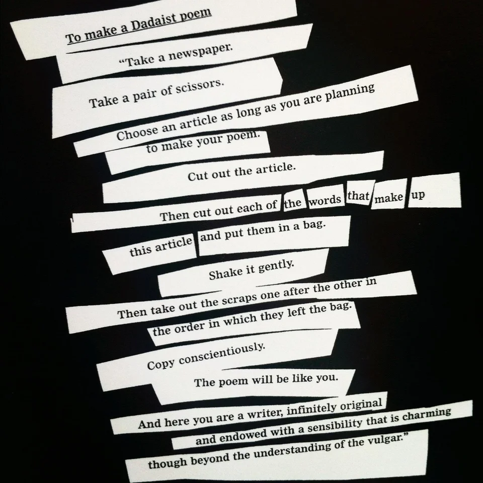
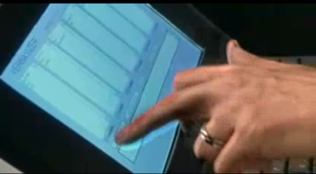

## Concept

Digital media are always composed of discrete elements—from 1s and 0s on the most fundamental level of digital representation, to the characters of text or the samples of audio, to the files and folders that comprise an operating system. Though these elements are always of a finite number, it is the way that they can be combined and recombined that results in (practically) limitless possibilities.

Of course, this property is also intrinsic to non-electronic systems—most notably, perhaps, the alphabet, through which the expressive potential of entire cultures is produced through the reordering of letters (just 26 in the case of English). But digital media excel at enumerating through all of the possibilities and finding ones that we might never have otherwise come up with. Like with nonlinear narrative, this property of recombination tasks the artist-programmer with designing a system for generating all potential versions, rather than only one particular version, and letting the computer plumb its limits.

## Context

### Non-digital

Practices by avant-garde artists and poets have prefigured some of the combinatory powers of computers, particularly when it comes to manipulating language. Just like with indeterminacy in visual art, the Dadaists applied their scissors and chance-based operations to words:

<p align="center">
  <br />
  Tristan Tzara, "To Make a Dadist Poem" (1920)
</p>

This "cut-up" technique was popularized in the mid-20th century by the well-known beat poet and provocateur [William S. Burroughs](https://en.wikipedia.org/wiki/William_S._Burroughs) (1914–1997), together with his friend, artist Brion Gysin (1916–1986). Burroughs' novel _The Soft Machine_ (1961), for example, was entirely constructed of a different text, _The Word Hoard_, that Burroughs had written in the years prior. Burroughs sliced up the earlier text and rearranged it to create the new novel, suggesting that the process helped reveal the "true meaning" of the original.

<p align="center">
  <br />
  William S. Burroughs, pieces of <i>The Word Hoard</i> (1954–1958)
</p>

Subsequently, Burroughs' influence on the counter-culture has led to the cut-up technique being used by artists from punk writer [Kathy Acker](https://en.wikipedia.org/wiki/Kathy_Acker) (_Blood and Guts in High School_ (1978)) to Thom Yorke of Radiohead, who pulled lyrics out of a hat for the album [_Kid A_](https://en.wikipedia.org/wiki/Kid_A) (2000). Experimental turntablist DJ Spooky, That Subliminal Kid takes his name from a Burroughs character and has [theorized the parallels](https://theinfluencers.org/en/dj-spooky) between the cut-up technique and DJ culture.

<p align="center">
  <br />
  DJ Spooky performing in 2013
</p>

The French literary group Oulipo (founded in 1960) is also notable for exploring combinatoric logic in their writing. "Oulipo" is short for the French for "workshop of potential literature" and the group blurs the lines between poetry and puzzle in their pieces. For example, Georges Perec used a "story-making machine" in which the narrative is guided by [algorithmic combinations of people, feelings, and objects](http://tselfoninternets.blogspot.com/2010/04/stuff.html) for his novel [_Life: A User's Manual_](https://en.wikipedia.org/wiki/Life:_A_User%27s_Manual) (1978); for _A Void_ (1969) he wrote a 300-page book that does not contain the letter "e."

However, the work that perhaps most directly expresses the spirit of the Oulipo is Raymond Queneau's _A Hundred Thousand Billion Poems_ (1961).

<p align="center">
  <br />
  The sliced pages of Raymond Queneau's <i>A Hundred Thousand Billion Poems</i> (1961) — watch <a href="https://www.youtube.com/watch?v=2NhFoSFNQMQ">here</a>.
</p>

The work consists of 10 [sonnets](https://en.wikipedia.org/wiki/Sonnet) with the same rhyme pattern, with the pages of each sonnet cut between each of their 14 lines. By manually flipping each of the resulting strips, each of the 10 possibilities for each line can be combined with any other, yielding 100,000,000,000,000 (10^14) possible poems. Part of the brilliance of this piece is that if you choose a particular poem and read it, you are likely to be the only person ever to read that poem.


### Digital

Text can be manipulated by code in ways reminiscent of the cut-up or Oulipo strategies, albeit with somewhat less mess.

One example comes from pop musician and cultural icon [David Bowie](https://en.wikipedia.org/wiki/David_Bowie). In the 1990s, Bowie and collaborator Ty Roberts created the [Verbasizer](https://www.vice.com/en_us/article/xygxpn/the-verbasizer-was-david-bowies-1995-lyric-writing-mac-app), which automizes the cut-up technique to produce lyrics. Bowie: "what you end up with is a real kaleidoscope of meanings and topic and nouns and verbs all sort of slamming into each other."

<p align="center">
  <br />
  Bowie using the Verbasizer.
</p>

Taking things a step further, the digital media artist [Allison Parrish](https://www.decontextualize.com) is known for her work creating algorithmic literature. Her book _Our Arrival_ (2015) for instance, draws source material from [Project Gutenberg](https://www.gutenberg.org), a collection of novels in the public domain. Parrish selects and recombines sentences from this source according to a set of criteria that make it a meditation on the natural world.

Taking things online, Darius Kazemi applies some of the same techniques toward the construction of [Twitter bots](https://en.wikipedia.org/wiki/Twitter_bot). Whereas bots are often a hazard of disinformation online, Kazemi's bots are alternately clever, poignant, or sarcastic, such as [Roof Slapping Bot](https://twitter.com/RoofSlappingBot) or [Which One Bot](https://twitter.com/WhichOneBot) which combine phrases found from various online sources.

One final piece uses some basic text analysis to produce a kind of data visualization: Luke DuBois' [_Hindsight is Always 20/20_](https://learninglab.si.edu/collections/hindsight-is-always-20-20/p7A3AxJofG9Uy4mT) takes the State of the Union addresses from each US President and arranges them on a traditional eye chart according to the most commonly used words:

<p align="center">
  <br />
  <i>Hindsight is Always 20/20</i>: Abraham Lincoln
</p>

<p align="center">
  <br />
  <i>Hindsight is Always 20/20</i>: George W. Bush
</p>

## Code:


### Working with strings and lists

We are already familiar with strings from the previous sketch. Consider this one:

```py
sentence = "I find this piece to be a great example of art."
```

We also know that variables that are strings have certain built-in capabilities; for example, we know that `sentence.lower()` will make all of the characters in the string lowercase (btw, functions like this that are attached to objects—ie, they come after a dot—are called **methods**).

Another example of a string method is `split()`:

```py
sentence = "I find this piece to be a great example of art."
words = sentence.split()
print(words)
```
...which will produce this in the console:
```py
['I', 'find', 'this', 'piece', 'to', 'be', 'a', 'great', 'example', 'of', 'art.']
```

As you can see, `split()` has divided the string at every space, resulting in a **list** of words, called `words`.

A list is a very powerful kind of variable—it's actually more of a meta-variable, because it holds a sequence of other things. These might be numbers, booleans (aka `True`/`False`), strings, or other objects. This list, `words`, currently has 11 items in it, all of them different strings.

We can access items in lists using square brackets and an index number after the list variable name. For example, `words[0]` is the string `I`, `words[1]` is the string `find`, `words[2]` is the string `this`, and so forth.

(Why do lists start with index 0 instead of 1? They just do, and ultimately it is easier this way, although it takes some getting used to.)

Using brackets and index numbers, we can change the value of one of the items in the list:

```py
sentence = "I find this piece to be a great example of art."
words = sentence.split()
words[7] = "questionable"
print(words)
```
```py
['I', 'find', 'this', 'piece', 'to', 'be', 'a', 'questionable', 'example', 'of', 'art.']
```
There's another string method, `join()`, which puts the sentence back together. Awkwardly, however, `join()` is a method of the separator character, and it takes the list as a parameter:
```py
sentence = "I find this piece to be a great example of art."
words = sentence.split()
words[7] = "questionable"
sentence = " ".join(words)  # use a space to join words
print(sentence)
```
```py
I find this piece to be a questionable example of art.
```

Using `split()`, indexes, and `join()`, we've now taken apart a sentence, swapped out a word, and put it back together again.

### Loading lists

Lists can be used for many different things—including loading data from files. For example, included in the template folder for this assignment is a file that contains a list of _isms_. That's right—the names of conceptual art movements and so forth. We can load it like this:

```py
isms = open("isms.txt").read().splitlines()
```
This sequence of methods reads "isms.txt" into memory and splits all of the lines into separate items of a list (try printing it to the console to see).

To randomly select an ism, we'll need a new function—`choice()`. This doesn't come enabled by default, so we have to include a special line at the beginning of our program:

```py
from random import choice   # enables the choice function

isms = open("isms.txt").read().splitlines()

an_ism = choice(isms)
print(an_ism)
```
```
neo-impressionism
```

Returning to our example, we can now take a step toward indeterminacy:

```py
from random import choice

isms = open("isms.txt").read().splitlines()

sentence = "I find this piece to be a great example of art."
words = sentence.split()
words[10] = choice(isms) + "."
sentence = " ".join(words)  # use a space to join words
print(sentence)
```
```py
I find this piece to be a great example of dadaism.
```

With another word list loaded from a text file, adjectives, we can take things further:
```py
from random import choice

adjectives = open("adjectives.txt").read().splitlines()
isms = open("isms.txt").read().splitlines()

sentence = "I find this piece to be a great example of art."
words = sentence.split()
words[7] = choice(adjectives)
words[10] = choice(isms) + "."
sentence = " ".join(words)  # use a space to join words
print(sentence)
```
```py
I find this piece to be a cluttered example of neue slowenische kunst.
```

Might as well fill out the review:

```py
from random import choice

adjectives = open("adjectives.txt").read().splitlines()
adverbs = open("adverbs.txt").read().splitlines()
nouns = open("nouns.txt").read().splitlines()
isms = open("isms.txt").read().splitlines()

# make multi-line strings with triple-quotes
sentence = """
            I find this piece to be a great example of art.
            The lines are straight and the colors seem dull.
            It is, frankly, a normal painting.
            """
words = sentence.split()
words[7] = choice(adjectives)
words[10] = choice(isms) + "." # add a period
words[14] = choice(adjectives)
words[18] = choice(adverbs)
words[19] = choice(nouns) + "."
words[24] = choice(adjectives)
words[25] = choice(nouns) + "."
sentence = " ".join(words)  # use a space to join words
print(sentence)
```
```
I find this piece to be a grubby example of cubo-futurism.
The lines are sweaty and the colors shakily stay.
It is, frankly, a secondary hippopotamus.   
```
Ok, well, it's not perfect. But using a little rudimentary grammar, some word lists, and substituting for a template, we get a pretty interesting critique. Or rather, as many critiques as we could ever want (consider how you might use a `for` loop to accomplish this).

### next
- whole sentences (exhaustive, not random)

load a corpus
sort the sentences alphabetically
sort the sentences by length

all possible haikus

limmerick

### next
- filters + syllables (haiku) -- while keeping track in a loop?
- filters + rhyme (limmerick)
- load a full article
    - scramble the sentences
    - pull parts of speech (cant)


### advanced

Markov
 Project Gutenberg

    https://blog.upperlinecode.com/making-a-markov-chain-poem-generator-in-python-4903d0586957

## Sketch #4

5 different versions generated by the same code
literary or poetic form, such as:


**>> do this before finishing all the examples


## dev

what am I trying to teach about lists?


using word lists madlib style
finding words that rhyme within that
finding words that start with a certain letter (indexing)
paying attention to each line (join and split)
get the number of syllables


markov chain


static mode in app
or take input

rhyming?

random()

rhymes funciton?


http://www.decontextualize.com/teaching/dwwp/chance-operations-simple-models-of-text/

madlibs is concatenation style

https://github.com/DiegoVicen/dandelion

https://pronouncing.readthedocs.io/en/latest/tutorial.html

https://github.com/leonardr/olipy/

https://pypi.org/project/generativepoetry/


what is the output?

lipogram


credit kazemi
