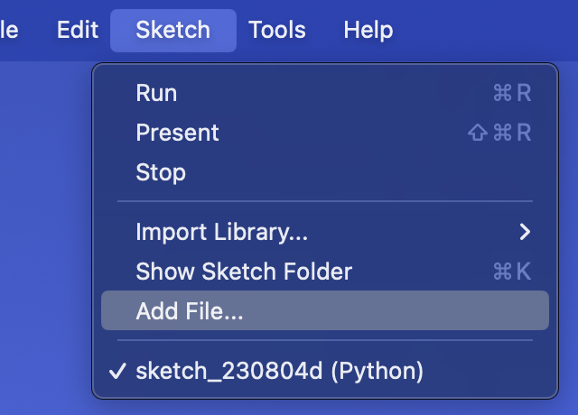
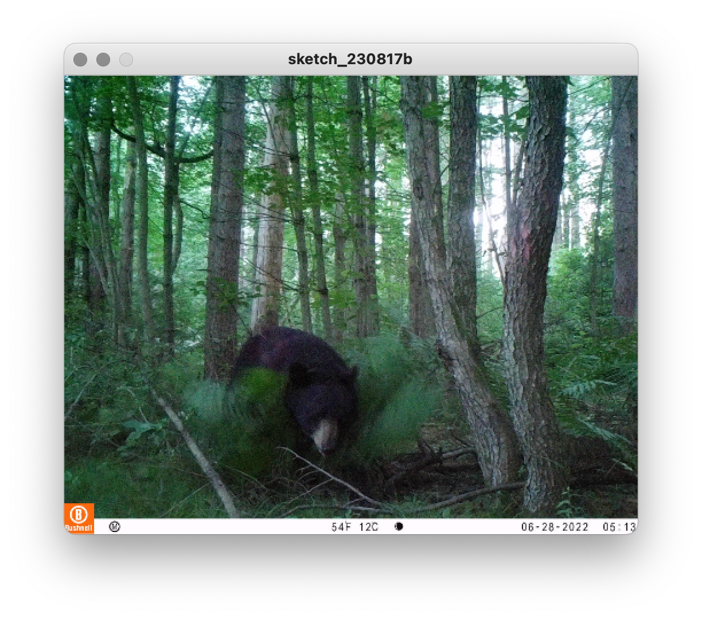
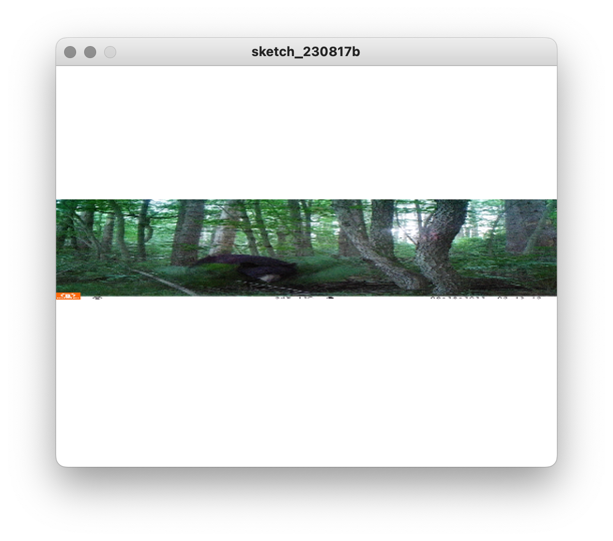
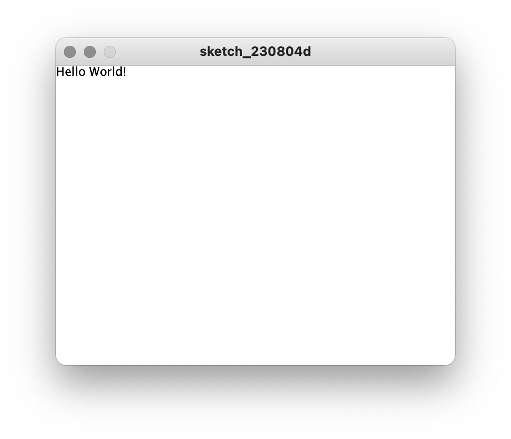
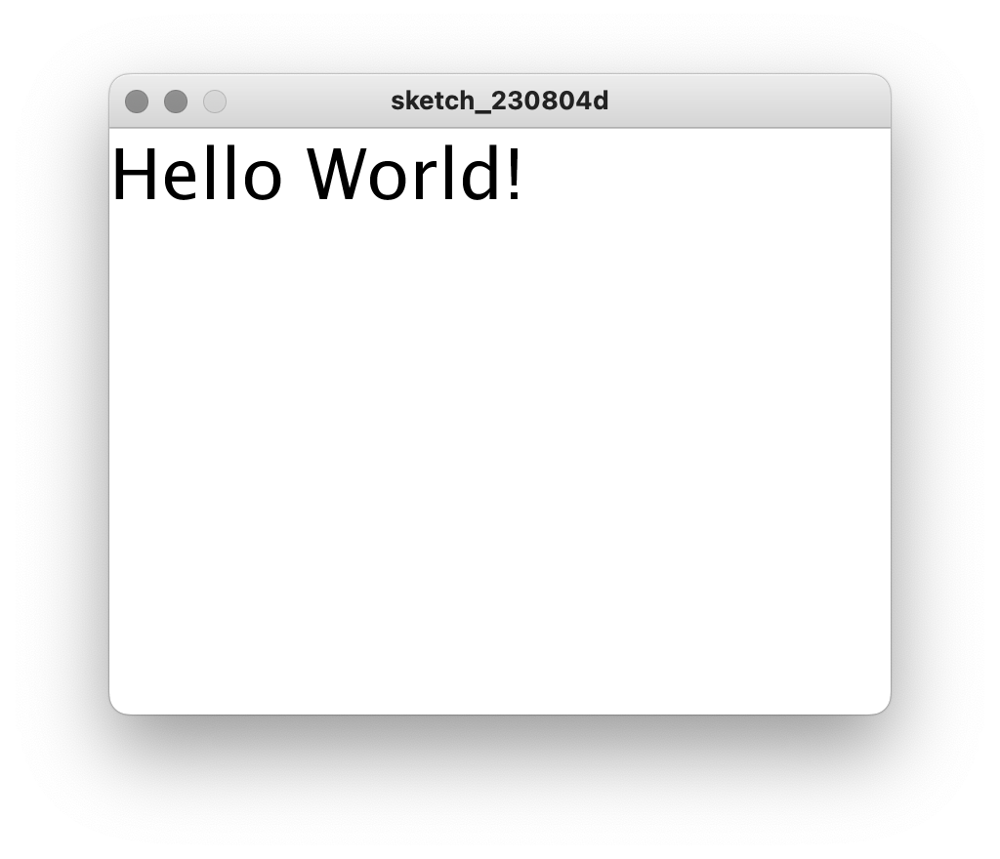
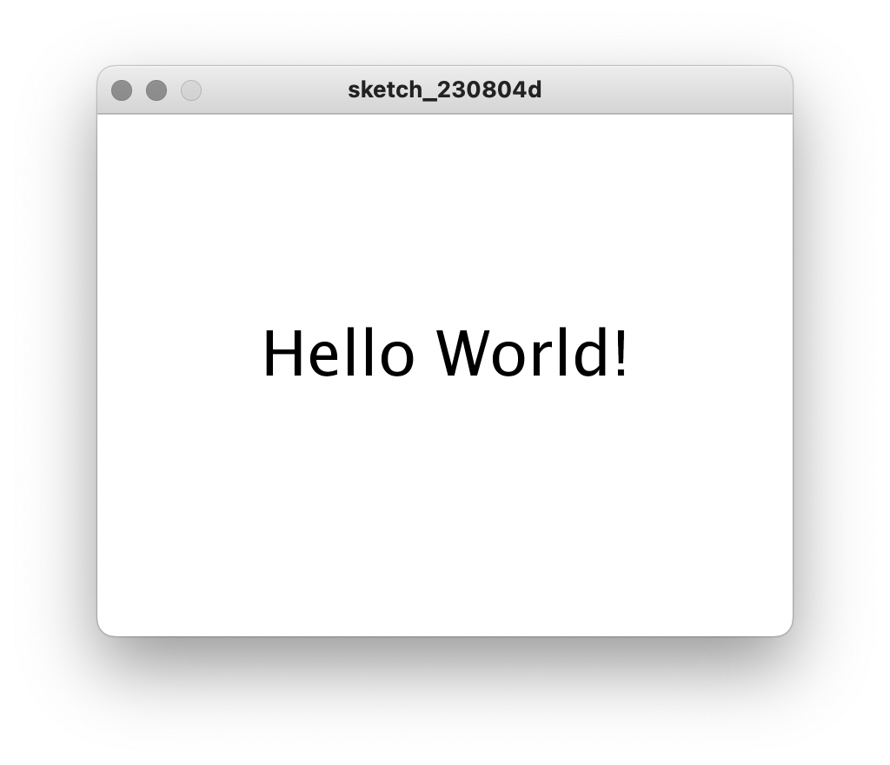
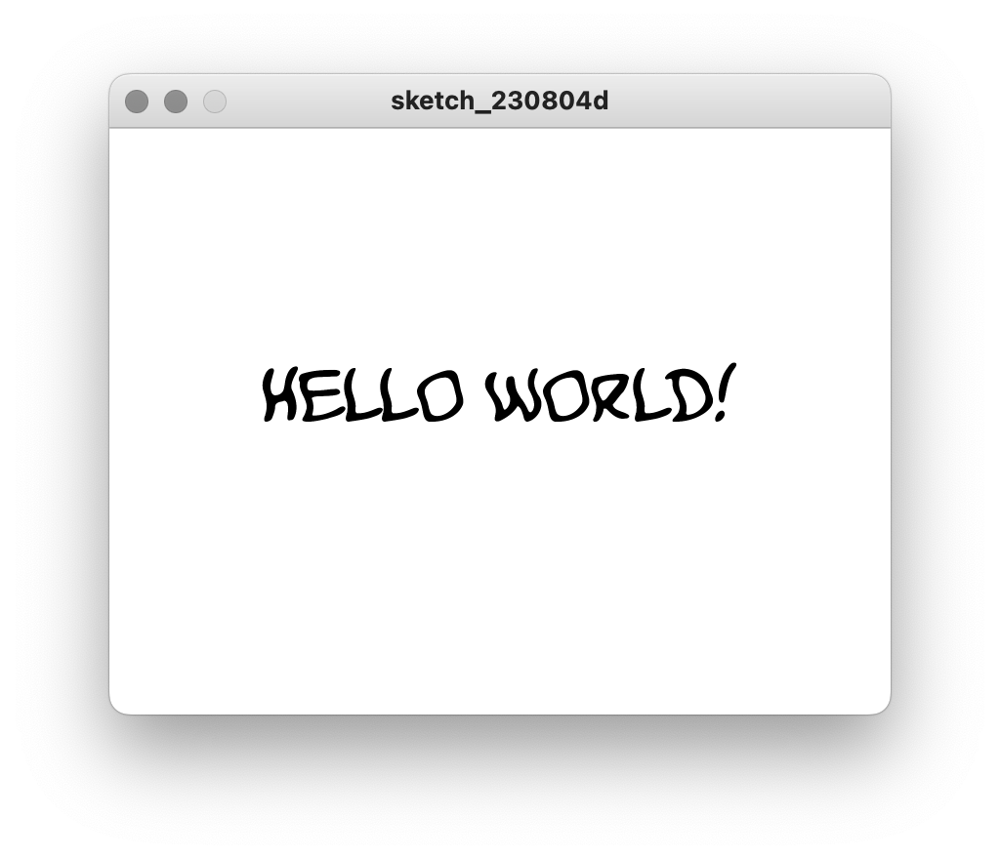
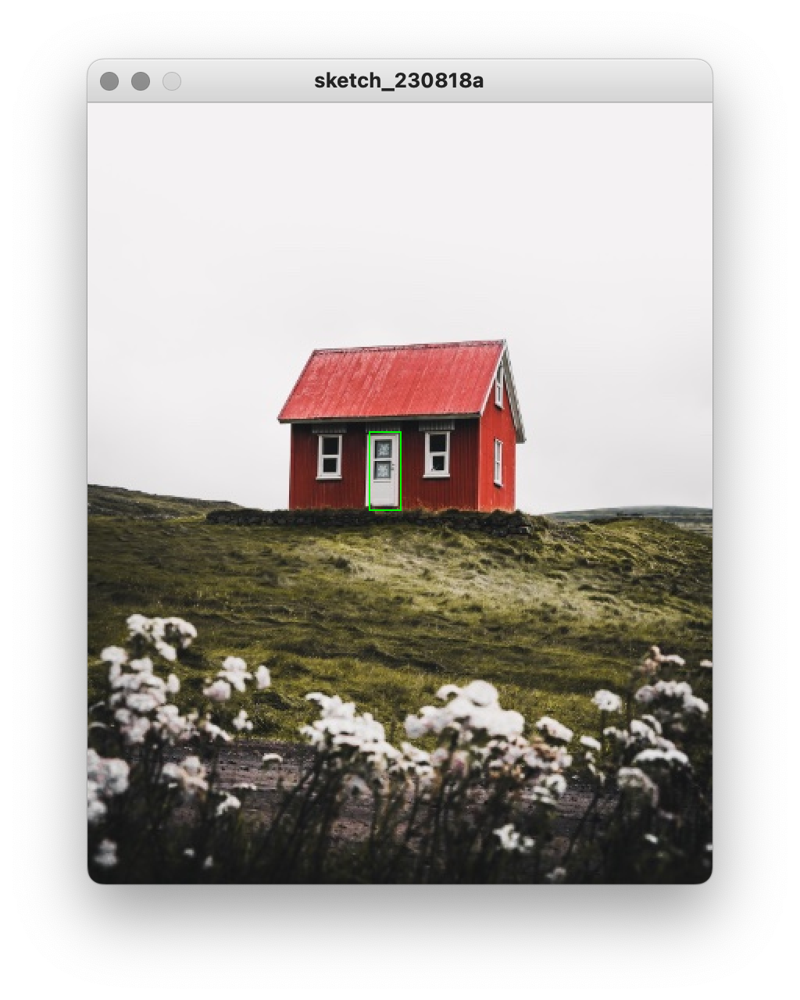
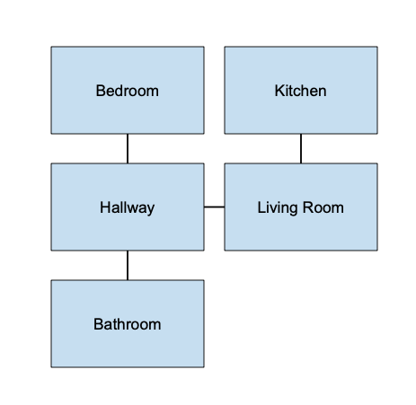
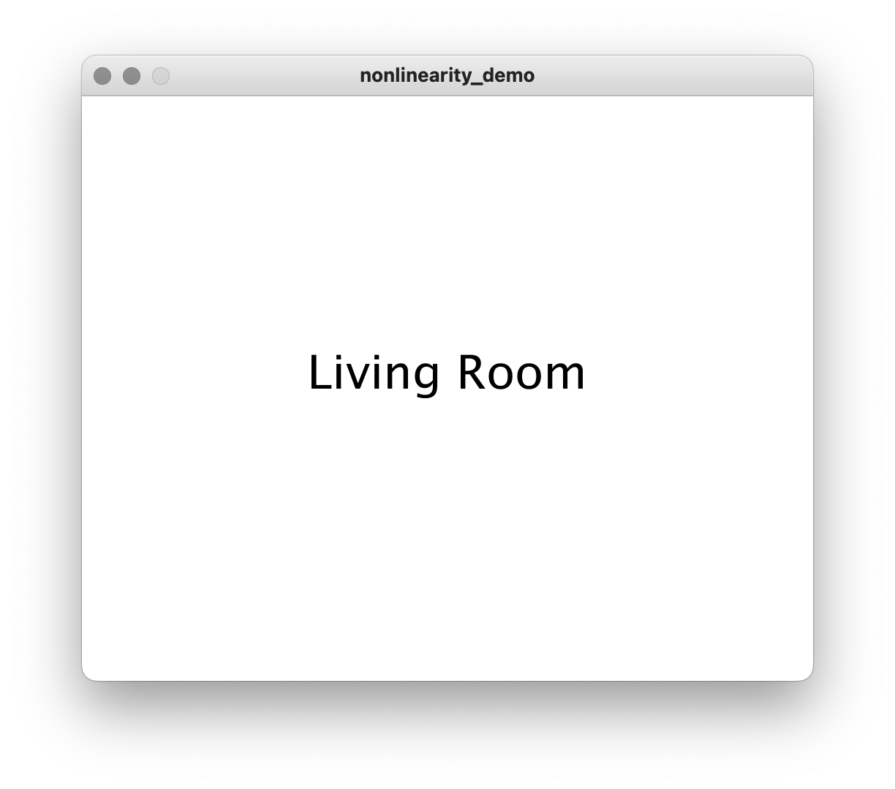

# Nonlinearity

The focus of this unit will be on how to string together functions into nonlinear experiences. But before we get to that, let's introduce a few new materials to work with.


## Images

So far, we've been drawing graphics to the canvas ourselves. But Processing also has the capability of loading in existing images and placing them on the canvas. 

This is a three step process. First, we have to add the image to the sketch. Next, the image data has to be loaded into the sketch within the `setup()` function. Finally, the image is drawn the canvas—repeatedly, using `draw()`.

### Adding an image

To begin, get your image file. It needs to be a .jpg or .png file. It's also a good idea to resize the file ahead of time to the size you'll use in your sketch—too big, and it will make your sketch load slower; too small, and quality will be reduced. If you have a graphics program like Photoshop or Pixelmator, you can change the format and resize using that. Otherwise, Google "image resize" and there are several options online, such as: [imageresizer.com](https://imageresizer.com/). <!-- make people do this with their phones -->

To add your image to your sketch, use "Sketch" —> "Add File..." and navigate to your file.

<p align="center">
  <br />
</p>

Once you do this, nothing will appear to have happened. However, if you do "Sketch" —> "Show Sketch Folder", you'll see that there is a "Data" folder inside it, and inside that, the image (don't add the image to your sketch folder directly; it's better to do it through the interface to make sure all the file paths are correct).

### Loading an image

To load an image into your sketch, use the `loadImage()` function inside the `setup()` function. `loadImage()` takes one argument, which is the exact filename of the image. The image data will be returned so that we can store it in a variable. This should be a global variable in order for us to access it later. Note that loading will take a few milliseconds, depending on how big the image is. 

```py
def setup():
    global bear             # declare "bear" to be global
    size(500, 400)
    bear = loadImage("bear_in_sanctuary.png") 
```

If you run this code and nothing happens (and no errors arise), it works! Image data is now stored within the variable `bear`.


### Displaying an image on the canvas

To display the image, use the `image()` function. This requires 3 arguments: the variable holding the image data, and the x y coordinates of where to place the upper left corner.

```py
def setup():
    global bear
    size(500, 400)
    bear = loadImage("bear_in_sanctuary.png") 

def draw():
    background(255)
    image(bear, 0, 0)
```

<p align="center">
  <br />
</p>

Optionally, we can specify width and height values for the image to change it's size on the fly:

```py
def setup():
    global bear
    size(500, 400)
    bear = loadImage("bear_in_sanctuary.png") 

def draw():
    background(255)
    image(bear, 0, height/3, 500, 100)
```

<p align="center">
  <br />
</p>


You can have many images in your sketch at once. Just be sure to use `loadImage()` within `setup()` and have a global variable for each one. Then you can manipulate them within draw as needed.


## Text

Processing has several built-in functions that allow us to put text on the canvas. The most basic is `text()`, which takes three arguments: the string itself, and an x and y coordinate for where to put the bottom-left corner of the text box. `fill()` designates the color (and the default is white). So to place black text in the upper left corner of our white canvas, we do the following:

```py
def setup():
    size(500, 400)
    pixelDensity(2) 
    
def draw():
    background(255) 
    fill(0)
    text("Hello World!", 0, 10)
```

(If your text looks ragged, try using `pixelDensity(2)`)

<p align="center">
  <br />
</p>

#### Size

To change the size, we use `textSize()` (the default is 12):

```py
def setup():
    size(500, 400)
    pixelDensity(2) 

def draw():
    background(255)     
    fill(0)
    textSize(36)
    text("Hello World!", 0, 36)
```

<p align="center">
  <br />
</p>

#### Alignment

To write from the center or the right, use `textAlign()`. This can be set to `LEFT`, `CENTER`, or `RIGHT`. 

```py
def setup():
    size(500, 400)
    pixelDensity(2) 

def draw():
    fill(0)
    textSize(36)
    textAlign(CENTER)
    text("Hello World!", width/2, height/2)
```

<p align="center">
  <br />
</p>

#### Font

What is a font? A font is a particular size, style (normal, italic), and weight (bold, etc) of a given typeface, rendered as a file. Font formats include .ttf (TrueType) and .otf (OpenType), among others. Processing uses a built-in font by default; to change it, you'll need to download a .ttf or .otf file and add it to your sketch.

<!-- On a Mac, go to the Finder. Then choose "GO" –> "Library" from the menu bar while holding down "Option" (this makes the Library appear).  -->

How do you find a font? While fonts can be very expensive, many are available for free, such as from [https://www.1001freefonts.com](https://www.1001freefonts.com). When you download a typeface, you'll have a folder full of fonts of different variations.

<p align="center">
  <br />
</p>

To add one of these to your sketch, use "Sketch" —> "Add File..." and navigate to a .ttf or .otf file.

<p align="center">
  <br />
</p>

Next, we use the `createFont()` function to load it into Processing—this is similar to the `loadImage()` function. It takes the filename of the font and a size, and it stores the font data in a variable. The size is more or less irrelevant, since we can change it later, but for best quality try to set it to approximately what you'll use—you can list more than one as additional arguments.

`createFont()` should always be called within `setup()`, but you can use `textFont()` anywhere to change fonts on the fly. Just keep in mind that you may need to make a global variable with the font name:

```py
def setup():
    global funky_font
    size(400, 300)
    pixelDensity(2)
    funky_font = createFont("KOMIKAB_.ttf", 36)

def draw():
    background(255)
    fill(0)
    textFont(funky_font)
    textSize(36)
    textAlign(CENTER)
    text("Hello World!", width/2, height/2)
```

<p align="center">
  <br />
</p>


## Helper code and hotspots

### Including helper code

Images and fonts are both external things that we can add to our sketches to give us material to work with. Another thing we can add is code—prewritten files and libraries that add additional functionality that we can work with. 

For this, we're going to add a file called `nonlinearity_helper.py`, which you can download [here](nonlinearity_demo/nonlinearity_helper.py).

Similar to before, use "Sketch" —> "Add File..." and navigate to the code you've downloaded. This time, you should see a new tab appear in your sketch with the name of the file. You can ignore the code that appears—just click back to your main tab.

To use this helper code, we need to add an `import` statement to our main sketch:
```py
from nonlinearity_helper import *
```

Import statements usually come as the very first line of code, but they can also be the last. In this case, we're going to have it as our last line of code.


### Hotspots

This particular helper code allows us to make "hotspots". A hotspot is just an area of the screen, defined by a rectangle. We can check to see if the mouse has been clicked within a hotspot and code our program to respond.

We can create a hotspot by creating a variable and assigning it to four values: x, y, width, height. (As an aside, setting a variable to multiple values simultaneously is a very Python way to do things—it's a shortcut that's not always available in other languages.) 

Hotspots work well with images, so we'll first load an image into our sketch ("house.jpg") and then make a hotspot on top of it. We'll call the hotspot "door":

```py
def setup():
    global house
    size(400, 500)
    house = loadImage("house.jpg") # load the image

def draw():
    image(house, 0, 0)          # draw the image
    door = 180, 210, 20, 50     # new hotspot variable

from nonlinearity_helper import *        
```

To draw the hotspot so we can see it, we can use `draw_hotspot()`. This function will make a green rectangle around the area we've defined—the intention is to use it for testing, so it can be commented out later.

```py
def setup():
    global house
    size(400, 500)
    house = loadImage("house.jpg")

def draw():
    image(house, 0, 0)
    door = 180, 210, 20, 50
    draw_hotspot(door)          # door hotspot is argument

from nonlinearity_helper import *        
```


Finally, we can use the function `check_hotspot()` to detect whether there has been a mouse click within the area of the rectangle. This function returns `True` or `False`, so we can place it within an `if` conditional:

```py
def setup():
    global house
    size(400, 500)
    house = loadImage("house.jpg")

def draw():
    image(house, 0, 0)
    door = 180, 210, 20, 50
    draw_hotspot(door)
    if check_hotspot(door):
        print("Door was clicked!")
            
from nonlinearity_helper import *    
```

<p align="center">
  <br />
</p>


This code simply prints "Door was clicked!" to the console. But anything can go in that code block, especially moving between functions, as we'll see.


## Nonlinearity and functions

Now we get to the crux of the matter: functions.

We've already used several types of functions that Processing provides—drawing the canvas, creating random numbers, checking frames, responding to events, etc. Now we will make our own functions for a slightly different purpose. Together with variables and conditionals, functions allow us to define nonlinear paths.

Before we continue to write code, consider this abstract diagram of a house, where connections (ie, doors) between rooms are represented by lines:

<p align="center">
  
</p>

A person moving through this house will have different options depending on what room they're in. If they are in the bedroom, the only option is to enter the hallway. But from there, they can go to the living room, the bathroom, or back to the bedroom. To get to the kitchen, they would have to pass through the living room first.

This is a metaphor for how programs are structured with functions and conditionals (in computer science, this is what is known as a [finite state machine](https://en.wikipedia.org/wiki/Finite-state_machine)). Taken more literally, it's also more or less how Will Crowther built _Adventure_ or Cyan Studios made _Myst_.

Each of these rooms can be represented with a function. Like this:

```py
def setup():
    size(500, 400)
    pixelDensity(2)
    fill(0)   
    textSize(24)

def bedroom():
    text("Bedroom", 180, height/2)

def kitchen():
    text("Kitchen", 180, height/2)

def hallway():
    text("Hallway", 180, height/2)

def living_room():
    text("Living Room", 180, height/2)

def bathroom():
    text("Bathroom", 180, height/2)
    
from nonlinearity_helper import *    
```

Each room is represented by its own function. At the moment, those functions just display the name of the room (and note how we're making the text box the width of the canvas and using `textAlign()` to center the text within it).

Note that we do not have a `draw()` function. What we'll do instead is use each of the room functions as the draw function, depending on what room we're in, activating only one at a time.

Currently, if you run this code, nothing with happen. But if we give `change_room()` the name of one of our room functions as an argument, that function will become `draw()`. To begin, we'll use `change_room()` within `setup()`:

```py
def setup():
    size(500, 400)
    pixelDensity(2)
    fill(0)   
    textSize(24)
    change_room(living_room) # function name given as argument 

def bedroom():
    text("Bedroom", 180, height/2)

def kitchen():
    text("Kitchen", 180, height/2)

def hallway():
    text("Hallway", 180, height/2)

def living_room():
    text("Living Room", 180, height/2)

def bathroom():
    text("Bathroom", 180, height/2)
    
from nonlinearity_helper import *    
```

<p align="center">
  
</p>

So we start in the living room. Going back to our diagram, the living room is connected to the kitchen and the hallway. Using hotspots, we can provide those options. First, we'll make some text, and put hotspots around them. We just have to play with the parameters of the text boxes and hotspots until it looks right.

One note: be careful not to name a hotspt with the same name as a room function. Since we're using text in this example, we've called them "kitchen_link" and "hallway_link":

```py
def living_room():
    text("Living Room", 180, height/2)
 
    text("Go to kitchen", 20, height-100)
    kitchen_link = 20, height-120, width/3, 20
    draw_hotspot(kitchen_link)
    
    text("Go to hallway", width/2, height-100)
    hallway_link = width/2, height-120, width/3, 20
    draw_hotspot(hallway_link)
```    


Now, we can use `check_hotspot()` together with `change_room()` to make the magic happen. 

```py
def living_room():
    text("Living Room", 180, height/2)
 
    text("Go to kitchen", 20, height-100)
    kitchen_link = 20, height-120, width/3, 20
    draw_hotspot(kitchen_link)
    if check_hotspot(kitchen_link):
        change_room(kitchen)
    
    text("Go to hallway", width/2, height-100)
    hallway_link = width/2, height-120, width/3, 20
    draw_hotspot(hallway_link)
    if check_hotspot(hallway_link):
        change_room(hallway)
```

With this code, clicking on one hotspot or the other will activate either the "kitchen" or the "hallway" function. By adding hotspots to all the functions, we activate the map to create a nonlinear structure.


## Using functions to create standard

Consider a nonlinear adventure game that has 'rooms' corresponding to locations on a deserted island:

```py
def setup():
    size(500, 500)
    pixelDensity(2)
    change_room(dune)

def dune():
    text("You're on a dune. No drinkable water here.", 180, height/2 - 200, 200, 300)
        
def beach():
    text("You're at a beach. No drinkable water here.", width/2, height/2)

def swamp():
    text("You're in a swamp. No drinkable water here.", width/2, height/2)

def spring():
    text("You found a spring! Drink up.", width/2, height/2)
```

For this game, we want to navigate by clicking the cardinal directions on a compass rose: North, South, East, or West. Since this navigation is standard, it needs to be drawn the same in every function. However, that would involve a lot of repeated code. Instead, we can create a function to encapsulate this element, like this:

```py
def compass():
    
    # create some global hotspot variables
    global north, south, east, west     
    north = width/2, height - 100 - 10, 10, 10
    south = width/2, height - 70 - 10, 10, 10
    east = width/2 + 20, height - 95, 10, 10
    west = width/2 - 20, height - 95, 10, 10

    # draw the compass
    fill(0)
    textSize(20)
    textAlign(LEFT)
    text("N", width/2, height - 100)
    text("S", width/2, height - 70)    
    text("E", width/2 + 20, height - 85)
    text("W", width/2 - 20, height - 85)
```

Now we can call our `compass()` function within our room functions, and it will use the standard code to draw the compass rose. We can then test those global hotspots, since when we created them we declared them to be global:

```py
def dune():
    text("You're on a dune. No drinkable water anywhere.", 180, height/2 - 200, 200, 300)
    compass()
    if check_hotspot(north):
        change_room(beach)
    elif check_hotspot(west): 
        change_room(swamp)
```        

However, one problem that arises here is if a room doesn't have an option to go in all four directions. In this example, for instance, what happens if you click "S"?

### Creating arguments

There's many ways we could solve this. One might be to pass arguments to `compass()` to indicate which directions should be shown. 

```py
def compass(show_north, show_south, show_east, show_west):   # create arguments
    
    # create some global hotspot variables
    global north, south, east, west     
    north = width/2, height - 100 - 10, 10, 10
    south = width/2, height - 70 - 10, 10, 10
    east = width/2 + 20, height - 95, 10, 10
    west = width/2 - 20, height - 95, 10, 10

    # draw the compass
    fill(0)
    textSize(20)
    textAlign(LEFT)
    if show_north == True:                           # have conditionals
        text("N", width/2, height - 100)
    if show_south == True:
        text("S", width/2, height - 70)        
    if show_east == True:
        text("E", width/2 + 20, height - 85)
    if show_west == True:
        text("W", width/2 - 20, height - 85)
```

Notice how at the top of the function we list out the arguments that we're expecting. These become variables that we can use in our functions. Below, we're using conditionals to check if each of these variables are True or False, showing the cardinal direction accordingly.

Back in our `dune()` function, we now call `compass()` with a list of True/False values indicating which directions should be shown:

```py
def dune():
    text("You're on a dune. No drinkable water anywhere.", 180, height/2 - 200, 200, 300)
    compass(True, False, False, True)
    if check_hotspot(north):
        change_room(beach)
    elif check_hotspot(west): 
        change_room(swamp)
```    


## Other functions

Our nonlinearity helper also includes a few helper functions that may be useful:

- `go_back()` returns the user to the previous room

- `elapsed(duration)` can be used within a conditional statement to do things after a certain number of frames have elapsed since the room was entered. For example:

```py
def monster():
    text("There's a monster in this swamp! You run back the way you came.", width/2, height/2)    
    if elapsed(100):
        go_back()
```


## Keeping track of things with global variables


## Using global variables to measure progress


