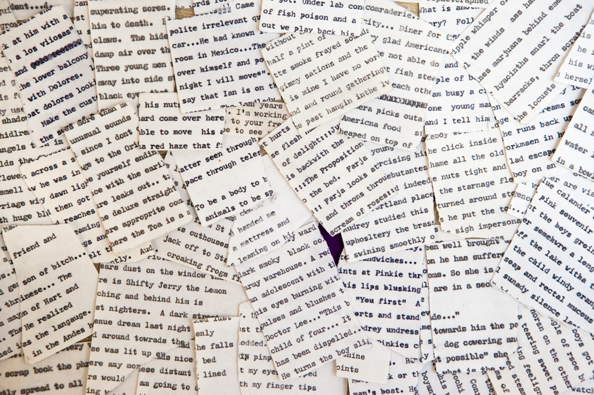
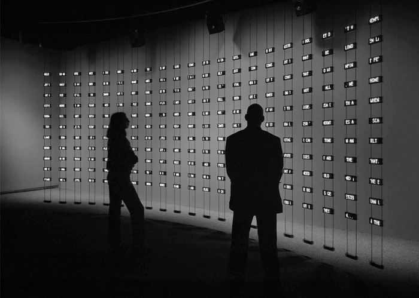

# Recombination

## Concept

Digital media are always composed of discrete elements—from 1s and 0s on the most fundamental level of digital representation, to the characters of text or the samples of audio, to the files and folders that comprise an operating system. Though these elements are always of a finite number, it is the way that they can be combined and recombined that results in (practically) limitless possibilities.

Of course, this property is also intrinsic to non-electronic systems—most notably, perhaps, the alphabet, through which the expressive potential of entire cultures is produced through the reordering of letters (just 26 in the case of English). But digital media excel at enumerating through all of the possibilities and finding ones that we might never have come up with otherwise. Like with nonlinear narrative, this property of recombination tasks the artist-programmer with designing a system for generating potential versions, rather than only one particular version, and letting the computer plumb its limits.

## Context

### Non-digital

Practices by avant-garde artists and poets have prefigured some of the combinatory powers of computers, particularly when it comes to manipulating language. Just like with indeterminacy in visual art, the Dadaists applied their scissors and chance-based operations to words:

<p align="center">
  <br />
  Tristan Tzara, "To Make a Dadist Poem" (1920)
</p>

```
How to Make a Dadaist Poem
(method of Tristan Tzara)
To make a Dadaist poem:

Take a newspaper.
Take a pair of scissors.
Choose an article as long as you are planning to make your poem.
Cut out the article.
Then cut out each of the words that make up this article and put them in a bag.
Shake it gently.
Then take out the scraps one after the other in the order in which they left the bag.
Copy conscientiously.
The poem will be like you.
And here are you a writer, infinitely original and endowed with a sensibility that is charming though beyond the understanding of the vulgar.
--Tristan Tzara
```
This "cut-up" technique was popularized in the mid-20th century by the well-known beat poet and provocateur [William S. Burroughs](https://en.wikipedia.org/wiki/William_S._Burroughs) (1914–1997), together with his friend, artist Brion Gysin (1916–1986). Burroughs' novel _The Soft Machine_ (1961), for example, was entirely constructed of a different text, _The Word Hoard_, that Burroughs had written in the years prior. Burroughs sliced up the earlier text and rearranged it to create the new novel, suggesting that the process helped reveal the "true meaning" of the original.

<p align="center">
  <br />
  William S. Burroughs, pieces of <i>The Word Hoard</i> (1954–1958)
</p>

Subsequently, Burroughs' influence on the counter-culture led to the cut-up technique being used by artists from punk writer [Kathy Acker](https://en.wikipedia.org/wiki/Kathy_Acker) (_Blood and Guts in High School_, 1978) to Thom Yorke of Radiohead, who pulled lyrics out of a hat for the album [_Kid A_](https://en.wikipedia.org/wiki/Kid_A) (2000). Experimental turntablist DJ Spooky, That Subliminal Kid takes his name from a Burroughs character and has [theorized the parallels](https://theinfluencers.org/en/dj-spooky) between the cut-up technique and DJ culture.

<p align="center">
  <br />
  DJ Spooky performing in 2013
</p>

The French literary group Oulipo (founded in 1960) is also notable for exploring combinatoric logic in their writing. "Oulipo" is short for the French for "workshop of potential literature" and the group blurs the lines between poetry and puzzle in their pieces. For example, Georges Perec used a "story-making machine" in which the narrative is guided by [algorithmic combinations of people, feelings, and objects](http://tselfoninternets.blogspot.com/2010/04/stuff.html) for his novel [_Life: A User's Manual_](https://en.wikipedia.org/wiki/Life:_A_User%27s_Manual) (1978); for _A Void_ (1969) he wrote a 300-page book that does not contain the letter "e."

However, the work that perhaps most directly expresses the spirit of the Oulipo is Raymond Queneau's _A Hundred Thousand Billion Poems_ (1961).

<p align="center">
  <br />
  The sliced pages of Raymond Queneau's <i>A Hundred Thousand Billion Poems</i> (1961) — watch <a href="https://www.youtube.com/watch?v=2NhFoSFNQMQ">here</a>.
</p>

The work consists of 10 [sonnets](https://en.wikipedia.org/wiki/Sonnet) with the same rhyme pattern, with the pages of each sonnet cut between each of their 14 lines. By manually flipping each of the resulting strips, each of the 10 possibilities for each line can be combined with any other, yielding 100,000,000,000,000 (10^14) possible poems. Part of the brilliance of this piece is that if you choose a particular poem and read it, you are likely to be the only person ever to read that poem.


### Digital

Text can be manipulated by code in ways reminiscent of the cut-up technique or the Oulipo strategies, albeit with somewhat less mess.

One example comes from pop musician and cultural icon [David Bowie](https://en.wikipedia.org/wiki/David_Bowie). In the 1990s, Bowie and collaborator Ty Roberts created the [Verbasizer](https://www.vice.com/en_us/article/xygxpn/the-verbasizer-was-david-bowies-1995-lyric-writing-mac-app), which automizes the cut-up technique to produce lyrics. Bowie: "what you end up with is a real kaleidoscope of meanings and topic and nouns and verbs all sort of slamming into each other."

<p align="center">
  <br />
  Bowie using the Verbasizer.
</p>

Taking things a step further, the digital media artist [Allison Parrish](https://www.decontextualize.com) is known for her work creating algorithmic literature. Her book _Our Arrival_ (2015), for instance, draws source material from [Project Gutenberg](https://www.gutenberg.org), a collection of novels in the public domain. Parrish selects and recombines sentences from this source according to a set of criteria that make it a meditation on the natural world.

Working with how language works online, Darius Kazemi applies some of the same techniques toward the construction of [Twitter bots](https://en.wikipedia.org/wiki/Twitter_bot). Whereas bots are often a hazard of disinformation online, Kazemi's bots are alternately clever, poignant, or sarcastic, such as [Roof Slapping Bot](https://twitter.com/RoofSlappingBot) or [Which One Bot](https://twitter.com/WhichOneBot) which combine phrases found from various online sources.

Another approach uses some basic text analysis to produce a data visualization: Luke DuBois' [_Hindsight is Always 20/20_](https://learninglab.si.edu/collections/hindsight-is-always-20-20/p7A3AxJofG9Uy4mT) takes the State of the Union addresses from each US President and arranges them on a traditional eye chart according to the most commonly used words:

<p align="center">
  <br />
  <i>Hindsight is Always 20/20</i>: Abraham Lincoln
</p>

<p align="center">
  <br />
  <i>Hindsight is Always 20/20</i>: George W. Bush
</p>

_Listening Post_ (2002–2006), by Ben Rubin and Mark Hansen, is room-scale installation that visualizes and sonifies text that is being posted to the internet, whether in chatrooms or social media. By analyzing the nature of the sentences, re-grouping them, and speaking them aloud with a text-to-speech system, it is a poignant reflection on the nature of online interaction.

<p align="center">
  <br />
  Ben Rubin and Mark Hansen, <i>Listening Post</i> (2002–2006)<br />
  <a href="https://www.youtube.com/watch?v=Rzfnndd9fCk">Video here</a>
</p>

Finally, John Cayley is a pioneer of using digital algorithms to produce innovative forms writing, having made work on floppy disk in the early 90s. His more recent work shifts the focus from writing to _reading_ in an algorithmic way: [_The Readers_](http://thereadersproject.org) (2009) includes a series of algorithmic "readers" that make their way through text in ways other than linear, changing things as they go.

Ok one more: [Computer Generated Olive Garden Commercial](https://twitter.com/keatonpatti/status/1006961202998726665?lang=en)
