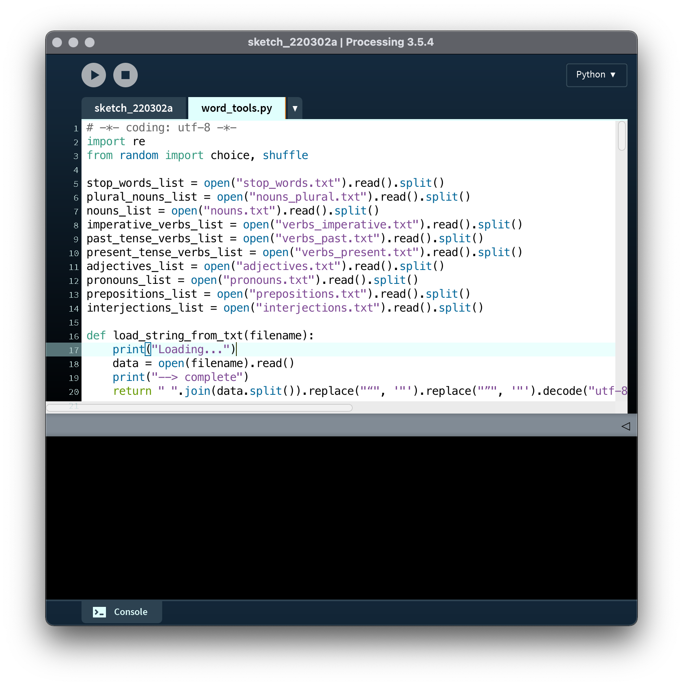

# Getting started with word_tools

### Adding code modules

For this unit, we'll be working with a new set of functions. Rather than work with graphics like the Processing functions we used previously, these functions work with text. However, they are not built in to Processing—I've written them in advance—and so we have to load them into our sketch separately.

First, create a new sketch, and save it.

Next, go to [word_tools.py](recombination_demo/word_tools.py). Click on the button that says "Raw". This will bring you to a page with the actual code. We need to save this code as a Python file somewhere on the computer.

**Safari**: Choose "Save As..." under the file menu, and save it as "word_tools.py". Make sure the option "Format: Page Source" is selected (not "Format: Page Archive"). Safari may ask you "Do you want to append '.txt' to the name?"—you do not!

**Chrome**: Chose "Save" under file menu, and save it!

Once the file is downloaded on your computer, we need to add it to the sketch. Back in Processing, under the sketch menu there is an option, "Add File..."

   

Select "word_tools.py" and confirm. If you've done this successfully, a new tab should appear in your sketch. You'll ignore this tab, but it supplies all the new functions that you'll be able to use.

   

### Adding word dictionaries

That's not all. word_tools makes use of some additional files that we will also need to add. Hang on, there's quite a few of them.

For each of the following files, follow the same procedure as above. However, since these are .txt files, they will not create new tabs. In fact, nothing visible will happen when you add them, but if you select "Show Sketch Folder" under the sketch menu and look inside the "data" folder, you'll see them there.

- [adjectives.txt](recombination_demo/data/adjectives.txt)
- [interjections.txt](recombination_demo/data/interjections.txt)
- [nouns_plural.txt](recombination_demo/data/nouns_plural.txt)
- [nouns.txt](recombination_demo/data/nouns.txt)
- [prepositions.txt](recombination_demo/data/prepositions.txt)
- [pronouns.txt](recombination_demo/data/pronouns.txt)
- [stop_words.txt](recombination_demo/data/stop_words.txt)
- [verbs_imperative.txt](recombination_demo/data/verbs_imperative.txt)
- [verbs_past.txt](recombination_demo/data/verbs_past.txt)
- [verbs_present.txt](recombination_demo/data/verbs_present.txt)

### Continue with recombination

Click back the main tab in your code, and then [continue with recombination](code.md)!
