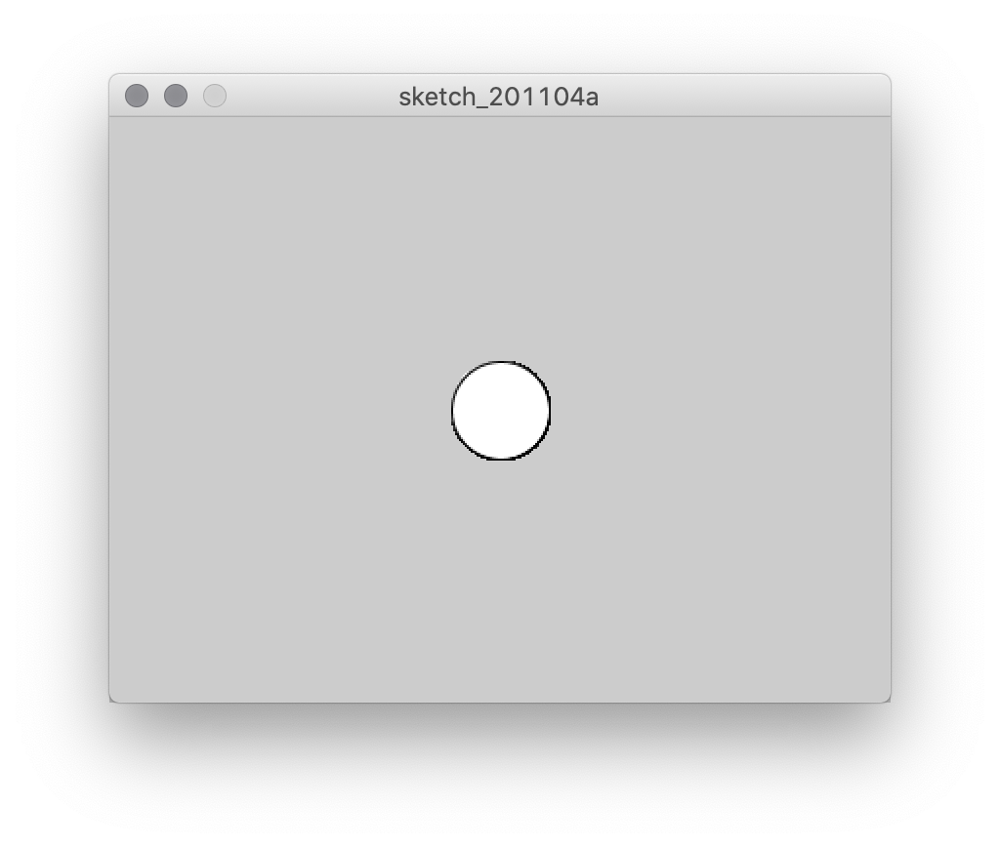
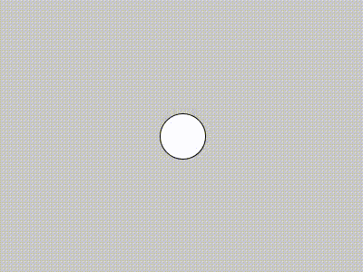
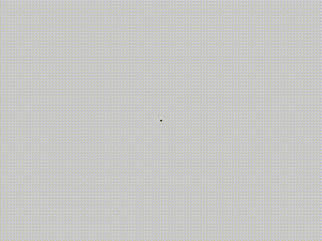
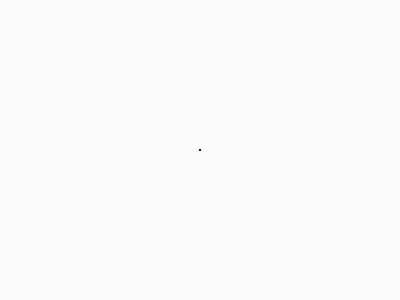
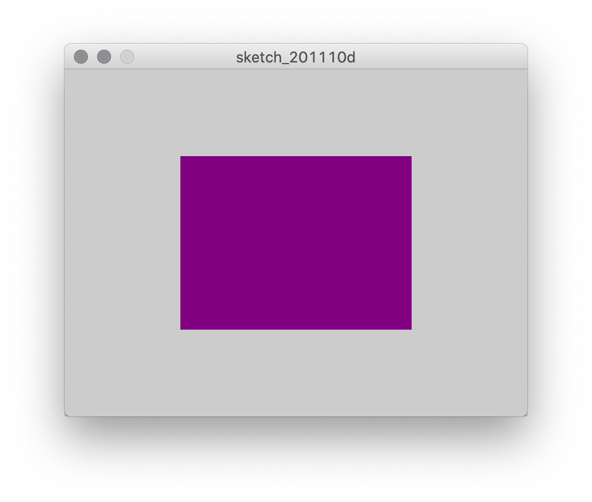
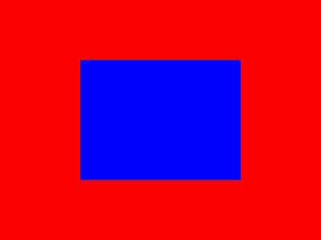
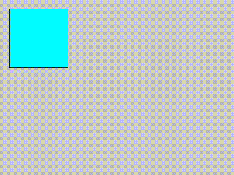
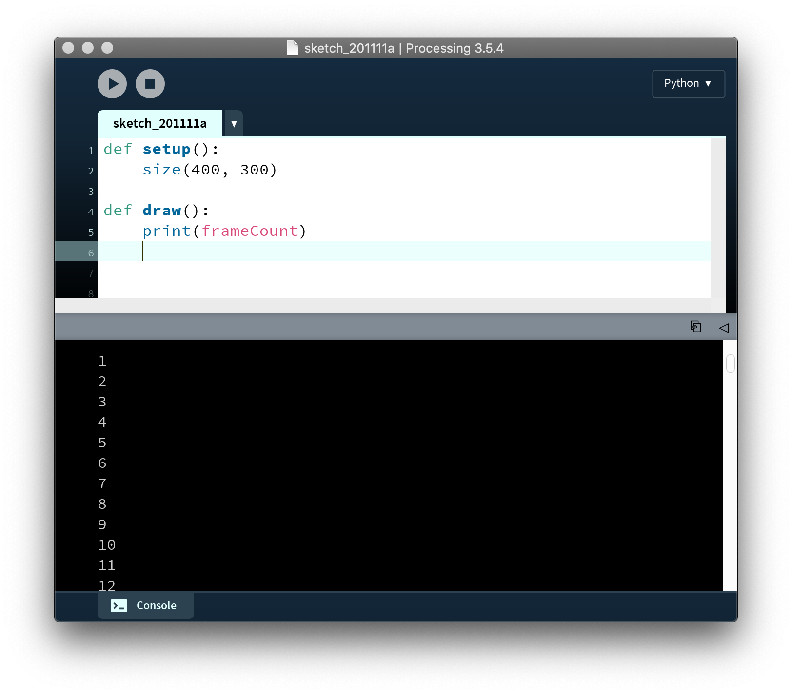
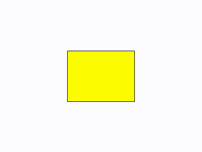
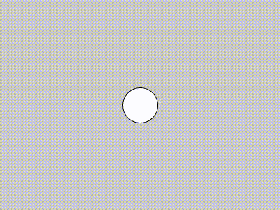

# Animation

## Code

The introduction of the previous unit, **interface**, brought us the possibility of animation with the introduction of the `draw()` function. While brushes are a form of animation, our emphasis was on using the mouse coordinates and cumulatively layering. But by clearing the canvas each frame, we can create motion graphics.

In addition, by keeping track of the number of frames that have passed, we can introduce a temporal dimension to our moving compositions.


### Motion basics

To begin, let's revisit the familiar starting point of a circle on a canvas.

```py
def setup():
    size(400, 300)

def draw():
    circle(200, 150, 50)
```

<p align="center">
  <br />
</p>

Previously, we made the circle move by substituting `200` and `150` with `mouseX` and `mouseY`, which made the circle follow the mouse. However, the introduction of some global variables can also produce motion.

```py
def setup():
    global position_x

    size(400, 300)
    position_x = 200

def draw():
    global position_x

    # clear the screen each frame
    background(200)

    circle(position_x, 150, 50)
    position_x += 1
```

<p align="center">
  <br />
</p>

Each time `draw()` is called, `position_x` is incremented by 1, which puts the circle in a different position the next call.

(Note that `position_x += 1` is the same thing as `position_x = position_x + 1`—this shorthand syntax will make things easier to write down the line. `*=` and `/=` work the same with multiplication and division.)

What happens when the ball gets to the edge of the canvas? Well, it keeps on going, forever.

We can change that with a conditional. Using an `if` statement to check if the circle has passed beyond the canvas, we can then reset `position_x` to just beyond the other side.

```py
def setup():
    global position_x

    size(400, 300)
    position_x = 200

def draw():
    global position_x

    # clear the screen each frame
    background(200)

    circle(position_x, 150, 50)
    position_x += 1

    if position_x > width + 25: # 25 is 1/2 of the diameter of the circle
        position_x = -25
```
<p align="center">
  <br />
</p>

So far so good. But what about making it _bounce_? For that, it's not just a matter of changing the position of the circle, but the _velocity_.

Currently, the velocity in our example is simply `1`. But we can prepare to make things a lot more interesting if we use a variable rather than a static number. While we're at it, let's make things work in both dimensions. We'll call these new variables `velocity_x` and `velocity_y` (and we'll also add `position_y`). We'll keep `velocity_x` at 1, and initialize `velocity_y` at 1.5, just because, and see how it flies off the bottom of the screen.


```py
def setup():
    global position_x, position_y, velocity_x, velocity_y         # multiple variables can be listed after global    

    size(400, 300)
    position_x = 200
    position_y = 150
    velocity_x = 1         # these values set the
    velocity_y = 1.5       # speed and initial direction

def draw():
    global position_x, position_y, velocity_x, velocity_y   

    background(200)
    circle(position_x, position_y, 50)
    position_x += velocity_x    # add 1 to position_x each frame
    position_y += velocity_y    # add 1.5 to position_y each frame
```
<p align="center">
  <br />
</p>

Now that we have `velocity_x` and `velocity_y`, we're ready to bounce:

```py
def setup():
    global position_x, position_y, velocity_x, velocity_y

    size(400, 300)
    position_x = 200
    position_y = 150
    velocity_x = 1
    velocity_y = 1.5    

def draw():
    global position_x, position_y, velocity_x, velocity_y

    background(200)
    circle(position_x, position_y, 50)
    position_x += velocity_x
    position_y += velocity_y

    # check if position_x is within the circle's radius of a vertical wall
    if position_x > width - 25:
        position_x = width - 25 # set it back to
        velocity_x *= -1        # flip the direction
    elif position_x < 25:
        position_x = 25
        velocity_x *= -1

    # same for y
    if position_y > height - 25:
        position_y = height - 25
        velocity_y *= -1
    elif position_y < 25:
        position_y = 25
        velocity_y *= -1
```
<p align="center">
  <br />
</p>

In example above, the conditional statements check to see if `position_x` or `position_y` have strayed outside their bounds. If so, position is snapped back to those bounds, and the appropriate velocity variable is flipped from positive to negative or negative to positive. This changes the direction of the circle, or as now might be more appropriate to call it, the "ball."

All that we're doing here is drawing a circle at different coordinates each frame, which we're keeping track of as the interaction between a set of variables. But what we see feels like an object obeying (roughly!) the laws of physics.

### Types of motion

So far, our ball is bouncing linearly. However, this doesn't necessarily need to be the case.

For example, try adding a random factor to the position update:
```py
position_x += velocity_x + random(-2, 2)
position_y += velocity_y + random(-2, 2)
```

<p align="center">
  <br />
</p>

Likewise, you might use a bit of trigonometry to create periodic motion:

```py
circle(position_x, position_y, 50)
position_x += velocity_x
position_y += velocity_y * sin(radians(angle))
angle += 2  # a global variable
```

<p align="center">
  <br />
</p>

In this example, we've created another global variable, `angle` (although this isn't shown), and we use it to oscillate `velocity_y`. `radians()` converts degrees to radians, which is what is required for the `sin` and `cos` functions. Every frame, `angle` is incremented by two degrees, but changing this number will affect the character of the movement (and using the same thing with `cos` for the x axis will produce circles, or figure-8s, or...).


### Other parameters

In the example so far, we're moving a shape around on the screen. But just like the `x` and `y` parameters of a shape can be animated, so can any other place where a variable might substitute for a static value.

Take this variation on our example, for instance. Here, we're applying the very same logic of a variable, another variable that modifies it, and a set of conditions to modify the size of the shape instead of the position.

```py
def setup():
    global diameter, delta_diameter

    size(400, 300)
    diameter = 0
    delta_diameter = 1   


def draw():
    global diameter, delta_diameter

    background(200)
    circle(width/2, height/2, diameter)

    diameter += delta_diameter

    if diameter >= height:    # setting the max size to the height of the canvas
        diameter = height
        delta_diameter *= -1  # make it shrink intead of grow
    elif diameter <= 0:
        diameter = 0
        delta_diameter *= -1
```


<p align="center">
  <br />
</p>

Of course, these two examples could be combined, to have a shape that is both moving and expanding.

Taking the visual aspects beyond the simple example of the ball, you might animate something reminiscent of our brushes by replacing the line to draw a circle with something like this that incorporates `random()`:

```py
stroke(0, 0, 100, 128)
for i in range(50):
    line(200, 150, 200 + random(-diameter, diameter), 150 + random(-diameter, diameter))
```

<p align="center">
  <br />
</p>

Again, any parameter can be added by updating a global variable within `draw()`.


### Color

It's also possible to animate color. So far, we've been defining colors directly, within `fill()` and `stroke()`. However, we can do more interesting things by defining colors abstractly, with the `color()` function.

For example:

```py
def setup():
    size(400, 300)

def draw():
    color_1 = color(255, 0, 0)
    color_2 = color(0, 0, 255)
```

Now that we have `color_1` and `color_2` defined, or whatever we want to call them, we can interpolate between them using `lerpColor()`. This function takes three parameters—two colors, and a number between 0 and 1 that indicates how much to fade between the two.

```py
def setup():
    size(400, 300)

def draw():
    color_1 = color(255, 0, 0)
    color_2 = color(0, 0, 255)
    interpolated_color = lerpColor(color_1, color_2, 0.5)

    noStroke()
    fill(interpolated_color)    
    rect(width/4, height/4, width/2, height/2)
```

<p align="center">
  <br />
</p>

To animate this and fade between the two colors, we'll need some global variables—`fade_amount`, which will be the number between 0 and 1 that determines the interpolation, and `fade_rate`, which, like velocity, determines the rate of change.

For good measure, we'll go ahead and make two rectangles fading in opposite directions. And by adding a condition, we'll make it loop:

<p align="center">
  <br />
</p>


### Relative motion

So far, we've been defining the placement of objects relative to canvas. However, we can also make them relative to each other.

Let's start with a familiar example, this time a traveling square:

```py
def setup():
    global position_x, position_y

    size(400, 300)
    position_x = 15
    position_y = 15


def draw():
    global position_x, position_y

    background(200)
    fill(0, 255, 255)
    square(position_x, position_y, 100)

    position_x += 1
    position_y += .15

    if position_x > width:
        position_x = -100
    elif position_x < -100:
        position_x = width
    if position_y > height:
        position_y = -100
    elif position_y < -100:
        position_y = height
```

<p align="center">
  <br />
</p>

Next, let's add something _inside_ the square as it moves. This will simply be a `rect` that bounces back and forth within the confines of the square. To make it, we'll need a new global variable, `rect_w`, which we'll update each frame and reset once it reaches 100:

```py
def setup():
    global position_x, position_y, rect_w

    size(400, 300)
    position_x = 15
    position_y = 15
    rect_w = 0


def draw():
    global position_x, position_y, rect_w

    background(200)
    fill(0, 255, 255)
    square(position_x, position_y, 100)

    fill(0, 255, 0)
    rect(position_x, position_y, rect_w, 100)

    position_x += 1
    position_y += .15
    rect_w += 1

    if position_x > width:
        position_x = -100
    elif position_x < -100:
        position_x = width
    if position_y > height:
        position_y = -100
    elif position_y < -100:
        position_y = height

    if rect_w == 100:
        rect_w = 0
```

<p align="center">
  <br />
</p>

Because both the square and the rect use `position_x` and `position_y`, and `rect_w` varies independently, the color swipe is relative to the moving object, not to the canvas.


### Triggering by frame

So far, we have been dealing with time implicitly by updating global variables each time `draw()` is called. However, there is another way that Processing lets us work with time.

The magic variable `frameCount` gives us a number that indicates how many times `draw()` has been called since the sketch began running. We can see this in the console:

<p align="center">
  <br />
</p>

There are a lot of ways that this constantly increasing number could be exploited. But for our purposes, using `frameCount` to trigger variable changes is a good place to start.

Creating a condition based on `frameCount` might look like this:
```py
if frameCount < 1000:
    ...
elif frameCount < 2000:
    ...
else:
    ...    
```
This `if` statement divides time into three separate periods. For a simple example, we might use it to change the color of a square:

```py
def setup():
    size(400, 300)

def draw():
    background(255)
    if frameCount < 100:
        fill(255, 255, 0)
    elif frameCount < 200:
        fill(255, 0, 255)
    else:
        fill(0, 255, 255)

    rect(width/3, height/3, width/3, height/3)
```    


<p align="center">
  <br />
</p>

`frameCount` is also a good opportunity to introduce one remaining operator, modulo, or `%`. Modulo takes one number and gives the remainder when it is divided by another number. For example, `21 % 10` is `1`, because once 10 goes into 20 twice, 1 is left over.

When it comes to `frameCount`, modulo is helpful because although `frameCount` will increase infinitely, using `%` with a maximum value can, in effect, make it loop.

```py
def setup():
    size(400, 300)

def draw():
    background(200)
    step = frameCount % 300  # step will increase to 299 and then go back to 0
    if step < 100:
        circle(width/2, height/2, 50)
    elif step < 200:
        square(width/2 - 25, height/2 - 25, 50)
    elif step < 300:
        rect(width/2 - 45, height/2 - 15, 90, 30)
```

<p align="center">
  <br />
</p>


## Sketch #6

For this sketch, you will create an animation. This is an open-ended assignment—the only requirement is that you clear the canvas with `background()` at the beginning of every frame. The only restriction is that you may not use bouncing balls—find a way to incorporate what you've learned in the example to other and more refined shapes.

Submit your code along with a [3-sentence description](../../resources/description_guidelines.md). A rough version should be complete for the class prior to the crit in order to get feedback from your peers.
