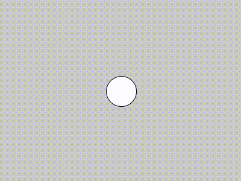
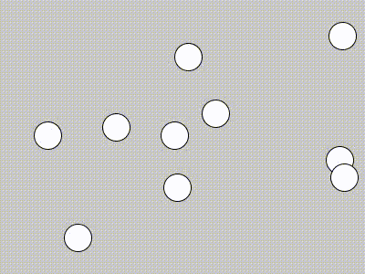
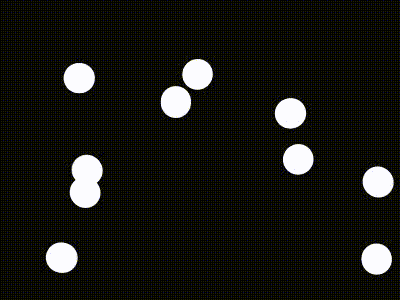

## Coming soon


/// emergence

+ schilling
+ Game of life
+ Boids
+ Robert Hodgin
+ Sims


## Code

The introduction of the previous unit, **interface**, brought us the possibility of animation. While brushes are a form of animation, they're not one that simulates autonomous elements moving on their own, which is what we're going to explore now. In addition to providing a means of creating animated effects, this also introduces the possibility of creating dynamic systems that don't need direct human input to create rich and surprising images.


### Motion

To begin, let's revisit the familiar starting point of a circle on a canvas.

```py
def setup():
    size(400, 300)

def draw():
    circle(200, 150, 50)
```

<p align="center">
  <br />
</p>

Previously, we made the circle move by substituting `200` and `150` with `mouseX` and `mouseY`, which made the circle follow the mouse. However, the introduction of some global variables can also produce motion.

```py
position_x = 200

def setup():
    size(400, 300)

def draw():
    global position_x

    # clear the screen each frame
    background(200)

    circle(position_x, 150, 50)
    position_x += 1
```

<p align="center">
  <br />
</p>

Each time `draw()` is called, `position_x` is incremented by 1, which puts the circle in a different position the next call.

(Note that `position_x += 1` is the same thing as `position_x = position_x + 1`—this shorthand syntax will make things easier to write down the line.)

We can prepare to make things a lot more interesting if we increment `position_x` (and let's add `position_y` as well) by a variable rather than a static number. This is in essence _velocity_, so we'll call those variables `velocity_x` and `velocity_y`. We'll keep `velocity_x` at 1, and initialize `velocity_y` at 1.5.


```py
position_x = 200
position_y = 150
velocity_x = 1
velocity_y = 1.5

def setup():
    size(400, 300)

def draw():
    global position_x, position_y, velocity_x, velocity_y         # multiple variables can be listed after global
    background(200)
    circle(position_x, position_y, 50)
    position_x += velocity_x    # add 1 to position_x each frame
    position_y += velocity_y    # add 1.5 to position_y each frame
```
<p align="center">
  <br />
</p>

Now that we have `velocity_x` and `velocity_y`, we can do something interesting, like make the ball bounce off the edge:

```py
position_x = 200
position_y = 150
velocity_x = 1
velocity_y = 1.5

def setup():
    size(400, 300)

def draw():
    global position_x, position_y, velocity_x, velocity_y         # multiple variables can be listed after global
    background(200)
    circle(position_x, position_y, 50)
    position_x += velocity_x
    position_y += velocity_y

    # check if position_x is within the circle's radius of a vertical wall
    # if so, flip the direction of the velocity
    if position_x > width - 25 or position_x < 0 + 25:
        velocity_x *= -1    #  *= works like +=

    # same for y
    if position_y > height - 25 or position_y < 0 + 25:
        velocity_y *= -1
```
<p align="center">
  <br />
</p>

In example above, the two conditional statements check to see if `position_x` or `position_y` have strayed outside their bounds. If so, the appropriate velocity variable is flipped from positive to negative or negative to positive, which changes the direction of the circle, or as now might be more appropriate to call it, the "ball."

(To make the ball "wrap" instead of bounce would mean altering `position_x` or `position_y` directly instead of `velocity_x` or `velocity_y`, reseting the ball to the other side of the screen.)

All that we're doing here is drawing a circle at different coordinates each frame, which we're keeping track of as the interaction between a set of variables. But what we see feels like an object obeying (roughly!) the laws of physics.

### Vectors

One thing that you'll notice with this code is that it's a little bit of a pain to keep track of x and y variables separately. After awhile it gets confusing, and if we start adding other aspects that depend on x and y coordinates, the variables add up.

However, because making things move is such a common thing to do in processing, there is a special kind of **object** designed to help us out. What's an object in code? We'll get to that in a minute. For now, know that any pair of x and y variables in Processing can be replaced by a `PVector`. Not only will it make our code cleaner, it will enable us to do some more interesting things.

Here's the previous example rewritten with `PVector`—the result is the same.

```py
position = PVector(200, 150)    # declare with x and y parameters
velocity = PVector(1, 1.5)

def setup():
    size(400, 300)

def draw():
    global position, velocity

    # draw things
    background(200)
    circle(position.x, position.y, 50)  # access x and y components with a dot

    # update position
    position += velocity        # adds both x and y components

    # update velocity to bounce off the walls
    if position.x > width - 25 or position.x < 0 + 25:
        velocity.x *= -1
    if position.y > height - 25 or position.y < 0 + 25:
        velocity.y *= -1

```

This code is slightly simpler and more intuitive to read. Note that to access the individual x and y properties of a `PVector`, we write the name of the variable with a dot, followed by `x` or `y`. We do this when we need to access the individual values, such as for our "walls." On the other hand, when we update the `position` with `velocity` we can just do so all at once, ie, `position += velocity`.

Vectors are actually quite powerful. Say we wanted this ball to not only move on its own and bounce off the walls, but to follow the mouse. We can represent the mouse position (the ball's desired position) as a vector like this:
```py
desired_position = PVector(mouseX, mouseY)
```
The difference between the current position and the desired position, which is the direction we want the ball to turn, is then:
```py
turn = desired_position - position
```
How fast do we want it to turn? In this example, we initialized velocity with 1 and 1.2 for the horizontal and vertical aspects, respectively, so a turn velocity of around 2 is probably reasonable (as opposed to something like 100). The overall strength of a vector (ie, the x and y components taken together) is called the magnitude. To set it, we use `setMag()`:
```py
turn.setMag(2)
```

That's it—a little math with vectors, and the ball will chase the mouse (in addition to bounce off the walls) if we set `velocity` to our new `turn`:

```py
position = PVector(200, 150)
velocity = PVector(1, 1.5)

def setup():
    size(400, 300)

def draw():
    global position, velocity

    # draw things
    background(200)
    circle(position.x, position.y, 50)
    position += velocity

    # update velocity to follow the mouse
    desired_position = PVector(mouseX, mouseY)
    turn = desired_position - position
    turn.setMag(4)
    velocity = turn_direction   

    # update velocity to bounce off the walls
    if position.x > width - 25 or position.x < 0 + 25:
        velocity.x *= -1
    if position.y > height - 25 or position.y < 0 + 25:
        velocity.y *= -1

```
<p align="center">
  <br />
</p>

We can do a little better than this, however. Objects in the physical world have inertia, that is, they don't stop on a dime as in our example. To add something that approximates that reality, instead of assigning `velocity` to `turn` outright, let's just give it a percentage of `turn` added to the direction it was going before. This yields a much nicer effect:

```py
position = PVector(200, 150)
velocity = PVector(1, 1.5)

def setup():
    size(400, 300)

def draw():
    global position, velocity

    # draw things
    background(200)
    circle(position.x, position.y, 50)

    # update position
    position += velocity

    # update velocity to follow the mouse
    desired_position = PVector(mouseX, mouseY)
    turn = desired_position - position
    turn.setMag(4)
    # 1% turn and 99% previous velocity
    velocity = (turn * 0.01) + (velocity * .99)

    # update velocity to bounce off the walls
    if position.x > width - 25 or position.x < 0 + 25:
        velocity.x *= -1
    if position.y > height - 25 or position.y < 0 + 25:
        velocity.y *= -1

```
By changing the magnitude of `turn` and the percentages with which we update `velocity`, we can change the character of the motion of the ball.


<p align="center">
  <br />
</p>

Seems like a lot of work to just make a ball move. However, there is already a lot of expressive potential in this.

Consider the following example, which could be used in a drawing interface from last unit. Most of the code is the same as above, except instead of clearing our tracks every frame with `background()`, we're letting things accumulate in order to make a brush when `mousePressed` is down. We've gotten rid of the walls. And we're adjusting the weight of the brush according to the velocity, the parameters of which we've tweaked. Those small aesthetic details give us an interesting tool, where the faint red line is the mouse movement and the computer generates an "accompaniment":


<p align="center">
  <br />
</p>

### Objects

Returning to our ball example, we may think a single bouncing ball is cool, but what we really want to do, of course, is to have lots of bouncing balls.

From what we know so far, we might approach that by making a lot of variables by hand, one for each ball. Something like:

```py
ball_1_position = PVector(200, 150)
ball_1_velocity = PVector(1, 1.5)
ball_2_position = PVector(210, 75)
ball_2_velocity = PVector(1.2, 1.75)
ball_3_position = PVector(120, 90)
ball_3_velocity = PVector(1.5, 1.5)
ball_4_position = PVector(400, 300)
ball_4_velocity = PVector(1, -1)
...

def draw():
...
    circle(ball_1_position.x, ball_1_position.y, 50)
    circle(ball_2_position.x, ball_2_position.y, 50)
    circle(ball_3_position.x, ball_3_position.y, 50)
    circle(ball_4_position.x, ball_4_position.y, 50)

    ball_1_position += ball_1_velocity
    ball_2_position += ball_2_velocity
    ball_3_position += ball_3_velocity
    ball_4_position += ball_4_velocity

...
```

This would not be wrong, but eventually this kind of approach is going to get really tedious. What we really want is to define an object, like a ball, all at once, with all of its appropriate variables and functions. And this is where one of the most complicated and beautiful structures of programming comes in.

In programming, we create "classes" of objects. In other words, if I create a class "ball", then I can use it to create as many ball objects as I want. In Python, we do this with the keyword `class`. An outline of a `Ball` class might look like this:

```py
class Ball():

    def __init__(self):
        ...

    def draw(self):
        ...
```
Here, within the class are three functions associated with that class. The first is called, bizarrely, `__init__()`, which for all intents and purposely is the same thing as `setup()`, _but just for this particular object._ We're going to use `__init__()` to declare our variables (and this time, we'll assign them random parameters):

```py
class Ball():

    def __init__(self):
        self.position = PVector(random(width), random(height))
        self.velocity = PVector(random(-2, 2), random(-2, 2))

    def draw(self):
        ...
```

The big difference here is the use of this magic keyword `self`, which binds these variables to the Ball class and makes unique versions of them for each ball object we create.

Likewise, `draw()` here is equivalent to our typical `draw()`, but it's just for this object. We put in all the code that applies to a particular ball and attach the variables to `self`. We'll make the ball just 30 pixels in diameter this time:
```py
class Ball():

    def __init__(self):
        self.position = PVector(random(width), random(height))
        self.velocity = PVector(random(-2, 2), random(-2, 2))

    def draw(self):
        # draw the ball
        circle(self.position.x, self.position.y, 30)
        # update its position and velocity
        self.position += self.velocity
        if self.position.x > width - 15 or self.position.x < 0 + 15:
            self.velocity.x *= -1
        if self.position.y > height - 15 or self.position.y < 0 + 15:
            self.velocity.y *= -1    
```

How does this fit with the rest of a Processing sketch? Well, the whole point here is that we're going to create a lot of bouncing balls. So before anything else, we're going to create a list to hold them:

```py
balls = []
```

Now, in `setup()`, after we create the canvas we'll create 10 new balls and add them to the list:

```py
balls = []

def setup():
    size(400, 300)

    for i in range(10):
        new_ball = Ball()
        balls.append(new_ball)
```

Note that calling the name of the class, `Ball()`, creates an object of that class. `new_ball` becomes an instance of the class, and we append that to the `balls` list. And then we repeat that 10 times.

Now, we have `draw()`:

```py
def draw():
    background(200)

    for i in range(len(balls)):
        ball = balls[i]
        ball.draw()

```

Here, we're using another loop to access each of the balls and call its individual `draw()` function.

All together, the code looks like this:
```py
balls = []

def setup():
    size(400, 300)

    for i in range(10):
        balls.append(Ball())


def draw():
    background(200)

    for i in range(len(balls)):
        ball = balls[i]
        ball.draw()


class Ball():

    def __init__(self):
        self.position = PVector(random(width), random(height))
        self.velocity = PVector(random(-2, 2), random(-2, 2))

    def draw(self):
        # draw the ball
        circle(self.position.x, self.position.y, 30)
        # update its position and velocity
        self.position += self.velocity
        if self.position.x > width - 15 or self.position.x < 0 + 15:
            self.velocity.x *= -1
        if self.position.y > height - 15 or self.position.y < 0 + 15:
            self.velocity.y *= -1    
```            
<p align="center">
  <br />
</p>

Now, in a relatively concise bit of code, we've created a whole group of balls doing their own things on the canvas. A little tweaking to how the shapes are drawn, but keeping the logic the same, can yield some aesthetic results:
<p align="center">
  <br />
</p>

<p align="center">
  <br />
</p>


### Emergence

Motion, vectors, and objects. This has been a lot to absorb so far. But we're finally ready to look at a really fascinating thing that happens when all of these come together. And that is emergent behavior.

To consider the example with the bouncing balls, the thing that we've left out is having the balls interact with one another, just like we had one ball interact with the mouse. Think about the possibilities: the balls might collide and bounce off one another, try to steer and avoid each other, follow each other, move in the same direction, or any number of other possibilities.

When multiple objects follow the same set of rules ... emergence

parameters

subtle tweaking

here's code

remember, can have different kinds of objects


Congrats! You've gotten to the end of what we'll learn, and indeed, all of the fundamental structures in code. Everything else programmers do are essentially shortcuts and elaborations.
