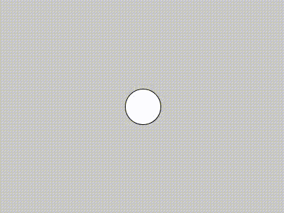
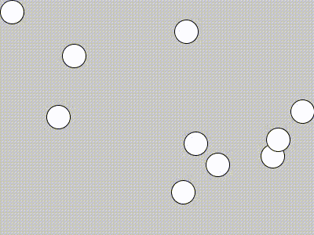
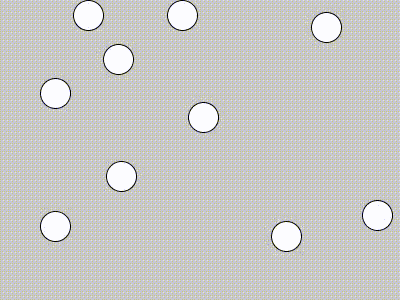

## Coming soon


/// emergence

+ schilling
+ Game of life
+ Boids
+ Robert Hodgin
+ Sims


## Code

The introduction of the previous unit, **interface**, brought us the possibility of animation. While brushes are a form of animation, they're not one that simulates autonomous elements moving on their own, which is what we're going to explore now. In addition to providing a means of creating animated effects, this also introduces the possibility of creating dynamic systems that don't need direct human input to create rich and surprising images.


### Motion

To begin, let's revisit the familiar starting point of a circle on a canvas.

```py
def setup():
    size(400, 300)

def draw():
    circle(200, 150, 50)
```

<p align="center">
  <br />
</p>

Previously, we made the circle move by substituting `200` and `150` with `mouseX` and `mouseY`, which made the circle follow the mouse. However, the introduction of some global variables can also produce motion.

```py
position_x = 200

def setup():
    size(400, 300)

def draw():
    global position_x

    # clear the screen each frame
    background(200)

    circle(position_x, 150, 50)
    position_x += 1
```

<p align="center">
  <br />
</p>

Each time `draw()` is called, `position_x` is incremented by 1, which puts the circle in a different position the next call.

(Note that `position_x += 1` is the same thing as `position_x = position_x + 1`—this shorthand syntax will make things easier to write down the line. `*=` and `/=` work the same with multiplication and division.)

What happens when the ball gets to the edge of the canvas? Well, it keeps on going, forever.

We can change that with a conditional. Using an `if` statement to check if the circle has passed beyond the canvas, we can then reset `position_x` to just beyond the other side.

```py
position_x = 200

def setup():
    size(400, 300)

def draw():
    global position_x

    # clear the screen each frame
    background(200)

    circle(position_x, 150, 50)
    position_x += 1

    if position_x > width + 25:
        position_x = -25
```
<p align="center">
  <br />
</p>    

So far so good. But what about making it _bounce_? For that, it's not just a matter of changing the position of the circle, but the _velocity_.

Currently, the velocity in our example is simply `1`. But we can prepare to make things a lot more interesting if we use a variable rather than a static number. While we're at it, let's make things work in both dimensions. We'll call these new variables `velocity_x` and `velocity_y` (and we'll also add `position_y`). We'll keep `velocity_x` at 1, and initialize `velocity_y` at 1.5, just because, and see how it flies off the bottom of the screen.


```py
position_x = 200
position_y = 150
velocity_x = 1
velocity_y = 1.5

def setup():
    size(400, 300)

def draw():
    global position_x, position_y, velocity_x, velocity_y         # multiple variables can be listed after global
    background(200)
    circle(position_x, position_y, 50)
    position_x += velocity_x    # add 1 to position_x each frame
    position_y += velocity_y    # add 1.5 to position_y each frame
```
<p align="center">
  <br />
</p>

Now that we have `velocity_x` and `velocity_y`, we're ready to bounce:

```py
position_x = 200
position_y = 150
velocity_x = 1
velocity_y = 1.5

def setup():
    size(400, 300)

def draw():
    global position_x, position_y, velocity_x, velocity_y         # multiple variables can be listed after global
    background(200)
    circle(position_x, position_y, 50)
    position_x += velocity_x
    position_y += velocity_y

    # check if position_x is within the circle's radius of a vertical wall
    if position_x > width - 25:
        position_x = width - 25 # set it back to
        velocity_x *= -1        # flip the direction
    elif position_x < 25:
        position_x = 25
        velocity_x *= -1

    # same for y
    if position_y > height - 25:
        position_y = height - 25
        velocity_y *= -1
    elif position_y < 25:
        position_y = 25
        velocity_y *= -1     
```
<p align="center">
  <br />
</p>

In example above, the conditional statements check to see if `position_x` or `position_y` have strayed outside their bounds. If so, position is snapped back to those bounds, and the appropriate velocity variable is flipped from positive to negative or negative to positive. This changes the direction of the circle, or as now might be more appropriate to call it, the "ball."

All that we're doing here is drawing a circle at different coordinates each frame, which we're keeping track of as the interaction between a set of variables. But what we see feels like an object obeying (roughly!) the laws of physics.

### Vectors

One thing that you'll notice with this code is that it's a little bit of a pain to keep track of x and y variables separately. After awhile it gets confusing, and if we start adding other aspects that depend on x and y coordinates, the variables add up.

However, because making things move is such a common thing to do in Processing, there is something special to help us out. Any pair of x and y variables in Processing can be replaced by a `PVector`, which is an object that includes both x and y components. Not only will it make our code cleaner, it will enable us to do some more interesting things.

Here's the previous example rewritten with `PVector`—the result is the same.

```py
position = PVector(200, 150)    # declare with x and y parameters
velocity = PVector(1, 1.5)

def setup():
    size(400, 300)

def draw():
    global position, velocity

    # draw things
    background(200)
    circle(position.x, position.y, 50)  # access x and y components with a dot

    # update position
    position += velocity        # adds both x and y components

    # update velocity to bounce off the walls
    if position.x > width - 25:
        position.x = width -25
        velocity.x *= -1
    elif position.x < 25:
        position.x = 25
        velocity.x *= -1        
    if position.y > height - 25:
        position.y = height - 25
        velocity.y *= -1
    elif position.y < 25:
        position.y = 25
        velocity.y *= -1

```

This code is slightly simpler and more intuitive to read, but is essentially the same thing. Note that to access the individual x and y properties of a `PVector`, we write the name of the variable with a dot, followed by `x` or `y`. We do this when we need to access the individual values, such as for our "walls." On the other hand, when we update the `position` with `velocity` we can just do so all at once, ie, `position += velocity`.

Vectors let us phrase complex calculations rather simply. Say we wanted this ball to not only move on its own and bounce off the walls, but to also chase the mouse. We can represent the mouse position as a vector like this:
```py
mouse_position = PVector(mouseX, mouseY)
```
The difference between `mouse_position` and the ball's `position` is the direction we want the ball to go. This is simply:
```py
direction = mouse_position - position
```
How fast do we want it to go in this direction? The overall strength of a vector (ie, the x and y components taken together) is called the magnitude. So let's make a `chase_velocity` vector from `direction` with a `setMag()` of 2:
```py
chase_velocity = direction.setMag(2)
```

That's it—a little math with vectors, and the ball will flee the mouse (in addition to bounce off the walls) if we set `velocity` to our new `repel_velocity`:

```py
position = PVector(200, 150)
velocity = PVector(1, 1.5)

def setup():
    size(400, 300)

def draw():
    global position, velocity

    # draw things
    background(200)
    circle(position.x, position.y, 50)
    position += velocity

    # update velocity to cahse the mouse
    mouse_position = PVector(mouseX, mouseY)
    direction = mouse_position - position
    chase_velocity = direction.setMag(2)
    velocity = chase_velocity   

    # update velocity to bounce off the walls
    if position.x > width - 25:
        position.x = width -25
        velocity.x *= -1
    elif position.x < 25:
        position.x = 25
        velocity.x *= -1        
    if position.y > height - 25:
        position.y = height - 25
        velocity.y *= -1
    elif position.y < 25:
        position.y = 25
        velocity.y *= -1

```
<p align="center">
  <br />
</p>

We can do a little better than this, however. Objects in the physical world have inertia, that is, they don't stop on a dime as in our example. To add something that approximates that reality, instead of assigning `velocity` to `chase_velocity` outright, let's just give it a percentage of `chase_velocity` added to the direction it was going before. This yields a much nicer effect:

```py
position = PVector(200, 150)
velocity = PVector(1, 1.5)

def setup():
    size(400, 300)

def draw():
    global position, velocity

    # draw things
    background(200)
    circle(position.x, position.y, 50)

    # update position
    position += velocity

    # update velocity to cahse the mouse
    mouse_position = PVector(mouseX, mouseY)
    direction = mouse_position - position
    chase_velocity = direction.setMag(2)
    # 1% chase_velocity and 99% previous velocity
    velocity = (chase_velocity * 0.01) + (velocity * .99)

    # update velocity to bounce off the walls
    if position.x > width - 25:
        position.x = width -25
        velocity.x *= -1
    elif position.x < 25:
        position.x = 25
        velocity.x *= -1        
    if position.y > height - 25:
        position.y = height - 25
        velocity.y *= -1
    elif position.y < 25:
        position.y = 25
        velocity.y *= -1

```
By changing the magnitude of `chase_velocity` and the percentages with which we update `velocity`, we can change the character of the motion of the ball.


<p align="center">
  <br />
</p>

### Objects

We may think a single bouncing ball is cool, but what we really want to do, of course, is to have lots of bouncing balls.

From what we know so far, we might approach that by making a lot of variables by hand, one for each ball. Something like:

```py
ball_1_position = PVector(200, 150)
ball_1_velocity = PVector(1, 1.5)
ball_2_position = PVector(210, 75)
ball_2_velocity = PVector(1.2, 1.75)
ball_3_position = PVector(120, 90)
ball_3_velocity = PVector(1.5, 1.5)
ball_4_position = PVector(400, 300)
ball_4_velocity = PVector(1, -1)
...

def draw():
...
    circle(ball_1_position.x, ball_1_position.y, 50)
    circle(ball_2_position.x, ball_2_position.y, 50)
    circle(ball_3_position.x, ball_3_position.y, 50)
    circle(ball_4_position.x, ball_4_position.y, 50)

    ball_1_position += ball_1_velocity
    ball_2_position += ball_2_velocity
    ball_3_position += ball_3_velocity
    ball_4_position += ball_4_velocity

...
```

This would not be wrong, but eventually this kind of approach is going to get really tedious. What we really want is to define an object, like a ball, all at once, with all of its appropriate variables and functions. And this is where one of the most complicated and beautiful structures of programming comes in.

In programming, we create "classes" of objects. In other words, if I create a class "ball", then I can use it to create as many ball objects as I want. In Python, we do this with the keyword `class`. An outline of a `Ball` class might look like this:

```py
class Ball():

    def __init__(self):
        ...

    def draw(self):
        ...
```
Here, within the class are three functions associated with that class. The first is called, bizarrely, `__init__()`, which for all intents and purposely is the same thing as `setup()`, _but just for this particular object._ We're going to use `__init__()` to declare our variables (and this time, we'll assign them random parameters):

```py
class Ball():

    def __init__(self):
        self.position = PVector(random(width), random(height))
        self.velocity = PVector(random(-2, 2), random(-2, 2))

    def draw(self):
        ...
```

The big difference here is the use of this magic keyword `self`, which binds these variables to the Ball class and makes unique versions of them for each ball object we create.

Likewise, `draw()` here is equivalent to our typical `draw()`, but it's just for this object. We put in all the code that applies to a particular ball and attach `self` in front of all the variables. We'll make the ball just 30 pixels in diameter this time:
```py
class Ball():

    def __init__(self):
        self.position = PVector(random(width), random(height))
        self.velocity = PVector(random(-2, 2), random(-2, 2))

    def draw(self):
        # draw the ball
        circle(self.position.x, self.position.y, 30)
        # update its position and velocity
        self.position += self.velocity
        if self.position.x > width - 15:
            self.position.x = width - 15
            self.velocity.x *= -1
        elif self.position.x < 15:
            self.position.x = 15
            self.velocity.x *= -1        
        if self.position.y > height - 15:
            self.position.y = height - 15
            self.velocity.y *= -1
        elif self.position.y < 15:
            self.position.y = 15
            self.velocity.y *= -1
```

How does this fit with the rest of a Processing sketch? Well, the whole point here is that we're going to create a lot of bouncing balls. So before anything else, we're going to create a list to hold them:

```py
balls = []
```

Now, in `setup()`, after we create the canvas we'll create 10 new balls and add them to the list:

```py
balls = []

def setup():
    size(400, 300)

    for i in range(10):
        new_ball = Ball()
        balls.append(new_ball)
```

Note that calling the name of the class, `Ball()`, creates an object of that class. `new_ball` becomes an instance of the class, and we append that to the `balls` list. And then we repeat that 10 times.

Now, we have `draw()`:

```py
def draw():
    background(200)

    for i in range(len(balls)):
        ball = balls[i]
        ball.draw()

```

Here, we're using another loop to access each of the balls and call its individual `draw()` function.

All together, the code looks like this:
```py
balls = []

def setup():
    size(400, 300)

    for i in range(10):
        balls.append(Ball())


def draw():
    background(200)

    for i in range(len(balls)):
        ball = balls[i]
        ball.draw()


class Ball():

    def __init__(self):
        self.position = PVector(random(width), random(height))
        self.velocity = PVector(random(-2, 2), random(-2, 2))

    def draw(self):
        # draw the ball
        circle(self.position.x, self.position.y, 30)
        # update its position and velocity
        self.position += self.velocity
        if self.position.x > width - 15:
            self.position.x = width - 15
            self.velocity.x *= -1
        elif self.position.x < 15:
            self.position.x = 15
            self.velocity.x *= -1        
        if self.position.y > height - 15:
            self.position.y = height - 15
            self.velocity.y *= -1
        elif self.position.y < 15:
            self.position.y = 15
            self.velocity.y *= -1
```            
<p align="center">
  <br />
</p>

Now, in a relatively concise bit of code, we've created a whole group of balls doing their own things on the canvas. A little tweaking to how the shapes are drawn, but keeping the logic the same, can yield some aesthetically pleasing results:
<p align="center">
  <br />
</p>

<p align="center">
  <br />
</p>

(Tip: both of these examples use a very transparent `rect()`, drawn every frame to create the fading effect.)

### Emergence

Motion, vectors, and objects. This has been a lot to absorb so far. But we're finally ready to look at a really fascinating thing that happens when all of these come together. And that is emergent behavior.

To consider the example with the bouncing balls, the thing that we've left out is having the balls interact with one another, just like we had one ball interact with the mouse. Think about the possibilities: the balls might collide and bounce off one another, be attracted to each other, be repelled from each other, or just move in the same direction.

When multiple objects follow the same set of simple rules, complex effects can result. Even without the use of `random()`, we can get unpredictable and beautiful results.

The first thing we'll want to do when considering the interaction between the different objects is to calculate their distance from one another. `PVectors` make this easy, with their `.dist()` method.

Putting the following in `Ball.draw()` will create a list with the distances between this ball and every other ball:
```py
distances = []
for i in range(len(balls)):
    ball = balls[i]
    distances.append(self.position.dist(ball.position))
```

Now that we've done these distance calculations, we can use them to determine the appropriate interaction.

To begin with, balls are colliding if they are within their diameter of one another. So, also in `Ball.draw()`:

```py
for i in range(len(balls)):
    ball = balls[i]
    if ball != self and distances[i] <= 30:
        ??
```
"Collision" is in essence abrupt repulsion (with no inertia!). From our previous example with the mouse and just one ball, we already have the formula for chasing. Repulsion is very similar, it's just a matter of subtracting the other ball's position from the current ball's position instead of the other way around. Kind of -- this is an approximation that doesn't take into account the shape of the objects, but it's good enough for now. To make it slightly more realistic, we'll also swap the magnitude of the velocity for that of the other balls:

```py
for i in range(len(balls)):
    ball = balls[i]
    if ball != self and distances[i] <= 30:
        direction = self.position - ball.position
        repulsion = direction.setMag(ball.velocity.mag())
        self.velocity = repulsion
```

Even better—what if the balls tried to avoid each other to begin with? We can keep the collision code for distances under 30, but let's add something else for if it's under, say, 50:

```py
for i in range(len(balls)):
    ball = balls[i]

    # collide
    if ball != self and distances[i] <= 30:
        direction = self.position - ball.position
        repulsion = direction.setMag(ball.velocity.mag())
        self.velocity = repulsion

    # repel
    elif ball != self and distances[i] <= 50:
        direction = self.position - ball.position
        repulsion = direction.setMag(4)
        self.velocity = (repulsion * 0.01) + (self.velocity * .99)    
```

<p align="center">
  <br />
</p>

Good times. The balls still collide if they have to, but they'll try to avoid it. What about attraction? Same thing, but again just flipping the order of the objects in the direction vector. Let's add this one as well, but for distances over 50 and less than 100. And it will have to be at a lesser magnitude than avoidance:

```py
for i in range(len(balls)):
    ball = balls[i]

    # collide
    if ball != self and distances[i] <= 30:
        direction = self.position - ball.position
        repulsion = direction.setMag(ball.velocity.mag())
        self.velocity = repulsion

    # repel
    elif ball != self and distances[i] <= 50:
        direction = self.position - ball.position
        repulsion = direction.setMag(4)
        self.velocity = (repulsion * 0.01) + (self.velocity * .99)

    # attract
    elif ball != self and distances[i] > 50 and distances[i] < 100 :
        direction = ball.position - self.position
        attraction = direction.setMag(1)
        self.velocity = (attraction * 0.01) + (self.velocity * .99)             
```

<p align="center">
  <br />
</p>

Now we're getting into weird territory where groups are forming and moving around on their own -- without any input or randomness beyond the initial layout of balls.

One more interesting relationship is to have the balls follow the general direction of other nearby balls. This quality, often called alignment, is associated with so-called "flocking" algorithms.


parameters

subtle tweaking

here's code

remember, can have different kinds of objects


Congrats! You've gotten to the end of what we'll learn, and indeed, all of the fundamental structures in code. Everything else programmers do are essentially shortcuts and elaborations.
