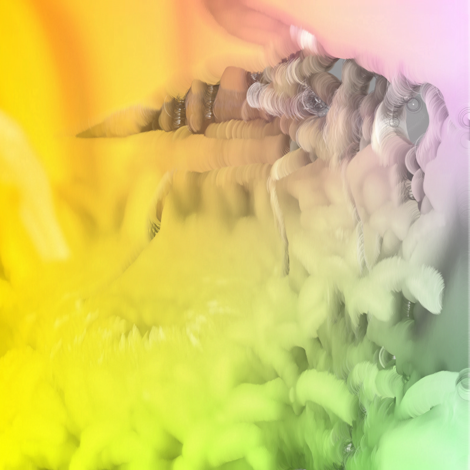
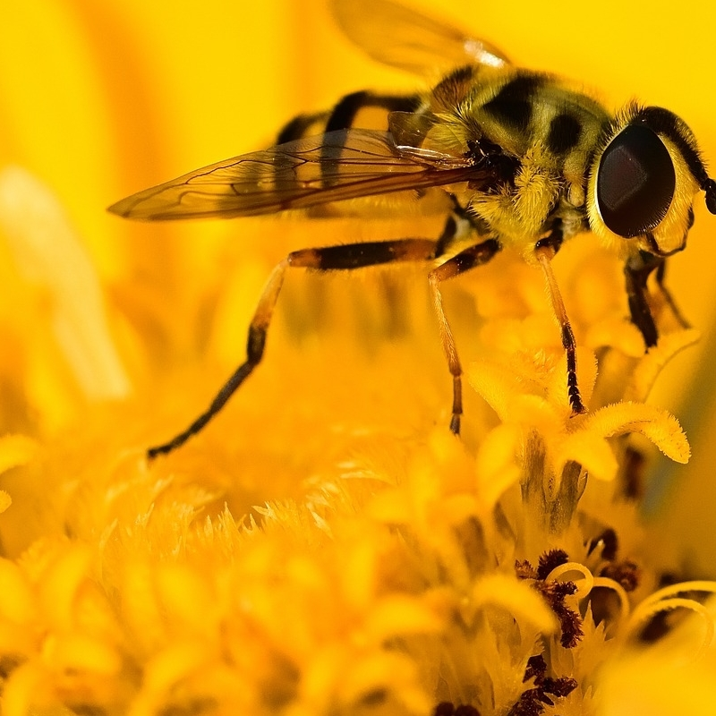
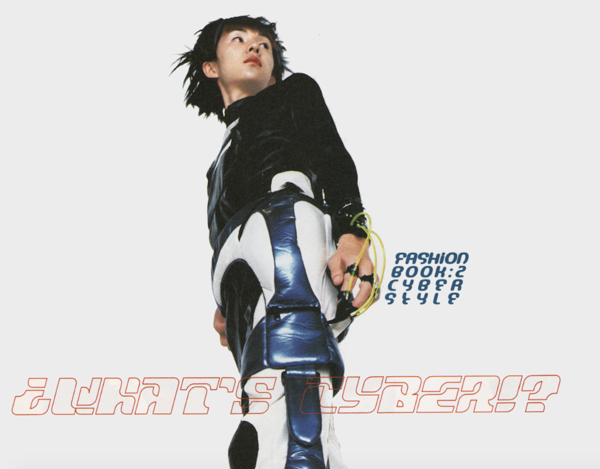
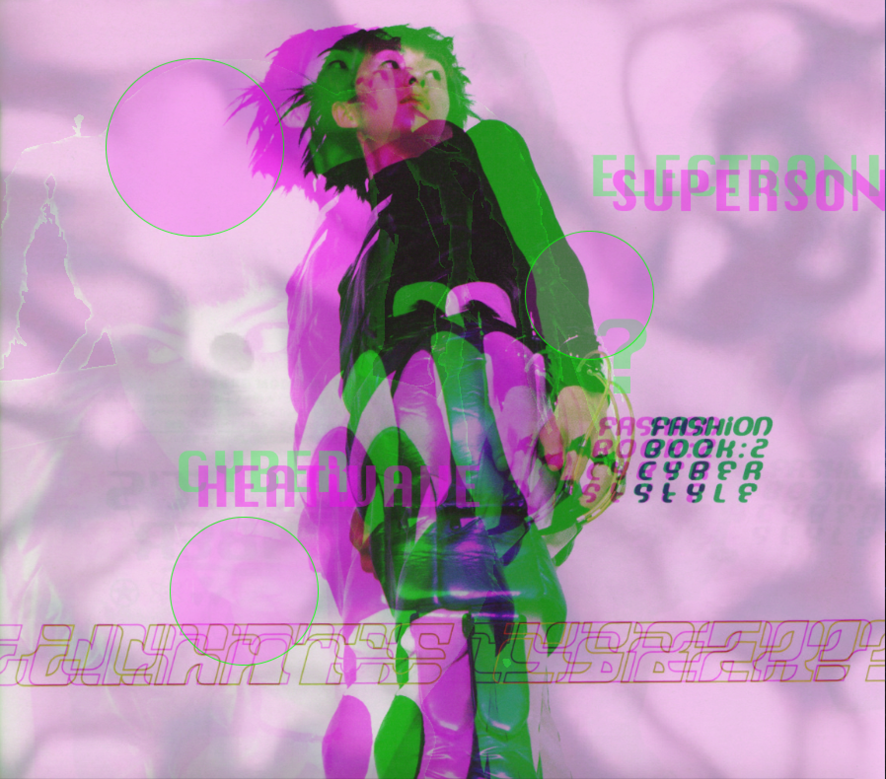
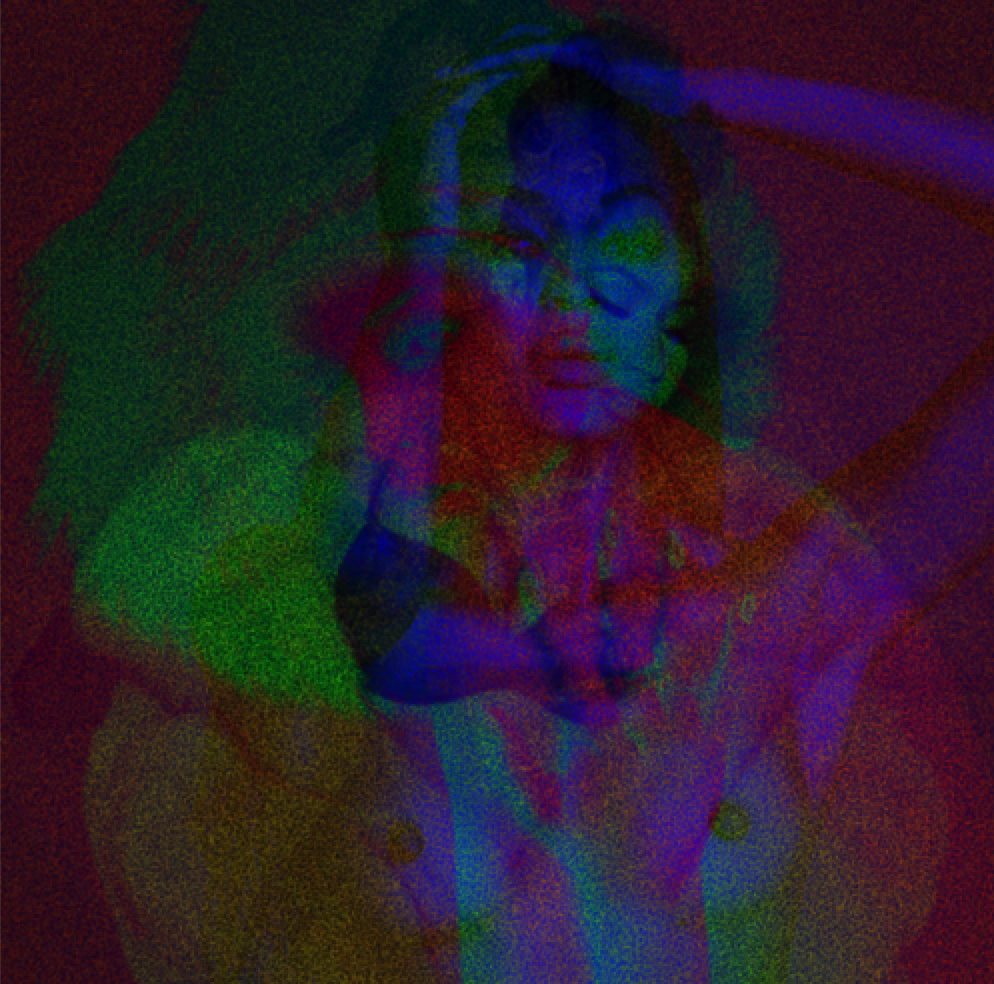

## Sketch #6: Glitch

For this sketch, you will create a "glitch" version of an image of your choice. Create a transformation of the original that is your own (not a copy of these examples) and which serves an aesthetic and conceptual purpose in relation to the original image.

Submit your code along with a [3-sentence description](../../resources/description_guidelines.md). Include the original image along with an image of your reimagined version.

### Examples

  
   
  Jake Warmflash, <i>Hair Dye</i> (2020) 

  

  
   
  Elsa Hanson, <i>What's Cyber?</i> (2020) 

  

   
  Alex Perez, <i>Thermal Beauty</i> (2020) 

