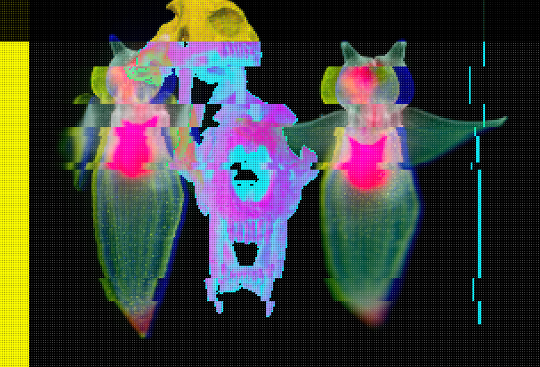
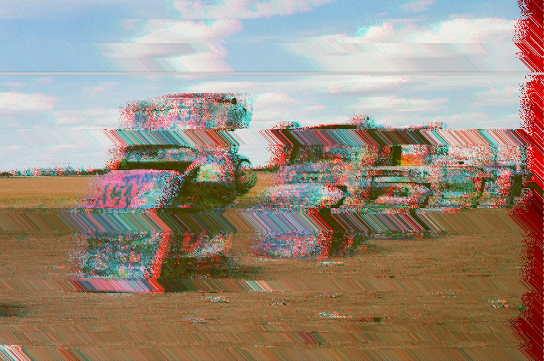
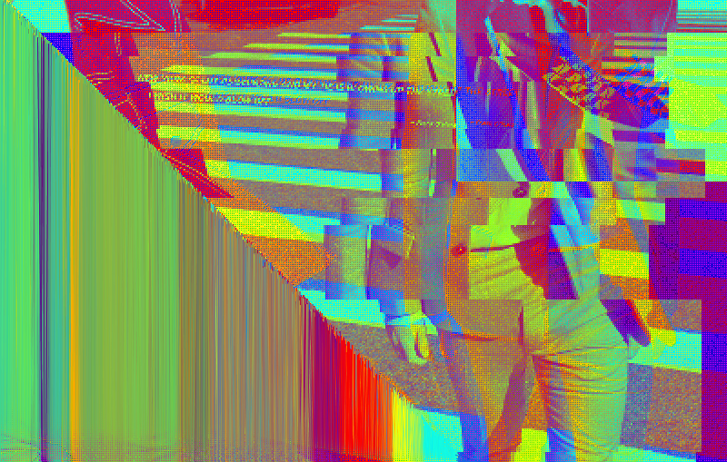
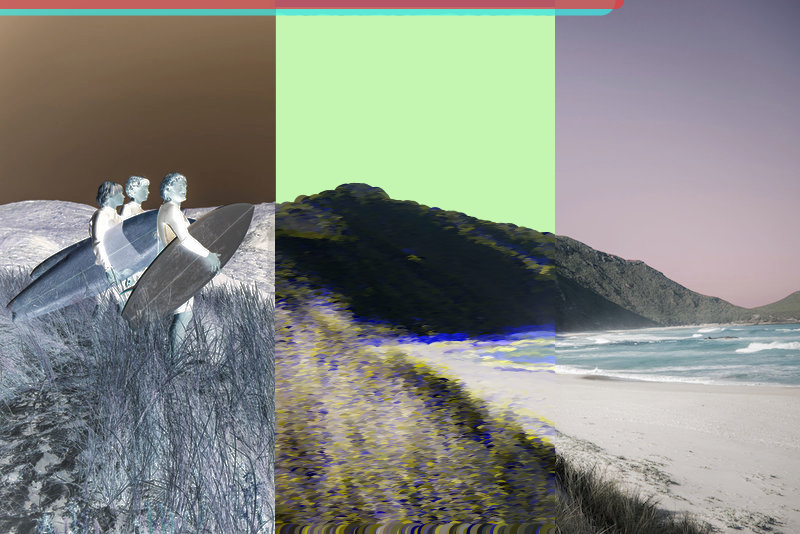

## Sketch #6: Glitch

For this sketch, you will create a "glitch" version of an image of your choice. Create a transformation of the original that is your own (not a copy of these examples) and which serves an aesthetic and conceptual purpose in relation to the original image.

Submit your code along with a [3-sentence description](../../resources/description_guidelines.md). Include the original image along with an image of your reimagined version.

### Examples

   
  Eleanor Trombla (2021) 

   
  Marcelo Bond, <i>Rewound</i> (2021) 

   
  Renz Johnson, <i>Up the Street</i> (2021) 

   
  Tal Jones, <i>Breath</i> (2021) 

