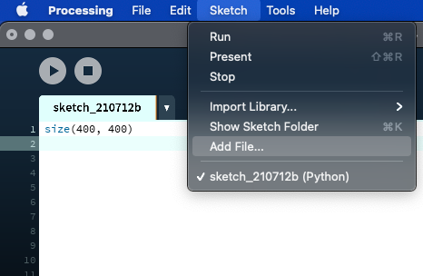
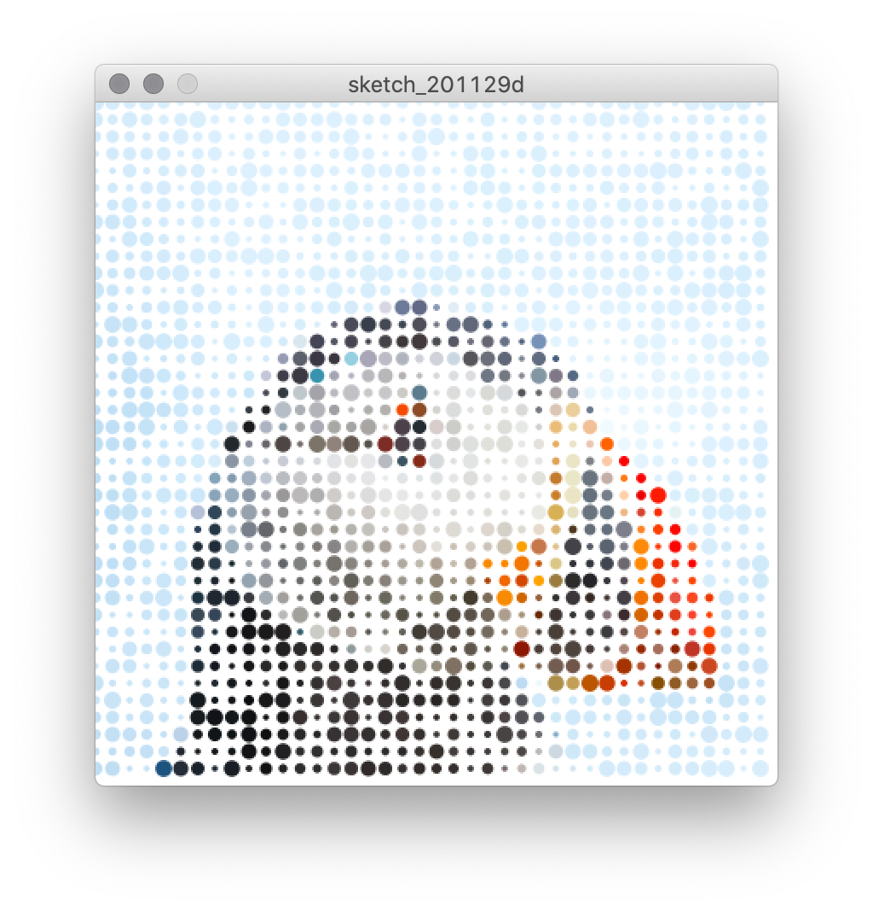
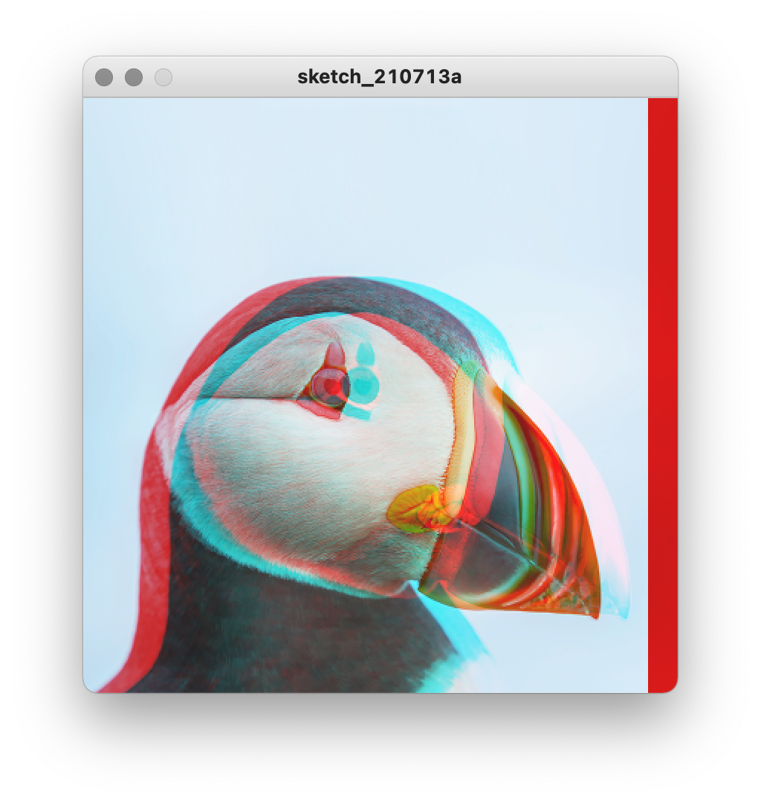
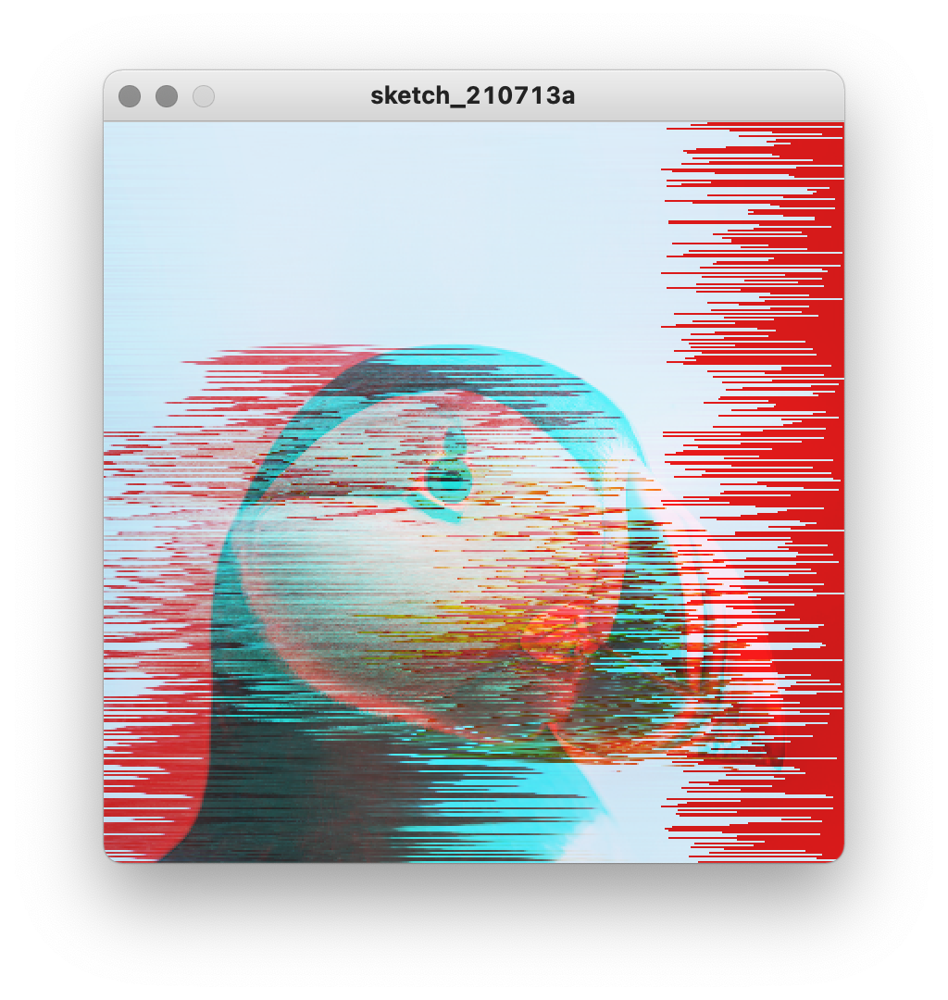
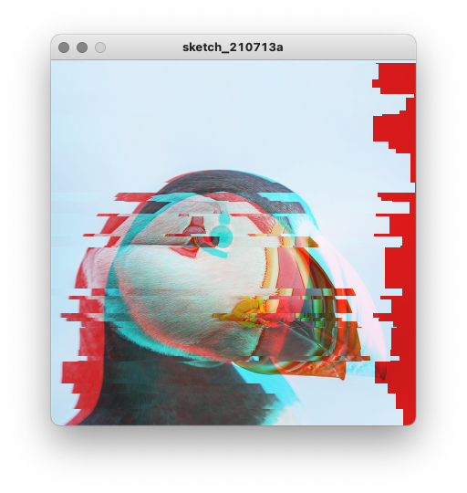

# Glitch

### Loading an image

There are many ways to use preexisting software programs to glitch images, but working with code will allow us to get a better sense of how pixel data actually works.

To start with, we'll need an image. Make one, steal one, do whatever you have to do. I've selected an image of a puffin that I've downloaded from Google Images (control-click on an image, choose "Open Image in New Tab", and then save the image).

<p align="center">
  <br />
  puffin.png<br />
</p>

To start our sketch, we'll set the size of our canvas:

```py
size(400, 400)
```

For the purposes of this sketch, we want our image to be the same size as our canvas. Or rather, we'll resize an image to be the size that we want our canvas to be.

I've used an [online image resizer](https://www.adobe.com/photoshop/online/resize-image.html) to make my puffin 400 x 400 pixels (you'll probably want a larger canvas). Save your image as a .png file if possible. Using Photoshop or some other image editing software also works.

Processing makes loading an image into the sketch very straightforward. To begin, add your image file to the sketch using the Sketch -> Add File option.

<p align="center">
  <br />
</p>

Now, we use the `loadImage()` function to load the image data into a new variable (`puffin`). To display the image, we use the `image()` function, which takes the image data variable as an argument along with an x and y coordinate at which to draw it.

```py
size(400, 400)
puffin = loadImage("puffin.png")    # load the image into a variable
image(puffin, 0, 0)                 # draw the image to the canvas
```

Running this program should simply show the image:

<p align="center">
  <br />
</p>

Once we know our image is being loaded correctly, we're not going to display it directly with `image()` again. Instead, we're going to use the individual pixel data.

### Working with pixel data

The `image.get()` function gets the pixel data from a particular coordinate. For example:
```py
size(400, 400)
puffin = loadImage("puffin.png")    # load the image into a variable
pixel = puffin.get(0, 0)
print(pixel)
```
```
-2954759
```
This number is the raw number that actually contains the R, G, B values for the pixel at 0, 0. We can access the individual components like this:
```py
size(400, 400)
puffin = loadImage("puffin.png")
pixel = puffin.get(0, 0)
r = red(pixel)
g = green(pixel)
b = blue(pixel)
print(r, g, b)
```
```
(210.0, 233.0, 249.0)
```

A lot can be done with this data. For our purposes, let's begin by reconstructing the image using `for` loops:

```py
size(400, 400)
puffin = loadImage("puffin.png")
for y in range(400):
    for x in range(400):
        pixel = puffin.get(x, y)
        r = red(pixel)
        g = green(pixel)
        b = blue(pixel)        
        stroke(r, g, b)
        point(x, y)
```
<p align="center">
  <br />
</p>

Once again, we have the same image of a puffin. But this time, we have used a nested `for` loop to loop through all of the pixels in the image (using `x` and `y` instead of `i` to make the purpose clear). For each of the those pixels, we retrieve the data already draw to the canvas, extract the color data, and draw it to the canvas using `point()`.

Now we can start to play around. For example, we could mess with the colors, putting r, g, and b in all the wrong places:

```py
size(400, 400)
puffin = loadImage("puffin.png")
for y in range(400):
    for x in range(400):
        pixel = puffin.get(x, y)
        r = red(pixel)
        g = green(pixel)
        b = blue(pixel)        
        stroke(b, r, g)
        point(x, y)
```

<p align="center">
  <br />
</p>

Or invert the image by subtracting the values from 255:

```py
size(400, 400)
puffin = loadImage("puffin.png")
for y in range(400):
    for x in range(400):
        pixel = puffin.get(x, y)
        r = red(pixel)
        g = green(pixel)
        b = blue(pixel)        
        stroke(255 - r, 255 - g, 255 - b)
        point(x, y)
```

<p align="center">
  <br />
</p>

We can also play around with shifting the position of pixels. For example, we could subtract x from the width of the canvas, resulting in a flipped image:

```py
size(400, 400)
puffin = loadImage("puffin.png")
for y in range(400):
    for x in range(400):
        pixel = puffin.get(x, y)
        r = red(pixel)
        g = green(pixel)
        b = blue(pixel)        
        stroke(r, g, b)
        point(400 - x, y)
```
<p align="center">
  <br />
</p>


### Advanced `range()` and shapes

Let's revisit `range()`. Thus far, we've usually given `range()` just one argument. But it can also work with _two_ arguments for the starting and stopping values (with one argument, the computer just assumes that the starting value is 0). For example, the following will print all the values from 0 up to (but not including) 100:

```py
for i in range(0, 100):
    print(i)
```
```
0
1
2
.
.
.
97
98
99
```

In fact, `range()` also takes a _third_ argument, skip, which defines how much is increased each time. For example, the following will do the same thing as above, but increment by 10:

```py
for i in range(0, 100, 10):
    print(i)
```
```
0
10
20
.
.
.
70
80
90
```

How is this helpful with our image manipulations? Because maybe we don't want to draw _every_ pixel using point:

```py
size(400, 400)
background(255)  # adding a white background
puffin = loadImage("puffin.png")

for y in range(0, 400, 3):      # every third pixel vertically
    for x in range(0, 400, 3): # every third pixel horizontally
        pixel = puffin.get(x, y)
        r = red(pixel)
        g = green(pixel)
        b = blue(pixel)
        stroke(r, g, b)
        point(x, y)
```
<p align="center">
  <br />
</p>

This comes in particularly handy if we want to make some bigger shapes. For example, let's draw with squares that are 5 pixels wide, and use the skip argument in `range()` to make space for them:

This comes in handy if we want to use some bigger shapes. For example, instead of using `set()` to change a pixel, let's draw with squares that are 5 pixels wide, and use the skip argument in `range()` to make space for them:

```py
size(400, 400)
puffin = loadImage("puffin.png")

for y in range(0, 400, 5):      # every fifth pixel vertically
    for x in range(0, 400, 5): # every fifth pixel horizontally
        pixel = puffin.get(x, y)
        r = red(pixel)
        g = green(pixel)
        b = blue(pixel)
        fill(r, g, b)   # using fill instead of stroke
        square(x, y, 5)
```

<p align="center">
  <br />
</p>

Pushing this technique further, let's use circles instead of squares, spread them out further, and randomize their size:

```py
size(400, 400)
background(255)
puffin = loadImage("puffin.png")

for y in range(0, 400, 10):      # every 10th pixel vertically
    for x in range(0, 400, 10): # every 10th pixel horizontally
        pixel = puffin.get(x, y)
        r = red(pixel)
        g = green(pixel)
        b = blue(pixel)
        fill(r, g, b)
        noStroke()
        circle(x, y, random(3, 10)) # using a random size
```            


<p align="center">
  <br />
</p>

For a more impressionistic variation, let's make them closer again, increase the size, and add some transparency:

```py
size(400, 400)
background(255)
puffin = loadImage("puffin.png")

for y in range(0, 400, 5):      # every fifth pixel vertically
    for x in range(0, 400, 5): # every fifth pixel horizontally
        pixel = puffin.get(x, y)
        r = red(pixel)
        g = green(pixel)
        b = blue(pixel)
        fill(r, g, b, 50)   # adding transparency to color
        noStroke()
        circle(x, y, random(3, 20)) # using a random size
```

<p align="center">
  <br />
</p>

Or, let's make line segments move off in random directions:

```py
size(400, 400)
background(255)
puffin = loadImage("puffin.png")

for y in range(0, 400, 5):
    for x in range(0, 400, 5):
        pixel = puffin.get(x, y)
        r = red(pixel)
        g = green(pixel)
        b = blue(pixel)
        stroke(g, b, r) # swap colors
        line(x, y, x + random(-50, 50), y + random(-50, 50))
```
<p align="center">
  <br />
</p>            

This can start to get very experimental. Here, we're using the red value to control the stroke weight, which makes little intuitive sense, but has an interesting result:

```py
size(400, 400)
background(255)
puffin = loadImage("puffin.png")

for y in range(0, 400, 5):
    for x in range(0, 400, 5):
        pixel = puffin.get(x, y)
        r = red(pixel)
        g = green(pixel)
        b = blue(pixel)
        stroke(r, g, b)
        strokeWeight(r / 5)
        line(x, y, x + random(-5, 5), y + random(-5, 5))              
```

<p align="center">
  <br />
</p>   


<!-- ### Conditionals and gradients

So far, we've been applying the same effect evenly across the image. However, we can also use conditions to make decisions as we go.

For example, using modulo, we can change the code every 25 pixels:

```py
size(400, 400)
background(255)
puffin = loadImage("puffin.png")

for y in range(0, 400, 1):
    for x in range(0, 400, 1):
        pixel = puffin.get(x, y)
        r = red(pixel)
        g = green(pixel)
        b = blue(pixel)
        # noStroke()
        stroke(r, g, b)            
        if x % 50 < 25: # if the remainder when divided by 50 is less than 25...
            point(x, height-y)
        else:
            point(x, y)            
```
<p align="center">
  <br />
</p>   

To have a more gradual effect, we could calculate how far along we are from one end of the screen to the another, and use that value to change an argument. Here's an example of that using `lerpColor()`:

```py
size(400, 400)
background(255)
puffin = loadImage("puffin.png")

for y in range(0, 400, 1):
    for x in range(0, 400, 1):
        pixel = puffin.get(x, y)
        r = red(pixel)
        g = green(pixel)
        b = blue(pixel)

        position = x / 400.0   # horizontal progression from 0-1

        original_color = color(r, g, b)
        crazy_color = color(g, b, 255 - r)
        lerped_color = lerpColor(original_color, crazy_color, position)

        stroke(lerped_color)            
        point(x, y)
```

<p align="center">
  <br />
</p>   -->

### Separating channels and shifting pixels

These effects all produce interesting results. To get closer to a "glitchy" aesthetic, however, we need to reproduce common mistakes of the machine. This includes two common and related artifacts: misregistration, where the R, G, B channels do not line up properly, and pixel-shifting, where pixels are shifted from their positions.

To start with, we're going to grab two pixels instead of just one. The second pixel is going to be offset by a set amount. Then, when we set our stroke value, we're going to mix and match color values from each pixel:

```py
size(400, 400)
puffin = loadImage("puffin.png")
offset = 50
for y in range(400):
    for x in range(400):

        pixel_1 = puffin.get(x, y)
        r_1 = red(pixel_1)
        g_1 = green(pixel_1)
        b_1 = blue(pixel_1)

        pixel_2 = puffin.get(x + offset, y)
        r_2 = red(pixel_2)
        g_2 = green(pixel_2)
        b_2 = blue(pixel_2)

        stroke(r_1, g_2, b_2)   
        point(x, y)
```
<p align="center">
  <br />
</p>
Here we have the color misregistration, which gives a sense of the image being pulled apart. If we wanted to separate all three color channels, we could pull another pixel from a different offset.

However, another thing we could try is to vary the offset. For example, let's choose a new random offset for each row:

```py
size(400, 400)
puffin = loadImage("puffin.png")
offset = 0
for y in range(400):
    offset = random(100)
    offset = int(offset)  # do this to avoid an error
    for x in range(400):
        pixel_1 = puffin.get(x, y)
        r_1 = red(pixel_1)
        g_1 = green(pixel_1)
        b_1 = blue(pixel_1)

        pixel_2 = puffin.get(x + offset, y)
        r_2 = red(pixel_2)
        g_2 = green(pixel_2)
        b_2 = blue(pixel_2)

        stroke(r_1, g_2, b_2)   
        point(x, y)
```
<p align="center">
  <br />
</p>

This looks a bit extreme. But what if instead of shifting things for every row, we only did it occasionally?

One way to set up this kind of probability is to "roll the dice" with a conditional statement: get a random number up to 100, and if it's less than the probability you want something to happen, do that thing. ie, this will produce a 10% chance of something happening:

```py
if random(100) < 10:
    do the thing
```

Let's use this technique to control the selection of a new offset:
```py
size(400, 400)
puffin = loadImage("puffin.png")
offset = 0
for y in range(400):
    if random(100) < 10:
        offset = random(50)   # set to a lower value to tone down the effect
        offset = int(offset)  # do this to avoid an error
    for x in range(400):
        pixel_1 = puffin.get(x, y)
        r_1 = red(pixel_1)
        g_1 = green(pixel_1)
        b_1 = blue(pixel_1)

        pixel_2 = puffin.get(x + offset, y)
        r_2 = red(pixel_2)
        g_2 = green(pixel_2)
        b_2 = blue(pixel_2)

        stroke(r_1, g_2, b_2)   
        point(x, y)
```

<p align="center">
  <br />
</p>

Notice that we used a conditional statement. Since x and y are always incrementing in our loops, using these with `if` statements is a very useful tool when we want changes to apply to just a portion of the canvas:

```py
size(400, 400)
puffin = loadImage("puffin.png")
offset = 0
for y in range(400):
    if random(100) < 10:
        offset = random(50)   # set to a lower value to tone down the effect
        offset = int(offset)  # do this to avoid an error
    for x in range(400):
        pixel_1 = puffin.get(x, y)
        r_1 = red(pixel_1)
        g_1 = green(pixel_1)
        b_1 = blue(pixel_1)

        # apply "fuzz" to the right half of the image
        if x < 200:
            fuzz = 0
        else:
            fuzz = random(50)
            fuzz = int(fuzz)

        pixel_2 = puffin.get(x + offset, y + fuzz)
        r_2 = red(pixel_2)
        g_2 = green(pixel_2)
        b_2 = blue(pixel_2)

        # different color combination for the top and bottom of the image
        if y > 250:
            stroke(r_1, g_2, b_1)
        else:
            stroke(r_1, g_2, b_2)   

        point(x, y)
```

<p align="center">
  <br />
</p>
Now we're really getting some glitch going. Imagine using different offsets for different channels, adding vertical offset, combining multiple images, using transparency, etc...

### Repeated applications

One parting thought. What if you generated an output image from this code, and then put it back through your sketch as the input image?
