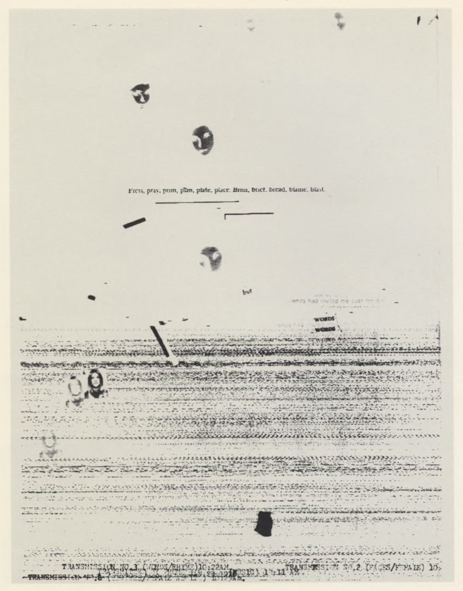

# Glitch

## Concept

In this course, we've been working with images and text by defining algorithms to produce them. But way back with our first unit, we learned how computers use numbers to represent everything. This includes digital images, which, whether created by us or downloaded from the internet, are composed of individual pixels with their own color value.

This provides us with another approach to work with images. Rather than build them up with shapes like lines and circles, we can start with pixel values. By creatively misusing these data, we can expressively transform the image to our own artistic ends. This includes effects that might be classified as intentional "glitches"—corruption in data that might appear to be mistakes but which are nonetheless aesthetically interesting.

## Context

The idea of interesting mistakes is really endemic to the art-making process—no artist works without experimentation, and not all results are planned. When it comes to making machines make the mistakes for us, an early and iconic example might be Nam June Paik (1932–2006), a Korean American who anticipated the development of the internet and media art as a genre. His _TV Magnet_ and many experiments like it interfered with the normal functioning of a TV, which worked with cathode ray tubes at that time. A large magnet disrupted the scanning process of the ray, producing an abstract image instead of the original signal:

   
  Nam June Paik, <i>TV Magnet</i> (1965)

This work is meant to be subversive, as it undermines the authoritative power of the television broadcast, but the method it uses, making something "dysfunctional," has its own sense of beauty. The word "glitch" came into popular usage around the same time as Paik's experiments, thanks to the (very famous at the time) astronaut John Glenn, who mentioned the use of the term among NASA engineers (likely of Yiddish origin).

The advent of communications technology that could transfer visual documents offered the opportunity for glitches to interfere with the transmission. Using a teleprinter, William Larson produced some early examples of what we might recognize as a "glitch aesthetic" today by interleaving photography, text, and audio data.

   
  William Larson, from <i>Fireflies</i> (1975)

By the late 1970s, video games were becoming available as some of the first widely available digital media, along with the possibility of glitching them. _Digital TV Dinner_ (1978) by Raul Zaritsky, Jamie Fenton, and Dick Ainsworth, misused the cartridges for Bally Astrocade console game, creating errors that would render as patterns on the TV screen (and a glitchy soundtrack).

   
  Raul Zaritsky, Jamie Fenton, and Dick Ainsworth, <i>Digital TV Dinner</i> (1979) 
  <a href="https://www.youtube.com/watch?v=Ad9zdlaRvdM">Video here</a>

Rosa Menkman (1983–) is an artist and curator primarily working in digital video that has extensively explored "glitch art" as a genre unto itself. She comments that:
>    On the one hand, there are the tactical and critical artists who use the technique to criticize popular culture, and on the other hand the technique now is very much alive and part of this same culture.
    —Rosa Menkmen, _The Glitch Moment(um)_

   
  Rosa Menkman, examples of digital glitch techniques from <i>The Glitch Moment(um)</i> (2011)

While earlier forms of glitch were limited to hardware errors, code and data mean glitches can happen on an information level and can therefore be created intentionally with image editing programs, or even with code.

Mathieu St-Pierre provides one example, _Melting Ice Cream_ (2012), a series of images that takes still video frames (of ice cream) and manipulates them to develop a whole other idea of melting:

   
  Mathieu St-Pierre, from <i>Melting Ice Cream</i> (2012)

Some others:

   
  Jarid Scott (2017)

   
  Thomas Collett (2018)

   
  Tobias Lofgren (2018)

