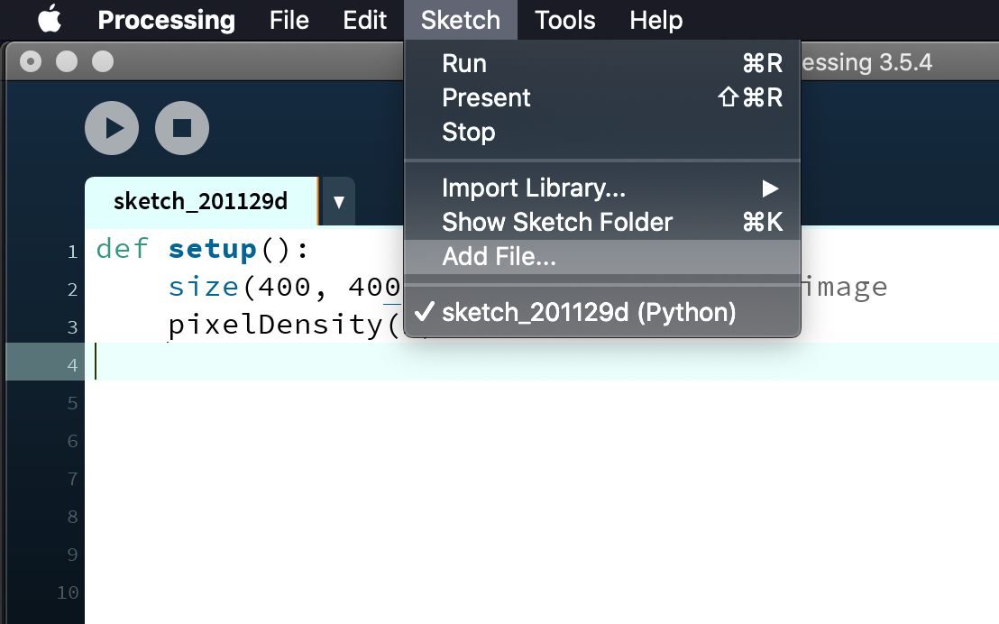
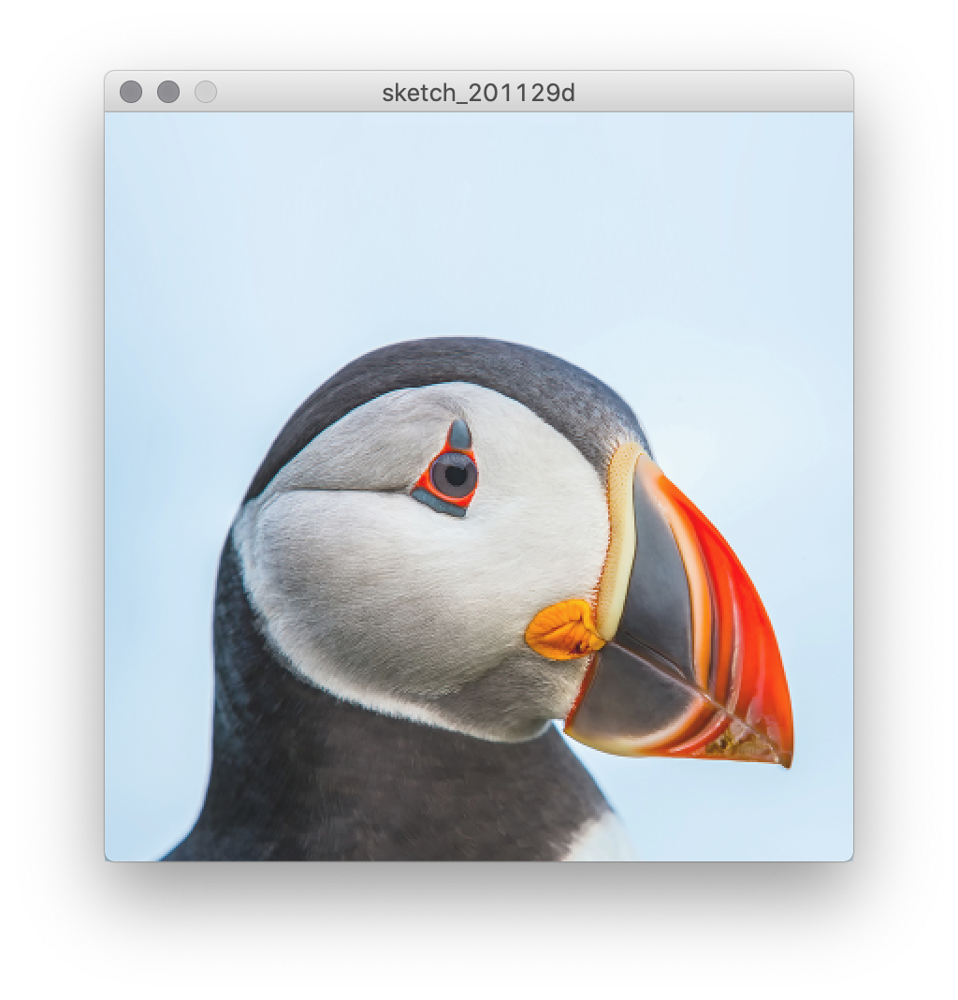
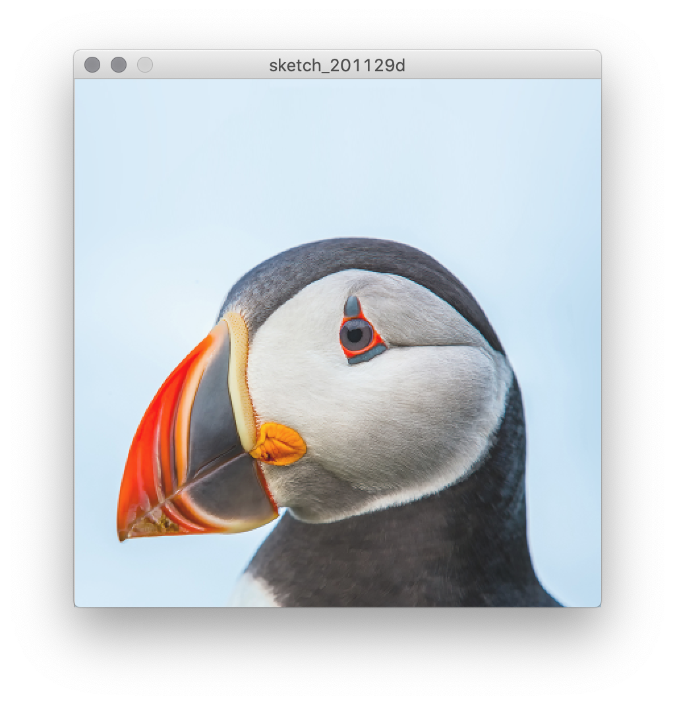
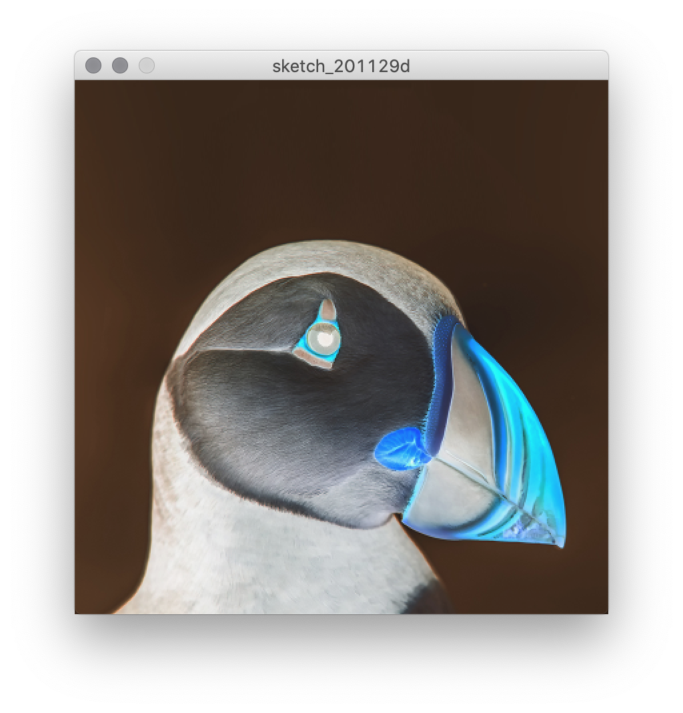
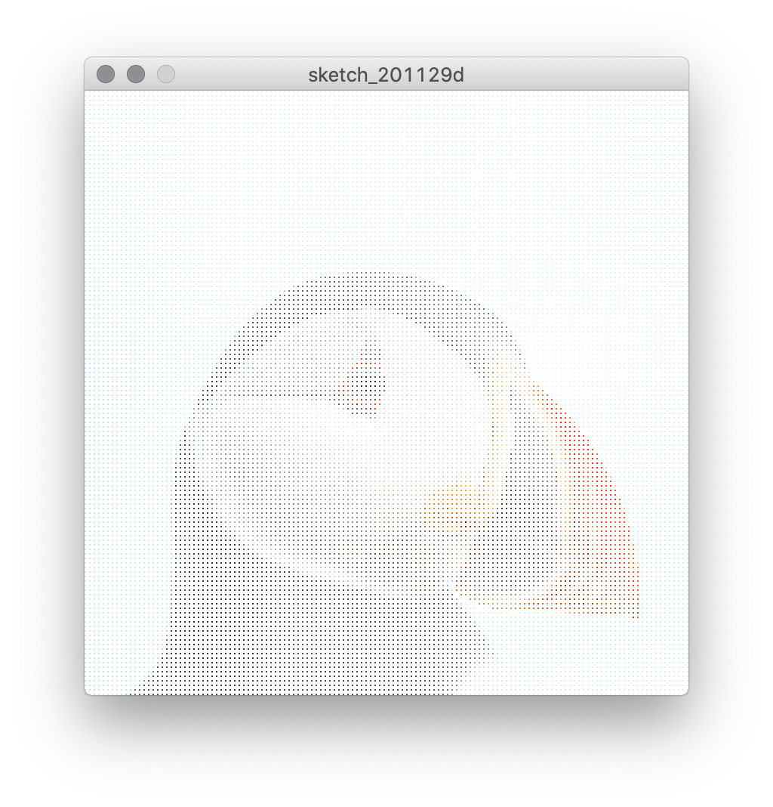
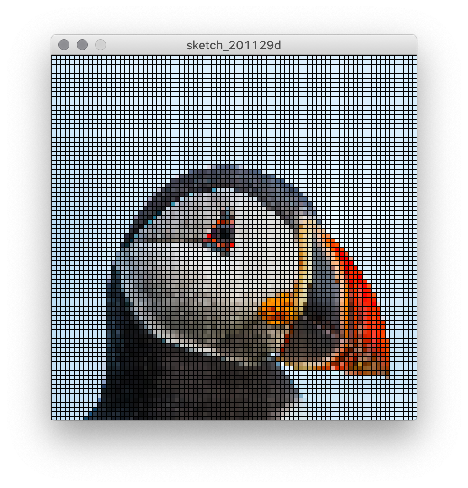
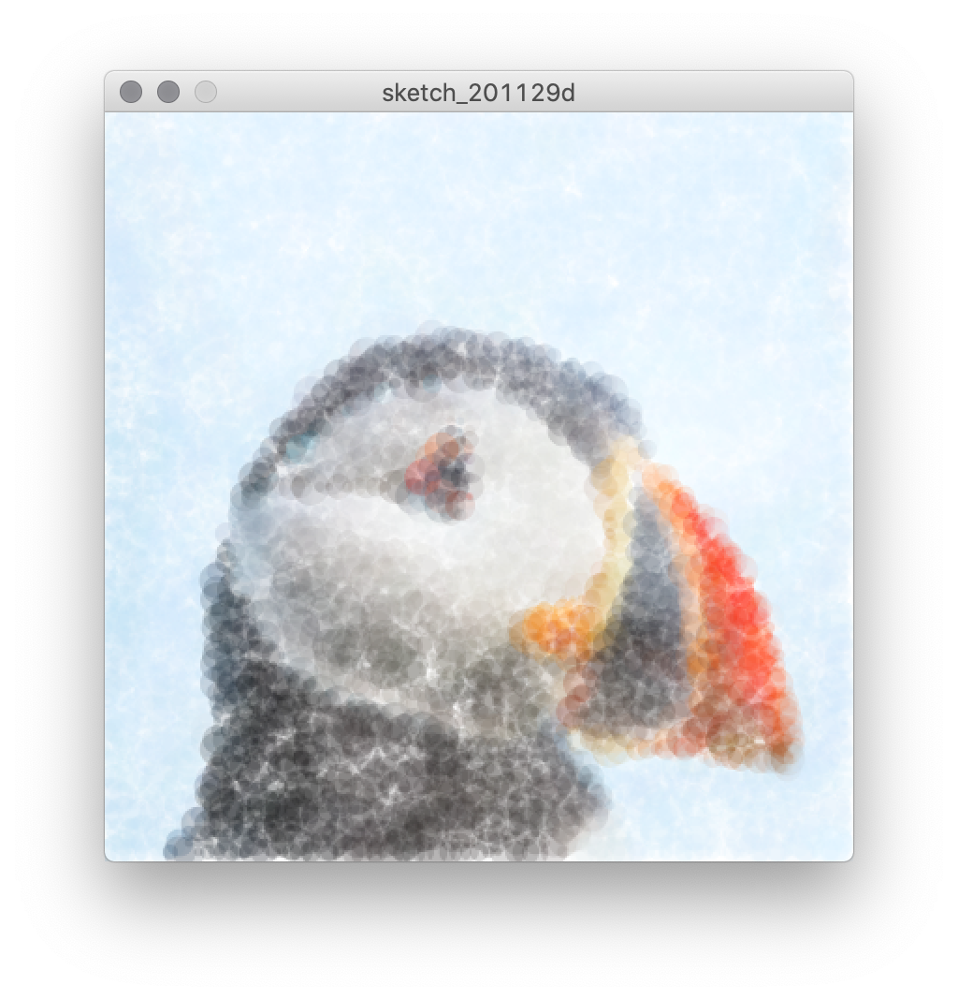
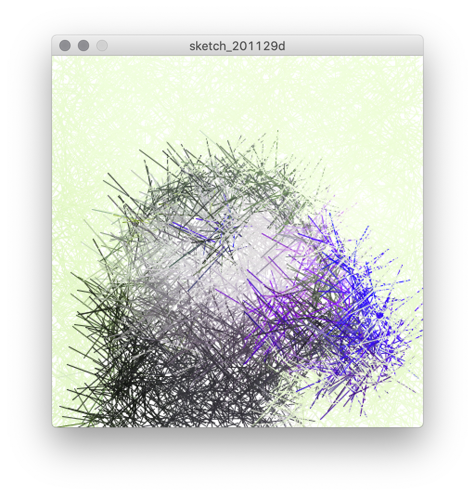

# Glitch

In this course, we've been working with images and text by defining algorithms to produce them. But way back with **encoding**, we learned how computers use numbers to represent everything. This includes the images that we save—when we make a file, our image becomes a static set of numerical data. By loading that data back into processing, we can use that data to produce new images based on the original, but with artistic modifications.

## Code

### Loading an image

For the purposes of this sketch, we want to select an image that is the same size as our canvas. Or rather, we'll resize an image to be the size that we want our canvas to be.

For the purpose of demonstration, I've selected an image of a puffin that I've stolen from Google Images. I've then used an [online image resizer](https://www.adobe.com/photoshop/online/resize-image.html) to make it 400 x 400 pixels (you'll probably want a larger canvas). Save your image as a .png file if possible.

<p align="center">
  <br />
  puffin.png<br />
</p>

To start our sketch, we'll create `setup()` and set the size of our canvas.

```py
def setup():
    size(400, 400)  # same size as the image
```

Processing makes loading an image very straightforward. To begin, add your image file to the sketch using the Sketch -> Add File option.

<p align="center">
  <br />
</p>

Now, we use the `loadImage()` function to load the image data into a new variable using the name of the file. We're also going to make this a global variable off the bat in case we need it later.

```py
def setup():
    global puffin   # global variable to store our image data

    size(400, 400)  # same size as the image

    puffin = loadImage("puffin.png") # load the image data
```

To display the image, we use the `image()` function, which takes the image data variable as a parameter along with an x and y coordinate at which to draw it.

```py
def setup():
    global puffin   # global variable to store our image data

    size(400, 400)  # same size as the image

    puffin = loadImage("puffin.png") # load the image data
    image(puffin, 0, 0)
```

<p align="center">
  <br />
</p>


### Working with pixel data

Once we know our image is being loaded correctly, we're not going to display it directly with `image()` again. Instead, we're going to use the individual pixel data.

The `image.get()` function gets the pixel data from a particular coordinate. For example:

```py
pixel = puffin.get(0, 0)
print(pixel)
```
```
-3355444
```
This number is the raw number that actually contains the color values for the pixel at 0, 0. We can access the individual components like this:
```py
pixel = puffin.get(0, 0)
r = red(pixel)
g = green(pixel)
b = blue(pixel)
print(r, g, b)
```
```
(204.0, 204.0, 204.0)
```
We can use this information to do all sorts of interesting things. For our purposes, let's begin by reconstructing the image using `for` loops:

```py
def setup():
    global puffin
    size(400, 400)
    puffin = loadImage("puffin.png")

    for x in range(0, width):
        for y in range(0, height):
            pixel = puffin.get(x, y)
            r = red(pixel)
            g = green(pixel)
            b = blue(pixel)
            stroke(r, g, b)
            point(x, y)
```
<p align="center">
  <br />
</p>

Once again, we have an image of a puffin. But this time, we have used a nested `for` loop to loop through all of the pixels in the image (using `x` and `y` instead of `i` to make the purpose clear). For each of the those pixels, we retrieve the data from our image, extract the color data and use it for `stroke()`, and then draw a point at the same spot. It looks nearly same, but it's a recreated version.

Now we can start to play around. For example, say we wanted to flip the image horizontally. We could just subtract x from the width of the image:

```py
def setup():
    global puffin
    size(400, 400)
    puffin = loadImage("puffin.png")

    for x in range(0, width):
        for y in range(0, height):
            pixel = puffin.get(x, y)
            r = red(pixel)
            g = green(pixel)
            b = blue(pixel)
            stroke(r, g, b)
            point(width - x, y)
```            

<p align="center">
  <br />
</p>

More interestingly, we could mess with the colors, putting r, g, and b in all the wrong places:

```py
def setup():
    global puffin
    size(400, 400)
    puffin = loadImage("puffin.png")

    for x in range(0, width):
        for y in range(0, height):
            pixel = puffin.get(x, y)
            r = red(pixel)
            g = green(pixel)
            b = blue(pixel)
            stroke(b, r, g)
            point(x, y)
```

<p align="center">
  <br />
</p>

Or invert the image by subtracting the values from 255:

```py
def setup():
    global puffin
    size(400, 400)
    puffin = loadImage("puffin.png")

    for x in range(0, width):
        for y in range(0, height):
            pixel = puffin.get(x, y)
            r = red(pixel)
            g = green(pixel)
            b = blue(pixel)
            stroke(255 - r, 255 - g, 255 - b)
            point(x, y)
```

<p align="center">
  <br />
</p>


### Advanced `range()` and shapes

Manipulating the colors is great, and there's a lot that can be done with that. But we can more drastically alter things if we use a drawing function other than `point()`.

First, however, let's revisit `range()`. Thus far, we've given `range()` two parameters for the starting and stopping values (or just one parameter if the starting value is 0). For example, the following will print all the values from 0 up to (but not including) 100:

```py
for i in range(0, 100):
    print(i)
```
```
0
1
2
.
.
.
97
98
99
```

However, `range()` also takes a _third_ parameter, skip, which defines how much is increased each time. For example, the following will do the same thing as above, but increment by 10:

```py
for i in range(0, 100, 10):
    print(i)
```
```
0
10
20
.
.
.
70
80
90
```

How is this helpful with our images? Because maybe we don't want to draw _every_ pixel:

```py
def setup():
    global puffin
    size(400, 400)
    background(255)  # adding a white background
    puffin = loadImage("puffin.png")

    for x in range(0, width, 3):      # every third pixel horizontally
        for y in range(0, height, 3): # every third pixel vertically
            pixel = puffin.get(x, y)
            r = red(pixel)
            g = green(pixel)
            b = blue(pixel)
            stroke(r, g, b)
            point(x, y)
```
<p align="center">
  <br />
</p>

This comes in handy if we want to make some bigger shapes. For example, let's draw with squares that are 5 pixels wide, and use the skip parameter in `range()` to make space for them:

```py
def setup():
    global puffin
    size(400, 400)
    background(255)
    puffin = loadImage("puffin.png")

    for x in range(0, width, 5):      # every fifth pixel horizontally
        for y in range(0, height, 5): # every fifth pixel vertically
            pixel = puffin.get(x, y)
            r = red(pixel)
            g = green(pixel)
            b = blue(pixel)
            fill(r, g, b)   # using fill instead of stroke
            square(x, y, 5)
```

<p align="center">
  <br />
</p>

Pushing this technique further, let's use circles instead of squares, spread them out further, and randomize their size:

```py
def setup():
    global puffin
    size(400, 400)
    background(255)
    puffin = loadImage("puffin.png")

    for x in range(0, width, 10):      # every 10th pixel horizontally
        for y in range(0, height, 10): # every 10th pixel vertically
            pixel = puffin.get(x, y)
            r = red(pixel)
            g = green(pixel)
            b = blue(pixel)
            fill(r, g, b)
            noStroke()
            circle(x, y, random(3, 10)) # using a random size
```            


<p align="center">
  <br />
</p>

For a more impressionistic variation, let's make them closer again, increase the size, and add some transparency:

```py
def setup():
    global puffin
    size(400, 400)
    background(255)
    puffin = loadImage("puffin.png")

    for x in range(0, width, 5):      # every fifth pixel horizontally
        for y in range(0, height, 5): # every fifth pixel vertically
            pixel = puffin.get(x, y)
            r = red(pixel)
            g = green(pixel)
            b = blue(pixel)
            fill(r, g, b, 50)   # adding transparency to color
            noStroke()
            circle(x, y, random(3, 20)) # using a random size
```

<p align="center">
  <br />
</p>

Inspired by some of the brush examples, let's make line segments move off in random directions:

```py
def setup():
    global puffin
    size(400, 400)
    background(255)
    puffin = loadImage("puffin.png")

    for x in range(0, width, 5):
        for y in range(0, height, 5):
            pixel = puffin.get(x, y)
            r = red(pixel)
            g = green(pixel)
            b = blue(pixel)
            stroke(g, b, r) # swap colors
            line(x, y, x + random(-50, 50), y + random(-50, 50))
```
<p align="center">
  <br />
</p>            

This can start to get very experimental. Here, we're using the red value to control the stroke weight, which makes little intuitive sense, but has an interesting result:

```py
def setup():
    global puffin
    size(400, 400)
    background(255)
    puffin = loadImage("puffin.png")

    for x in range(0, width, 5):
        for y in range(0, height, 5):
            pixel = puffin.get(x, y)
            r = red(pixel)
            g = green(pixel)
            b = blue(pixel)
            stroke(r, g, b)
            strokeWeight(r / 5)
            line(x, y, x + random(-5, 5), y + random(-5, 5))              
```

<p align="center">
  <br />
</p>   


### Conditionals and gradients

So far, we've been applying the same effect evenly across the image. However, we can also use conditions to make decisions as we go.

For example, using modulo, we can change the code every 25 pixels:

```py
def setup():
    global puffin
    size(400, 400)
    background(255)
    puffin = loadImage("puffin.png")

    for x in range(0, width, 1):
        for y in range(0, height, 1):
            pixel = puffin.get(x, y)
            r = red(pixel)
            g = green(pixel)
            b = blue(pixel)
            # noStroke()
            stroke(r, g, b)            
            if x % 50 < 25: # if the remainder when divided by 50 is less than 25...
                point(x, height-y)
            else:
                point(x, y)            
```
<p align="center">
  <br />
</p>   

To have a more gradual effect, we could calculate how far along we are from one end of the screen to the another, and use that value to change a parameter. Here's an example of that using `lerpColor()`:

```py
def setup():
    global puffin
    size(400, 400)
    background(255)
    puffin = loadImage("puffin.png")

    for x in range(0, width, 1):
        for y in range(0, height, 1):
            pixel = puffin.get(x, y)
            r = red(pixel)
            g = green(pixel)
            b = blue(pixel)

            position = x / 400.0   # horizontal progression from 0-1

            original_color = color(r, g, b)
            crazy_color = color(g, b, 255 - r)
            lerped_color = lerpColor(original_color, crazy_color, position)

            stroke(lerped_color)            
            point(x, y)
```

<p align="center">
  <br />
</p>  

## Sketch #7

For this sketch, you will create a "glitch" version of an image of your choice. Create a transformation of the original that is your own (not a copy of these examples) and which serves an aesthetic and conceptual purpose in relation to the original image.

Submit your code along with a [3-sentence description](../../resources/description_guidelines.md). Include the original image along with an image of your reimagined version.
