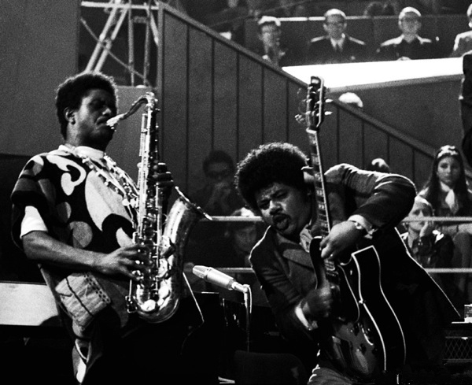
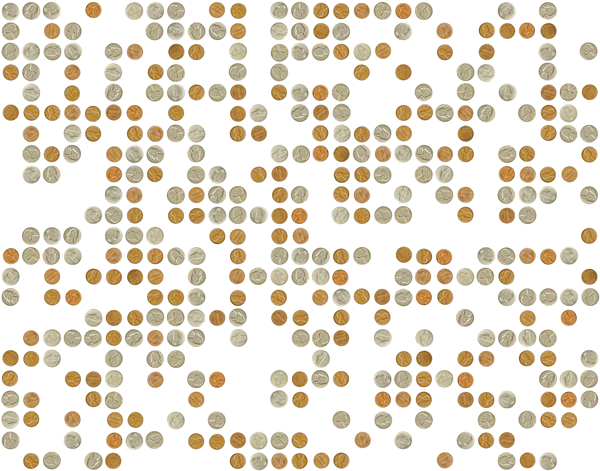
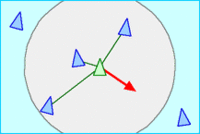
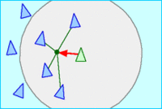
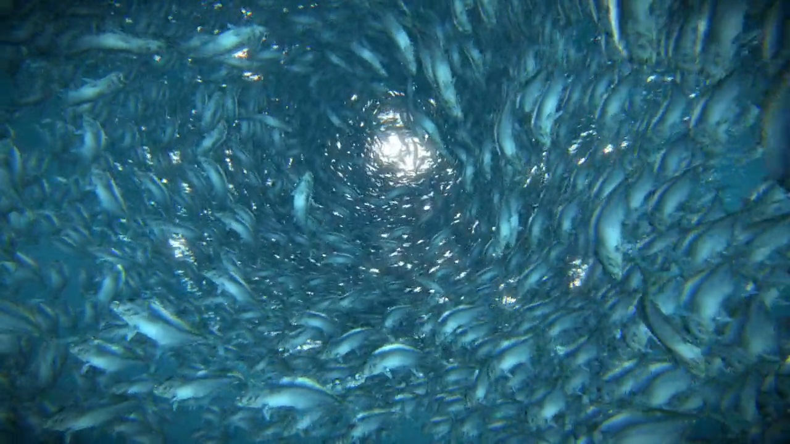
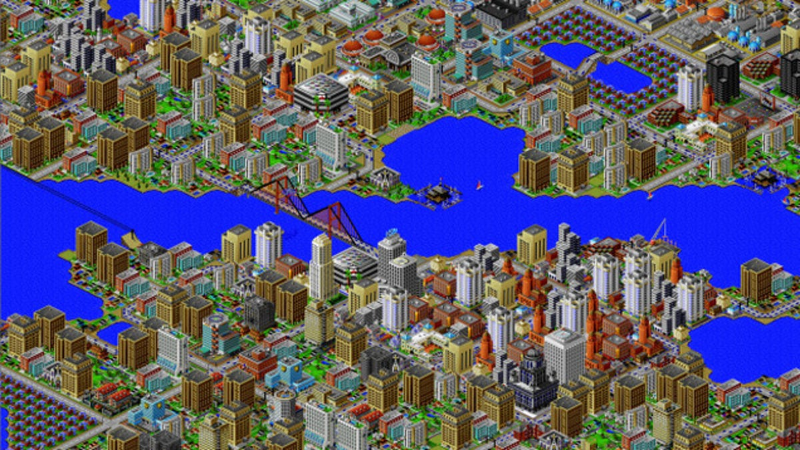
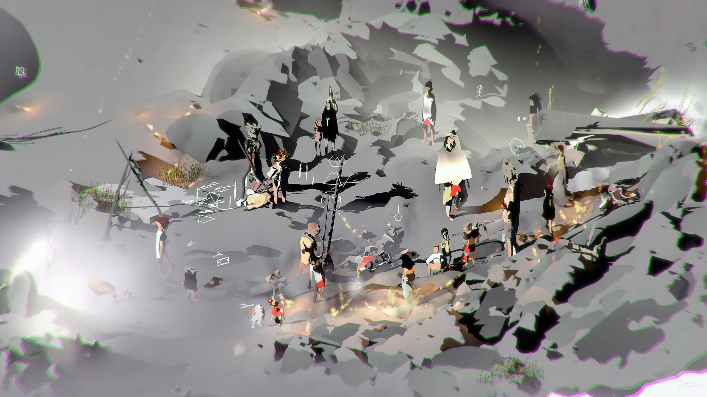

# Emergence

## Concept

It's likely you've heard Aristotle's phrase, "the whole is more than the sum of its parts." It implies that when things come together, there is a qualitative shift in what they mean and do, and in art practice we're surrounded by examples—whether the effect produced by the juxtaposition of two colors or the rhythm that arises from repeating a pattern, the potential of new tools to stimulate new ideas, or the productive exchange of inspiration that happens in a group of peers. In science, systems theory attempts to understand the world in terms of such interactions between elements. The behavior of markets, the human brain, the global climate, local ecosystems, and many other phenomena have been approached in this way.

This property of systems is often called _emergence_, and computers have been instrumental in exploring how it works. Computers essentially do just one thing, which is to make simple calculations, but they do this very rapidly. So by starting with very basic quantitative interactions between elements, they can extrapolate what happens over time, and result often demonstrates a high degree of complexity. From the early days calculating ballistic trajectories to today's non-player characters in open-world simulations, digital media and emergence have gone hand in hand.

## Context

### Non-digital

All art deals with emergence in some respect, some more directly than others. Impressionism, for example, relies on an awareness on the part of the artist of how the mind will combine small but individually distinct brushstrokes into a larger scene.

   
  Claude Monet, <i>Woman with a Parasol</i> (1875)

Ultimately, however, emergence implies an effect over time, and so it is suited to a time-based medium. In this respect, musical idioms that emphasize collective improvisation are concerned with emergence; free jazz provides a good example of a form in which the aesthetic outcome is heavily dependent on moment-to-moment interaction between the musicians.

   
  Pharoah Sanders and Sonny Sharrock, 1992

One early example of the use of emergent principles to model social behavior comes from the economist Thomas Schelling in 1971. He was interested in the dynamics of residential segregation, and represented two races with pennies and nickels arranged randomly on a grid. Individuals were "unhappy" if they were a racial minority (for example, a penny surrounded by too many nickels), and if an individual was unhappy, they would move to an open square. Playing this out (with the help of many grad students), Schelling showed that even this slight individual preference always resulted in marked segregation. However, this model completely disregards structural inequality and recasts institutional racism as innocent personal preference—later research has shown that in reality, one-sided discrimination plays a more significant role.

   
  From <a href="https://www.e-flux.com/architecture/are-friends-electric/289193/homophily-the-urban-history-of-an-algorithm/">"Homophily: The Urban History of an Algorithm"</a>

### Digital

Schelling's physical model is an example of a cellular automaton (CA), a way of modeling behavior in a simple system that is closely tied to the history of computation. Initially formulated by mathematicians Stanislaw Ulam and John von Neumann at Los Alamos (the research center that designed the atomic bomb), CAs begin with a grid of "cells." Each cell has a state, typically "on" and "off." There is then a set of rules that determine what happens in each cell according to the states of its eight adjacent neighbors.

Perhaps the most well-known CA is called the "Game of Life," which was devised by John Conway in 1970 and has subsequently been studied extensively. The rules of the Game of Life are simple:

- any live cell with two or three live neighbors survives
- any dead cell with three live neighbors becomes a live cell
- all other live cells die in the next generation; all other dead cells stay dead

From these simple rules, incredible complexity emerges. Academics and hobbyists have spent countless hours defining and naming all the various dynamic structures that emerge from these rules.

   
  A single "Gosper's glider gun" creating "gliders"

   
  A "puffer-train"

Leaving behind grid-based systems, emergence is often demonstrated in terms of the behavior of "agents." An agent is typically moving in a two- or three-dimensional world with a set of motivations governing its behavior (although behavior other than movement might also be modeled). This kind of setup easily lends itself to both robotics and simulations of biological creatures. One of the most enduring phenomena in agent-based modeling came from computer-graphics pioneer Craig Reynolds in 1986: flocking.

Reynolds agents, which he called "boids," follow three rules:
- separation: steer to avoid crowding local flockmates
- alignment: steer towards the average heading of local flockmates
- cohesion: steer to move towards the average position (center of mass) of local flockmates

     
    Separation 
     
    Alignment 
     
    Cohesion

Put together, these steering mechanisms create a effect analogous to birds flocking, in which groups of boids coalesce, break apart, and flow throughout the simulation space in an organic manner:

   
  Boids

Simulations like these are central to the field of Artificial Life, which sits somewhere between art and science, and seeks to create models that on some level cease to be models, demonstrating their own living characteristics.

Artists have expanded on these principles to create amazing graphics. One practitioner is Robert Hodgin, who originally studied sculpture before turning to digital media. He has extrapolated flocking algorithms to create elaborate dynamic scenes, such as this work from 2015:

   
  Robert Hodgin, <i>Fish Tornado</i> (2015) <a href="https://vimeo.com/132161782">video</a>

A discussion of digital media and emergence would be remiss to omit a reference to the Sim-series video games by Will Wright, who incorporated the principle of emergence into gameplay. From the original SimCity to the current Sims series, the interaction between relatively agents determines larger dynamics.

   
  Scene from SimCity 2000 (1993)

Contemporary artists and independent game designers have taken a more reflective and stance toward simulation and emergence, given its somewhat problematic history and the demographic unbalance of the field.

[Ian Cheng](https://en.wikipedia.org/wiki/Ian_Cheng) is one, who is interested in "an agent’s capacity to deal with an ever-changing environment." His trilogy _Emissaries_ is described as "video games that play themselves," features a cast of flora and fauna that interact, intervene and recombine in an open-ended narrative that meditates on vulnerability and resilience.

   
  Ian Cheng, <i>Emissaries</i> (2015–2017) <a href="https://www.moma.org/calendar/exhibitions/3656">video</a>

