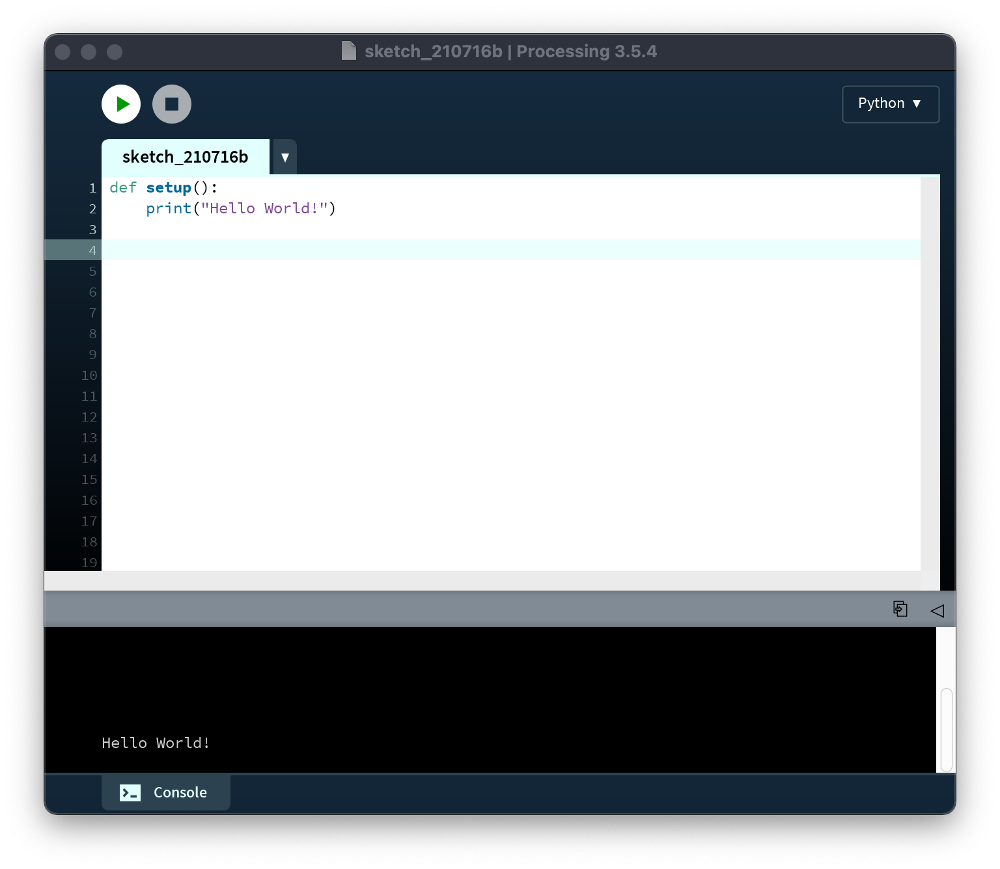

# Emergence

## Concept

It's likely you've heard Aristotle's phrase, "the whole is more than the sum of its parts." It implies that when things come together, there is a qualitative shift in what they mean and do, and in art practice we're surrounded by examples—whether the effect produced by the juxtaposition of two colors or the rhythm that arises from repeating a pattern, the potential of new tools to stimulate new ideas, or the productive exchange of inspiration that happens in a group of peers. In science, systems theory attempts to understand the world in terms of such interactions between elements. The behavior of markets, the human brain, the global climate, local ecosystems, and many other phenomena have been approached in this way.

This property of systems is often called _emergence_, and computers have been instrumental in exploring how it works. Computers essentially do just one thing, which is to make simple calculations, but they do this very rapidly. So by starting with very basic quantitative interactions between elements, they can extrapolate what happens over time, and result often demonstrates a high degree of complexity. From the early days calculating ballistic trajectories to today's non-player characters in open-world simulations, digital media and emergence have gone hand in hand.

## Context

### Non-digital

All art deals with emergence in some respect, some more directly than others. Impressionism, for example, relies on an awareness on the part of the artist of how the mind will combine small but individually distinct brushstrokes into a larger scene.

<p align="center">
  <br />
  Claude Monet, <i>Woman with a Parasol</i> (1875)
</p>

Ultimately, however, emergence implies an effect over time, and so it is suited to a time-based medium. In this respect, musical idioms that emphasize collective improvisation are concerned with emergence; free jazz provides a good example of a form in which the aesthetic outcome is heavily dependent on moment-to-moment interaction between the musicians.

<p align="center">
  <br />
  Pharoah Sanders and Sonny Sharrock, 1992
</p>

One early example of the use of emergent principles to model social behavior comes from the economist Thomas Schelling in 1971. He was interested in the dynamics of residential segregation, and represented two races with pennies and nickels arranged randomly on a grid. Individuals were "unhappy" if they were a racial minority (for example, a penny surrounded by too many nickels), and if an individual was unhappy, they would move to an open square. Playing this out (with the help of many grad students), Schelling showed that even this slight individual preference always resulted in marked segregation. However, this model completely disregards structural inequality and recasts institutional racism as innocent personal preference—later research has shown that in reality, one-sided discrimination plays a more significant role.

<p align="center">
  <br />
  From <a href="https://www.e-flux.com/architecture/are-friends-electric/289193/homophily-the-urban-history-of-an-algorithm/">"Homophily: The Urban History of an Algorithm"</a>
</p>


### Digital

Schelling's physical model is an example of a cellular automaton (CA), a way of modeling behavior in a simple system that is closely tied to the history of computation. Initially formulated by mathematicians Stanislaw Ulam and John von Neumann at Los Alamos (the research center that designed the atomic bomb), CAs begin with a grid of "cells." Each cell has a state, typically "on" and "off." There is then a set of rules that determine what happens in each cell according to the states of its eight adjacent neighbors.

Perhaps the most well-known CA is called the "Game of Life," which was devised by John Conway in 1970 and has subsequently been studied extensively. The rules of the Game of Life are simple:

- any live cell with two or three live neighbors survives
- any dead cell with three live neighbors becomes a live cell
- all other live cells die in the next generation; all other dead cells stay dead

From these simple rules, incredible complexity emerges. Academics and hobbyists have spent countless hours defining and naming all the various dynamic structures that emerge from these rules.

<p align="center">
  <br />
  A single "Gosper's glider gun" creating "gliders"
</p>


<p align="center">
  <br />
  A "puffer-train"
</p>

Leaving behind grid-based systems, emergence is often demonstrated in terms of the behavior of "agents." An agent is typically moving in a two- or three-dimensional world with a set of motivations governing its behavior (although behavior other than movement might also be modeled). This kind of setup easily lends itself to both robotics and simulations of biological creatures. One of the most enduring phenomena in agent-based modeling came from computer-graphics pioneer Craig Reynolds in 1986: flocking.

Reynolds agents, which he called "boids," follow three rules:
- separation: steer to avoid crowding local flockmates
- alignment: steer towards the average heading of local flockmates
- cohesion: steer to move towards the average position (center of mass) of local flockmates

<p align="center">
    <br />
    Separation<br />
    <br />
    Alignment<br />
    <br />
    Cohesion
</p>

Put together, these steering mechanisms create a effect analogous to birds flocking, in which groups of boids coalesce, break apart, and flow throughout the simulation space in an organic manner:
<p align="center">
  <br />
  Boids
</p>

Simulations like these are central to the field of Artificial Life, which sits somewhere between art and science, and seeks to create models that on some level cease to be models, demonstrating their own living characteristics.

Artists have expanded on these principles to create amazing graphics. One practitioner is Robert Hodgin, who originally studied sculpture before turning to digital media. He has extrapolated flocking algorithms to create elaborate dynamic scenes, such as this work from 2015:

<p align="center">
  <br />
  Robert Hodgin, <i>Fish Tornado</i> (2015) <a href="https://vimeo.com/132161782">video</a>
</p>


A discussion of digital media and emergence would be remiss to omit a reference to the Sim-series video games by Will Wright, who incorporated the principle of emergence into gameplay. From the original SimCity to the current Sims series, the interaction between relatively agents determines larger dynamics.

<p align="center">
  <br />
  Scene from SimCity 2000 (1993)
</p>

Contemporary artists and independent game designers have taken a more reflective and stance toward simulation and emergence, given its somewhat problematic history and the demographic unbalance of the field.

[Ian Cheng](https://en.wikipedia.org/wiki/Ian_Cheng) is one, who is interested in "an agent’s capacity to deal with an ever-changing environment." His trilogy _Emissaries_ is described as "video games that play themselves," features a cast of flora and fauna that interact, intervene and recombine in an open-ended narrative that meditates on vulnerability and resilience.

<p align="center">
  <br />
  Ian Cheng, <i>Emissaries</i> (2015–2017) <a href="https://www.moma.org/calendar/exhibitions/3656">video</a>
</p>

## Code

### `setup()`, `draw()`, and global variables

So far, we've used Python functions written by others, whether to make graphics in Processing or via `import` commands to manipulate text or use variations on the random module. We've also written our own functions to make rooms in nonlinear narratives and recursive drawings. Now, we're going to use functions in yet another, slightly different way.

When we write functions that have certain specific names, Processing will know to call those functions for us under certain circumstances. These are called **event handlers**.

`setup()` is the most boring of these. This function is called once when the sketch is first run:

<p align="center">
  <br />
</p>

Notice how this function runs even though we didn't call it explicitly (which we had to do for our functions in the nonlinearity sketch, for instance).

Once we start using handlers, _all_ of our code has to be contained in functions. So `setup()` doesn't do much for us other than give us a place to put the kind of code we've been working with so far—that is, code that is intended to be run just once. For example, from now on, we'll put `size()` inside of setup.

The interesting stuff starts with `draw()`. Processing calls `draw()` over and over again, once every 1/30th of a second. The implications of this are profound, because it allows us to do animation (the reason that it is 1/30th of a second is that this is the standard frame rate for digital video).

To start with, let's draw a circle:

```py
def setup(): # runs just once
    size(400, 400)

def draw(): # runs over and over again
    circle(200, 200, 30)    
```

<p align="center">
  <br />
</p>

So far, `setup()` is called right when the sketch is run, and it initializes the canvas. Then, `draw()` is called and it in turn calls `circle()`. In fact, the code inside `draw()` is running 30 times every second, drawing circle upon circle upon circle. However, we can't see this, because it's always drawing the circle at the same position.

To change the position of the circle, we're going to need some variables.

```py
def setup(): # runs just once
    size(400, 400)

def draw(): # runs over and over again
    x = 200
    y = 200  
    circle(x, y, 30)
```
<p align="center">
  <br />
</p>

No change yet. But what we're going to do now is use `setup()` to set the initial values of `x` and `y`, and then update them in `draw()`. One catch when we do this: we need to let Processing know that the `x` in `setup()` is the same `x` as the `x` in `draw()`. Likewise with `y`. To do this, we use the `global` keyword:

```py
def setup(): # runs just once
    global x, y # these variables are shared between functions     
    size(400, 400)
    x = 200 # initial value for x
    y = 200 # initial value for y

def draw(): # runs over and over again
    global x, y # these variables are shared between functions
    circle(x, y, 30)
```
<p align="center">
  <br />
</p>

Still no change, but now we're setting `x` and `y` in `setup()` and making use of them in `draw()`. So now we're ready to make something happen:
```py
def setup(): # runs just once
    global x, y # these variables are shared between functions     
    size(400, 400)
    x = 200 # initial value for x
    y = 200 # initial value for y

def draw(): # runs over and over again
    global x, y # these variables are shared between functions
    circle(x, y, 30)
    x = x + 1   # update the value of x each frame
    y = y - 1.2 # update the value of y each frame
```
<p align="center">
  <br />
</p>

The circle moves! Or rather, the circle is being redrawn at a new location every frame. The trail of circles looks pretty cool, but to make this really feel like animation, we have to clear our canvas every frame, using `background()`:

```py
def setup(): # runs just once
    global x, y   
    size(400, 400)
    frameRate(30)
    x = 200
    y = 200

def draw(): # runs over and over again
    global x, y
    background(255) # clear the background every frame
    circle(x, y, 30)
    x = x + 1
    y = y - 1.2
```

<p align="center">
  <br />
</p>

This way, 30 frames a second, the canvas gets wiped clean, and then we draw the circle again.

The magic is in how we update `x` and `y`—in this case, just taking their previous values and adding `1` and subtracting `1.2`, respectively. There is a slightly more compact syntax for this:

```py
x += 1
y -= 1.2
```
These operators—increment and decrement—accomplish the exact same thing as before, but without repeating the variable name. This is helpful if those variable names start to get a little complex, as they will in a moment.

### Heading

Ok, so what if we want the circle to go in a different direction? There's many ways to do this, but we're going to create a new variable, `heading` to indicate the direction in which we want the circle to move.

Remember that in Processing we work with angles in terms of radians:

<p align="center">
  <br />
</p>

Processing provides a special variable (or rather, a constant) called `PI` that holds the value of pi for us and is always available. So to give our circle a heading to the northwest, we could do:
```py
heading = 3 * PI / 4
```

Or better yet, to give our circle a random heading, we'll do
```py
heading = random(2 * PI)
```

Great, but how do we use `heading` to update `x` and `y` in the appropriate amounts? Well, we're going to need (just a little) trig. The equations we want are:
```py
x += cos(heading)
y += sin(heading)
```
This will get us a new `x` and `y` based on the current heading. Putting this together, our code looks like this:
```py
def setup(): # runs just once
    global x, y, heading   # added heading to global variables   
    size(400, 400)
    x = 200
    y = 200
    heading = random(2 * PI) # initial value for heading

def draw(): # runs over and over again
    global x, y, heading # added heading to global variables
    background(255)
    circle(x, y, 30)
    x += cos(heading)
    y += sin(heading)
```
Each time we run our sketch, the circle is going to head off in different direction, thanks to the `random()` up in `setup()`. If we wanted the circle to also have a random speed, we could add another variable, `speed`:

```py
def setup(): # runs just once
    global x, y, heading   
    size(400, 400)
    x = 200
    y = 200
    heading = random(2 * PI)
    speed = random(.2, 2)      # random speed between .2 and 2 pixels per frame

def draw(): # runs over and over again
    global x, y, heading
    background(255)
    circle(x, y, 30)
    x += cos(heading) * speed  # multiplying each new coordinate value by speed will make it happen
    y += sin(heading) * speed
```

So now we have a circle with `x`, `y`, `heading`, and `speed` attributes, and we use those variables to move it across the canvas.

But what if we wanted _two_ circles?

Well, intuitively, we might just add another set of variables, something like `x2`, `y2`, `heading2`, and `speed2`. That would work, but what about 20 circles? 100? Making so many variables is going to be too onerous. Thankfully, there are some additional programming tools that can help us out.

### Dictionaries

We've previously spent time working with lists. But there is another data structure that is very similar, except instead of numeric indexes (0, 1, 2, 3, etc) it uses arbitrary labels. For example:

```py
person = {'name': "Brian", 'occupation': "professor", 'age': 25}
```

We use `{` and `}` to declare dictionaries. Each element is separated by a comma, just like with lists, but now each element is a key, value pair, eg `'key': "value"`. (While both keys and values can be strings, as a convention, I tend to use single-quotes for keys and double quotes for values. This is not necessary, however, I feel that it looks nicer and it helps me keep things straight.)

To access the values, we use the key. So in this example, `person['name']` is equal to `"brian"`.

With dictionaries, we can put all our variables together. Consider this refactoring of our example:

```py
def setup():
    global agent   
    size(400, 400)
    frameRate(30)
    agent = {'x': random(400), 'y': random(400), 'heading': random(2 * PI), 'speed': random(.2, 2)}

def draw():
    global agent
    background(255)
    circle(agent['x'], agent['y'], 30)
    agent['x'] += cos(agent['heading']) * agent['speed']
    agent['y'] += sin(agent['heading']) * agent['speed']
```
This is the same thing, but with dictionary syntax. (We've named our circle `agent` to have something more generic and to avoid a conflict with the `circle()` function, and also randomized the initial location.) It uses fewer variables, although the syntax is a little more complex.

But how does this help us create more than one agent? Well, the real power is when we combine dictionaries with lists and loops:

```py
agents = []
for i in range(10):
    agent = {'x': random(400), 'y': random(400), 'heading': random(2 * PI), 'speed': random(.2, 2)}
    agents.append(agent)
```
This code snippet first creates an empty list, `agents`, and then proceeds to fill it by creating an `agent`, appending it to the list, and repeating 10 times.

On the other end, we can use another loop:
```py
for i in range(len(agents)):
    agent = agents[i]
    circle(agent['x'], agent['y'], 30)
    agent['x'] += cos(agent['heading']) * agent['speed']
    agent['y'] += sin(agent['heading']) * agent['speed']        
```
The code to draw and to move our agent is now applied to all 10 agents in the list. If we don't need to use `i`, there's actually another `for` loop format that simplifies this for us a bit:
```py
for agent in agents:
    circle(agent['x'], agent['y'], 30)
    agent['x'] += cos(agent['heading']) * agent['speed']
    agent['y'] += sin(agent['heading']) * agent['speed']        
```

Putting these snippets together, we get:
```py
def setup():
    global agents       # agents instead of agent
    size(400, 400)
    agents = []
    for i in range(10):
        agent = {'x': random(400), 'y': random(400), 'heading': random(2 * PI), 'speed': random(.2, 2)}
        agents.append(agent)

def draw():
    global agents       # agents instead of agent
    background(255)
    for agent in agents:
        circle(agent['x'], agent['y'], 30)
        agent['x'] += cos(agent['heading']) * agent['speed']
        agent['y'] += sin(agent['heading']) * agent['speed']  
```

<p align="center">
  <br />
</p>

At this point, we've already made some huge leaps. By using Processing's `draw()` function, we've created animated objects. And by looping through lists of dictionaries we are able to efficiently keep track of all those individual objects without repeating code.

### Simulating behaviors

Already, our "agents" have a little bit of personality as they float around the canvas. But to push things further, we can start to model some more advanced behavior.

#### Avoidance

For example, we should stop the agents from running into each other and have them avoid (or collid with) one another instead. How? Well, every agent is going to have to pay attention to every other agent, and if necessary adjust its heading. That means the first thing we're going to need is another loop inside our loop:

```py
def draw():
    global agents
    background(255)

    for agent in agents:
        circle(agent['x'], agent['y'], 30)
        agent['x'] += cos(agent['heading']) * agent['speed']
        agent['y'] += sin(agent['heading']) * agent['speed']  

        for other in agents:
            # 'agent' should avoid 'other' here
```

Within this loop, `other` is just a second agent, since we're already using the name `agent` in our outer loop. First let's check to make sure `agent` and `other` are not the same agent! We don't want to accidentally try to avoid ourselves.
```py
        ...
        for other in agents:
            if other != agent:
                # 'agent' should avoid 'other' here
```
We also don't want our agent to avoid all the other agents if they aren't too close to us—it's about colliding, not about heading for the hills at the sight of one another.

So we'll need to get the distance between `agent` and `other`. Turns out Processing has a function for us, `dist()`, which does just that. To use it, we just need to plug in the x- and y-coordinates for the two agents we're comparing:
```py
        ...
        for other in agents:
            if other != agent:
                distance = dist(agent['x'], agent['y'], other['x'], other['y'])
                if distance < 30:
                    # 'agent' should avoid 'other' here
```
We've set our threshold at 30, the size of our circle, which will result in a collision. A higher number would have the agents avoid each other before they actually touch, so this is something we can play with.

In the rest of this loop, we need to adjust the heading of `agent` to steer away from `other`. This gets a little gnarly, and uses the concept of vectors from geometry and trigonometry. But it's ok, I already looked it up for us, so you just have to plug it in (but be careful of your indents!).

To start off, we're going to need to know the velocity of our agent. Basically, that's the speed broken down into the x and y components, like this:
```py
        ...
        for other in agents:
            if other != agent:
                distance = dist(agent['x'], agent['y'], other['x'], other['y'])
                if distance < 30:
                    velocity_x = cos(agent['heading']) * agent['speed']
                    velocity_y = sin(agent['heading']) * agent['speed']
```   
This should look familiar, as it's the same thing with which we update the position of the agent.

Next, we need to get the x and y components of the direction we need the agent to steer. This is just the difference between each component of the position of each agent, divided by the distance:
```py
        ...
        for other in agents:
            if other != agent:
                distance = dist(agent['x'], agent['y'], other['x'], other['y'])
                if distance < 30:
                    velocity_x = cos(agent['heading']) * agent['speed']
                    velocity_y = sin(agent['heading']) * agent['speed']
                    steer_x = (agent['x'] - other['x']) / distance
                    steer_y = (agent['y'] - other['y']) / distance
```   
Adding the steering to the current velocity gives us a new velocity:
```py
        ...
        for other in agents:
            if other != agent:
                distance = dist(agent['x'], agent['y'], other['x'], other['y'])
                if distance < 30:
                    velocity_x = cos(agent['heading']) * agent['speed']
                    velocity_y = sin(agent['heading']) * agent['speed']
                    steer_x = (agent['x'] - other['x']) / distance
                    steer_y = (agent['y'] - other['y']) / distance
                    new_velocity_x = velocity_x + steer_x
                    new_velocity_y = velocity_y + steer_y
```   
And _finally_ we need to convert that velocity back into an updated heading, using `atan2()` (trig!). Here's the whole sketch:
```py
def setup():
    global agents
    size(400, 400)
    agents = []
    for i in range(10):
        agent = {'x': random(400), 'y': random(400), 'heading': random(2 * PI), 'speed': random(.2, 2)}
        agents.append(agent)

def draw():
    global agents
    background(255)

    for agent in agents:
        circle(agent['x'], agent['y'], 30)
        agent['x'] += cos(agent['heading']) * agent['speed']
        agent['y'] += sin(agent['heading']) * agent['speed']  

        for other in agents:
            if other != agent:
                distance = dist(agent['x'], agent['y'], other['x'], other['y'])
                if distance < 30:
                    velocity_x = cos(agent['heading']) * agent['speed']
                    velocity_y = sin(agent['heading']) * agent['speed']
                    steer_x = (agent['x'] - other['x']) / distance
                    steer_y = (agent['y'] - other['y']) / distance
                    new_velocity_x = velocity_x + steer_x
                    new_velocity_y = velocity_y + steer_y
                    agent['heading'] = atan2(new_velocity_y, new_velocity_x)                        
```
Phew! That's some math. How'd we do?

<p align="center">
  <br />
</p>

#### Walls

Ok, so it seems obvious that the next step needs to be to make some walls so that these agents don't go flying away.

We already have this code for avoiding agents, so let's reuse that for the walls. In this case, by reuse I don't mean copy-paste. Let's make a function to keep things neat.

It should look something like this:

```py
def avoid(agent, other, threshold, strength):
    if other == agent:
        return 0
    distance = dist(agent['x'], agent['y'], other['x'], other['y'])
    if distance < threshold:
        velocity_x = cos(agent['heading']) * agent['speed']
        velocity_y = sin(agent['heading']) * agent['speed']
        steer_x = ((agent['x'] - other['x']) / distance) * strength
        steer_y = ((agent['y'] - other['y']) / distance) * strength
        new_velocity_x = velocity_x + steer_x
        new_velocity_y = velocity_y + steer_y
        agent['heading'] = atan2(new_velocity_y, new_velocity_x)
    return distance
```
Here, `avoid()` takes four arguments. The agent doing the avoiding, the other agent that its trying to avoid, the distance threshold that determines whether it applies or not, and the "strength". Strength is an additional argument with which I've multiplied `steer_x` and `steer_y` which will help us down the line set the relative intensity when avoiding multiple types of things (like agents _and_ walls).

Notice that we're **returning** the distance between `agent` and `other`. Return statements mean that the function will not only do what it does (in this case updating `agent['heading']`, it will come up with a value that we can use later, just like `cos()` or `dist()`. We'll see how this works in a moment.

So the full sketch becomes:
```py
def setup():
    global agents
    size(400, 400)
    agents = []
    for i in range(10):
        agent = {'x': random(300) + 50, 'y': random(300) + 50, 'heading': random(2 * PI), 'speed': random(.2, 2)}
        agents.append(agent)


def draw():
    global agents
    background(255)

    for agent in agents:
        circle(agent['x'], agent['y'], 30)
        agent['x'] += cos(agent['heading']) * agent['speed']
        agent['y'] += sin(agent['heading']) * agent['speed']  

        for other in agents:
            avoid(agent, other, 30, .5)    # calling the avoid function


def avoid(agent, other, threshold, strength):
    if other == agent:
        return 0
    distance = dist(agent['x'], agent['y'], other['x'], other['y'])
    if distance < threshold:
        velocity_x = cos(agent['heading']) * agent['speed']
        velocity_y = sin(agent['heading']) * agent['speed']
        steer_x = ((agent['x'] - other['x']) / distance) * strength
        steer_y = ((agent['y'] - other['y']) / distance) * strength        new_velocity_x = velocity_x + steer_x
        new_velocity_y = velocity_y + steer_y
        agent['heading'] = atan2(new_velocity_y, new_velocity_x)
    return distance
```    
Ok, so how do we apply this to walls? Well, avoiding walls is the same thing as avoiding another agent that's always positioned along a particular x or y axis and aligned with you along the other axis. So, calculated in each frame, these are the walls:

```py
walls = [   {'x': 0, 'y': agent['y']},      # left wall
            {'x': 400, 'y': agent['y']},    # right wall
            {'x': agent['x'], 'y': 0},      # top wall
            {'x': agent['x'], 'y': 400}     # bottom wall
            ]
```
(Here, the list of walls consists of four dictionary items—we're just declaring it explicitly rather than using a `for` loop)

We can put this in its own function, `avoid_walls()` which calls `avoid()` with special arguments. This is not unlike what we did with recursive functions calling themselves.

```py
def avoid_walls(agent, threshold, strength):
    walls = [{'x': 0, 'y': agent['y']}, {'x': 400, 'y': agent['y']}, {'x': agent['x'], 'y': 0}, {'x': agent['x'], 'y': 400}]
    for wall in walls:
        avoid(agent, wall, threshold, strength)   
```

All together, our code looks like this:

```py
def setup():
    global agents
    size(400, 400)
    agents = []
    for i in range(10):
        agent = {'x': random(400), 'y': random(400), 'heading': random(2 * PI), 'speed': random(.2, 2)}
        agents.append(agent)

def draw():
    global agents
    background(255)

    for agent in agents:
        circle(agent['x'], agent['y'], 30)
        agent['x'] += cos(agent['heading']) * agent['speed']
        agent['y'] += sin(agent['heading']) * agent['speed']  

        for other in agents:
            avoid(agent, other, 30, .5)

        avoid_walls(agent, 15, .5)     


def avoid(agent, other, threshold, strength):
    if other == agent:
        return 0
    distance = dist(agent['x'], agent['y'], other['x'], other['y'])
    if distance < threshold:
        velocity_x = cos(agent['heading']) * agent['speed']
        velocity_y = sin(agent['heading']) * agent['speed']
        steer_x = ((agent['x'] - other['x']) / distance) * strength
        steer_y = ((agent['y'] - other['y']) / distance) * strength        
        new_velocity_x = velocity_x + steer_x
        new_velocity_y = velocity_y + steer_y
        agent['heading'] = atan2(new_velocity_y, new_velocity_x)
    return distance


def avoid_walls(agent, threshold, strength):
    walls = [{'x': 0, 'y': agent['y']}, {'x': 400, 'y': agent['y']}, {'x': agent['x'], 'y': 0}, {'x': agent['x'], 'y': 400}]
    for wall in walls:
        avoid(agent, wall, threshold, strength)       
```
<p align="center">
  <br />
</p>

Notice that `avoid()` and `avoid_walls()` are not indented at all. We doing lots of nesting with our `for` loops, so it can get tricky to keep track of.

#### Seeking

Avoidance (or in this case, collision) is great, and we're starting to get some complex dynamics emerge, but our agents are still lacking personality. What's their motivation?

To provide that, we're going to need seeking, not just avoiding. It turns out, however, that it's pretty much the same thing, with just a few signs reversed. Here's our seek function:

```py
def seek(agent, other, threshold, strength):
    if other == agent:
        return 0
    distance = dist(agent['x'], agent['y'], other['x'], other['y'])
    if distance < threshold:
        velocity_x = cos(agent['heading']) * agent['speed']
        velocity_y = sin(agent['heading']) * agent['speed']
        steer_x = ((other['x'] - agent['x']) / distance) * strength      # this line reversed
        steer_y = ((other['y'] - agent['y']) / distance) * strength      # this line reversed
        new_velocity_x = velocity_x + steer_x
        new_velocity_y = velocity_y + steer_y
        agent['heading'] = atan2(new_velocity_y, new_velocity_x)
    return distance
```

Put this function below the others, and don't indent it (since this code is getting a little long, I'll no longer put the entire sketch with every example, but just show individual functions or parts of functions with ellipses ... but everything else still needs to be there).

Now that we have the function, let's reimagine the sketch. Let's say instead of generic "agents" we have bees, and they are going after flowers.

Here's our new `setup()` function:
```py
def setup():
    global bees, flowers    # bees and flowers in global
    size(400, 400)

    bees = []
    for i in range(10):
        bee = {'x': random(400), 'y': random(400), 'heading': random(2 * PI), 'speed': 1}
        bees.append(bee)

    flowers = []
    for i in range(3):
        flower = {'x': random(400), 'y': random(400)}   # flowers don't need heading or speed
        flowers.append(flower)
```
So we have two lists now, one for bees and one for flowers. The flowers aren't going to move, so we don't need to have heading and speed for those.

Our new `draw()` function could be something like this:
```py
def draw():
    global bees, flowers
    background(255)

    # for all the flowers...
    for flower in flowers:
        # draw the flower
        fill(255, 200, 200)
        square(flower['x'] - 5, flower['y'] - 5, 10)

    # for all the bees...
    for bee in bees:

        # draw the bee
        fill(255, 255, 0)
        circle(bee['x'], bee['y'], 10)

        # move the bee
        bee['x'] += cos(bee['heading']) * bee['speed']
        bee['y'] += sin(bee['heading']) * bee['speed']  

        # avoid other bees
        for other in bees:
            avoid(bee, other, 20, .5)

        # avoid walls
        avoid_walls(bee, 10, .5)    

        # seek the flowers
        for flower in flowers:
            seek(bee, flower, 100, .3)
```

For all the bees, first we draw the bee, then move the bee, then calculate the new heading for the next frame. It doesn't really matter what order we do these things in, as long as it's consistent.

The addition of `seek()` is rather profound. By giving each bee competing behaviors, suddenly our agents seem biological, or at least more biology-like.

<p align="center">
  <br />
</p>

#### `millis()` and changes in the environment

Processing calls `draw()` over and over, which implicitly gives us a sense of time as the frames progress. But it also provides us with a function, `millis()`, which lets us measure time explicitly. This comes in especially handy when we want to modify something about our sketch after a given duration; for example, changes in the "environment" of our bees to which they must respond.

In nature, flowers bloom for a limited amount of time, and different flowers bloom at different times. To simulate this, let's make our "flowers" change location every so often. Concretely, what we'll need to do is after every 5 seconds, let's remove a flower and add a new one at a random location.

`millis()` gives us the number of milliseconds that have elapsed since the sketch started running. To measure time with it inside the `draw()` function, we need a variable to keep track of the start of the duration we want to measure, and we'll subtract it from `millis()` until we reach the desired interval. ie:

```py
if millis() - start_time >= 5000:   # 5000 milliseconds is 5 seconds
    # do something
    start_time = millis()           # reset start_time
```
The last line above resets the `start_time` variable so that we'll have to wait another 5 seconds before this code block is run again.

However, what we're missing here is that we need to initialize `start_time`. We'll do this in `setup()` and add it to our globals:

```py
def setup():
    global bees, flowers, start_time
    start_time = 0
...
```
Then, in `draw()`, we'll also add it to our globals. Then, every 5 seconds, we'll remove the first flower from the list and append a new one.

```py
def draw():
    global bees, flowers, start_time
    background(255)

    if millis() - start_time >= 5000:
        flowers.remove(flowers[0])
        flower = {'x': random(400), 'y': random(400)}
        flowers.append(flower)
        start_time = millis()
```

<p align="center">
  <br />
</p>

With the periodically shifting flowers, the system never settles into stasis, so things stay interesting as the bees constantly adapt to their changing environment.

#### Modifying agents

To mix things up further, let's add a different kind of agent. Say, sharks, because this is our world so why not. We'll also explore one additional technique, which is to make additional use of that distance measurement.

In `setup()`, let's make a couple sharks (remember to add `sharks` to globals as well):

```py
...
    sharks = []
    for i in range(3):
        shark = {'x': random(400), 'y': random(400), 'heading': random(2 * PI), 'speed': 2, 'size': 10}
        sharks.append(shark)
...        
```
In addition to the same attributes as we have with our bees, we're including size as well.

Now, in `draw()`, we're going to create another `for` loop (make sure it's _not_ indented under either of the other loops for flowers or bees). In this loop, we replicate most of the behavior of the bees, other than the seeking of flowers:

```py
...
    # for all the sharks            
    for shark in sharks:

        # draw the shark
        fill(255, 0, 255)
        circle(shark['x'], shark['y'], shark['size'])  # use the size attribute

        # move the shark
        shark['x'] += cos(shark['heading']) * shark['speed']
        shark['y'] += sin(shark['heading']) * shark['speed']  

        # avoid other sharks
        for other in sharks:
            avoid(shark, other, 20, .5)

        # avoid walls
        avoid_walls(shark, 10, .5)     
...        
```

So far so good:
<p align="center">
  <br />
</p>

Notice that the sharks are moving twice as fast as the bees, which is how we defined them in `setup()`, and that they go right through the bees and nobody seems to mind. Let's change that—let's make the bees run from the sharks. Inside the bee loop, add:

```py
# avoid the sharks
...
        for shark in sharks:
            avoid(bee, shark, 100, .7)
...            
```

<p align="center">
  <br />
</p>

The bees are now clearly motivated to steer clear of the sharks. At this point, you may notice the sharks moving beyond the borders of the sketch, or the bees getting chased off the edge. To compensate for that, you can increase the "strength" argument to the `avoid_walls()` function to 1.

So now, in the shark loop, let's have the sharks pursue the bees:
```py
...
        # seek bees
        for bee in bees:
            seek(shark, bee, 100, .5)        
...
```
<p align="center">
  <br />
</p>

Yikes! The chase is on.

One final, macabre step. Remember that in `avoid()` and `seek()` we added a return value, which is the distance to the other agent? We can use this to modify this seeking behavior. Instead of just seeking the bees, let's detect if the sharks actually catch up with them. And if they do, let's remove the bee from the sketch and increase the size of the shark (gulp):

```py
...
        # seek bees
        for bee in bees:
            distance = seek(shark, bee, 100, .5)
            if distance < 5:
                shark['size'] += 3
                bees.remove(bee)
...
```
<p align="center">
  <br />
</p>


#### Simulation

Seeking and avoiding; adding, removing, re-positioning, and modifying agents. From these relatively simple building blocks, we can design micro-worlds with their own emergent behaviors. Note that the only time we use `random()` is to set the initial attributes of agents when they are created, yet their exact paths are entirely unpredictable. This makes our simulations examples of chaotic systems with a high sensitivity to initial conditions.

As humans, we are experts at making sense of complexity through narrative. Materially, what we have here are lots and lots of calculations updating the positions of circles. But it is almost impossible for us not to personify these circles as characters with particular drives. This is how video games work, of course, as well as animation in general.

When we personify, we impose all sorts of biases and expectations. This is what makes building a simulation an artistic exercise. In this example, I've reproduced a predator/prey dynamic that we might recognize from nature but which also might be a mischaracterization of what actually happens in the natural world. Simulations like this are necessarily reductions, and the parameters we choose will effect how people receive the result.

Part of the limits to simulation comes from the computational cost. What if we had 100 bees here? 1000? The code wouldn't change much at all. But if you try it, you'll notice your computer start to grind. This is really where supercomputers and cloud computation and quantum computing comes in—the capacity to do complex simulation. But there is always a limit.


<!-- def draw_shark(x, y, size):
    fill(255, 0, 255)
    circle(x, y, 3)
    triangle(x, y, x - size, y - size, x - size, y + size)


def draw_rotated_shark(x, y, size, rotation):
    push()
    translate(x, y)
    rotate(rotation)
    draw_shark(0, 0, size)
    pop() -->
