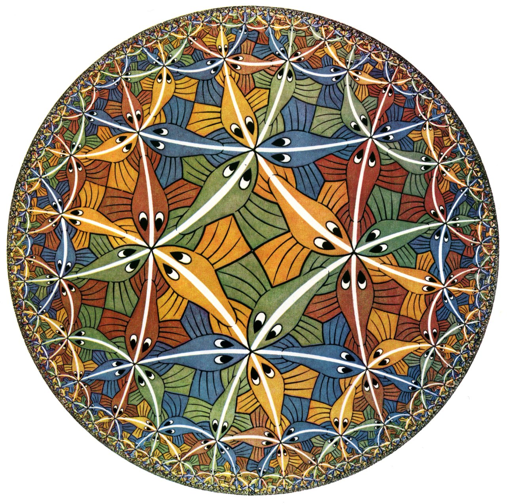
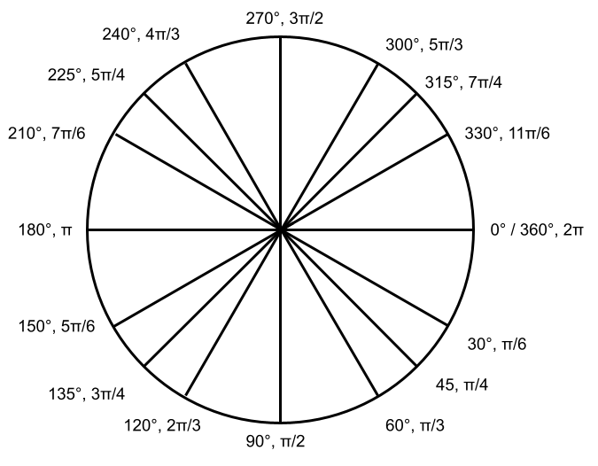

# Recursion

Of all the concepts associated with computers, recursion may be the most philosphically vexing. It is, in short, an algorithm that includes itself as a step within its own instructions. Like a hall of mirrors or a dream within a dream, this creates nested repetitions that can produce very interesting results from very little code.

Perfect recursion is inherently mathematical and abstract, but as it turns out, it is one way to approximate some of the self-similar structures of natural form. The branches of a tree, for example, are themselves "little trees," just as a rock has a similar shape as a boulder and as a mountain—it's as if they were made by the same set of instructions nested within themselves.


## Context

### Non-Digital

The foundation for recursion in visual representation shows up in Western history first as _mise en abyme_ (a term coined by critic André Gide in the early 20th century), in which a painting includes a separate representation of the scene it depicts. This began in earnest with the depiction of mirrors in celebrated canonical works like Velázquez's *Las Meninas* (1656) and the *Arnolfini Portrait* (1434) by Jan van Eyck.

<p align="center">
  <br />
  Diego Velázquez, <i>Las Meninas</i> (1656)
</p>

Taking things a step further and suggesting an infinite regress of images is the Droste effect. It's named after the Droste brand of cacao and its tin from 1904, which featured an image of a nurse carrying a tin of Droste cacao, which depicted an image of a nurse carrying a tin of Droste cacao, which depicted an image of nurse carrying a tin of Droste cacao ... you get the idea.

<p align="center">
  <br />
  Jan Musset, Droste cacao label (1904)
</p>

The idea has subsequently been explored by contemporary artists, perhaps most popularly by the Dutch printmaker MC Escher (1898–1972). His *Circle Limit* series, for example, reproduced repeated interlocking figures in diminishing size as they extended to the edge of image.

<p align="center">
  <br />
  MC Escher, <i>Circle Limit III</i> (1959)
</p>

Another form of recursion is fractals. Fractals are structures that have a finite area but an infinite amount of detail (or, put mathematicaly, fractals are continuous functions that are non-differentiable). This of course is how the real world works—the more you zoom in to something, the more detail emerges.

As a principle of visual design, fractals have been used most extensively in African architecture. Employing algorithmic procedures, designers have created highly intricate structures:

<p align="center">
  <br />
  The palace of the chief in Logone-Birni, Cameroon
</p>


### Digital

Computer graphics radically opened up the possibility of exploring recursive forms. In particular, fractal mathematics could be now be rendered visually. In the late 1970s and early 1980s, the mathematician Benoit Mandelbrot formalized fractal geometry using a computer (and coined the term "fractal"). His incredible looking "Mandlebrot set" imagery subsequently entered the popular imagination as a representation of math's formal beauty:

<p align="center">
  <br />
  Partial view of the Mandelbrot set (<a href="https://en.wikipedia.org/wiki/Mandelbrot_set#/media/File:Mandel_zoom_08_satellite_antenna.jpg">source</a>)
</p>

More generally, recursion has become a tool in computer graphics to implicitly create complexity rather than explicitly defining every detail. Within game design, this is known as "procedural generation," and is used in particular to create landscapes. One recent title, *No Man's Sky* (2016), boasts 18 quintillion planets that can be epxlored, all of which are generated algorithmically according to a few initial variables.  


<p align="center">
  <br />
  Algorithmically generated scene from <i>No Man's Sky</i> (2016), Hello Games.
</p>

In some respects, recursion is similar to what we explored with indeterminacy. However, the added structure produces more recognizable shapes and textures that are satisfying on multiple scales.


## Code

### Functions and arguments

First, let's review creating our own functions. We use the keyword `def`, followed by a unique name. Anything that is subsequently indented is included in the function. In other words:

```py
def my_function():
    # stuff happens
```

So far, this has come in handy for organizing our code (such as with nonlinearity). However, we know from using pre-built functions that Processing and Python provide us that functions can take *arguments*, ie, parameters that change what the function does. From the dimensions of a rectangle to the name of a file to load, functions with arguments open up the possibility of abstracting code to work on varied input.

Essentially, arguments are just another form of variable. When you declare the function, you list a series of variables names within the parentheses. You can then use these variables within the body of the function. When calling the function, whatever numbers, strings, lists, or variables you put in the parentheses will subsequently provide the values for these variables:

```py
def add_numbers(number_1, number_2):
    result = number_1 + number_2
    print(result)

add_numbers(4, 3)
add_numbers(2, 10)
add_numbers(13, 6)
```
```
7
12
19
```
Here, we're calling `add_numbers` multiple times with different arguments, so each time it prints out a different result.

### A function that calls itself

Consider the following sketch:
```py
size(400, 400)
background(255)
noStroke()
fill(0, 10)

def draw_circle(x, y, size):
    circle(x, y, size)

draw_circle(200, 200, 400)
```
<p align="center">
  
</p>

This is a little bit silly, because all we've done is wrap `circle()` in another function called `draw_circle()` that takes the exact same arguments and produces the exact same result. `200` and `200` are provided as arguments for `x` and `y`, respectively, and we're also passing `size`.

However, this arrangement provides us with an opportunity. What if we were to call `draw_circle()` _within_ `draw_circle()`?

```py
def draw_circle(x, y, size):
    circle(x, y, size)
    draw_circle(x, y, size) # recursively call draw_circle()

draw_circle(200, 200, 400)
```

<p align="center">
  
</p>

Ok, so that doesn't work. As powerful as computers are, they don't deal well with infinity, and here we've created an infinite feedback mechanism. However, we can add another argument, which we'll call `depth`, to keep track of how many levels of inception we've gone to. We'll use a conditional to stop recursing if we get too far.

```py
size(400, 400)

def draw_circle(x, y, size, depth):
    if depth < 5:
        circle(x, y, size)
        draw_circle(x, y, size, depth + 1)

draw_circle(200, 200, 400, 0)
```

Here, we increase `depth` by one every time we call `draw_circle()` inside itself, but only until `depth` is equal to five. So this code will draw 5 circles on top of one another (which still looks exactly the same), and we don't get an error.

<p align="center">
  
</p>

Ok, now the fun part. First, let's decrease the size of the circle each time:
```py
size(400, 400)

def draw_circle(x, y, size, depth):
    if depth < 5:
        circle(x, y, size)
        draw_circle(x, y, size / 2, depth + 1)

draw_circle(200, 200, 400, 0)
```
<p align="center">
  
</p>

Just like we're doing with `depth`, we change the value of `size` each time it's passed. We might also do that with `x` and `y` (and let's change some of the stroke settings while we're at it):

```py
size(400, 400)
background(255)
noStroke()
fill(0, 10)

def draw_circle(x, y, size, depth):
    if depth < 5:
        circle(x, y, size)
        draw_circle(x, y - (size / 4), size / 2, depth + 1)

draw_circle(200, 200, 400, 0)
```
<p align="center">
  
</p>

Layering transparency gives a sense of the increasing depth. And by decreasing the `y` coordinate by a quarter of `size` each time, the circles stay along the edge.

Now, let's call `draw_circle()` _multiple_ times within itself:
```py
size(400, 400)
background(255)
noStroke()
fill(0, 10)

def draw_circle(x, y, size, depth):
    if depth < 5:
        circle(x, y, size)
        draw_circle(x, y - (size / 4), size / 2, depth + 1)
        draw_circle(x, y + (size / 4), size / 2, depth + 1)
        draw_circle(x - (size / 4), y, size / 2, depth + 1)
        draw_circle(x + (size / 4), y, size / 2, depth + 1)

draw_circle(200, 200, 400, 0)
```
<p align="center">
  
</p>
Notice that this algorithm branches four times—within each circle, there are four smaller ones. Reduce the depth to 2 to see this more clearly:

```py
size(400, 400)
background(255)
noStroke()
fill(0, 10)

def draw_circle(x, y, size, depth):
    if depth < 2:
        circle(x, y, size)
        draw_circle(x, y - (size / 4), size / 2, depth + 1)
        draw_circle(x, y + (size / 4), size / 2, depth + 1)
        draw_circle(x - (size / 4), y, size / 2, depth + 1)
        draw_circle(x + (size / 4), y, size / 2, depth + 1)

draw_circle(200, 200, 400, 0)
```

<p align="center">
  
</p>

This is a fractal, though not an infinite one. And regardless, we've produced a surprisingly intricate shape from a minimal amount of code.

### Base cases

Let's make another one, somewhat similar, but with rectangles. But this time, our algorithm won't be to divide each rectangle evenly, but into four quadrants of random size. We'll do this by randomly choosing a point within the rectangle, `rand_x`, `rand_y`:

<p align="center">
  
</p>

We'll then use that point to define the next four rectangles. Here, we've called the function `frame()`:

```py
size(400, 400)
background(255)
strokeWeight(5)

def frame(x1, y1, x2, y2, depth):
    if depth < 3:
        rect(x1, y1, x2, y2)
        rand_x = int(random(x1, x2))
        rand_y = int(random(y1, y2))
        frame(x1, y1, rand_x, rand_y, depth + 1) # recurse on upper left rectangle
        frame(rand_x, y1, x2, rand_y, depth + 1) # recurse on upper right rectangle
        frame(x1, rand_y, rand_x, y2, depth + 1) # recurse on lower left rectangle
        frame(rand_x, rand_y, x2, y2, depth + 1) # recurse on lower right rectangle

frame(0, 0, 400, 400, 0)
```
<p align="center">
  
</p>

To make this appear like a Mondrian, let's fill some percentage of resulting rectangles with a color. This is the final step, after we're done recursing. So we'll put it within the `else` of our conditional. It turns out that we don't have to draw anything at all until this final step, so we can put the `rect()` function here too:

```py
size(400, 400)
background(255)
strokeWeight(5)

def frame(x1, y1, x2, y2, depth):
    if depth < 3:
        rand_x = int(random(x1, x2))
        rand_y = int(random(y1, y2))
        frame(x1, y1, rand_x, rand_y, depth + 1) # recurse on upper left rectangle
        frame(rand_x, y1, x2, rand_y, depth + 1) # recurse on upper right rectangle
        frame(x1, rand_y, rand_x, y2, depth + 1) # recurse on lower left rectangle
        frame(rand_x, rand_y, x2, y2, depth + 1) # recurse on lower right rectangle
    else:
        if random(100) < 30:
            fill(random(255), random(255), random(255))
        else:
            fill(255)
        rect(x1, y1, x2-x1, y2-y1)        

frame(0, 0, 400, 400, 0)
```
<p align="center">
  
</p>

This final step in the conditional is called a "base case" which stops the recursion and defines the final result.

### Trees

Trees have a paradigmatic recursive shape—starting with a single trunk, each limb branches into two or more smaller limbs, over and over, culminating in a leaf.

<p align="center">
  <br />
  (stolen from Daniel Shiffman)
</p>

To program this, let's begin with a function that draws a line based on a starting point (`x1`, `y1`), an `angle`, and a `length`. Using a little bit of trig, we can calculate the endpoint of the line (`x2` and `y2`) with the angle.

```py
size(400, 400)
background(255)

def limb(x1, y1, angle, length):
    x2 = x1 + cos(radians(angle)) * length
    y2 = y1 + sin(radians(angle)) * length
    line(x1, y1, x2, y2)

limb(200, 400, 270, 100)
```

Let's unpack that formula a bit. In Processing, we work with angles in terms of radians, ie, multiples of π, with 0° pointing to the right and the angles increasing clockwise:

<p align="center">
  
</p>

In this case, working with degrees is going to be more intuitive. Processing has a function where we can convert degrees to radians:
```py
radians(270)  # convert 270° to 3π/2
```

To get an endpoint from start point, an angle, and a length, we use `cos` and `sin` for the `x` and `y` values, respectively (converting from degrees to radians right there in the arguments):
```py
x2 = x1 + cos(radians(angle)) * length
y2 = y1 + sin(radians(angle)) * length
```

This is how our limb function draws a line given initial parameters, in this case the coordinates 200,400 (the center of the bottom) and the angle pointing straight up.

<p align="center">
  
</p>

The next thing we have to do is to make two limbs branch off, ie, two recursive calls to the function inside itself. We'll also add a `depth` argument to control the number of levels:

```py
size(400, 400)
background(255)

def limb(x1, y1, angle, length, depth):
    if depth < 2:
        x2 = x1 + cos(radians(angle)) * length
        y2 = y1 + sin(radians(angle)) * length
        line(x1, y1, x2, y2)
        limb(x2, y2, angle + 45, length * .66, depth + 1)
        limb(x2, y2, angle - 45, length * .66, depth + 1)

limb(200, 400, 270, 100, 0) # start at depth=0
```

<p align="center">
  
</p>

Notice that we are giving the endpoint of our line as the starting point of the next two lines (`x2`,`y2`). One side of the branch increases the angle by 45 degrees, while the other decreases it. We also reduce the length by a third. And, of course, we increase the depth.

Allowing further recursions (`if depth < 10`), we get this:

<p align="center">
  
</p>

While it has its own beauty, this form is of course far more regular than a real tree. There's several things we might try to get it more organic looking. For example, what if the angles were randomized?

```py
size(400, 400)
background(255)

def limb(x1, y1, angle, length, depth):
    if depth < 10:
        x2 = x1 + cos(radians(angle)) * length
        y2 = y1 + sin(radians(angle)) * length
        line(x1, y1, x2, y2)
        limb(x2, y2, angle + random(10, 45), length * .66, depth + 1)
        limb(x2, y2, angle - random(10, 45), length * .66, depth + 1)

limb(200, 400, 270, 100, 0)
```

<p align="center">
  
</p>

To make it more tree-like, maybe we should add a girth argument (using it to define `strokeWeight()` and reducing it by half each level):

```py
size(400, 400)
background(255)

def limb(x1, y1, angle, length, girth, depth):
    if depth < 10:
        x2 = x1 + cos(radians(angle)) * length
        y2 = y1 + sin(radians(angle)) * length
        strokeWeight(girth)
        line(x1, y1, x2, y2)
        limb(x2, y2, angle + random(10, 45), length * .66, girth * .5, depth + 1)
        limb(x2, y2, angle - random(10, 45), length * .66, girth * .5, depth + 1)

limb(200, 400, 270, 100, 20, 0)
```

<p align="center">
  
</p>

Real tree limbs don't always branch exactly in two, and sometimes they continue straight. Employing a `for` loop with a random number of iterations, we can add variation to the branching:

```py
size(400, 400)
background(255)

def limb(x1, y1, angle, length, girth, depth):
    if depth < 10:
        x2 = x1 + cos(radians(angle)) * length
        y2 = y1 + sin(radians(angle)) * length
        strokeWeight(girth)
        line(x1, y1, x2, y2)
        limb(x2, y2, angle, length * .66, girth * .5, depth + 1)  # this one continues straight
        for i in range(int(random(1, 4))):
            limb(x2, y2, angle + random(-60, 60), length * .66, girth * .5, depth + 1)

limb(200, 400, 270, 100, 20, 0)
```

<p align="center">
  
</p>

Finally, let's add a base case for the leaves (and play with the colors a bit):

```py
size(400, 400)
background(255)

def limb(x1, y1, angle, length, girth, depth):
    if depth < 10:
        x2 = x1 + cos(radians(angle)) * length
        y2 = y1 + sin(radians(angle)) * length
        stroke(92, 55, 0)
        strokeWeight(girth)
        line(x1, y1, x2, y2)
        limb(x2, y2, angle, length * .66, girth * .5, depth + 1)  # this one continues straight
        for i in range(int(random(1, 4))):
            limb(x2, y2, angle + random(-60, 60), length * .66, girth * .5, depth + 1)
    else:
        noStroke()
        fill(0, 200, 0, 25)
        circle(x1, y1, 5)

limb(200, 400, 270, 100, 20, 0)
```

<p align="center">
  
</p>

Not bad for less than 20 lines of code! This process of refining the algorithm shows how you can steer recursion to create the kind of form you want. It's exactly the kind of thing used in software like _No Man's Sky_ to build an endless number of landscapes.

### More conditionals

Here's another example:

```py
size(400, 400)
background(255)

def seed(x, y, angle, tightness, size):
    if size > 3:

        # draw a circle
        fill(0, 255)      
        circle(x, y, size)

        # calculate the position of the next circle
        # the angle increases by the "tightness" amount each time
        new_x = x + cos(radians(angle)) * size
        new_y = y + sin(radians(angle)) * size
        seed(new_x, new_y, angle + tightness, tightness, size - .5)

        # 10% of the time        
        if random(100) < 10:

            # create a branch with a different tightness parameter                           
            tightness = -tightness + random(-10, 10)        
            angle = angle + tightness
            new_x = x + cos(radians(angle)) * size
            new_y = y + sin(radians(angle)) * size
            seed(new_x, new_y, angle, tightness, size - .5)   

seed(200, 200, 0, 15, 20)
```

A simple output:
<p align="center">
  
</p>

...and another that is more complex:
<p align="center">
  
</p>

Key things to note in this example include the use of random to produce a recursive branch that happens 10% of the time. Adjusting this parameter can help tune how complex the output forms are.

In addition, notice that there is no `depth` argument—the recursion is limited by `size`, so it is inherently tied to the size of the circles, taking as many levels as it needs to get there.

### Designing with recursion

When coming up with a recursive form, start simple. Pick a basic shape and imagine how it might progress. Once your function is calling itself, play with the parameters to get the effect you want. Try with various colors and transparencies—sometimes intended effects emerge, which is great.

You can, of course, have more than one recursive algorithm in a sketch. Can you create a whole ecosystem of varying beings?
