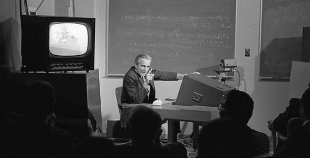
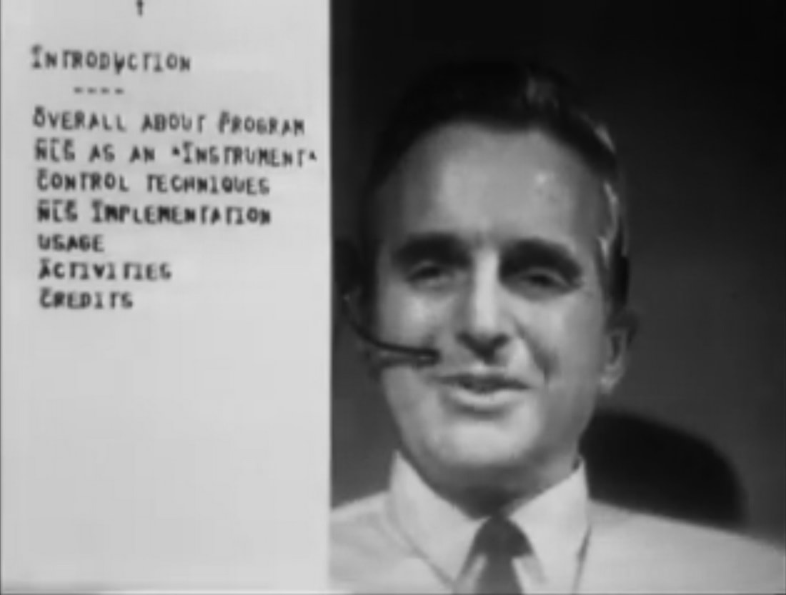
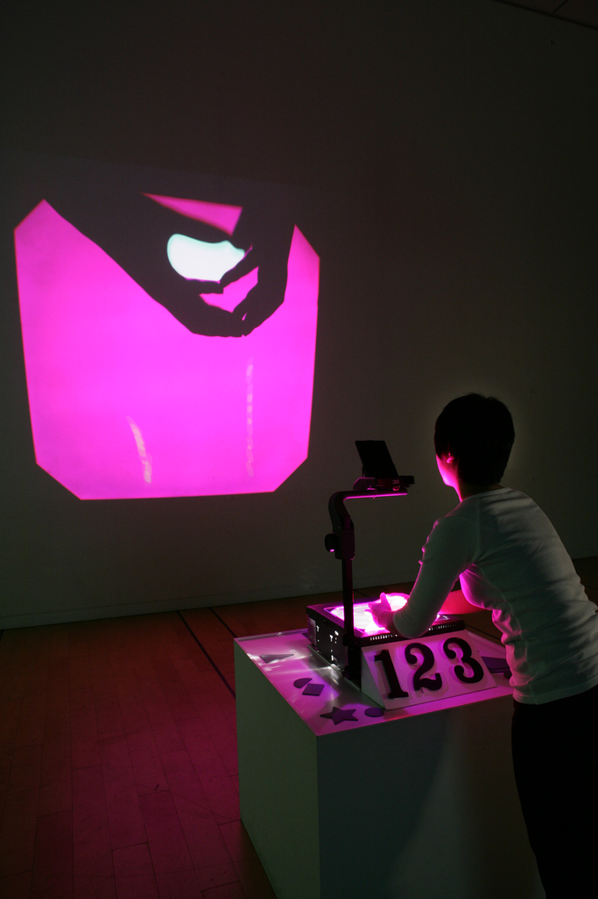
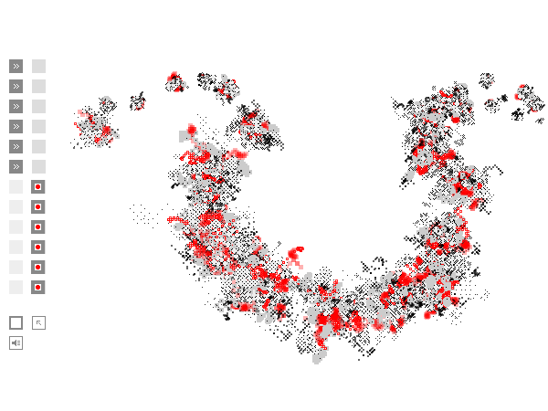
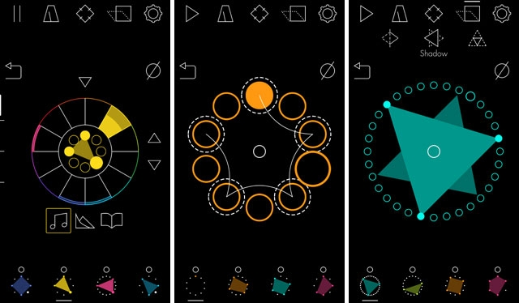
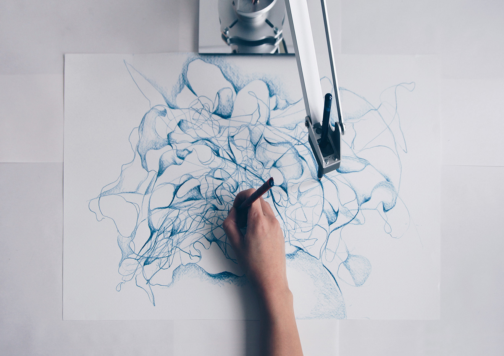
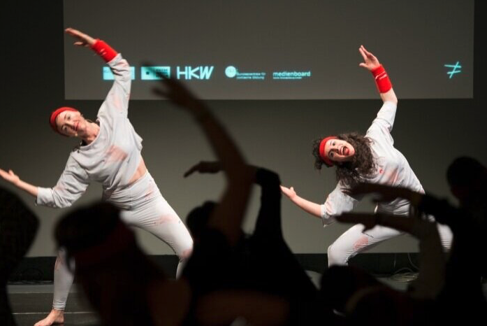
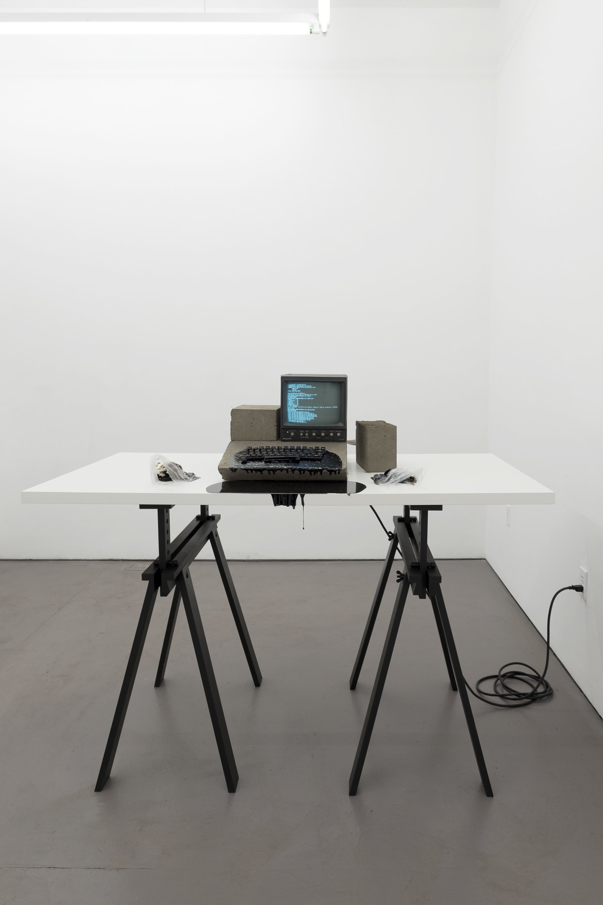

# Interface

## Concept

The symbolic logic of the digital is often thought to be immaterial. However, it is bound up with physical mechanics on two levels. The first, naturally, comprises the computers and other electronic devices themselves that perform abstract computations with very real electricity. The second is the level of interface. That is, in order for digital logic to apply to the material world, and for us to perceive it, there must be ways through which we can interact with computers. Monitors, keyboards, mice, touchscreens, cameras, microphones, speakers ... none of these are digital technologies per se, but they are all means of translation between our physical sensory capabilities and what happens inside of the machine. And _how_ that translation works is a critical and creative act of design.

Digital media artists always work with interfaces. This often means mastering software built by someone else, such as using Photoshop or Ableton Live, that determines how clicks and keystrokes become images and music. Programming languages like Python with Processing, however, allow artists to design their own interfaces. While the tools we build may not be as complex as those made professionally, by building them ourselves we can better understand how all interfaces are biased in particular ways and make those biases fit our artistic intentions.

## Context

As we experienced in the previous units, much early digital media took place on computer terminals limited to the use of a keyboard and the display of text, or on a graphics system that nonetheless still relied on punch cards for input. We take for granted today the ease with which we use interfaces like touch screens, but these technologies have evolved in fits and starts over decades.

That said, there is one event that may be considered to have outsized influence on the nature of the interface. This is known as "[The Mother of All Demos](https://en.wikipedia.org/wiki/The_Mother_of_All_Demos)" (watch it [here](https://www.youtube.com/watch?v=yJDv-zdhzMY)), a presentation given by engineer Douglas Engelbart on December 9th, 1968. Over the course of 90 minutes, Engelbart demonstrated prototypes of the computer mouse, video conferencing, collaborative documents, and hypertext, innovations that would take another 30+ years to be fully realized and adopted in society. His "oN-Line System" became a direct precursor to Apple's Macintosh system after Steve Jobs observed a refined version at Xerox PARC in the early 1980s (and the Macintosh would subsequently be imitated by Microsoft Windows and kick off a rivalry between the platforms).

   
  Douglas Engelbart performing "The Mother of all Demos" (1968) 

   
  Screenshot from the demo (1968) 

   
  Bill English, prototype of a computer mouse made from Englebart's sketches (1968) 

In years since, computer interfaces for artistic expression have been myriad and diverse, from commercial software to idiosyncratic systems.

One influential example, which makes use of a projector and camera, comes from Golan Levin and Zach Liebermann. Their _Manual Input Workstation_ (2004, [video here](https://www.youtube.com/watch?v=3paLKLZbRY4)) uses shadows to create shapes from the negative space between fingers:

   
  Golan Levin and Zach Liebermann, <i>Manual Input Workstation</i> (2004) 

LIA, an artist who we looked at for her use of indeterminacy, also makes her own interactive software tools. Her [_Enthrallogy_](https://vimeo.com/63511992) (2000), makes a version of those tools public. Though it riffs on the common interface paradigms of programs like MacPaint, LIA's work is far more distinctive:

   
  LIA & Miguel Carvalhais, <i>Pontiac: Vibe Enthrallogy</i> (2000) 

Musicians and composers regularly make custom visual interfaces to express their ideas about music. Meara O'Reilly is interested in the perception of non-standard rhythms; her [_Rhythm Necklace_](http://rhythmnecklace.com) (2014) is a complex yet ultimately intuitive system for visually connecting circular shapes to produce syncopation and polyrhythms that would otherwise be difficult to notate.

   
  Meara O'Reilly and Sam Tarakajian, screenshots of <i>Rhythm Necklace</i> (2014) on iOS 

Many traditionally trained artists are interested not only in how their skills can translate to digital interfaces, but how automated systems might collaborate with them. A compelling example of this kind of work is that of the artist [Sougwen Chung](https://sougwen.com), who paints with a brush on canvas alongside a robotic arm. Though this involves more hardware than a screen and mouse, prototypes of such a system are developed in software like Processing.

   
  Sougwen Chung, <i>Drawing with Doug</i> (ongoing) 

Other artists reflect on the implications of that fact that computer interfaces mediate so much of our lives. Liat Berdugo's [_Unpatentable Multitouch Aerobics_](https://www.liatberdugo.com/work/unpatentable) (2015), for example, comments on Apple's claim that it owns the gestures—like swiping and pinching—that are made on it's iPads and iPhones. Berdugo instead performs these gestures as aerobic exercises, which are legally unpatentable.

   
  Liat Berdugo, <i>Unpatentable Multitouch Aerobics</i> (2015) 

Additionally, in their series [_Black Gooey Universe_](https://americanartist.us/works/black-gooey-universe) (2018), the artist American Artist considers how the default white background of much software interface design betrays a cultural bias that is often hostile to Black aesthetics. Notably, they include a comment/critique on Engelbart's _Mother of All Demos_.

   
  American Artist, <i>Mother of All Demos</i> (2018) 

